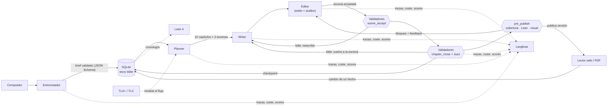

# My Story Marker (storyMaker)

Sistema agéntico que escribe **novelas personalizadas para regalar**: a un hijo, a la
pareja, para una boda, un aniversario o una jubilación. Un agente entrevistador recoge los
datos del destinatario; un equipo de roles planifica, escribe, edita y juzga una novela de
10 capítulos en español en la que el destinatario se reconoce, y que además se lee bien.

Personalización y calidad narrativa pesan lo mismo: que aparezcan todos los datos no basta
si la historia no funciona como historia. Los validadores, el editor y el juez comprueban
ambas cosas.

> **Estado.** El programa [spec 004](specs/004-exam-refactor-programme/004-exam-refactor-programme.md)
> está construido: la novela de ejemplo de 10 capítulos se generó y publicó de principio a
> fin ([Resultados](#resultados)). Solo falta el vídeo de demo, que añade el autor.

## Arquitectura en resumen



- **Roles**: entrevistador, planner, writer, editor (editor de estilo + auditor), juez y
  canonizador. Todos con Claude Haiku 4.5 a través de la CLI de Claude Code.
- **Memoria**: una base SQLite autoritativa (`HARNESS_DB`, por defecto
  `data/harness.sqlite`) con brief, hechos y su uso por escena, cronología, versiones de
  capítulos, palabras prohibidas, log de políticas y resultados de validadores.
- **Checkpoint por capítulo**: si la generación falla, se reanuda desde el último capítulo
  completado.
- Diseño completo en [`docs/architecture.md`](docs/architecture.md).

## Requisitos

| Herramienta | Versión | Para |
|---|---|---|
| Python + [uv](https://docs.astral.sh/uv/) | 3.12 | backend |
| Node.js + npm | 24 | lector web |
| Claude Code CLI (`claude`), con sesión iniciada | reciente | llamadas al modelo (no se usa API key) |
| Lean 4 vía [elan](https://github.com/leanprover/elan) | la de `formal/lean/lean-toolchain` | validador formal de la historia |
| Java 11+ (para TLC) | 11+ | model checking de `formal/tla` |
| Cuenta de Langfuse | opcional | observabilidad |

## Instalación

```bash
# backend
cd backend && uv sync && cp .env.example .env && cd ..

# lector web
cd frontend && npm ci && cd ..

# Lean 4
curl https://raw.githubusercontent.com/leanprover/elan/master/elan-init.sh -sSf | sh
cd formal/lean && lake build && cd ../..        # descarga la toolchain fijada y comprueba la librería

# TLC (solo en desarrollo): requiere java 11+ en el PATH; el script descarga tla2tools.jar fijado
formal/tla/run-tlc.sh
```

### Variables de entorno

Copia [`.env.example`](.env.example) (raíz) y [`backend/.env.example`](backend/.env.example)
a sus `.env` y rellena solo lo que necesites. **Ningún fichero versionado contiene claves.**
Sin claves de Langfuse la observabilidad queda desactivada y el resto funciona.

### Navegador para Playwright MCP

[`.mcp.json`](.mcp.json) declara el servidor **Playwright MCP** (headless, Chromium) para
que Claude Code abra el lector web y lo verifique visualmente. Si la caché de navegadores de
Playwright de tu máquina no tiene la revisión que espera `@playwright/mcp`, indica tu
Chromium sin tocar el fichero:

```bash
export PLAYWRIGHT_MCP_EXECUTABLE_PATH=/ruta/a/chromium/chrome
# o bien: npx @playwright/mcp install-browser chrome-for-testing
```

## Generar la novela de ejemplo

El brief de ejemplo es
[`evals/briefs/ejemplo.json`](evals/briefs/ejemplo.json), con copia en
`ejemplos/brief-ejemplo.json`; el destinatario es ficticio.

```bash
cd backend
uv run python -m app.novel.cli generate --brief ../evals/briefs/ejemplo.json   # imprime el novel_id
uv run python -m app.novel.cli status --novel-id <id>                          # checkpoints, validadores, coste
uv run python -m app.export.cli pdf --novel-id <id> --out ../ejemplos/mi-novela.pdf
```

`--chapters N` genera una novela más corta (la de 3 capítulos de `ejemplos/` usa
`evals/briefs/b2-infantil.json`); `--novel-id` fija el identificador. Si se interrumpe, repetir el mismo comando reanuda desde el último capítulo completado. En
Claude Code: `/generate-novel evals/briefs/ejemplo.json`, o la skill
[`gift-novel-run`](.claude/skills/gift-novel-run/SKILL.md) para generar e inspeccionar de
principio a fin.

El resultado de ese brief está en [`ejemplos/novela-ejemplo.pdf`](ejemplos/novela-ejemplo.pdf);
[`ejemplos/README.md`](ejemplos/README.md) explica cada PDF y cómo reproducirlo.

## Leer la novela

- **Web**: dos terminales desde la raíz.

  ```bash
  # 1. API (lee la story bible de HARNESS_DB; por defecto, la base de data/)
  cd backend && STORY_ROOT=tests/fixtures/repo uv run uvicorn app.main:app --port 8000
  # 2. lector
  cd frontend && npm run dev          # http://localhost:5173
  ```

  Portada con dedicatoria, índice navegable con marca «modificado» en los capítulos que
  cambiaron respecto a la versión anterior, capítulos, ficha de personajes y lugares con
  enlaces al capítulo donde aparecen, selector de versión y enlace al PDF. `STORY_ROOT` solo
  satisface la comprobación de arranque del harness heredado. Detalle y comprobación visual
  con Playwright en [`frontend/README.md`](frontend/README.md#reading-a-novel-spec-014).
- **PDF**: `cd backend && uv run python -m app.export.cli pdf --novel-id <id> [--version N]
  --out novela.pdf`. Portada con dedicatoria, página «Novedades» si la versión es > 1,
  índice enlazado, capítulos y ficha de personajes y lugares con enlaces internos.

### Login

La API del lector y de la entrevista exige sesión cuando `AUTH_REQUIRED=1` (valor por
defecto en [`backend/.env.example`](backend/.env.example)): contraseña con bcrypt en SQLite
y token JWT firmado con `AUTH_SECRET`. En el lector, la página `/login` registra o inicia
sesión (`POST /auth/register`, `POST /auth/login`) y cada usuario ve solo sus novelas. Con
`AUTH_REQUIRED=0` una petición sin token actúa como el dueño `local`, que es el dueño de lo
que genera la CLI (útil para una demo local; `STORY_MAKER_USER` asigna lo generado a un
usuario registrado). Spec [018](specs/018-login/018-login.md).

## Pedir un cambio

Desde el lector web, selecciona un fragmento o un hecho y pide el cambio ("el perro se
llama Nala"). El sistema actualiza el hecho en la story bible, localiza los capítulos que lo
usan, regenera solo esos sin romper la continuidad y publica una versión nueva; la anterior
se conserva. También por CLI/API (operación `change_fact`) o con `/change-fact` en Claude
Code.

```bash
cd backend
uv run python -m app.novel.cli change-fact --novel-id <id> --fact pet.canela.name --value Nala
```

Ejemplo real: [`ejemplos/novela-ejemplo-v2-cambio-nala.pdf`](ejemplos/novela-ejemplo-v2-cambio-nala.pdf)
(9 de 10 capítulos regenerados, v1 intacta).

## Validadores

Cada validador tiene nombre, punto de ejecución, guarda su resultado en `validator_result`
y lo envía a Langfuse como score. Son los que registra `register_validators()` y los que
corrieron en la novela de ejemplo.

| Validador | Tipo | Punto de ejecución |
|---|---|---|
| `brief_schema` / `schema_brief` — JSON Schema del brief | programático | entrevista (hook) · pre-publicación |
| `schema_role_output` — salida de cada rol | programático | aceptación de escena |
| `forbidden_words_scene` / `forbidden_words_chapter` — palabras prohibidas globales y por novela, texto normalizado | programático (guardrail) | aceptación de escena · cierre de capítulo; también hook de Claude Code |
| `no_placeholders` — sin nombres anonimizados ni marcadores | programático | aceptación de escena · cierre de capítulo |
| `exact_names` — nombres exactos según la story bible | programático | cierre de capítulo |
| `chapter_length` — 1.000–1.500 palabras | programático | cierre de capítulo |
| `calendar_consistency` — día de la semana coherente con su fecha | programático | cierre de capítulo |
| `fact_usage_recorder` — registra qué hechos usa cada capítulo | programático | cierre de capítulo |
| `prose_repetition` — repeticiones (blando) | programático | cierre de capítulo |
| `brief_coverage` — todos los hechos obligatorios aparecen | programático | pre-publicación |
| `visual_check` — portada, índice, capítulo y fichas en el lector (Playwright) | programático | pre-publicación (con `VISUAL_CHECK=1`) |
| `judge_chapter` / `judge_novel` — LLM-as-judge con rúbrica (continuidad, tono, calidad narrativa, personalización natural) | semántico | cierre de capítulo · pre-publicación |
| Revisión humana con la misma rúbrica ([`evals/human-review/`](evals/human-review/README.md)) | semántico | una novela completa |
| `lean_chronology` — cronología demostrada en Lean 4 | formal | pre-publicación |

## Verificación formal

- **Lean 4** ([`formal/lean`](formal/lean)): a partir de la story bible se genera un
  fichero Lean con eventos, momentos, personajes, lugares y fechas de nacimiento, y se
  comprueban invariantes de la cronología. Si falla, la versión no se publica y el fallo
  vuelve al editor. `cd formal/lean && lake build` comprueba la librería; el harness genera y
  compila un proyecto por novela en cada `pre_publish`. Caso real que solo Lean y el juez de
  novela detectaron: [`docs/process/lean-caso-real.md`](docs/process/lean-caso-real.md).
- **TLA+** ([`formal/tla`](formal/tla)): máquina de estados del harness (configuración →
  planificación → escritura → validación → publicación, con reintentos, reanudación y
  regeneración) verificada con TLC. Su README explica qué parte del código implementa cada
  acción. `formal/tla/run-tlc.sh` ejecuta TLC (5 capítulos, 2 reintentos): sin errores,
  5.492.531 estados distintos en ~8 min ([`tlc-output.txt`](formal/tla/tlc-output.txt));
  los contraejemplos encontrados y lo que cambiaron en el código están en
  [`COUNTEREXAMPLES.md`](formal/tla/COUNTEREXAMPLES.md).

## Observabilidad

Langfuse: una sesión por novela (entrevista y regeneraciones incluidas), una traza por
generación, spans por rol (`role:<rol>`) y por tool (`tool:<tool>`), tokens, coste y
latencia por llamada, capítulo y novela, scores de todos los validadores y prompts
versionados. Se activa con `LANGFUSE_PUBLIC_KEY` y `LANGFUSE_SECRET_KEY` en
`backend/.env`; sin ellas todo funciona sin trazas. Cada llamada queda además en la tabla
`llm_call` de SQLite (tokens, coste, latencia, versión de prompt), que es lo que resume
`app.novel.cli status`.

## Servidor MCP

`story-maker`, un servidor MCP de solo lectura (spec [017](specs/017-mcp-tools/017-mcp-tools.md))
con seis tools validadas por JSON Schema: `list_novels`, `list_versions`, `get_chapter`,
`get_chapter_summary`, `query_story_bible` y `download_novel` (PDF en base64).

```bash
uv run --project backend python -m app.mcp_server             # stdio
uv run --project backend python -m app.mcp_server --http 8765  # HTTP en 127.0.0.1:8765/mcp
```

Cómo conectarlo a Claude Code, Claude Desktop o MCP Inspector:
[`backend/app/mcp_server/README.md`](backend/app/mcp_server/README.md).

## Evals

Cinco briefs en [`evals/briefs/`](evals/README.md) (ejemplo, infantil, inyección de prompt,
incoherencia temporal y una contradicción que debe rechazarse).

```bash
cd backend
uv run python ../evals/run_evals.py --label after --chapters 3        # tabla brief × validador
uv run python ../evals/compare_iterations.py before after             # evals/results/tuning.md
```

Resultados en [`evals/results.md`](evals/results.md); causa y efecto de cada iteración de
tuning en [`docs/process/iteraciones.md`](docs/process/iteraciones.md#evals-y-tuning).

## Seguridad

Revisión de seguridad hecha por un agente (secretos en todo el historial de git,
dependencias vulnerables, inyección de prompt, exfiltración entre novelas, hooks y
endurecimiento de la API): [`docs/security-report.md`](docs/security-report.md). Se repite
con la skill [`security-review-harness`](.claude/skills/security-review-harness/SKILL.md) o
a mano:

```bash
python3 security/scan_secrets.py
cd backend && uv run python ../security/injection_probe.py && uv run python ../security/exfiltration_probe.py
```

## Resultados

| Qué | Resultado |
|---|---|
| Novela de 10 capítulos (`novela-ejemplo-a`, brief `ejemplo.json`) | **Publicada v1 a la primera**, 0 rondas de reparación; 10 capítulos de 1.006–1.170 palabras (10.645); 55 llamadas, **3,10 USD**, ~69 min; `judge_novel` 0,88; Lean, cobertura y calendario ✅ — [PDF](ejemplos/novela-ejemplo.pdf) |
| Cambio del lector (`change-fact pet.canela.name Nala`) | v2 publicada, 9 capítulos regenerados y 1 copiado, v1 intacta; ~27 min, ~0,94 USD — [PDF con «Novedades»](ejemplos/novela-ejemplo-v2-cambio-nala.pdf) |
| Novela de 3 capítulos (`novela-infantil`) | Publicada, 0,85 USD — [PDF](ejemplos/novela-infantil-3-capitulos.pdf) |
| Intentos previos de 10 capítulos | Bloqueados por `judge_novel` (3,68 y 4,61 USD); motivaron las iteraciones de tuning 1 y 2 ([registro](docs/process/iteraciones.md#evals-y-tuning)) |
| Comprobador del examen | 71/72 ([`exam/compliance.md`](exam/compliance.md)); falta solo el vídeo de demo |

Todos los roles con Claude Haiku 4.5.

## Estructura del repositorio

| Ruta | Contenido |
|---|---|
| `backend/` | FastAPI + Python: harness, roles, validadores, story bible |
| `frontend/` | Lector web en React + three.js |
| `formal/lean/`, `formal/tla/` | Verificación formal |
| `evals/` | Briefs de prueba, tabla de validadores por brief, red-team |
| `docs/` | Diseño: [definiciones](docs/definitions.md), [dominio](docs/domain-knowledge.md), [arquitectura](docs/architecture.md), [verificación](docs/verification.md) |
| `docs/process/` | [Documentación de proceso](docs/process/README.md): spec inicial, trade-offs, explainers, iteraciones, red-team, uso del browser MCP |
| `specs/` | Una carpeta por cambio: spec y plan de implementación |
| `presentacion/` | [Presentación técnico-comercial y anexos](presentacion/README.md) |
| `ejemplos/` | [Novela de ejemplo en PDF y su brief](ejemplos/README.md) |
| `exam/` | Requisitos del examen como datos y comprobador (`python exam/check.py`) |
| `.claude/` | Comandos, memoria y skills de Claude Code; [`CLAUDE.md`](CLAUDE.md) y [`AGENTS.md`](AGENTS.md) en la raíz |

## Enlaces

- Documentación de diseño: [`docs/`](docs/)
- Documentación de proceso: [`docs/process/`](docs/process/README.md)
- Presentación: [`presentacion/`](presentacion/README.md)
- Novela de ejemplo: [`ejemplos/novela-ejemplo.pdf`](ejemplos/novela-ejemplo.pdf)
- Vídeo de demo: pendiente — enlace a añadir por el autor
