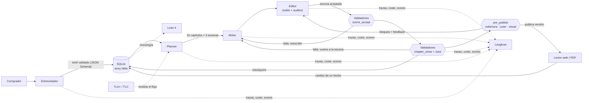

# My Story Marker (storyMaker)

Sistema agéntico que escribe **novelas personalizadas para regalar**: a un hijo, a la
pareja, para una boda, un aniversario o una jubilación. Un agente entrevistador recoge los
datos del destinatario; un equipo de roles planifica, escribe, edita y juzga una novela de
10 capítulos en español en la que el destinatario se reconoce, y que además se lee bien.

Personalización y calidad narrativa pesan lo mismo: que aparezcan todos los datos no basta
si la historia no funciona como historia. Los validadores, el editor y el juez comprueban
ambas cosas.

> **Estado.** El repositorio está en plena reconstrucción según el programa
> [spec 004](specs/004-exam-refactor-programme/004-exam-refactor-programme.md). Las
> secciones marcadas *pendiente (Bn)* describen piezas que construye el bloque *n* y se
> actualizarán cuando se integre.

## Arquitectura en resumen



- **Roles**: entrevistador, planner, writer, editor (editor de estilo + auditor), juez y
  canonizador. Todos con Claude Haiku 4.5 a través de la CLI de Claude Code.
- **Memoria**: una base SQLite autoritativa (`HARNESS_DB`, por defecto
  `data/harness.sqlite`) con brief, hechos y su uso por escena, cronología, versiones de
  capítulos, palabras prohibidas, log de políticas y resultados de validadores.
- **Checkpoint por capítulo**: si la generación falla, se reanuda desde el último capítulo
  completado.
- Diseño completo en [`docs/architecture.md`](docs/architecture.md).

## Requisitos

| Herramienta | Versión | Para |
|---|---|---|
| Python + [uv](https://docs.astral.sh/uv/) | 3.12 | backend |
| Node.js + npm | 24 | lector web |
| Claude Code CLI (`claude`), con sesión iniciada | reciente | llamadas al modelo (no se usa API key) |
| Lean 4 vía [elan](https://github.com/leanprover/elan) | la de `formal/lean/lean-toolchain` | validador formal de la historia |
| Java 11+ (para TLC) | 11+ | model checking de `formal/tla` |
| Cuenta de Langfuse | opcional | observabilidad |

## Instalación

```bash
# backend
cd backend && uv sync && cp .env.example .env && cd ..

# lector web
cd frontend && npm ci && cd ..

# Lean 4
curl https://raw.githubusercontent.com/leanprover/elan/master/elan-init.sh -sSf | sh
cd formal/lean && lake build && cd ../..        # pendiente (B8)

# TLC: requiere java en el PATH; ver formal/tla/README.md    # pendiente (B9)
```

### Variables de entorno

Copia [`.env.example`](.env.example) (raíz) y [`backend/.env.example`](backend/.env.example)
a sus `.env` y rellena solo lo que necesites. **Ningún fichero versionado contiene claves.**
Sin claves de Langfuse la observabilidad queda desactivada y el resto funciona.

### Navegador para Playwright MCP

[`.mcp.json`](.mcp.json) declara el servidor **Playwright MCP** (headless, Chromium) para
que Claude Code abra el lector web y lo verifique visualmente. Si la caché de navegadores de
Playwright de tu máquina no tiene la revisión que espera `@playwright/mcp`, indica tu
Chromium sin tocar el fichero:

```bash
export PLAYWRIGHT_MCP_EXECUTABLE_PATH=/ruta/a/chromium/chrome
# o bien: npx @playwright/mcp install-browser chrome-for-testing
```

## Generar la novela de ejemplo

*Pendiente (B3, B11).* El brief de ejemplo es
[`evals/briefs/ejemplo.json`](evals/briefs/ejemplo.json), con copia en
`ejemplos/brief-ejemplo.json`; el destinatario es ficticio.

```bash
cd backend
uv run python -m app.novel.cli generate --brief ../evals/briefs/ejemplo.json
```

Si se interrumpe, repetir el mismo comando reanuda desde el último capítulo completado. En
Claude Code: `/generate-novel evals/briefs/ejemplo.json`, o la skill
[`gift-novel-run`](.claude/skills/gift-novel-run/SKILL.md) para generar e inspeccionar de
principio a fin.

El resultado de ese brief está en [`ejemplos/novela-ejemplo.pdf`](ejemplos/novela-ejemplo.pdf)
(pendiente, B11).

## Leer la novela

- **Web**: `cd frontend && npm run dev` y abre la URL que indica Vite. Portada con
  dedicatoria, índice navegable, ficha de personajes y lugares con enlaces al capítulo
  donde aparecen, y marca de capítulos cambiados respecto a la versión anterior.
  *Pendiente (B10).*
- **PDF**: exportación desde el backend, con índice y enlaces internos. *Pendiente (B10).*

## Pedir un cambio

Desde el lector web, selecciona un fragmento o un hecho y pide el cambio ("el perro se
llama Nala"). El sistema actualiza el hecho en la story bible, localiza los capítulos que lo
usan, regenera solo esos sin romper la continuidad y publica una versión nueva; la anterior
se conserva. También por CLI/API (operación `change_fact`) o con `/change-fact` en Claude
Code. *Pendiente (B10).*

## Validadores

Cada validador tiene nombre, punto de ejecución y envía su resultado a Langfuse como score.
*La tabla definitiva la fija el bloque B4 (pendiente).*

| Validador | Tipo | Punto de ejecución |
|---|---|---|
| Schema del brief y de la salida de cada rol | programático | entrevista · cada rol |
| Palabras prohibidas (global y por novela, texto normalizado) | programático (guardrail) | aceptación de escena (hook) |
| Nombres exactos según la story bible | programático | cierre de capítulo |
| Longitud del capítulo (1.000–1.500 palabras) | programático | cierre de capítulo |
| Cobertura del brief contra la tabla de hechos | programático | cierre de capítulo · pre-publicación |
| Validación visual con Playwright MCP (portada, índice, ficha) | programático | pre-publicación |
| LLM-as-judge con rúbrica (continuidad, tono, calidad, personalización natural) | semántico | cierre de capítulo · novela |
| Revisión humana con la misma rúbrica | semántico | una novela completa |
| Cronología en Lean 4 | formal | pre-publicación |

## Verificación formal

- **Lean 4** ([`formal/lean`](formal/lean)): a partir de la story bible se genera un
  fichero Lean con eventos, momentos, personajes, lugares y fechas de nacimiento, y se
  comprueban invariantes de la cronología. Si falla, la versión no se publica y el fallo
  vuelve al editor. *Pendiente (B8).*
- **TLA+** ([`formal/tla`](formal/tla)): máquina de estados del harness (configuración →
  planificación → escritura → validación → publicación, con reintentos, reanudación y
  regeneración) verificada con TLC. Su README explica qué parte del código implementa cada
  acción. *Pendiente (B9).*

## Observabilidad

Langfuse: una sesión por novela (entrevista y regeneraciones incluidas), una traza por
generación, spans por rol (`role:<rol>`) y por tool (`tool:<tool>`), tokens, coste y
latencia por llamada, capítulo y novela, scores de todos los validadores y prompts
versionados. *Pendiente (B6).*

## Estructura del repositorio

| Ruta | Contenido |
|---|---|
| `backend/` | FastAPI + Python: harness, roles, validadores, story bible |
| `frontend/` | Lector web en React + three.js |
| `formal/lean/`, `formal/tla/` | Verificación formal |
| `evals/` | Briefs de prueba, tabla de validadores por brief, red-team |
| `docs/` | Diseño: [definiciones](docs/definitions.md), [dominio](docs/domain-knowledge.md), [arquitectura](docs/architecture.md), [verificación](docs/verification.md) |
| `docs/process/` | [Documentación de proceso](docs/process/README.md): spec inicial, trade-offs, explainers, iteraciones, red-team, uso del browser MCP |
| `specs/` | Una carpeta por cambio: spec y plan de implementación |
| `presentacion/` | [Presentación técnico-comercial y anexos](presentacion/README.md) |
| `ejemplos/` | [Novela de ejemplo en PDF y su brief](ejemplos/README.md) |
| `exam/` | Requisitos del examen como datos y comprobador (`python exam/check.py`) |
| `.claude/` | Comandos, memoria y skills de Claude Code; [`CLAUDE.md`](CLAUDE.md) y [`AGENTS.md`](AGENTS.md) en la raíz |

## Enlaces

- Documentación de diseño: [`docs/`](docs/)
- Documentación de proceso: [`docs/process/`](docs/process/README.md)
- Presentación: [`presentacion/`](presentacion/README.md)
- Novela de ejemplo: [`ejemplos/novela-ejemplo.pdf`](ejemplos/novela-ejemplo.pdf)
- Vídeo de demo: *pendiente*
