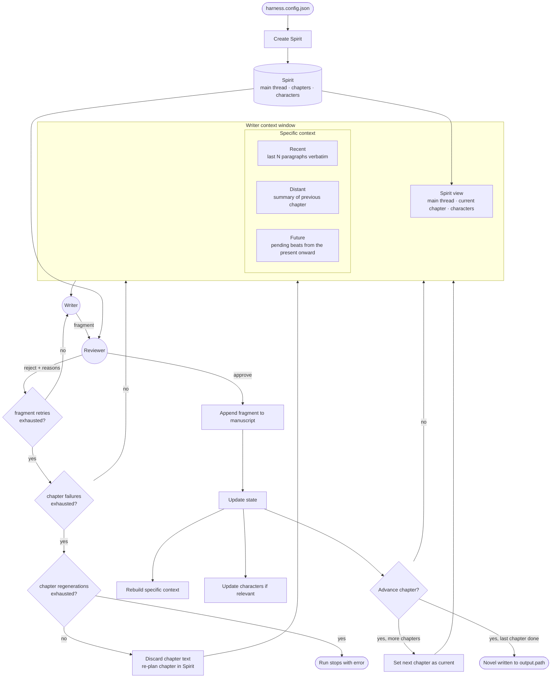

# Spec 1 — Story Creator Harness

Status: draft v0.2 · Source diagram: `DiagramaHarnessStoryCreator.drawio` · Config: `harness.config.json`

## 1. Intent

Build an agentic harness that writes a complete science fiction novel incrementally, fragment by fragment, so that the finished text is coherent from the first page to the last.

Coherence is the whole point. A single model writing a long novel in one pass loses track of plot, characters and pacing. This harness solves that by:

- Fixing the novel's plan up front in a document called the **Spirit** (main thread, chapter plans, characters).
- Giving the **Writer** a curated context window instead of the whole book: the Spirit plus a small, well-chosen slice of past and upcoming story.
- Putting a **Reviewer** between every fragment and the manuscript, so nothing enters the novel unless it matches the Spirit and respects the story's pacing.
- Refreshing the context after every accepted fragment, so the Writer always works from an accurate picture of "where the story is".
- Discarding and re-planning a whole chapter when it keeps failing review, on the assumption that the chapter plan itself was flawed.

The output is a manuscript that reads as if one author with a clear outline wrote it, produced automatically from an initial premise.

## 2. Inputs and outputs

### 2.1 Input

A single JSON configuration file, `harness.config.json`. Every parameter the spec refers to lives there, so a test run only needs to swap the file. All fields are optional except `chapters.count`; missing fields take the defaults shown.

| Field | Type | Default | Meaning |
|-------|------|---------|---------|
| `theme` | string or null | null | Optional premise or theme. When null, the Spirit Creator invents one within science fiction. |
| `language` | string | "en" | Language of the manuscript. |
| `tone_and_style` | string or null | null | Optional voice constraints passed verbatim to the Spirit Creator. |
| `chapters.count` | int | required | Number of chapters in the novel. |
| `chapters.target_paragraphs` | int | 40 | Target length of each chapter in paragraphs. The Spirit Creator sizes beats to fit; the Reviewer treats a strong deviation as a pacing problem. |
| `fragment.min_paragraphs` | int | 3 | Minimum paragraphs per Writer fragment. |
| `fragment.max_paragraphs` | int | 6 | Maximum paragraphs per Writer fragment. |
| `context.recent_paragraphs` | int | 4 | N: paragraphs given verbatim to the Writer as recent context. |
| `retries.max_fragment_retries` | int | 3 | Rejections allowed for one fragment before it counts as a fragment failure. |
| `retries.max_fragment_failures_per_chapter` | int | 2 | Fragment failures allowed inside one chapter before the chapter is discarded and re-planned. |
| `retries.max_chapter_regenerations` | int | 2 | Times a single chapter may be discarded and re-planned before the run stops with an error. |
| `output.path` | string | "output/novel.md" | Where the manuscript is written. |

### 2.2 Output

The novel only: one Markdown file at `output.path`, with one heading per chapter and the approved fragments in order. Nothing else is part of the deliverable. Internal state (Spirit, metrics, rejected attempts) may be persisted for debugging but is not an output of the process.

## 3. Flow



## 4. Domain model

### 4.1 Spirit

The single source of truth for the novel. Created once before the loop, mutated only in controlled places (character state, beat status, the "current chapter" pointer, and a full chapter re-plan on chapter failure).

```yaml
spirit:
  premise: string                # from config.theme, or invented
  tone_and_style: string         # from config, or chosen by the Spirit Creator
  main_thread:
    introduction: string
    development: string
    resolution: string
  chapters:                      # ordered, length == config.chapters.count
    - id: int
      title: string
      introduction: string | null   # optional, only when the chapter needs one
      development: string
      resolution: string
      target_paragraphs: int        # from config
      beats:                        # ordered list of things that must happen, derived from the three fields above
        - id: string
          description: string
          status: pending | current | done
  characters:
    - id: string
      name: string
      role: string
      description: string
      arc: string                    # intended development across the novel
      state: string                  # what has happened to them so far (updated by the harness)
  current_chapter_id: int
```

### 4.2 Manuscript

```yaml
manuscript:
  chapters:
    - id: int
      fragments:                  # ordered, approved only
        - id: string
          text: string
          beats_completed: [string]
```

### 4.3 Specific context

Rebuilt after every approved fragment.

| Part | Content | Source |
|------|---------|--------|
| Recent | Last N paragraphs of the manuscript, verbatim (N = `context.recent_paragraphs`) | Manuscript |
| Distant | Summary of the previous chapter (empty in chapter 1) | Generated once when a chapter closes, cached |
| Future | The ordered list of beats not yet done, starting from the current one, for the current chapter; plus the next chapter's introduction beat if the current chapter is on its last beat | Spirit beats with status `current` or `pending` |

### 4.4 The "present"

The present is the beat with status `current` in the current chapter. It is the only place where new narration is expected. The harness, not the Writer, owns the status of beats.

### 4.5 Run counters

Kept by the harness, reset as indicated.

| Counter | Reset when |
|---------|-----------|
| `fragment_attempts` | A fragment is approved, or a fragment failure is declared |
| `chapter_fragment_failures` | A chapter is closed or re-planned |
| `chapter_regenerations[chapter_id]` | Never |

## 5. Agents

### 5.1 Spirit Creator

- **Input**: the config (theme, language, tone, chapter count, chapter length).
- **Output**: a complete Spirit as in 4.1, with every chapter broken into beats and all beats `pending` except the first, which is `current`.
- **Acceptance**: exactly `chapters.count` chapters; every chapter has development and resolution; every character has an arc; the main thread resolution is reachable from the chapter list.
- **Re-plan mode**: given an existing Spirit, a chapter id and the reasons collected from that chapter's rejections, produce a new plan for that chapter only. It must stay consistent with the main thread, with the chapters already written, and with the current character states. Beats are reset to `pending` with the first `current`.

### 5.2 Writer

- **Input**: the Writer context window (Spirit view + specific context) and, on a retry, the Reviewer's rejection reasons.
- **Output**: one fragment of prose plus a self-report:

```yaml
fragment:
  text: string
  beats_completed: [string]      # beats the Writer considers finished by this fragment
  present_advanced: bool         # true if the Writer moved the story into the next beat
```

- **Rules**:
  1. Narrate the current beat.
  2. The Writer may move into the next pending beat only when it considers the current beat finished. Moving on is allowed and expected; that is how the story progresses. Skipping a beat is not.
  3. Never narrate beats beyond the next pending one. Future context exists so the Writer can foreshadow and stay consistent, not so it can jump ahead.
  4. Respect tone_and_style and the characters' current state.
  5. Fragment length between `fragment.min_paragraphs` and `fragment.max_paragraphs`.

### 5.3 Reviewer

- **Input**: the fragment, the full Spirit, the specific context.
- **Output**:

```yaml
verdict:
  approved: bool
  checks:
    main_thread: pass | fail
    current_chapter: pass | fail
    characters: pass | fail
    pacing: pass | fail
  reasons: [string]              # required on any fail, specific and actionable
  beats_completed: [string]      # Reviewer's own judgement, may differ from the Writer's
  chapter_closable: bool         # only meaningful when the resolution beat is done, see 6.1
```

- **Checks**:
  1. **Main thread**: nothing contradicts the novel-level introduction, development or resolution.
  2. **Current chapter**: the fragment serves the current chapter's plan and does not contradict it.
  3. **Characters**: behaviour, knowledge and voice match each character's description and current state.
  4. **Pacing**: the fragment narrates only the current beat and, at most, the start of the next pending beat. Narrating a later beat, or narrating the next beat when the current one is clearly unresolved, fails this check. Foreshadowing without resolving is allowed. A chapter running far beyond `target_paragraphs` with beats still pending also fails this check.
- **Decision**: approve only if all four checks pass. Otherwise reject with reasons.
- **Metric**: the harness records the four check results per attempt. This is the "Métrica" box in the diagram and the basis for later evaluation.

## 6. Orchestration loop

```
config = load("harness.config.json")
spirit = create_spirit(config)
while spirit.current_chapter exists:
    ctx = build_context(spirit, manuscript, config)
    fragment_attempts = 0
    previous_reasons = []
    loop:
        fragment = writer(ctx, previous_reasons)
        verdict = reviewer(fragment, spirit, ctx)
        record_metric(verdict)
        if verdict.approved: break
        previous_reasons = verdict.reasons
        fragment_attempts += 1
        if fragment_attempts >= config.retries.max_fragment_retries:
            # fragment failure
            chapter_fragment_failures += 1
            fragment_attempts = 0
            if chapter_fragment_failures >= config.retries.max_fragment_failures_per_chapter:
                # chapter failure
                ch = spirit.current_chapter_id
                chapter_regenerations[ch] += 1
                if chapter_regenerations[ch] > config.retries.max_chapter_regenerations:
                    stop_with_error("chapter {ch} could not be written")
                discard_chapter_text(manuscript, ch)
                replan_chapter(spirit, ch, collected_reasons)
                chapter_fragment_failures = 0
                ctx = build_context(spirit, manuscript, config)
            continue          # new fragment from scratch
    append(manuscript, fragment)
    mark_beats_done(spirit, verdict.beats_completed)   # Reviewer's list wins
    update_characters(spirit, fragment)
    if should_advance_chapter(spirit, verdict):
        close_chapter(spirit, manuscript)               # generate Distant summary
        chapter_fragment_failures = 0
        spirit.current_chapter_id += 1, or finish if it was the last chapter
write(manuscript, config.output.path)
```

### 6.1 Chapter advance rule

Advance when both hold:

1. The current chapter's resolution beat has status `done`.
2. The last approved paragraph leaves the scene open enough to lead into the next chapter's introduction. Evaluated by the Reviewer through `chapter_closable` once condition 1 is met.

If condition 1 holds but condition 2 does not, the Writer is asked for one more fragment whose explicit goal is to close the chapter.

### 6.2 Character update rule

After each approved fragment, a lightweight step asks: did anything happen in this fragment that changes a character's state or advances their arc? If yes, update `state` for that character. `description` and `arc` are not changed by the loop.

### 6.3 Chapter failure rule

A chapter fails when it accumulates `max_fragment_failures_per_chapter` fragment failures. The interpretation is that the chapter plan itself is flawed, not the prose. The harness then:

1. Deletes every fragment of that chapter from the manuscript.
2. Asks the Spirit Creator to re-plan that chapter using the collected rejection reasons.
3. Restarts the chapter from its first beat.

Character `state` is not rolled back automatically. Because the discarded fragments never became canon, the re-plan step must also revert any state changes that came from them. Implementation note: keep a snapshot of character states at chapter start and restore it on discard.

## 7. Open decisions

- Whether the Writer and Reviewer use the same model.
- Whether "Distant" should also include summaries of all earlier chapters, not just the previous one, for long novels.
- Whether a human can edit the Spirit mid-run and how the loop reacts.
- Whether `chapters.target_paragraphs` should be a per-chapter list instead of a single value.

## 8. Acceptance scenarios

1. **Happy path**: given a config with `chapters.count` = 3 and no theme, the loop produces a Markdown file with 3 chapters, every beat marked `done`, and ends with "Novel complete".
2. **Character consistency**: given a character whose state says "does not know about the signal", when a fragment shows them acting on the signal, then the Reviewer fails `characters` and the reasons mention the character.
3. **Pacing, skipped beat**: given beats A (current), B, C, when the fragment narrates C, then the Reviewer fails `pacing`.
4. **Pacing, legitimate advance**: given beats A (current) and B, when the fragment resolves A and starts B, then `pacing` passes and the Reviewer marks A as done.
5. **Chapter close**: given the resolution beat is done and the last paragraph is a cliffhanger into the next chapter, then the harness advances the chapter and generates the Distant summary.
6. **Retry**: given a rejection, when the Writer is called again, then it receives the reasons and the new fragment addresses them.
7. **Fragment failure**: given `max_fragment_retries` = 3, when a fragment is rejected 3 times, then the chapter failure counter increases by one and the Writer starts a fresh fragment.
8. **Chapter re-plan**: given `max_fragment_failures_per_chapter` = 2, when a chapter reaches 2 fragment failures, then its text is removed from the manuscript, its plan in the Spirit changes, its beats are reset, and character states equal the snapshot taken at chapter start.
9. **Run abort**: given `max_chapter_regenerations` = 2, when the same chapter fails a third time, then the run stops with an error naming the chapter and no output file is written.
10. **Config defaults**: given a config with only `chapters.count`, the run uses every default from section 2.1.

## 9. Change log

- v0.2 (2026-09-15): added inputs/outputs section and externalised all parameters to `harness.config.json`. Added the chapter failure rule (discard and re-plan) with three retry levels: fragment, chapter, regeneration. N default set to 4 following the author's edit. Removed the unresolved `escalate()` decision, now covered by the retry levels.
- v0.1 (2026-09-15): first written spec from the draw.io diagram and two rounds of clarification. Key decisions: both agents read the Spirit; the "no spoilers" rule became the pacing rule, because moving into the next beat is legitimate once the current beat is finished; chapter advance is a two-condition rule owned by the harness with the Reviewer providing the second signal.
