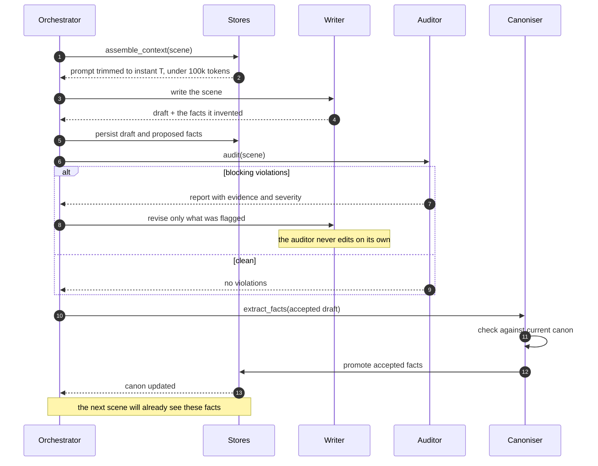

# CLAUDE.md — the store root

This directory is a **novel harness store**: the tree that holds one novel's canon, cast,
structure, scene records, prose and ledgers. It is the source of truth for the book. This
particular copy is the test fixture for backend spec 001; it is a real store in every
respect, just a very small one. See [`README.md`](./README.md) for what has been planted in
it and why.

This file is where the **turn protocol** and the **per-role permission table** live, because
it is the file every agent sees.

> **This file is informational.** Nothing here is enforced by being written down. The
> permission table below is a description of a table that lives in the backend
> (`app/commons/permissions/`) and is checked by the store layer on every write; an agent
> that tries to write outside its row gets a `403` and a byte-identical tree whether or not
> it ever read this file. **A prompt is not a boundary.** If this file and the backend ever
> disagree, the backend is right and this file is a bug.

---

## The stores

| Directory | Holds | Written by |
|---|---|---|
| `canon/` | The world: premise, style, axioms, technology, locations, factions, history, lexicon, temporal system | World builder (planning), canoniser (drafting) |
| `cast/` | Per character: dossier, voice, knowledge, registered changes; and the relationship graph | Architect (dossiers), canoniser (promotions) |
| `structure/` | Arcs and chapters: function, budget, tension curve, active threads | Architect |
| `scenes/` | One record per scene: dramatic function, story time, discourse order, tags, budget | Architect |
| `manuscript/` | The prose, and the digests rolled up from it | Writer, style editor |
| `ledger/` | Setups, threads, timeline, the canonisation queue, violation reports | Architect, writer, canoniser, auditor |

Beside the tree, and excluded from version control, sits `.index/`: the entity index, the
embedding cache, one record per writing turn, and an append-only provenance log naming the
role behind every store write. **`.index/` is not a store.** It is not governed by the table
below, no agent reads it, and the index part is rebuilt from the tree at will.

## Two rules that hold everywhere

1. **Identifiers are stable forever.** Renaming an entity breaks every edge that points at
   it, so the backend never renames. Entity ids match `^[a-z0-9][a-z0-9_-]*$`; scene ids are
   exactly three digits.
2. **Every file carries `schema_version`.** An unknown version fails validation rather than
   being read optimistically, and a file with a field nobody modelled is rejected rather than
   read as if the field were not there.

---

## The invariants

The ten domain invariants are stated in **`docs/definitions.md`, "Domain invariants"**, and
are deliberately **not** restated here. One statement, one place: a second copy is a second
thing to keep true.

They are referred to throughout this file and throughout `README.md` by number:

| # | Short name | How it is checked |
|---|---|---|
| 1 | Knowledge monotonicity | Record half mechanically (FR-AUD-01); prose half by the semantic auditor |
| 2 | Closed debts | Mechanically (FR-AUD-02) |
| 3 | Stable bodies | Semantic auditor, against `cast/{id}/changes.yaml` |
| 4 | Spatial uniqueness | Mechanically (FR-AUD-03) |
| 5 | Possible transits | Mechanically (FR-AUD-04), against the `transit_matrix` in `canon/time.yaml` |
| 6 | Axiomatic respect | Semantic auditor, against the axioms in the turn's selected list |
| 7 | Canonical lexicon | Mechanically (FR-AUD-05), against `canon/lexicon.yaml` |
| 8 | No inert scenes | Record half mechanically (FR-AUD-06); prose half by the semantic auditor |
| 9 | Recognisable voice | Mechanically (FR-AUD-07), against the POV's `never_says` |
| 10 | Thread latency | Mechanically (FR-AUD-08) |

All of them evaluate against the **story-time** axis, except thread latency, which is a
reading-order distance and evaluates against `discourse_order`.

When the model half of the audit cannot run, `audit` returns a `skipped` list naming the
invariants it did not check. **An empty violation list is not a pass unless `skipped` is
empty too.**

---

## The turn protocol

One writing turn, per scene. It runs roughly two hundred times over a novel, so its cost and
its failure behaviour dominate everything.

**The steps, and the rule each one carries.**

1. **Assemble.** The context is built *as of* the scene's `story_time`: nothing dated later
   enters it. Fixed block (`canon/project.md`, `canon/style.md`), then the POV's dossier
   as-of, then the previous scene's literal tail, then the ranked selection. It stops before
   the entry that would cross **100 000 tokens** and never truncates inside an entry. Closed
   items leave: a paid setup, a `resolved` or `abandoned` thread and a violation carrying a
   `resolution` never enter a context again.
2. **Write.** One scene per turn, from the assembled context and nothing else. The writer
   invents freely and records every invention in `ledger/proposed.yaml`. It **cannot** write
   canon.
3. **Audit.** Mechanical checks first, then the model half, with the mechanical results given
   to the model as data so it does not re-report them. The auditor **reports and does not
   repair**: its only output is `ledger/violations.yaml`.
4. **Revise.** Scoped to the flagged spans, not a regeneration. `write` and `revise` are not
   interchangeable. After three revisions the turn escalates to a human.
5. **Extract.** On whichever draft was finally accepted, never on a discarded one.
6. **Promote.** Non-colliding facts are written into canon. A collision is **never** resolved
   by code: `promote` records `existing_value`, sets `conflict`, leaves the fact pending and
   escalates. Only a human ruling — `accept` or `reject`, with a reason, on the record —
   settles it.
7. **Reconcile.** After a promotion, everything that depends on the changed entity is
   identified, so a retroactive change is visible rather than silent.

**Canon is updated before the next scene is assembled.** That is what closes the loop. Batch
promotion at the end of a chapter would mean scenes inside a chapter cannot see each other's
inventions, and contradictions would cluster inside chapters instead of across them.

**No manuscript prose enters a later context**, except the previous scene's literal tail.
Everything else the writer is told about earlier scenes comes from digests.

---

## Per-role permissions

**Write** in the Canon, Structure or Prose column is a write permission; `read` is a read
permission; `—` is neither. `In` and `Out` are stricter than those three columns: a store a
role may read is not necessarily in its context on a given turn, and **anything not listed as
an input is not available to the role**. A role that needs a fact absent from its inputs does
not go and fetch it — the contract is wrong and gets amended.

| Role | Signature | Canon | Structure | Prose | In | Out |
|---|---|---|---|---|---|---|
| **Architect** | `plan(canon, structure, intent) → scene records` | read | **write** | — | `canon/project.md` · `canon/axioms/` · `canon/factions/` · `canon/history/` · `canon/locations/` · `cast/{id}/dossier.md` · `ledger/setups.yaml` · `ledger/threads.yaml` | `structure/arcs.yaml` · `structure/chapters.yaml` · `scenes/NNN.yaml` |
| **World builder** | `build(intent, structure) → canon records` | **write** | read | — | `canon/project.md` · `canon/` · `structure/` | `canon/axioms/*.md` · `canon/technology/*.md` · `canon/locations/*.md` · `canon/factions/*.md` · `canon/history/*.md` · `canon/lexicon.yaml` · `canon/time.yaml` |
| **Writer** | `write(assembled_context) → Draft, ProposedFact[]` · `revise(draft, Violation[]) → Draft` | read | read | **write** | the assembled context: the fixed block, the POV's `cast/{id}/` as-of, the previous scene's tail, and whatever the selection ranked within the cap from `cast/` · `canon/` · `ledger/setups.yaml` · `manuscript/digests/`; on revision also `ledger/violations.yaml` | `manuscript/NNN.md` · `manuscript/digests/NNN.md` · `ledger/proposed.yaml` |
| **Style editor** | `polish(draft, style) → Draft` | read | — | **write** | `manuscript/NNN.md` · `canon/style.md` · `canon/lexicon.yaml` · the POV's `cast/{id}/voice.md` | `manuscript/NNN.md` |
| **Auditor** | `audit(scene) → Violation[]` | read | read | read | `manuscript/NNN.md` · `scenes/NNN.yaml` · the turn's selected-entity list · `canon/axioms/` · `canon/time.yaml` · `canon/lexicon.yaml` · `cast/{id}/dossier.md` · `cast/{id}/knowledge.yaml` · `cast/{id}/changes.yaml` · `cast/relationships.yaml` · `ledger/timeline.yaml` | `ledger/violations.yaml` |
| **Canoniser** | `promote(fact) → canon` | **write** | — | read | `ledger/proposed.yaml` · `manuscript/NNN.md` · `canon/` | `canon/` · `cast/` · `ledger/proposed.yaml` |

The auditor's selected-entity list matters more than it looks: the axioms it names are the
ones in force for invariant 6 on that turn. An axiom nobody selected is an axiom the scene
was never asked to honour, which is why the list is persisted on the turn record rather than
recomputed.

### Why the table is shaped like this

**Canon has exactly two inbound write edges**, from the world builder during planning and
from the canoniser during drafting. The writer — the role generating the most tokens and
therefore the most opportunities for error — has none. It can *propose* facts by writing to
`ledger/proposed.yaml`; it cannot commit them. This single constraint is what stops the prose
rewriting the world to justify itself.

**The auditor writes only to `ledger/violations.yaml`.** It cannot touch canon, structure or
prose. Its output is a report, and the decision about what to do with a report belongs to a
human or to the architect. An auditor with a write into the prose trims precisely the living
details that made the scene work, because those are the ones that deviate from the plan.

**The canoniser cannot write prose and the writer cannot write canon**, so no single role can
both invent a fact and make it binding.

**A human acts through a role, not around it.** The escalation edge the table does not draw:
a human sets `resolution` on a violation, or rules on a colliding fact, by calling the owning
role's route with `X-Actor: human`. The write is still the auditor's or the canoniser's; what
changes is who is recorded as having made it. Every store write lands in the provenance log
with its role and its actor.

**Roles are separations of permission, not necessarily separate processes.** Several of them
may be prompts against the same model. What must not collapse is the boundary.
