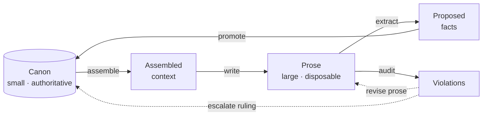
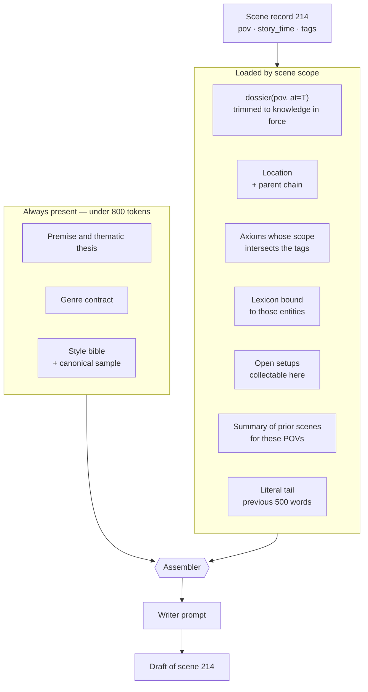
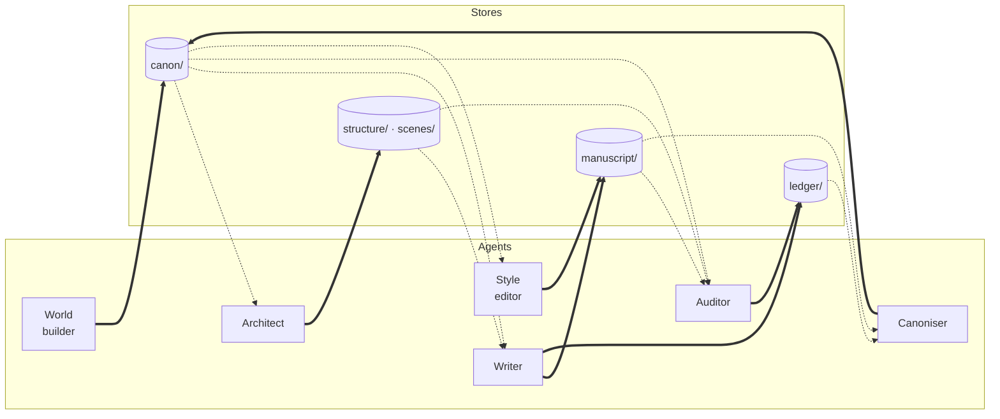
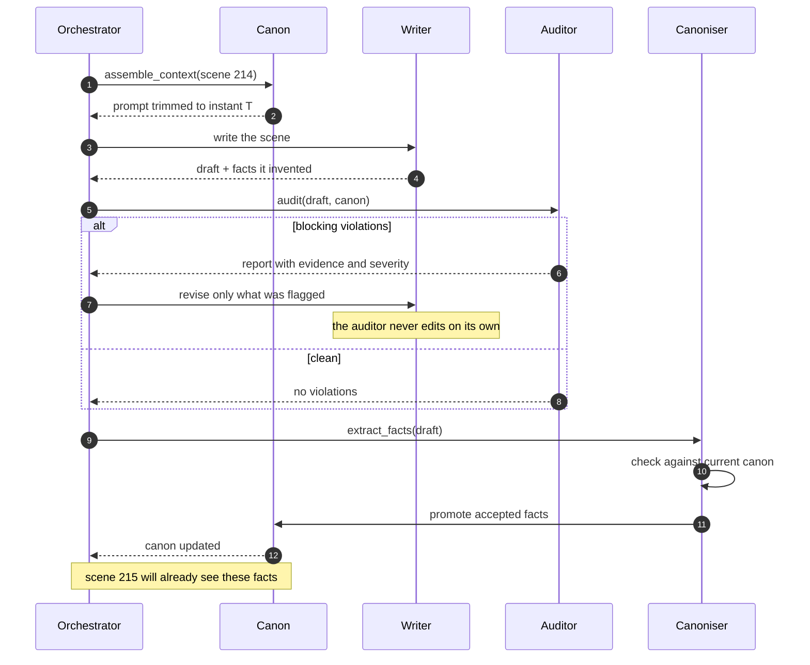

# Architecture

How the harness operates: the working loop, the system's own entities, the operations,
the agent roles and their permissions, the storage layout, and the turn protocol.

The vocabulary this system manipulates is defined in [`definitions.md`](./definitions.md).
The shape of the domain graph is explained in [`domain-knowledge.md`](./domain-knowledge.md).

---

## Governing principle

Most attempts at long-form generation fail because they treat the novel as **a text that
grows**. The harness treats it as **a normative knowledge base (the canon) plus a derived
artifact (the prose)**. Canon is small, curated and authoritative. Prose is large,
disposable and subordinate.

Two consequences follow, and everything else in this document is downstream of them.

**The manuscript is never loaded into context.** Not in summary form beyond what is
explicitly assembled, and never in full. Context is built by walking the entity graph, not
by retrieving similar text.

**Prose cannot edit canon.** When the draft contradicts a record, the draft is rewritten,
not the record — unless a designated agent rules otherwise, explicitly.

---

## Figure 1 — The working loop



### Reading it

Four of these five arrows are obvious and appear in every naive design: you gather
context, you write, you check, you fix. The one that is almost always missing is
**`promote`**, the return edge from proposed facts back into canon.

It matters because writing is generative in a way planning is not. When the writer
produces "the hangar smelled of ozone and dried blood", that detail did not exist in any
record. It is now true of that hangar, and the reader will hold the system to it. Without
the return edge, the canon stays frozen at day one while the prose invents a parallel
world, and the two diverge monotonically. No amount of writer quality prevents this —
drift is structural, not a failure of craft.

The two dotted edges from `Violations` encode a decision about authority. A violation can
be resolved by changing the prose, or by changing the canon, and the system does not
choose between them automatically. A checker that silently rewrites either side will
eventually sand off exactly the detail that made a scene good.

Note also that `Violations` is reachable from prose but has no edge into it. The auditor
reports; it does not repair.

---

## System entities (Layer 4)

These are working artifacts of the harness rather than facts about the fictional world,
which is why they are documented here rather than in `definitions.md`.

### Draft

The prose of one scene, versioned. Subordinate to canon.

| Field | Meaning |
|---|---|
| `scene_ref` | One scene, one file |
| `version` | Git history; diffs are the continuity record |
| `words` | Against the assigned budget |
| `literal_tail` | Last ~500 words, passed forward to the next scene |

`literal_tail` exists for tonal inertia. Summaries preserve what happened and lose how it
sounded; a verbatim tail lets the next scene start in the same register rather than
resetting to the model's default voice.

**Failure mode.** Letting the writer edit canon to justify what it has just written. That
is the precise mechanism by which drift begins.

### ProposedFact

A detail invented mid-draft, queued for canonisation. This is the entity most systems
omit, and its absence is why details get lost and contradicted thirty chapters later.

| Field | Meaning |
|---|---|
| `extracted_from` | Source draft |
| `target_entity` | Which canon record it would attach to |
| `conflict` | Whether it collides with something already canonical |
| `status` | `pending` · `promoted` · `rejected` |

**Failure mode.** Automatic promotion with no review. Canon fills with improvised noise
and stops being authoritative, at which point it is no longer worth consulting.

### Violation

A breach of a domain invariant, detected by the auditor. Issued as a report, never as an
automatic correction.

| Field | Meaning |
|---|---|
| `invariant` | Which one broke (see `definitions.md`) |
| `evidence` | Quotation and exact position in the draft |
| `severity` | `blocking` · `reviewable` · `note` |
| `resolution` | `fix prose` · `fix canon` · `accept with reason` |

**Failure mode.** Letting the auditor self-correct. It trims precisely the living details
that made the scene work, because those are the ones that deviate from the plan.

---

## Operations

The verbs of the system. Assembly walks the graph rather than searching by semantic
similarity: the relations here are known in advance, so an explicit traversal outperforms
a vector index and is reproducible besides.

### `dossier(character, at=story_time) → trimmed record`

The primitive operation. Returns the character as they were at that instant: only the
facts already acquired, the valence of their relationships on that date, and the
corresponding point on their arc. Everything else is built on top of this as-of query.

### `assemble_context(scene) → prompt`

Described in Figure 2 below.

### `extract_facts(draft) → ProposedFact[]`

Walks freshly written prose and isolates every assertion about the world that was not
already in canon. Runs unconditionally, including on drafts that will be discarded —
a rejected draft can still have invented a good name for something.

### `promote(fact) → canon`

The return edge. The only write path into canon during drafting, and the sole
responsibility of the canoniser. When a proposed fact collides with an existing record it
is escalated rather than resolved silently.

### `audit(scene) → Violation[]`

Runs the domain invariants against the draft and current canon. Reports; does not repair.

### `reconcile(canon_change) → affected_scenes[]`

When canon changes retroactively — and it will — returns which already-written scenes
depended on the previous fact. Without this operation, every late decision forces a
re-read of the entire book, which in practice means late decisions stop being made.

---

## Figure 2 — Assembling the context for one scene



### Reading it

The split between the two subgraphs is a budget decision. The fixed block is paid on every
single call for the length of the book, so it is capped hard — if the project layer does
not fit in roughly 800 tokens it has been written as prose when it should have been
written as constraints. Everything else is paid only when the scene actually needs it.

**The scene record drives the filter, not the prose.** `tags` is what selects which axioms
and which lexicon entries load. This is why tags are a required field rather than a
convenience: they are the index into the world layer, and a scene with no tags gets a
context with no world in it.

**`dossier(pov, at=T)` is the load-bearing call.** The trim is not an optimisation. A
writer handed the complete character record will use facts the character has not yet
learned, because there is nothing in the text marking them as future. Withholding them is
more reliable than instructing the model to ignore them.

**Open setups are offered, not assigned.** The assembler includes setups whose `due_by` is
approaching, so the writer *can* collect one if the scene affords it. It does not instruct
the writer to collect a specific one, because a payoff forced into an unsuitable scene
reads worse than a late payoff.

**The literal tail is the only verbatim prose in the context.** Everything else about the
manuscript arrives as summary. This is the compromise between tonal continuity and context
budget, and 500 words is roughly where it stops paying.

---

## Figure 3 — Agents and write permissions



Thick edges are writes, dotted edges are reads.

| Agent | Canon | Structure | Prose | Responsibility |
|---|---|---|---|---|
| Architect | read | **write** | — | Scene records, tension curve, budgets |
| World builder | **write** | read | — | Axioms, technology, locations, lexicon |
| Writer | read only | read | **write** | One scene per turn, from assembled context |
| Auditor | read | read | read | Runs invariants, issues violations |
| Canoniser | **write** | — | read | Promotes proposed facts, resolves conflicts |
| Style editor | read | — | **write** | Voice, rhythm, metrics, forbidden tics |

### Reading it

The permission asymmetry is the actual anti-drift mechanism. Everything else in this
document is support for it.

**`CANON` has exactly two inbound write edges**, from the world builder during planning
and from the canoniser during drafting. The writer, which is the agent generating the most
tokens and therefore the most opportunities for error, has none. It can *propose* facts by
writing to `ledger/`; it cannot commit them. This single constraint is what prevents the
prose from rewriting the world to justify itself, which is the failure that ends most
long-form generation attempts.

**The auditor writes only to `ledger/`.** It cannot touch canon, structure or prose. Its
output is a report, and the decision about what to do with the report belongs to a human
or to the architect.

**The canoniser cannot write prose and the writer cannot write canon**, which means no
single agent can both invent a fact and make it binding. That separation is what keeps
canon worth trusting.

Roles are separations of permission, not necessarily separate processes. A small setup can
run several of these as distinct prompts against the same model; what must not collapse is
the permission boundary.

---

## Figure 4 — One writing turn



### Reading it

This is the loop that runs roughly two hundred times over a novel, so its cost and its
failure behaviour dominate everything.

**Revision is scoped to what was flagged.** Handing the writer the full violation report
and asking for a rewrite produces a different scene, usually a blander one. The
instruction is to fix the flagged span, not to regenerate.

**Fact extraction runs after audit, not before.** A draft that fails audit may still be
discarded, but facts are extracted from whichever draft is finally accepted, so extraction
sits on the accepted path.

**Canon is updated before the next scene is assembled**, which is what makes the loop
actually closed. If promotion is deferred to a batch at the end of a chapter, scenes
within that chapter cannot see each other's inventions, and contradictions cluster inside
chapters instead of across them.

The unhandled case here is retroactive change. If promotion reveals that a new fact
contradicts something established in scene 40, `reconcile()` is what identifies the
affected work. Building the harness without it is viable for a first draft and painful
from the second onward.

---

## Storage layout

In Claude Code the ontology is simply the file tree, and that is an advantage: git gives
canon versioning and continuity diffs for free. YAML frontmatter for what must be queried,
prose for what the model must feel. Stable identifiers are mandatory, because renaming
breaks the graph.

```
CLAUDE.md                     protocol, invariants, per-role permissions
canon/
  project.md                  premise, thesis, genre contract
  style.md                    style bible + canonical samples
  axioms/*.md                 rules of the universe, with consequences
  technology/*.md             capabilities and limits
  locations/*.md              hierarchical, with sensory palette
  factions/*.md
  history/*.md
  lexicon.yaml                canonical form + forbidden variants
  time.yaml                   calendars and transit matrix
cast/
  {id}/dossier.md             identity, arc, competences
  {id}/voice.md               lexicon, syntax, never_says, sample
  {id}/knowledge.yaml         what they know and from which scene
  relationships.yaml          directed edges, dated valence
structure/
  arcs.yaml  chapters.yaml
scenes/
  NNN.yaml                    records: pov, goal, conflict, delta
manuscript/
  NNN.md                      prose; subordinate, versioned, disposable
ledger/
  setups.yaml                 reader debts and their deadlines
  threads.yaml                state and latency of each plot line
  timeline.yaml               story axis ↔ discourse axis
  proposed.yaml               canonisation queue
  violations.yaml             auditor reports
```

`CLAUDE.md` is where the turn protocol and the permission table live, since it is the file
every agent sees. The invariants themselves are stated in `definitions.md` and referenced
from there.

---

## Repository and application stack

The harness state described above (`canon/`, `structure/`, `scenes/`, `manuscript/`,
`ledger/`) is the source of truth. The application that serves and edits it lives in a
single **monorepo**, split into two top-level folders:

```
backend/     FastAPI · Python
frontend/    React · three.js
```

**`backend/`** is a FastAPI service in Python. It is the only process that reads and
writes the harness stores — canon, structure, scenes, manuscript, ledger — so the
permission boundaries in Figure 3 are enforced at this layer, not in the client.

**`frontend/`** is a React application, with three.js for any 3D or spatial
visualisation (e.g. navigating locations, the entity graph, or the timeline). It talks to
`backend/` over its API and holds no direct access to the stores.

This split is a repository and deployment decision, orthogonal to the agent/store model
above: agents still read and write through the stores in `Storage layout`, and
`backend/` is simply the process boundary that hosts those operations and exposes them to
`frontend/`.

---

## A warning about over-constraint

An over-constrained harness produces dead prose. The writer starts writing to satisfy the
scene record rather than to write well, and the result passes every check while being
unreadable.

Two corrections belong in the design from the start, and both are already reflected above:
the auditor **flags rather than repairs**, and the scene record specifies **dramatic
function** — what changes, what gets paid — while leaving the *how* free.

Consistency is a constraint, not the goal. The goal is still that chapter forty lands.
