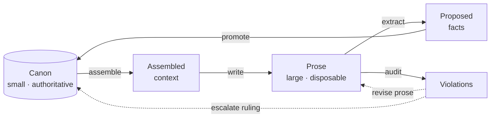
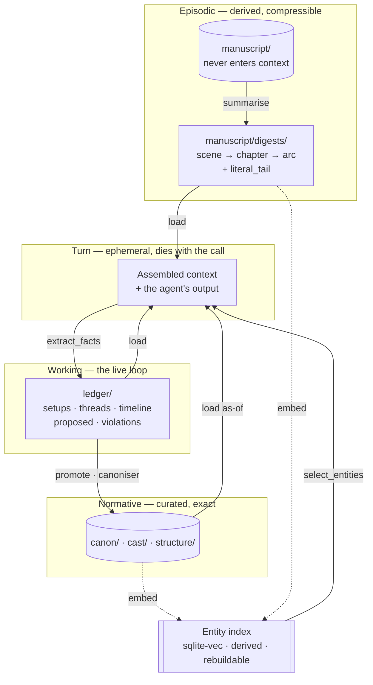
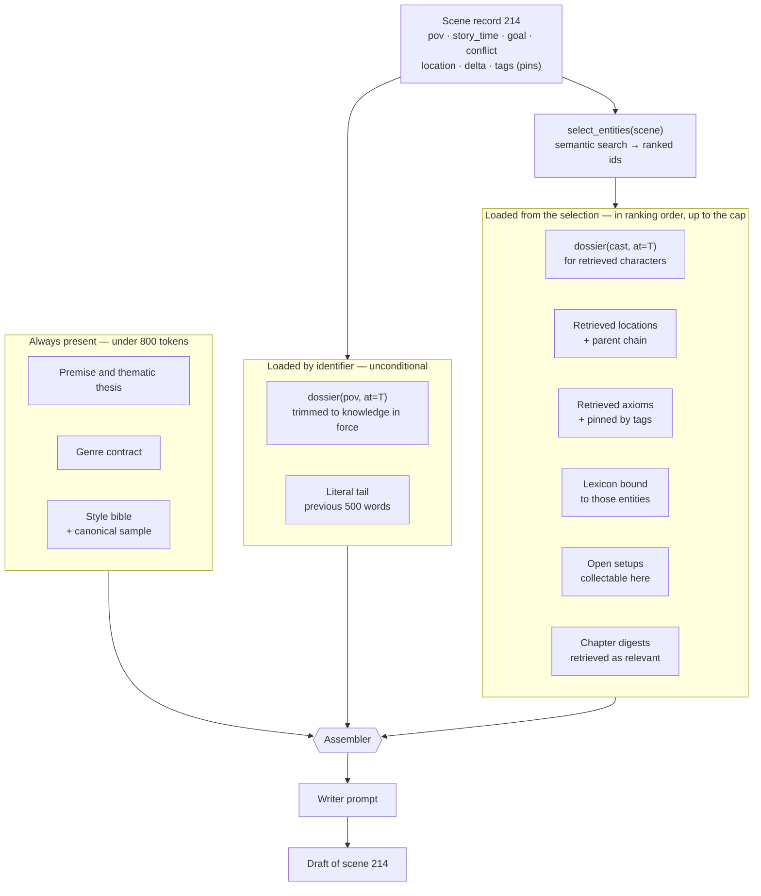
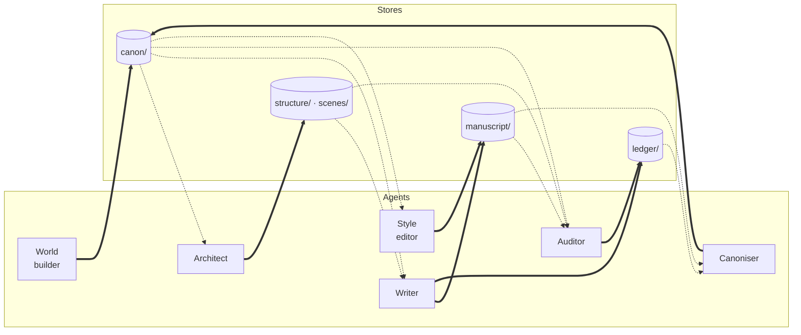
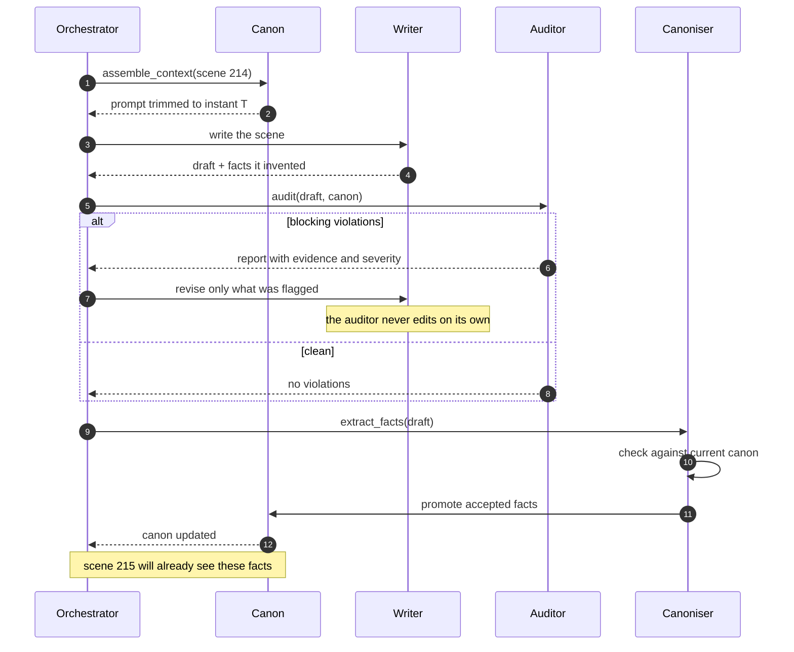

# Architecture

How the harness operates: the working loop, the system's own entities, the operations,
the agent roles and their permissions, the storage layout, and the turn protocol.

The vocabulary this system manipulates is defined in [`definitions.md`](./definitions.md).
The shape of the domain graph is explained in [`domain-knowledge.md`](./domain-knowledge.md).

---

## Governing principle

Most attempts at long-form generation fail because they treat the novel as **a text that
grows**. The harness treats it as **a normative knowledge base (the canon) plus a derived
artifact (the prose)**. Canon is small, curated and authoritative. Prose is large,
disposable and subordinate.

Two consequences follow, and everything else in this document is downstream of them.

**The manuscript is never loaded into context.** Not in summary form beyond what is
explicitly assembled, and never in full. Context is built in two steps: semantic search over
the scene record **selects** which entities are relevant, and the store **loads** each one
in the version that holds at the scene's instant. Retrieval decides *what* enters; it never
decides *which version*. See [Memory and context budget](#memory-and-context-budget).

**Prose cannot edit canon.** When the draft contradicts a record, the draft is rewritten,
not the record — unless a designated agent rules otherwise, explicitly.

---

## Figure 1 — The working loop



### Reading it

Four of these five arrows are obvious and appear in every naive design: you gather
context, you write, you check, you fix. The one that is almost always missing is
**`promote`**, the return edge from proposed facts back into canon.

It matters because writing is generative in a way planning is not. When the writer
produces "the hangar smelled of ozone and dried blood", that detail did not exist in any
record. It is now true of that hangar, and the reader will hold the system to it. Without
the return edge, the canon stays frozen at day one while the prose invents a parallel
world, and the two diverge monotonically. No amount of writer quality prevents this —
drift is structural, not a failure of craft.

The two dotted edges from `Violations` encode a decision about authority. A violation can
be resolved by changing the prose, or by changing the canon, and the system does not
choose between them automatically. A checker that silently rewrites either side will
eventually sand off exactly the detail that made a scene good.

Note also that `Violations` is reachable from prose but has no edge into it. The auditor
reports; it does not repair.

---

## System entities (Layer 4)

These are working artifacts of the harness rather than facts about the fictional world,
which is why they are documented here rather than in `definitions.md`.

### Draft

The prose of one scene, versioned. Subordinate to canon.

| Field | Meaning |
|---|---|
| `scene_ref` | One scene, one file |
| `version` | Git history; diffs are the continuity record |
| `words` | Against the assigned budget |
| `literal_tail` | Last ~500 words, passed forward to the next scene |

`literal_tail` exists for tonal inertia. Summaries preserve what happened and lose how it
sounded; a verbatim tail lets the next scene start in the same register rather than
resetting to the model's default voice.

**Failure mode.** Letting the writer edit canon to justify what it has just written. That
is the precise mechanism by which drift begins.

### SceneDigest

A compressed record of what one scene changed, produced when the scene closes and rolled
up at chapter and arc boundaries. Derived from prose; regenerable; never authoritative.

| Field | Meaning |
|---|---|
| `scene_ref` | The scene it summarises; at chapter or arc level, the range |
| `level` | `scene` · `chapter` · `arc` |
| `povs[]` | Whose scenes are covered, so the assembler can filter by POV |
| `delta` | What changed in the world, who learned what, which setups were paid |
| `words` | Roughly 100 at scene level, 250 at chapter, 400 at arc |

Digests are the only form in which past prose reaches a later scene, apart from the
`literal_tail` of the immediately preceding one. They live under `manuscript/digests/`
and are indexed for retrieval at chapter level (Figure 2). The ladder is what keeps the
cost of assembling scene 200 close to that of scene 20.

**Failure mode.** Treating the digest as canon. A digest records what the prose *said*;
whether that becomes true of the world is decided by `promote`, not by summarisation.

### ProposedFact

A detail invented mid-draft, queued for canonisation. This is the entity most systems
omit, and its absence is why details get lost and contradicted thirty chapters later.

| Field | Meaning |
|---|---|
| `extracted_from` | Source draft |
| `target_entity` | Which canon record it would attach to |
| `conflict` | Whether it collides with something already canonical |
| `status` | `pending` · `promoted` · `rejected` |

**Failure mode.** Automatic promotion with no review. Canon fills with improvised noise
and stops being authoritative, at which point it is no longer worth consulting.

### Violation

A breach of a domain invariant, detected by the auditor. Issued as a report, never as an
automatic correction.

| Field | Meaning |
|---|---|
| `invariant` | Which one broke (see `definitions.md`) |
| `evidence` | Quotation and exact position in the draft |
| `severity` | `blocking` · `reviewable` · `note` |
| `resolution` | `fix prose` · `fix canon` · `accept with reason` |

**Failure mode.** Letting the auditor self-correct. It trims precisely the living details
that made the scene work, because those are the ones that deviate from the plan.

---

## Operations

The verbs of the system. Assembly is two operations, not one: a semantic **selection** that
decides which entities a scene needs, and a deterministic **load** that fetches each one as
of the scene's instant. Keeping them apart is what lets retrieval find what the tags would
have missed without letting it leak facts the POV has not yet learned.

### `dossier(character, at=story_time) → trimmed record`

The primitive operation. Returns the character as they were at that instant: only the
facts already acquired, the valence of their relationships on that date, and the
corresponding point on their arc. Everything else is built on top of this as-of query.

### `select_entities(scene) → EntityRef[]`

Embeds the full scene record — `goal`, `conflict`, `value_change`, `pov`, `location`,
`entry_state`, `exit_state` and the architect's free-text `notes` — and queries the entity
index for the nearest characters, locations, axioms, lexicon entries and chapter digests.
Returns **identifiers ranked by relevance, never text**. The POV is not part of the result:
it enters by identifier from the scene record, unconditionally. Entities the architect
pinned through `tags` are prepended to the ranking.

The list this returns is written to the turn's trace, and the auditor reads the same list:
"which axioms apply to this scene" has one answer per turn, shared by writer and auditor.

### `assemble_context(scene) → prompt`

Calls `select_entities`, then loads each returned identifier through the store in as-of
form — `dossier(id, at=T)` for characters, the full record for axioms and locations, the
chapter-level `SceneDigest` for prose — in ranking order until the context budget is
reached. Described in Figure 2 below.

### `extract_facts(draft) → ProposedFact[]`

Walks freshly written prose and isolates every assertion about the world that was not
already in canon. Runs unconditionally, including on drafts that will be discarded —
a rejected draft can still have invented a good name for something.

### `promote(fact) → canon`

The return edge. The only write path into canon during drafting, and the sole
responsibility of the canoniser. When a proposed fact collides with an existing record it
is escalated rather than resolved silently.

### `audit(scene) → Violation[]`

Runs the domain invariants against the draft and current canon. Reports; does not repair.

### `reconcile(canon_change) → affected_scenes[]`

When canon changes retroactively — and it will — returns which already-written scenes
depended on the previous fact. Without this operation, every late decision forces a
re-read of the entire book, which in practice means late decisions stop being made.

---

## Memory and context budget

The system has no "memory" as a single thing. It has four tiers with different owners,
write paths and forgetting policies, and the failures this section prevents all come from
collapsing two of them — most often by letting an agent "remember" the previous turn
outside the stores.



### Reading it

**Agents are stateless functions over the stores.** There is no transcript, no
conversation history and no hand-off of context between roles. The writer and the auditor
communicate through `manuscript/NNN.md` and `ledger/violations.yaml`, never by passing
messages. This is the stronger form of the `In`/`Out` contract in Figure 3: an agent's
context is built from stores at the start of its call and discarded at the end.

**`promote` is the only write into long-term memory.** Everything the writer invents goes
to `ledger/proposed.yaml` first and reaches `canon/` only through the canoniser, with a
human ruling on collisions. Memory consolidation is reviewed, not accumulated.

**Forgetting is explicit and happens by rollup.** A scene digest is written when the scene
closes; chapter and arc digests are rolled up from it at their boundaries. The assembler
never loads raw prose from earlier scenes: it loads the chapter digests that
`select_entities` ranked as relevant, plus the `literal_tail` of the immediately preceding
scene for tonal continuity. Paid setups, resolved violations and closed threads leave the
working tier as they close.

**The entity index is derived, never a source.** It is built from `canon/`, `cast/` and
`manuscript/digests/`, one row per entity, and can be dropped and rebuilt with no loss. An
index entry with no backing record in the stores is a bug. Retrieval therefore cannot
introduce a fact; it can only choose among facts that exist.

**One hard cap: 100k tokens per invocation, for every role.** Roles run sequentially, each
in a fresh window, and no window is inherited, so the cap is per call and never
accumulates across the turn. There are no per-role targets below it. `assemble_context`
loads selected entities in ranking order and stops at the cap; a call that would exceed it
is stopped and traced, never silently truncated (see the budget guardrail in
[`verification.md`](./verification.md#guardrails--a-structural--t-behavioural)).

**Selection is not reproducible; loading is.** Two runs of `select_entities` over the same
stores may rank differently. This is accepted and registered in
[`verification.md`](./verification.md#accepted-risks-u-register), and it is why the
selected identifiers are written to the trace: what entered a context is always
recoverable, even when why it was chosen is not.

---

## Figure 2 — Assembling the context for one scene



### Reading it

The split between the three subgraphs is a budget decision. The fixed block is paid on
every single call for the length of the book, so it is capped hard — if the project layer
does not fit in roughly 800 tokens it has been written as prose when it should have been
written as constraints. The by-identifier block is small and mandatory. Everything else is
paid only when the selection says the scene needs it, and is loaded in ranking order until
the 100k cap is reached.

**The scene record drives the selection, not the prose.** `select_entities` embeds the
whole record — what the POV wants, what stops them, where, what changes — and the index
returns the characters, locations, axioms, lexicon entries and chapter digests nearest to
it. This is why the record's dramatic fields must be written with care: a vague `goal` and
`conflict` produce a vague selection, and a scene with an empty record gets a context with
no world in it. `tags` survive as an optional **pin**: anything the architect tags enters
regardless of ranking, so a rule the scene *must* honour is never left to similarity.

**Selection returns identifiers, not text.** What the index knows about a character is one
embedding of their record; what the writer receives is `dossier(id, at=T)`, loaded by the
store after selection. The two steps are kept apart so that retrieval can never hand the
writer a version of a record that the scene's instant forbids.

**`dossier(pov, at=T)` is the load-bearing call.** The trim is not an optimisation. A
writer handed the complete character record will use facts the character has not yet
learned, because there is nothing in the text marking them as future. Withholding them is
more reliable than instructing the model to ignore them. The POV never goes through
selection: it is read from the record and loaded unconditionally.

**Open setups are offered, not assigned.** The assembler includes setups whose `due_by` is
approaching, so the writer *can* collect one if the scene affords it. It does not instruct
the writer to collect a specific one, because a payoff forced into an unsuitable scene
reads worse than a late payoff.

**The literal tail is the only verbatim prose in the context.** Everything else about the
manuscript arrives as summary. This is the compromise between tonal continuity and context
budget, and 500 words is roughly where it stops paying.

---

## Figure 3 — Agents and write permissions



Thick edges are writes, dotted edges are reads.

| Agent | Signature | Canon | Structure | Prose | In | Out | Responsibility |
|---|---|---|---|---|---|---|---|
| Architect | `plan(canon, structure, intent) → scene records` | read | **write** | — | `canon/project.md` · `canon/axioms/` · `canon/factions/` · `canon/history/` · `canon/locations/` · `cast/{id}/dossier.md` · `ledger/setups.yaml` · `ledger/threads.yaml` | `structure/arcs.yaml` · `structure/chapters.yaml` · `scenes/NNN.yaml` | Scene records, tension curve, budgets |
| World builder | `build(intent, structure) → canon records` | **write** | read | — | `canon/project.md` · `canon/` · `structure/` | `canon/axioms/*.md` · `canon/technology/*.md` · `canon/locations/*.md` · `canon/factions/*.md` · `canon/history/*.md` · `canon/lexicon.yaml` · `canon/time.yaml` | Axioms, technology, locations, lexicon |
| Writer | `write(assembled_context) → Draft, ProposedFact[]`<br/>`revise(draft, Violation[]) → Draft` | read only | read | **write** | `assemble_context(scene)` (Figure 2): the fixed block (`canon/project.md` · `canon/style.md`), the POV's `cast/{id}/` as-of and the previous scene's tail, plus whatever `select_entities` ranked within the cap from `cast/` · `canon/` · `ledger/setups.yaml` · `manuscript/digests/`, the selected ids being recorded in the turn trace; on revision also `ledger/violations.yaml` | `manuscript/NNN.md` · `manuscript/digests/NNN.md` · `ledger/proposed.yaml` | One scene per turn, from assembled context |
| Style editor | `polish(draft, style) → Draft` | read | — | **write** | `manuscript/NNN.md` · `canon/style.md` · `canon/lexicon.yaml` · `cast/{id}/voice.md` | `manuscript/NNN.md` | Voice, rhythm, metrics, forbidden tics |
| Auditor | `audit(scene) → Violation[]` | read | read | read | `manuscript/NNN.md` · `scenes/NNN.yaml` · the turn's selected-entity list (the axioms it names are the ones in force for invariant 6) · `canon/axioms/` · `canon/time.yaml` · `canon/lexicon.yaml` · `cast/{id}/dossier.md` · `cast/{id}/knowledge.yaml` · `cast/{id}/changes.yaml` · `cast/relationships.yaml` · `ledger/timeline.yaml` | `ledger/violations.yaml` | Runs invariants, issues violations |
| Canoniser | `promote(fact) → canon` | **write** | — | read | `ledger/proposed.yaml` · `manuscript/NNN.md` · `canon/` | `canon/` · `cast/` · `ledger/proposed.yaml` | Promotes proposed facts, resolves conflicts |

`In` and `Out` are a stricter statement than the permission columns: a store an agent is
allowed to read is not necessarily in its context on a given turn. **Anything not listed
as an input is not available to the agent.** An agent that needs a fact absent from its
inputs does not go and fetch it; the contract is wrong and gets amended. This is what
keeps the context budget bounded and the behaviour reproducible.

Some inputs and outputs are not artefacts and so do not appear above: the human intent
that opens a planning turn, the human ruling the canoniser asks for on a collision, and
the escalation it raises when the conflict is not its to settle.

### Reading it

The permission asymmetry is the actual anti-drift mechanism. Everything else in this
document is support for it.

**`CANON` has exactly two inbound write edges**, from the world builder during planning
and from the canoniser during drafting. The writer, which is the agent generating the most
tokens and therefore the most opportunities for error, has none. It can *propose* facts by
writing to `ledger/`; it cannot commit them. This single constraint is what prevents the
prose from rewriting the world to justify itself, which is the failure that ends most
long-form generation attempts.

**The auditor writes only to `ledger/`.** It cannot touch canon, structure or prose. Its
output is a report and nothing else: the decision about what to do with it belongs to a
human or to the architect, so the auditor cannot act on its own findings.

**The canoniser cannot write prose and the writer cannot write canon**, which means no
single agent can both invent a fact and make it binding. That separation is what keeps
canon worth trusting. Its human ruling is not optional decoration: a canoniser that
resolves every collision by itself is the failure mode named under `ProposedFact` — canon
fills with improvised noise and stops being worth consulting.

**The architect's dramatic fields matter beyond their own record.** `goal`, `conflict`,
`value_change` and the states are what `select_entities` embeds, so a scene record with
vague dramatic fields produces a vague selection and a thin world. `tags` are the
architect's pin: an axiom or lexicon entry tagged on the record enters the context
regardless of ranking, which is how a rule the scene must honour is kept out of the hands
of similarity.

**The writer's two invocations are not interchangeable.** `write` produces a scene from
context; `revise` is scoped to the flagged spans and must not regenerate the scene.

**The style editor reads canon and writes prose**, never the reverse: a voice decision
taken there does not become a rule, which would have to go through the world builder.

Roles are separations of permission, not necessarily separate processes. A small setup can
run several of these as distinct prompts against the same model; what must not collapse is
the permission boundary.

## Figure 4 — One writing turn



### Reading it

This is the loop that runs roughly two hundred times over a novel, so its cost and its
failure behaviour dominate everything.

**Revision is scoped to what was flagged.** Handing the writer the full violation report
and asking for a rewrite produces a different scene, usually a blander one. The
instruction is to fix the flagged span, not to regenerate.

**Fact extraction runs after audit, not before.** A draft that fails audit may still be
discarded, but facts are extracted from whichever draft is finally accepted, so extraction
sits on the accepted path.

**Canon is updated before the next scene is assembled**, which is what makes the loop
actually closed. If promotion is deferred to a batch at the end of a chapter, scenes
within that chapter cannot see each other's inventions, and contradictions cluster inside
chapters instead of across them.

The unhandled case here is retroactive change. If promotion reveals that a new fact
contradicts something established in scene 40, `reconcile()` is what identifies the
affected work. Building the harness without it is viable for a first draft and painful
from the second onward.

---

## Storage layout

In Claude Code the ontology is simply the file tree, and that is an advantage: git gives
canon versioning and continuity diffs for free. YAML frontmatter for what must be queried,
prose for what the model must feel. Stable identifiers are mandatory, because renaming
breaks the graph.

```
CLAUDE.md                     protocol, invariants, per-role permissions
canon/
  project.md                  premise, thesis, genre contract
  style.md                    style bible + canonical samples
  axioms/*.md                 rules of the universe, with consequences
  technology/*.md             capabilities and limits
  locations/*.md              hierarchical, with sensory palette
  factions/*.md
  history/*.md
  lexicon.yaml                canonical form + forbidden variants
  time.yaml                   calendars and transit matrix
cast/
  {id}/dossier.md             identity, arc, competences
  {id}/voice.md               lexicon, syntax, never_says, sample
  {id}/knowledge.yaml         what they know and from which scene
  {id}/changes.yaml           registered ChangeEvents: body and memory changes, with cause
  relationships.yaml          directed edges, dated valence
structure/
  arcs.yaml  chapters.yaml
scenes/
  NNN.yaml                    records: pov, goal, conflict, delta
manuscript/
  NNN.md                      prose; subordinate, versioned, disposable
  digests/NNN.md              scene digests, rolled up per chapter and arc; regenerable
ledger/
  setups.yaml                 reader debts and their deadlines
  threads.yaml                state and latency of each plot line
  timeline.yaml               story axis ↔ discourse axis
  proposed.yaml               canonisation queue
  violations.yaml             auditor reports
```

`CLAUDE.md` is where the turn protocol and the permission table live, since it is the file
every agent sees. The invariants themselves are stated in `definitions.md` and referenced
from there.

Next to the tree, and excluded from version control, sits `.index/`: the entity index,
the embedding-model cache, and the backend's operational records, one file per writing turn
(the selected-entity list, model and prompt versions, token counts, iterations, outcome) and
an append-only provenance log naming the role behind every store write. Nothing under
`.index/` is a store: it is not governed by Figure 3, no agent reads it, and the index part
is rebuilt from the tree at will. The turn and provenance records are **not** rebuildable —
losing `.index/` loses the history of how the tree came to be, though not the tree — which
is registered as an accepted risk in
[`verification.md`](./verification.md#accepted-risks-u-register) until tracing moves them
to Langfuse.

---

## Repository and application stack

The harness state described above (`canon/`, `structure/`, `scenes/`, `manuscript/`,
`ledger/`) is the source of truth. The application that serves and edits it lives in a
single **monorepo**, split into two top-level folders:

```
backend/     FastAPI · Python
frontend/    React · three.js
```

**`backend/`** is a FastAPI service in Python. It is the only process that reads and
writes the harness stores — canon, structure, scenes, manuscript, ledger — so the
permission boundaries in Figure 3 are enforced at this layer, not in the client.

**`frontend/`** is a React application, with three.js for any 3D or spatial
visualisation (e.g. navigating locations, the entity graph, or the timeline). It talks to
`backend/` over its API and holds no direct access to the stores.

This split is a repository and deployment decision, orthogonal to the agent/store model
above: agents still read and write through the stores in `Storage layout`, and
`backend/` is simply the process boundary that hosts those operations and exposes them to
`frontend/`.

---

## Code architecture — package by feature

Both halves of the monorepo are organised the same way: **one folder per feature**, and a
single shared folder for what genuinely crosses features. Code is grouped by what it is
*about*, not by what it *is*. There is no top-level `models/`, `services/`, `routers/`,
`components/` or `hooks/` folder; those names appear *inside* a feature.

The rule that decides where a file goes: **if only one feature uses it, it lives in that
feature.** It moves to the shared folder the moment a second feature needs it — not in
anticipation of one. Speculative sharing is how a commons turns into a dumping ground.

### `backend/` — feature folders plus `commons/`

```
backend/
  app/
    main.py                   FastAPI app, mounts each feature's router
    commons/                  cross-feature only
      stores/                 the store layer — the ONLY path to canon/ structure/
                              scenes/ manuscript/ ledger/, and where Figure 3's
                              permission table is enforced
      permissions/            agent roles, the permission check itself
      schemas/                shared Pydantic models and JSON Schemas
      db/                     SQLite connection, migrations, FTS5 + vector setup
      errors/                 error types and the exception handlers
      config.py
    canon/                    one feature =…
      router.py               …its HTTP surface
      service.py              …its operations
      models.py               …its Pydantic models
      repository.py           …its access to the store layer in commons/
      tests/                  …and its tests, next to the code
    cast/
    scenes/
    manuscript/
    ledger/
    agents/
  tests/                      cross-feature and end-to-end tests only
```

Rules that hold across features:

1. **A feature owns its vertical slice.** Router, service, models, repository and tests
   for one concept live together. Deleting a feature means deleting one folder.
2. **Features do not import each other's internals.** If `scenes/` needs something from
   `canon/`, it calls `canon`'s service through its public surface, or the thing it needs
   belongs in `commons/`. No reaching into another feature's `repository.py`.
3. **`commons/` never imports a feature.** Dependencies point one way: feature →
   `commons/`. A `commons/` module that knows a feature's name is a design error.
4. **Store access stays in `commons/stores/`.** A feature's `repository.py` calls it and
   names the agent role performing the write. This is the load-bearing wall of Figure 3
   and no feature is allowed its own path around it.
5. **Cycles are forbidden.** Two features that need each other are one feature, or the
   shared part belongs in `commons/`.

### `frontend/` — package by feature, not FSD

The frontend is organised **package by feature**. It deliberately does *not* use Feature-
Sliced Design: no `entities/` · `features/` · `widgets/` · `pages/` · `shared/` layer
ladder, and no per-slice `ui/ model/ api/` segments. That ceremony buys layering
discipline we already get from the rule above, at the cost of scattering one concept
across five directories.

```
frontend/
  src/
    main.tsx
    app/                      router, providers, global layout
    shared/                   cross-feature only
      api/                    generated OpenAPI client — the only way to reach backend/
      ui/                     design-system primitives (button, dialog, …)
      three/                  reusable react-three-fiber helpers, loaders, controls
      lib/                    formatting, hooks and utilities used by 2+ features
      types/                  generated backend types
    canon/                    one feature =…
      CanonPage.tsx           …its screens and components
      useCanon.ts             …its hooks
      api.ts                  …its calls, built on shared/api
      types.ts                …its local types
      CanonView.test.tsx      …and its tests
    cast/
    scenes/
    manuscript/
    timeline/
    graph3d/
```

The same five rules apply, with the frontend-specific additions:

6. **A feature's components, hooks, state and API calls live in its folder**, flat, until
   the folder is large enough that subfolders help. Nesting is earned, not assumed.
7. **The generated API client is the only door to the backend.** Features import from
   `shared/api`; nothing hand-rolls a `fetch` to a route, and nothing touches the stores
   (see `frontend/` above and Process 3 rule 5 in `AGENTS.md`).
8. **`app/` composes features; features do not compose `app/`.** Routing knows about
   features; a feature never imports the router's configuration.

## A warning about over-constraint

An over-constrained harness produces dead prose. The writer starts writing to satisfy the
scene record rather than to write well, and the result passes every check while being
unreadable.

Two corrections belong in the design from the start, and both are already reflected above:
the auditor **flags rather than repairs**, and the scene record specifies **dramatic
function** — what changes, what gets paid — while leaving the *how* free.

Consistency is a constraint, not the goal. The goal is still that chapter forty lands.
