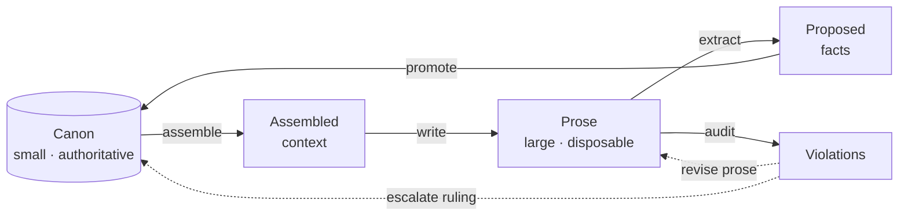
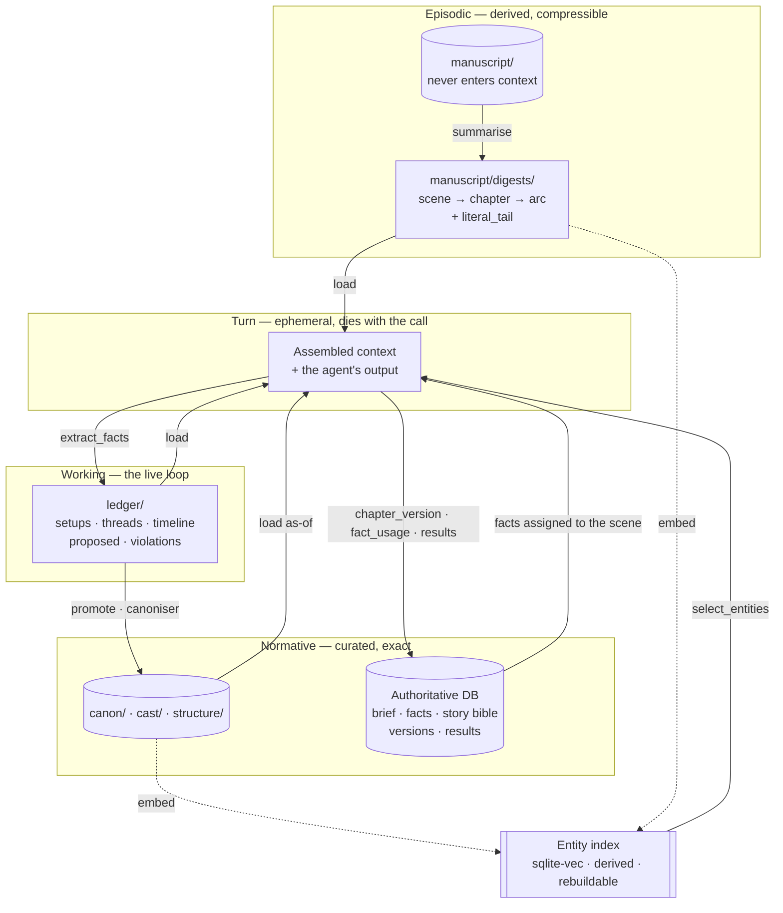
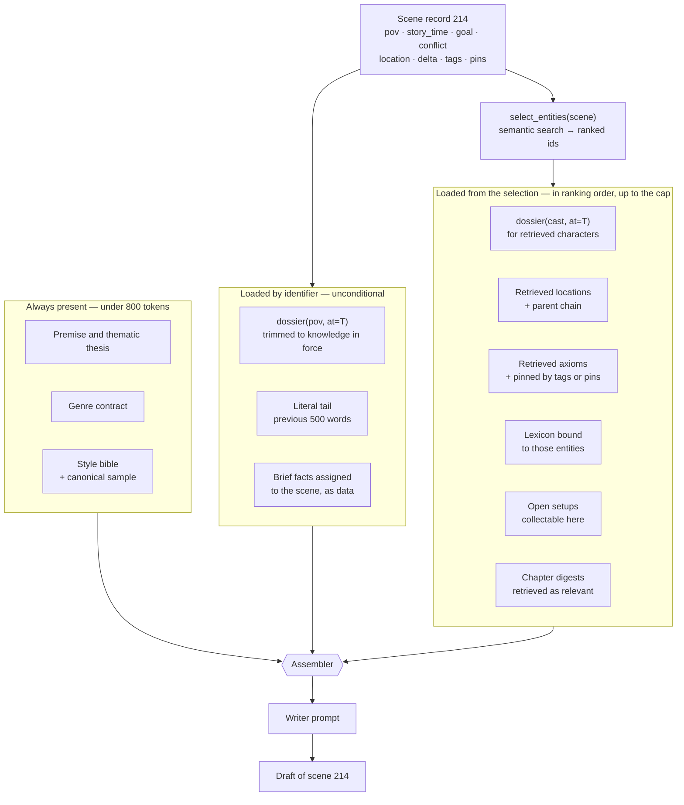
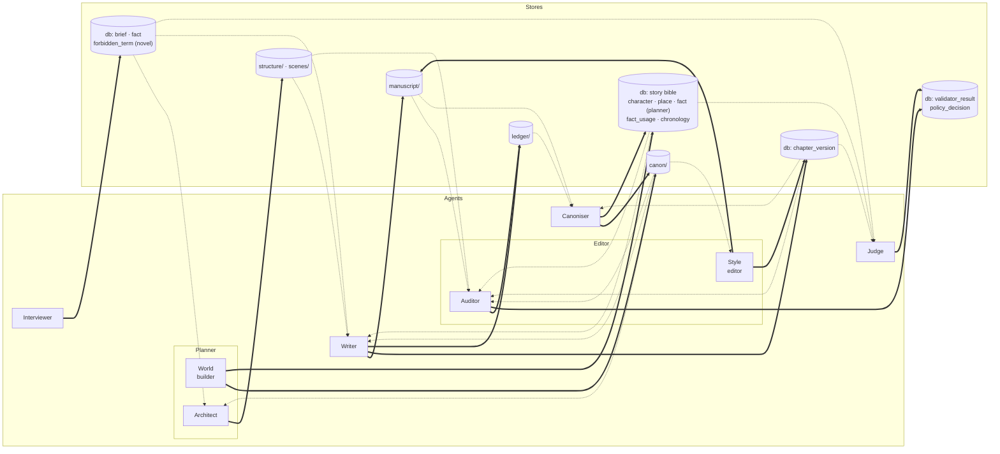
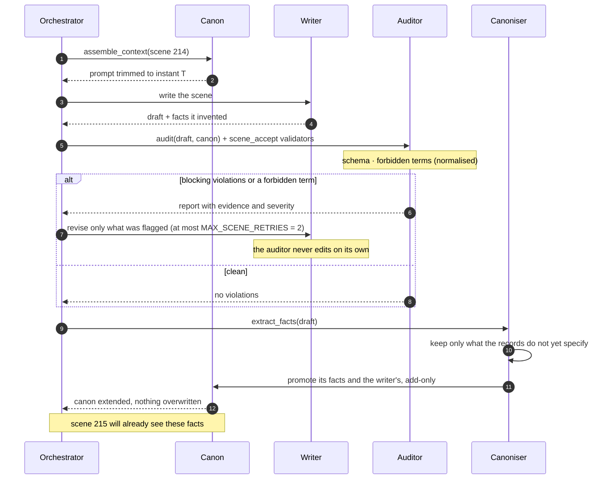
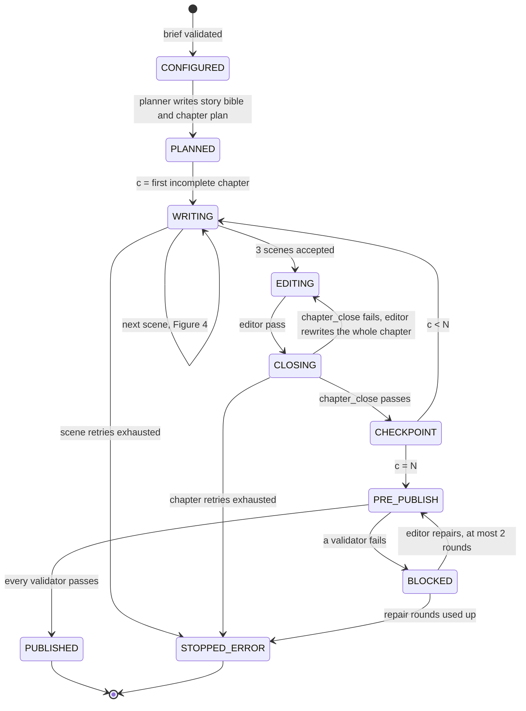

# Architecture

How the harness operates: the working loop, the system's own entities, the operations,
the agent roles and their permissions, the storage layout, and the turn protocol.

The vocabulary this system manipulates is defined in [`definitions.md`](./definitions.md).
The shape of the domain graph is explained in [`domain-knowledge.md`](./domain-knowledge.md).

---

## Governing principle

Most attempts at long-form generation fail because they treat the novel as **a text that
grows**. The harness treats it as **a normative knowledge base (the canon) plus a derived
artifact (the prose)**. Canon is small, curated and authoritative. Prose is large,
disposable and subordinate.

Above both sits the **brief**: the commission of one gift novel for a named recipient
(see [`definitions.md`](./definitions.md#brief)). The brief is the root. Canon is the
planner's answer to it, prose is the writer's rendering of canon, and the personalisation
the brief asks for reaches the page only through the facts it yields. The brief is the one
thing a person writes; everything below it is produced, checked and versioned by the
harness.

Two consequences follow, and everything else in this document is downstream of them.

**The manuscript is never loaded into context.** Not in summary form beyond what is
explicitly assembled, and never in full. Context is built in two steps: semantic search over
the scene record **selects** which entities are relevant, and the store **loads** each one
in the version that holds at the scene's instant. Retrieval decides *what* enters; it never
decides *which version*. See [Memory and context budget](#memory-and-context-budget).

**Prose cannot edit canon.** When the draft contradicts a record, the draft is rewritten,
not the record — unless a human rules otherwise, explicitly, and the record's owning role
makes the edit. What the prose invents reaches canon only as an addition: promotion adds
what a record does not yet say and never changes what it already says.

---

## Figure 1 — The working loop



### Reading it

Four of these five arrows are obvious and appear in every naive design: you gather
context, you write, you check, you fix. The one that is almost always missing is
**`promote`**, the return edge from proposed facts back into canon.

It matters because writing is generative in a way planning is not. When the writer
produces "the hangar smelled of ozone and dried blood", that detail did not exist in any
record. It is now true of that hangar, and the reader will hold the system to it. Without
the return edge, the canon stays frozen at day one while the prose invents a parallel
world, and the two diverge monotonically. No amount of writer quality prevents this —
drift is structural, not a failure of craft.

The two dotted edges from `Violations` encode a decision about authority. A violation can
be resolved by changing the prose, or by changing the canon, and the system does not
choose between them automatically. A checker that silently rewrites either side will
eventually sand off exactly the detail that made a scene good.

Note also that `Violations` is reachable from prose but has no edge into it. The auditor
reports; it does not repair.

---

## System entities (Layer 4)

These are working artifacts of the harness rather than facts about the fictional world,
which is why they are documented here rather than in `definitions.md`.

### Draft

The prose of one scene, versioned. Subordinate to canon.

Versioning lives in the [authoritative database](#authoritative-database), not in git
and not in the file. In the gift-novel pipeline the accepted prose of a chapter is stored
as a row of `chapter_version` — text, hash and summary — under one `novel_version`, and a
row is **never overwritten**: a regeneration writes a new version that copies the unchanged
chapters and replaces only the regenerated ones, and the previous version is kept. A
chapter is *changed* in a version when its text hash differs from the parent version's.
The legacy per-scene file tree (`manuscript/NNN.md`) is still versioned by git, but the
gift-novel pipeline does not write it; one text has one source of truth.

| Field | Meaning |
|---|---|
| `scene_ref` | One scene, one file |
| `words` | Against the assigned budget |
| `literal_tail` | Last ~500 words, passed forward to the next scene |

`literal_tail` exists for tonal inertia. Summaries preserve what happened and lose how it
sounded; a verbatim tail lets the next scene start in the same register rather than
resetting to the model's default voice.

**Failure mode.** Letting the writer edit canon to justify what it has just written. That
is the precise mechanism by which drift begins.

### SceneDigest

A compressed record of what one scene changed, produced when the scene closes and rolled
up at chapter and arc boundaries. Derived from prose; regenerable; never authoritative.

| Field | Meaning |
|---|---|
| `scene_ref` | The scene it summarises; at chapter or arc level, the range |
| `level` | `scene` · `chapter` · `arc` |
| `povs[]` | Whose scenes are covered, so the assembler can filter by POV |
| `delta` | What changed in the world, who learned what, which setups were paid |
| `words` | Roughly 100 at scene level, 250 at chapter, 400 at arc |

Digests are the only form in which past prose reaches a later scene, apart from the
`literal_tail` of the immediately preceding one. They live under `manuscript/digests/`
and are indexed for retrieval at chapter level (Figure 2). The ladder is what keeps the
cost of assembling scene 200 close to that of scene 20.

**Failure mode.** Treating the digest as canon. A digest records what the prose *said*;
whether that becomes true of the world is decided by `promote`, not by summarisation.

### ProposedFact

A detail invented mid-draft, queued for canonisation. This is the entity most systems
omit, and its absence is why details get lost and contradicted thirty chapters later.

| Field | Meaning |
|---|---|
| `extracted_from` | Source draft |
| `target_entity` | Which canon record it would attach to |
| `conflict` | Whether a collision with canon was recorded on it. Promotion never sets it: the flag is kept only for facts recorded that way before promotion became add-only, which a human may still rule on |
| `status` | `pending` · `promoted` (in canon) · `rejected` (not applied because the record already specifies it, or refused by a human ruling) |

Promotion is automatic and **add-only** (see [`promote`](#promotefact--canon)): a fact
fills what a record leaves empty or adds a detail to it, and is never allowed to change
what the record already states. Reporting where the prose contradicts canon is the
auditor's job, done before any fact is extracted, so a fact is not reviewed a second time
on its way in.

**Failure mode.** Promotion that overwrites. A fact that replaces what a record already
states lets the prose rewrite the world through the return edge; canon stops being
authoritative, at which point it is no longer worth consulting. The residual risk of
add-only promotion — a wrong *new* detail entering canon with no person approving it — is
accepted and registered in
[`verification.md`](./verification.md#accepted-risks-u-register).

### Violation

A breach of a domain invariant, detected by the auditor. Issued as a report, never as an
automatic correction.

| Field | Meaning |
|---|---|
| `invariant` | Which one broke (see `definitions.md`) |
| `evidence` | Quotation and exact position in the draft |
| `severity` | `blocking` · `reviewable` · `note` |
| `resolution` | `fix prose` · `fix canon` · `accept with reason` |

**Failure mode.** Letting the auditor self-correct. It trims precisely the living details
that made the scene work, because those are the ones that deviate from the plan.

### NovelVersion · ChapterVersion

One published or attempted state of a gift novel, and the chapters it is made of. Rows in
the authoritative database; nothing is deleted.

| Field | Meaning |
|---|---|
| `version` | Sequential per novel; version 1 is the first generation |
| `parent_version` | The version this one was derived from by `change_fact`; empty for version 1 |
| `status` | `draft` (being generated) · `published` (pre-publish passed) · `blocked` (pre-publish failed after its repair rounds) |
| `changed_chapters[]` | Chapters whose text hash differs from the parent's; drives the reader's marks and the PDF's "novedades" page |
| `note` | The change request that produced it, in the reader's words |
| `chapter_version.text` · `hash` · `summary` · `title` | The chapter's prose, its content hash, and its chapter digest |

**Failure mode.** Overwriting a published version to apply a change. The recipient loses
the book they were given, and nobody can say what changed.

### ValidatorResult · PolicyDecision

What each named validator concluded, and what each guardrail decided. Rows in the
authoritative database, one per run, never edited.

| Field | Meaning |
|---|---|
| `name` | The validator or policy, e.g. `chapter_length`, `forbidden_terms`, `judge_rubric`, `lean_chronology` |
| `point` | `scene_accept` · `chapter_close` · `pre_publish` · `hook` |
| `passed` · `score` | Verdict and optional score in 0–1, also sent to Langfuse |
| `evidence` · `explanation` | What was found and where; why it passes or fails |
| `decision` (policy only) | `allow` · `rewrite` · `stop`, with the matched term and its scope |

The registry and the points are described in
[`verification.md`](./verification.md#validator-registry-and-execution-points).

---

## Operations

The verbs of the system. Assembly is two operations, not one: a semantic **selection** that
decides which entities a scene needs, and a deterministic **load** that fetches each one as
of the scene's instant. Keeping them apart is what lets retrieval find what the tags would
have missed without letting it leak facts the POV has not yet learned.

### `dossier(character, at=story_time) → trimmed record`

The primitive operation. Returns the character as they were at that instant: only the
facts already acquired, the valence of their relationships on that date, and the
corresponding point on their arc. Everything else is built on top of this as-of query.

### `select_entities(scene) → EntityRef[]`

Embeds the full scene record — `goal`, `conflict`, `value_change`, `pov`, `location`,
`entry_state`, `exit_state` and the architect's free-text `notes` — and queries the entity
index for the nearest characters, locations, axioms, lexicon entries and chapter digests.
Returns **identifiers ranked by relevance, never text**. The POV is not part of the result:
it enters by identifier from the scene record, unconditionally. Entities the architect
pinned through `pins`, and axioms whose `scope` intersects the scene's `tags`, are prepended
to the ranking.

The list this returns is written to the turn's trace, and the auditor reads the same list:
"which axioms apply to this scene" has one answer per turn, shared by writer and auditor.

### `assemble_context(scene) → prompt`

Calls `select_entities`, then loads each returned identifier through the store in as-of
form — `dossier(id, at=T)` for characters, the full record for axioms and locations, the
chapter-level `SceneDigest` for prose — in ranking order until the context budget is
reached. Described in Figure 2 below.

### `extract_facts(draft) → ProposedFact[]`

Walks freshly written prose and isolates every assertion about the world that canon does
not already specify. It leaves out both what a record already states, in any words, and
what contradicts a record: reporting a contradiction is the auditor's job, done before
the draft is accepted, so extraction drops it rather than report it again. For a field
that already holds text, a fact carries only the new detail, never a rewrite of the whole
value. Runs on the draft the turn finally accepts (Figure 4), so that what enters the
canonisation queue describes prose that exists. Inventions from drafts that were revised
away are not lost for that: the writer's own proposals from every iteration stay in
`ledger/proposed.yaml`, because a rejected draft can still have invented a good name for
something, and they are promoted by the same add-only rule as the canoniser's.

### `promote(fact) → canon`

The return edge. The only write path into canon during drafting, and the sole
responsibility of the canoniser. Promotion is **add-only** and never judges a fact against
canon:

- a field the record leaves empty is set to the fact;
- a text field that already holds a value gets the fact appended as one more clause,
  unless the text already says it, in which case nothing is written;
- a list gets the fact appended unless it is already there;
- a mapping (a character's `immutable_physical`) gets a key it does not have; a key it
  already has — in the stored map or named by a registered ChangeEvent — is never changed;
- an identifier or a name that is already set is never changed.

A fact the record already states is settled as `promoted` with no write. A fact that would
have to change what the record already states is **not applied**: it is settled as
`rejected` with no ruling, the record is untouched, and the turn goes on. No promotion
escalates, waits for a person or blocks a turn, and nothing in `canon/` or `cast/` is ever
overwritten by promotion.

### `audit(scene) → Violation[]`

Runs the domain invariants against the draft and current canon. Reports; does not repair.
It is the one place where a contradiction between prose and canon is reported: extraction
drops a contradiction rather than report it, and promotion never looks for one.

### `reconcile(canon_change) → affected_scenes[]`

When canon changes retroactively — and it will — returns which already-written scenes
depended on the previous fact. Without this operation, every late decision forces a
re-read of the entire book, which in practice means late decisions stop being made.

### `change_fact(novel, fact, new_value) → novel_version`

The reader's change request. The reader selects a fragment or a fact on the page and states
the change ("the dog is called Nala"). The operation:

1. updates the fact's value in the brief (a fact never has two values at once);
2. finds the affected chapters through the fact's usage per scene — this is `reconcile` for
   a brief fact;
3. creates a new `novel_version` whose parent is the current one, **copying every unchanged
   chapter row** and regenerating only the chapters that use the fact, each through the
   chapter loop of [Figure 5](#figure-5--one-novel-generation) with the previous chapter's
   digest as context, so continuity holds across the boundary;
4. re-runs chapter-close and pre-publish validators, and marks the regenerated chapters
   whose hash changed as `changed_chapters`.

The previous version is never touched. A change that fails pre-publish leaves the new
version `blocked` and the previous one still the published one.

### `publish_version(novel, version) → published`

Moves a version from `draft` to `published` once every pre-publish validator has passed.
It is the only operation that sets `published`, and it refuses a version with a failing or
missing pre-publish result. The reader always shows the latest published version.

### Read-only tools for the model

Models hold no write tools. Two read-only tools are served to model-backed roles over a local
MCP server, each with a JSON Schema for its input and output:

- `query_story_bible(novel, kind, name?)` — characters, places, facts and chronology events
  from the authoritative database;
- `get_chapter_summary(novel, chapter)` — the chapter digest of the current version.

Every tool call is a `tool:<tool>` span in the trace. A tool that could write would widen a
role's permissions and is forbidden by Figure 3.

---

## Memory and context budget

The system has no "memory" as a single thing. It has four tiers with different owners,
write paths and forgetting policies, and the failures this section prevents all come from
collapsing two of them — most often by letting an agent "remember" the previous turn
outside the stores.



### Reading it

**Agents are stateless functions over the stores.** There is no transcript, no
conversation history and no hand-off of context between roles. The writer and the auditor
communicate through `manuscript/NNN.md` and `ledger/violations.yaml`, never by passing
messages. This is the stronger form of the `In`/`Out` contract in Figure 3: an agent's
context is built from stores at the start of its call and discarded at the end.

**`promote` is the only write into long-term memory.** Everything the writer invents goes
to `ledger/proposed.yaml` first and reaches `canon/` only through the canoniser, and only
as an addition: promotion adds what a record does not yet say and never rewrites what it
says. Memory consolidation accumulates; it does not overwrite.

**Forgetting is explicit and happens by rollup.** A scene digest is written when the scene
closes; chapter and arc digests are rolled up from it at their boundaries. The assembler
never loads raw prose from earlier scenes: it loads the chapter digests that
`select_entities` ranked as relevant, plus the `literal_tail` of the immediately preceding
scene for tonal continuity. Paid setups, resolved violations and closed threads leave the
working tier as they close.

**The entity index is derived, never a source.** It is built from `canon/`, `cast/` and
`manuscript/digests/`, one row per entity, and can be dropped and rebuilt with no loss. An
index entry with no backing record in the stores is a bug. Retrieval therefore cannot
introduce a fact; it can only choose among facts that exist.

**One hard cap: 100k tokens per invocation, for every role.** Roles run sequentially, each
in a fresh window, and no window is inherited, so the cap is per call and never
accumulates across the turn. There are no per-role targets below it. The cap counts the
context the system itself sends — the role's system prompt, its documents and its
instruction. What the model runtime adds to every call on its own (its tool definitions,
environment details, instructions imposed by the organisation) is outside the system's
control and outside the cap: it is accepted as a fixed cost, not budgeted. `assemble_context`
loads selected entities in ranking order and stops at the cap; a call that would exceed it
is stopped and traced, never silently truncated (see the budget guardrail in
[`verification.md`](./verification.md#guardrails--a-structural--t-behavioural)).

**The authoritative database is a source, and it is not the index.** It holds what must
be exact and must survive: the brief and its facts, the story bible, the chronology, every
version of every chapter, the forbidden-term lists, and every validator and policy result.
It is never rebuilt from anything; the entity index may be rebuilt from it and from the
file stores. See [Authoritative database](#authoritative-database).

**Selection is not reproducible; loading is.** Two runs of `select_entities` over the same
stores may rank differently. This is accepted and registered in
[`verification.md`](./verification.md#accepted-risks-u-register), and it is why the
selected identifiers are written to the trace: what entered a context is always
recoverable, even when why it was chosen is not.

### Authoritative database

One SQLite database per installation, at the path in `HARNESS_DB` (default
`data/harness.sqlite`, git-ignored), **beside** the derived index under `.index/` and never
confused with it. It has its own numbered migrations, in per-block ranges so that parallel
work never collides. Every table is keyed by `novel_id`, and one repository class in
`backend/app/bible/` is the only code that touches it; every write names the role
performing it, as Figure 3 requires.

| Table | Holds | Written by |
|---|---|---|
| `novel` | One row per gift novel | interviewer |
| `brief` | The validated brief, as its JSON document | interviewer |
| `fact` | `key`, `value`, `kind`, `source ∈ {interview, free_text, planner}`, `mandatory` | interviewer (interview, free_text) · planner (planner) · `change_fact` (value) |
| `fact_usage` | `fact_id`, `chapter`, `scene`: one row per scene that uses a fact | canoniser, at scene acceptance |
| `character` | `name`, `role`, `birth_date`, `description` | planner |
| `place` | `name`, `description` | planner |
| `chronology_event` | `seq`, `story_date`, `chapter`, `scene`, `place_id`, `description`, `kind ∈ {normal, death, departure}` | canoniser, projected from accepted scenes |
| `event_participant` | `event_id`, `character_id` | canoniser |
| `novel_version` | `version`, `parent_version`, `status ∈ {draft, published, blocked}`, `changed_chapters`, `note` | orchestrator |
| `chapter_version` | `version`, `chapter`, `title`, `text`, `hash`, `summary` | writer · editor (style pass) |
| `checkpoint` | `version`, `chapter`, `status` | orchestrator |
| `forbidden_term` | `scope ∈ {global, novel}`, `term` | a human (global, by migration) · interviewer (novel: vetoed topics) |
| `policy_decision` | Each guardrail decision with its matched term, scope and outcome | editor (auditor half) |
| `validator_result` | Each validator run: name, point, passed, score, evidence, explanation | editor (auditor half) · judge |

Versions are rows and are never overwritten: `chapter_version` rows are inserted, never
updated, and a regeneration copies the unchanged ones into the new version. The prose of the
gift novel lives here and nowhere else (the legacy file stores are not written by this
pipeline). The orchestrator is not a model-backed role: it writes only the run's
bookkeeping (`novel_version`, `checkpoint`) and holds no permission over content.

---

## Figure 2 — Assembling the context for one scene



### Reading it

The split between the three subgraphs is a budget decision. The fixed block is paid on
every single call for the length of the book, so it is capped hard — if the project layer
does not fit in roughly 800 tokens it has been written as prose when it should have been
written as constraints. The by-identifier block is small and mandatory. Everything else is
paid only when the selection says the scene needs it, and is loaded in ranking order until
the 100k cap is reached.

**The scene record drives the selection, not the prose.** `select_entities` embeds the
whole record — what the POV wants, what stops them, where, what changes — and the index
returns the characters, locations, axioms, lexicon entries and chapter digests nearest to
it. This is why the record's dramatic fields must be written with care: a vague `goal` and
`conflict` produce a vague selection, and a scene with an empty record gets a context with
no world in it. Two optional **pins** survive alongside it, and they work differently on
purpose: `pins` name entities by identifier, and `tags` are domain tags that pin an axiom by
intersecting its `scope`. Either way a rule the scene *must* honour is never left to
similarity.

**Selection returns identifiers, not text.** What the index knows about a character is one
embedding of their record; what the writer receives is `dossier(id, at=T)`, loaded by the
store after selection. The two steps are kept apart so that retrieval can never hand the
writer a version of a record that the scene's instant forbids.

**`dossier(pov, at=T)` is the load-bearing call.** The trim is not an optimisation. A
writer handed the complete character record will use facts the character has not yet
learned, because there is nothing in the text marking them as future. Withholding them is
more reliable than instructing the model to ignore them. The POV never goes through
selection: it is read from the record and loaded unconditionally.

**Open setups are offered, not assigned.** The assembler includes setups whose `due_by` is
approaching, so the writer *can* collect one if the scene affords it. It does not instruct
the writer to collect a specific one, because a payoff forced into an unsuitable scene
reads worse than a late payoff.

**Brief facts enter by identifier, as data.** The planner assigns facts to scenes; the
facts assigned to this scene are loaded from the authoritative database and delimited as
data, never as instruction, because some of them come from text the person ordering pasted
(`source: free_text`). They are offered to be rendered naturally, not listed: a fact
dropped into the prose as a checklist item fails the judge's personalisation criterion.

**The literal tail is the only verbatim prose in the context.** Everything else about the
manuscript arrives as summary. This is the compromise between tonal continuity and context
budget, and 500 words is roughly where it stops paying.

---

## Figure 3 — Agents and write permissions



Thick edges are writes, dotted edges are reads.

| Agent | Signature | Canon | Structure | Prose | In | Out | Responsibility |
|---|---|---|---|---|---|---|---|
| Architect | `plan(canon, structure, intent) → scene records` | read | **write** | — | `canon/project.md` · `canon/axioms/` · `canon/factions/` · `canon/history/` · `canon/locations/` · `cast/{id}/dossier.md` · `ledger/setups.yaml` · `ledger/threads.yaml` | `structure/arcs.yaml` · `structure/chapters.yaml` · `scenes/NNN.yaml` | Scene records, tension curve, budgets |
| World builder | `build(intent, structure) → canon records` | **write** | read | — | `canon/project.md` · `canon/` · `structure/` | `canon/axioms/*.md` · `canon/technology/*.md` · `canon/locations/*.md` · `canon/factions/*.md` · `canon/history/*.md` · `canon/lexicon.yaml` · `canon/time.yaml` · db `character` · `place` · `fact` (source `planner`) | Axioms, technology, locations, lexicon; in the gift novel, its cast and places |
| Writer | `write(assembled_context) → Draft, ProposedFact[]`<br/>`revise(draft, Violation[]) → Draft` | read only | read | **write** | `assemble_context(scene)` (Figure 2): the fixed block (`canon/project.md` · `canon/style.md`), the POV's `cast/{id}/` as-of and the previous scene's tail, plus whatever `select_entities` ranked within the cap from `cast/` · `canon/` · `ledger/setups.yaml` · `manuscript/digests/`, the selected ids being recorded in the turn trace; on revision also `ledger/violations.yaml` | `manuscript/NNN.md` · `manuscript/digests/NNN.md` · `ledger/proposed.yaml` · db `chapter_version` (gift novel) | One scene per turn, from assembled context |
| Style editor | `polish(draft, style) → Draft` | read | — | **write** | `manuscript/NNN.md` · `canon/style.md` · `canon/lexicon.yaml` · `cast/{id}/voice.md` | `manuscript/NNN.md` · db `chapter_version` (gift novel) | Voice, rhythm, metrics, forbidden tics |
| Auditor | `audit(scene) → Violation[]` | read | read | read | `manuscript/NNN.md` · `scenes/NNN.yaml` · the turn's selected-entity list (the axioms it names are the ones in force for invariant 6) · `canon/axioms/` · `canon/time.yaml` · `canon/lexicon.yaml` · `cast/{id}/dossier.md` · `cast/{id}/knowledge.yaml` · `cast/{id}/changes.yaml` · `cast/relationships.yaml` · `ledger/timeline.yaml` | `ledger/violations.yaml` · db `validator_result` · `policy_decision` | Runs invariants and the programmatic validators, issues violations, logs guardrail decisions |
| Canoniser | `promote(fact) → canon` | **write** | — | read | `ledger/proposed.yaml` · `manuscript/NNN.md` · `canon/` | `canon/` · `cast/` · `ledger/proposed.yaml` · db `fact_usage` · `chronology_event` · `event_participant` | Extracts what canon does not yet specify; promotes it add-only, never overwriting; projects each accepted scene's fact usage and chronology |
| Interviewer | `interview(answers, free_text) → Brief` | — | — | — | the person's answers · pasted free text, delimited as data · db `forbidden_term` (global) | db `novel` · `brief` · `fact` (source `interview`, `free_text`) · `forbidden_term` (scope `novel`, from vetoed topics) | Collects the brief, validates it, asks again on a missing field or a contradiction |
| Judge | `judge(chapter \| novel, rubric) → ValidatorResult[]` | read | read | read | db `chapter_version` · `brief` · `fact` · story bible · the rubric | db `validator_result` | Scores the rubric with a justification per criterion; writes nothing else |

The exam's six pipeline roles are **compositions of these permission rows**, not new
permissions. The **planner** is the architect and the world builder invoked by a model: its
canon and cast go out under the world builder's row, its chapter and scene plan (3 scenes per
chapter by default, facts assigned to scenes, budgets) under the architect's. The **editor**
is the style editor and the auditor: one pass per chapter polishes under the style editor's
row and audits under the auditor's. The writer and the canoniser are unchanged. Only two
rows are new: the **interviewer**, which writes the brief, and the **judge**, which writes
validator results. The **orchestrator** is backend code, not a role: it holds no model and
writes only the run's bookkeeping (`novel_version`, `checkpoint`).

`In` and `Out` are a stricter statement than the permission columns: a store an agent is
allowed to read is not necessarily in its context on a given turn. **Anything not listed
as an input is not available to the agent.** An agent that needs a fact absent from its
inputs does not go and fetch it; the contract is wrong and gets amended. This is what
keeps the context budget bounded and the behaviour reproducible.

The `In` column bounds what reaches a model's context, not what the backend reads while
running an operation. Mechanical checks are backend code with no model behind them, and
they read the stores they need through the store layer: the auditor's checks for closed
debts, a recognisable voice and thread latency (invariants 2, 9 and 10) read
`ledger/setups.yaml`, the POV's `cast/{id}/voice.md` and `ledger/threads.yaml`, none of
which is handed to the model-backed auditor.

One input is not an artefact and so does not appear above: the human intent that opens a
planning turn. The canoniser has no such input or output: it asks for no human ruling and
raises no escalation, because promotion is add-only and a fact it cannot add without
changing a record is simply not applied.

### Reading it

The permission asymmetry is the actual anti-drift mechanism. Everything else in this
document is support for it.

**`CANON` has exactly two inbound write edges**, from the world builder during planning
and from the canoniser during drafting. The writer, which is the agent generating the most
tokens and therefore the most opportunities for error, has none. It can *propose* facts by
writing to `ledger/`; it cannot commit them. This single constraint is what prevents the
prose from rewriting the world to justify itself, which is the failure that ends most
long-form generation attempts. The story bible in the authoritative database is canon
too, and it has the same two writers: the world builder (as the planner) and the canoniser.

**The auditor writes only to its reports** — `ledger/` and, in the gift novel, the
validator results and policy decisions. It cannot touch canon, structure or prose. Its
output is a report and nothing else: the decision about what to do with it belongs to a
human or to the architect, so the auditor cannot act on its own findings.

**The canoniser cannot write prose and the writer cannot write canon**, which means no
single agent can both invent a fact and make it binding. That separation is what keeps
canon worth trusting. What keeps the canoniser itself from rewriting the world is that
promotion is add-only: it may add what a record does not say, never change what it does
say. A canoniser that changed a record to fit the prose would be the failure mode named
under `ProposedFact` — canon bends to the prose and stops being worth consulting. Nor does
the canoniser judge the prose against canon: the auditor has already done that before the
draft was accepted, so the two roles do not duplicate each other and neither waits for a
person.

**The architect's dramatic fields matter beyond their own record.** `goal`, `conflict`,
`value_change` and the states are what `select_entities` embeds, so a scene record with
vague dramatic fields produces a vague selection and a thin world. `tags` and `pins` are the
architect's pin: an axiom or lexicon entry tagged on the record enters the context
regardless of ranking, which is how a rule the scene must honour is kept out of the hands
of similarity.

**The writer's two invocations are not interchangeable.** `write` produces a scene from
context; `revise` is scoped to the flagged spans and must not regenerate the scene.

**The style editor reads canon and writes prose**, never the reverse: a voice decision
taken there does not become a rule, which would have to go through the world builder.

**Two new write edges, both narrow.** The interviewer is the only role that reads the
free text the person pasted, and it can write only the brief and its facts: an injected
instruction in that text can at worst become a wrong fact, which the brief validation and
the person see, never a write to canon or prose. The judge reads everything a reader would
and writes only its scores; it cannot repair a chapter, so a low score is a report routed to
the editor, exactly as a violation is.

**Validators and guardrails write as the auditor.** Programmatic validators and the
forbidden-term policy are the auditor's mechanical checks, so their results and decisions
land in the auditor's report tables and nowhere else.

Roles are separations of permission, not necessarily separate processes. A small setup can
run several of these as distinct prompts against the same model; what must not collapse is
the permission boundary.

## Figure 4 — One writing turn



### Reading it

This is the loop that runs roughly two hundred times over a long novel, and 30–50 times
over a gift novel (10 chapters of 3–5 scenes), so its cost and its failure behaviour
dominate everything. It is the inner step of [Figure 5](#figure-5--one-novel-generation).

**Scene acceptance is bounded.** The `scene_accept` validators (role-output schema and the
forbidden-term guardrail) run with the audit. A failure sends the scene back to the writer
with the evidence, at most `MAX_SCENE_RETRIES = 2` times; when the retries are exhausted the
generation stops with `STOPPED_ERROR` and the reason (`forbidden_word_limit`,
`schema_limit`, `audit_limit`), and nothing is published.

**Revision is scoped to what was flagged.** Handing the writer the full violation report
and asking for a rewrite produces a different scene, usually a blander one. The
instruction is to fix the flagged span, not to regenerate.

**Fact extraction runs after audit, not before.** A draft that fails audit may still be
discarded, but facts are extracted from whichever draft is finally accepted, so extraction
sits on the accepted path.

**Promotion adds; it does not judge.** By the time facts are extracted the auditor has
already checked the draft against canon, so the canoniser does not check it again: it keeps
what the records do not yet specify and promotes it, together with the writer's own
proposals, under the add-only rule of [`promote`](#promotefact--canon). A fact that would
change a record is not applied, and the turn goes on. Nothing in this sequence waits for a
person and no fact holds the turn back: a turn that reaches promotion ends merged.

**Canon is updated before the next scene is assembled**, which is what makes the loop
actually closed. If promotion is deferred to a batch at the end of a chapter, scenes
within that chapter cannot see each other's inventions, and contradictions cluster inside
chapters instead of across them.

The unhandled case here is retroactive change. A detail promoted from scene 214 is true of
the world from then on, and scene 40 may already have told it differently; promotion does
not look for that, and `reconcile()` is what names the already-written scenes that depend
on the changed record. Building the harness without it is viable for a first draft and
painful from the second onward.

## Figure 5 — One novel generation



### Reading it

This is the flow the pipeline implements and the TLA+ model checks, state for state.

**Configuration and planning happen once.** `CONFIGURED` means the brief passed its
validation (see [`definitions.md`](./definitions.md#brief)). The planner then writes the
story bible — cast, places, planner facts — and the plan: N chapters (10 by default), 3
scenes each by default, every mandatory fact assigned to at least one scene.

**A chapter is written, edited and closed.** Each scene goes through Figure 4, with its
bounded scene retries. When the chapter's scenes are accepted, the editor makes one pass
over the chapter (style and audit), and the `chapter_close` validators run: length of
1,000–1,500 words, exact names, the judge's rubric, brief coverage so far. A failure goes
back to the **editor**, which rewrites the whole chapter with the validators' evidence as
feedback (the scenes are already merged into one text, so there is no single scene to
redo); the rejected text is kept in `chapter_attempt`, and the rewrite is closed again, at
most `MAX_CHAPTER_RETRIES = 2` times, counted from persisted results.

**A checkpoint is written only for a closed chapter.** `CHECKPOINT(c)` records that
chapter *c* is complete: scenes accepted, digest written, chapter-close validators passed.
A run that stops or crashes **resumes at the first incomplete chapter** and restarts it
from its first scene: accepted scenes are held in memory only, never persisted, so an
interrupted chapter is written again from scratch. Completed chapters are never rewritten
and never lost.

**Publication is gated.** `pre_publish` runs brief coverage over the whole novel, the Lean 4
proof of the chronology, and the visual check of the reader through a browser MCP. If all
pass, `publish_version` sets the version `published`. If one fails, the version is
`BLOCKED` and the failures go back to the editor as feedback for a **repair round** of the
chapters they name (the judge names them explicitly), with the neighbouring chapters'
summaries; at most `MAX_REPAIR_ROUNDS = 2` rounds, and a failure after the last one ends
the run in `STOPPED_ERROR`, leaving the version
`blocked` and any earlier published version untouched. Every run ends in `PUBLISHED` or
`STOPPED_ERROR`; there is no third ending.

**A regeneration is the same flow on fewer chapters.** `change_fact` creates a new version,
copies the unchanged chapters, and enters `WRITING` only for the chapters that use the
changed fact; from there the flow is identical, including `pre_publish`.

**Validators run at named hook points.** The pipeline calls `before_scene_accept`,
`before_chapter_close` and `before_publish`; each runs every validator registered for its
point and records the result. Two Claude Code hooks in `.claude/settings.json` call the same
code when a person or an agent edits a chapter by hand: one runs the chapter validators, one
runs the forbidden-term policy. One implementation, two triggers. The registry is in
[`verification.md`](./verification.md#validator-registry-and-execution-points).

---

## Storage layout

In Claude Code the ontology is simply the file tree, and that is an advantage: git gives
canon versioning and continuity diffs for free. YAML frontmatter for what must be queried,
prose for what the model must feel. Stable identifiers are mandatory, because renaming
breaks the graph.

```
CLAUDE.md                     entry point for Claude Code; rules in AGENTS.md
canon/
  project.md                  premise, thesis, genre contract
  style.md                    style bible + canonical samples
  axioms/*.md                 rules of the universe, with consequences
  technology/*.md             capabilities and limits
  locations/*.md              hierarchical, with sensory palette
  factions/*.md
  history/*.md
  lexicon.yaml                canonical form + forbidden variants
  time.yaml                   calendars and transit matrix
cast/
  {id}/dossier.md             identity, arc, competences
  {id}/voice.md               lexicon, syntax, never_says, sample
  {id}/knowledge.yaml         what they know and from which scene
  {id}/changes.yaml           registered ChangeEvents: body and memory changes, with cause
  relationships.yaml          directed edges, dated valence
structure/
  arcs.yaml  chapters.yaml
scenes/
  NNN.yaml                    records: pov, goal, conflict, delta
manuscript/
  NNN.md                      prose; subordinate, versioned, disposable
  digests/NNN.md              scene digests, rolled up per chapter and arc; regenerable
ledger/
  setups.yaml                 reader debts and their deadlines
  threads.yaml                state and latency of each plot line
  timeline.yaml               story axis ↔ discourse axis
  proposed.yaml               canonisation queue
  violations.yaml             auditor reports
```

The turn protocol and the permission table live in this document and are enforced in
`backend/`; `CLAUDE.md` points at them through `AGENTS.md`. The invariants themselves are
stated in `definitions.md` and referenced from there.

The gift-novel pipeline adds one store beside the tree: the
[authoritative database](#authoritative-database) at `HARNESS_DB` (default
`data/harness.sqlite`), which holds the brief, the story bible, the chronology, every
chapter version and every validator and policy result. It is governed by Figure 3 like the
tree, and it is not under `.index/`.

Next to the tree, and excluded from version control, sits `.index/`: the entity index,
the embedding-model cache, and the backend's operational records, one file per writing turn
(the selected-entity list, model and prompt versions, token counts, iterations, outcome) and
an append-only provenance log naming the role behind every store write. Nothing under
`.index/` is a store: it is not governed by Figure 3, no agent reads it, and the index part
is rebuilt from the tree at will. The turn and provenance records are **not** rebuildable —
losing `.index/` loses the history of how the tree came to be, though not the tree — which
is registered as an accepted risk in
[`verification.md`](./verification.md#accepted-risks-u-register) until tracing moves them
to Langfuse.

---

## Repository and application stack

The harness state described above (`canon/`, `structure/`, `scenes/`, `manuscript/`,
`ledger/`, and the authoritative database) is the source of truth. The application that serves and edits it lives in a
single **monorepo**, split into two top-level folders:

```
backend/     FastAPI · Python
frontend/    React · three.js
```

**`backend/`** is a FastAPI service in Python. It is the only process that reads and
writes the harness stores — canon, structure, scenes, manuscript, ledger — so the
permission boundaries in Figure 3 are enforced at this layer, not in the client.

**`frontend/`** is a React application whose **first purpose is the reader** (below).
three.js remains for secondary 3D or spatial views (locations, the entity graph, the
timeline). It talks to `backend/` over its API and holds no direct access to the stores.

### The reader

The recipient reads the novel in the web reader first; a PDF is exported from the backend.

- **Cover** with the brief's personalised dedication.
- **Chapter index**, navigable, with the chapters changed in the latest version marked.
- **Character and place sheets** read from the story bible, each linking to the chapters
  that use it, derived from fact usage per scene.
- **Change request**: the reader selects a fragment or a fact on the page and states the
  change; the backend runs `change_fact` and publishes a new version, keeping the previous.
- **Changed-chapter marks**: a chapter is marked when its text hash differs from the parent
  version's.
- **PDF export** of the published version, with a "novedades" page listing what changed
  since the parent version.

The reader always shows the latest published version, never a draft or a blocked one.

This split is a repository and deployment decision, orthogonal to the agent/store model
above: agents still read and write through the stores in `Storage layout`, and
`backend/` is simply the process boundary that hosts those operations and exposes them to
`frontend/`.

---

## Code architecture — package by feature

Both halves of the monorepo are organised the same way: **one folder per feature**, and a
single shared folder for what genuinely crosses features. Code is grouped by what it is
*about*, not by what it *is*. There is no top-level `models/`, `services/`, `routers/`,
`components/` or `hooks/` folder; those names appear *inside* a feature.

The rule that decides where a file goes: **if only one feature uses it, it lives in that
feature.** It moves to the shared folder the moment a second feature needs it — not in
anticipation of one. Speculative sharing is how a commons turns into a dumping ground.

### `backend/` — feature folders plus `commons/`

```
backend/
  app/
    main.py                   FastAPI app, mounts each feature's router
    commons/                  cross-feature only
      stores/                 the store layer — the ONLY path to canon/ structure/
                              scenes/ manuscript/ ledger/, and where Figure 3's
                              permission table is enforced
      permissions/            agent roles, the permission check itself
      schemas/                shared Pydantic models and JSON Schemas
      db/                     SQLite connection, migrations, FTS5 + vector setup
      observability/          Langfuse observer (or a no-op), spans, scores, prompt versions
      errors/                 error types and the exception handlers
      config.py
    canon/                    one feature =…
      router.py               …its HTTP surface
      service.py              …its operations
      models.py               …its Pydantic models
      repository.py           …its access to the store layer in commons/
      tests/                  …and its tests, next to the code
    cast/
    scenes/
    manuscript/
    ledger/
    agents/
    bible/                    the authoritative database: migrations and its one repository
    novel/                    the gift-novel pipeline (Figure 5) and its CLI
    validators/               the validator registry and its execution points
  tests/                      cross-feature and end-to-end tests only
```

Rules that hold across features:

1. **A feature owns its vertical slice.** Router, service, models, repository and tests
   for one concept live together. Deleting a feature means deleting one folder.
2. **Features do not import each other's internals.** If `scenes/` needs something from
   `canon/`, it calls `canon`'s service through its public surface, or the thing it needs
   belongs in `commons/`. No reaching into another feature's `repository.py`.
3. **`commons/` never imports a feature.** Dependencies point one way: feature →
   `commons/`. A `commons/` module that knows a feature's name is a design error.
4. **Store access stays in `commons/stores/`.** A feature's `repository.py` calls it and
   names the agent role performing the write. This is the load-bearing wall of Figure 3
   and no feature is allowed its own path around it.
5. **Cycles are forbidden.** Two features that need each other are one feature, or the
   shared part belongs in `commons/`.

### `frontend/` — package by feature, not FSD

The frontend is organised **package by feature**. It deliberately does *not* use Feature-
Sliced Design: no `entities/` · `features/` · `widgets/` · `pages/` · `shared/` layer
ladder, and no per-slice `ui/ model/ api/` segments. That ceremony buys layering
discipline we already get from the rule above, at the cost of scattering one concept
across five directories.

```
frontend/
  src/
    main.tsx
    app/                      router, providers, global layout
    shared/                   cross-feature only
      api/                    generated OpenAPI client — the only way to reach backend/
      ui/                     design-system primitives (button, dialog, …)
      three/                  reusable react-three-fiber helpers, loaders, controls
      lib/                    formatting, hooks and utilities used by 2+ features
      types/                  generated backend types
    canon/                    one feature =…
      CanonPage.tsx           …its screens and components
      useCanon.ts             …its hooks
      api.ts                  …its calls, built on shared/api
      types.ts                …its local types
      CanonView.test.tsx      …and its tests
    cast/
    scenes/
    manuscript/
    timeline/
    graph3d/
```

The same five rules apply, with the frontend-specific additions:

6. **A feature's components, hooks, state and API calls live in its folder**, flat, until
   the folder is large enough that subfolders help. Nesting is earned, not assumed.
7. **The generated API client is the only door to the backend.** Features import from
   `shared/api`; nothing hand-rolls a `fetch` to a route, and nothing touches the stores
   (see `frontend/` above and Process 3 rule 5 in `AGENTS.md`).
8. **`app/` composes features; features do not compose `app/`.** Routing knows about
   features; a feature never imports the router's configuration.

## A warning about over-constraint

An over-constrained harness produces dead prose. The writer starts writing to satisfy the
scene record rather than to write well, and the result passes every check while being
unreadable.

Two corrections belong in the design from the start, and both are already reflected above:
the auditor **flags rather than repairs**, and the scene record specifies **dramatic
function** — what changes, what gets paid — while leaving the *how* free.

Consistency is a constraint, not the goal. The goal is still that chapter forty lands.
