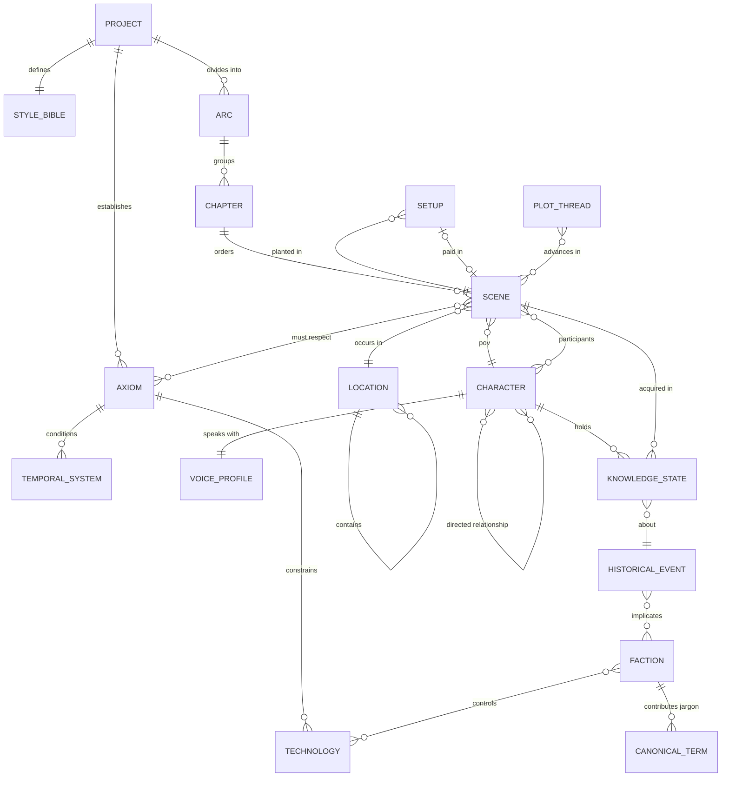
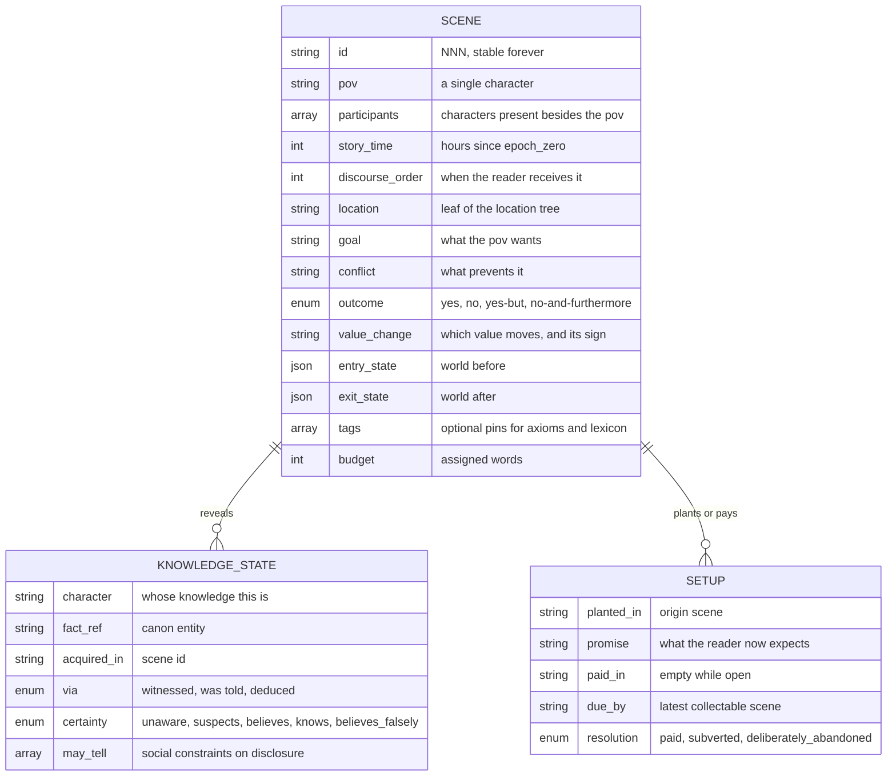
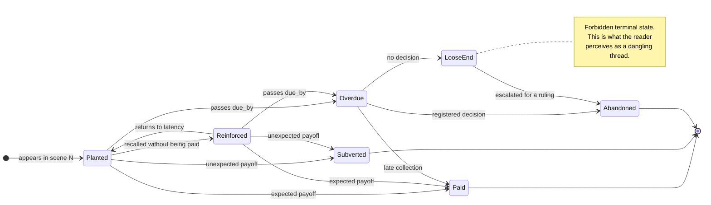
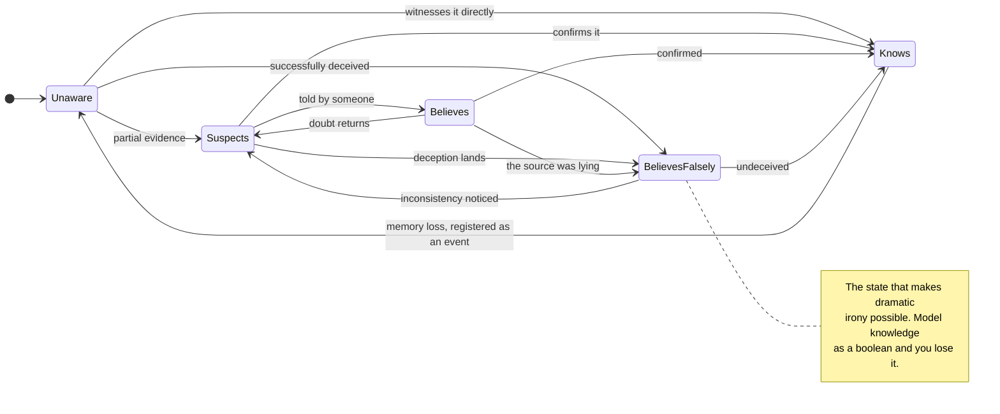
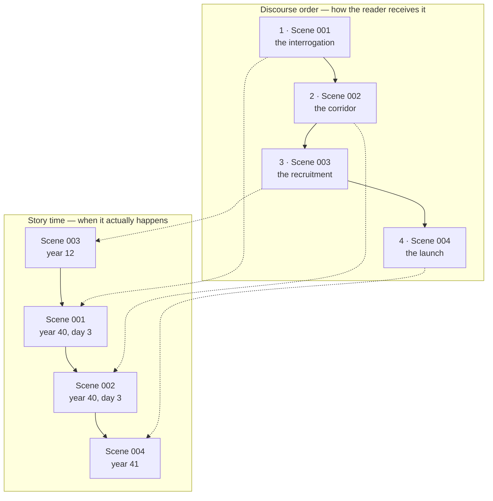

# Domain Knowledge

Visual models of the fictional world and the narrative machinery that governs it, each
with a detailed reading. This document explains **what the domain looks like as a graph**
and why it is shaped that way.

Entity definitions are in [`definitions.md`](./definitions.md). The system that operates
on these structures — assembly, agents, storage, audit pipeline — is in
[`architecture.md`](./architecture.md).

---

## Figure 1 — The entity graph

### Reading it

The graph has a clear centre of gravity: **`SCENE`**. Almost every other entity either
feeds a scene or is dated by one. That is not accidental — it follows from the decision to
make the scene the atomic unit of both writing and context. If you wanted to redesign this
model, changing the atomic unit is the change that would ripple furthest.

Three structural features deserve attention.

**The two self-referential edges.** `LOCATION ||--o{ LOCATION` and
`CHARACTER }o--o{ CHARACTER` are the only recursive relations, and they exist for
different reasons. Locations nest because context inherits downward: a cabin belongs to a
ship, which is in an orbit, and describing the cabin requires all three. Character
relationships are recursive *and* many-to-many *and* directed, because the interesting
narrative case is exactly the asymmetric one — A trusts B, B despises A.

**Everything dated runs through `SCENE`.** `KNOWLEDGE_STATE` is acquired in a scene.
`SETUP` is planted in a scene and paid in a scene. `PLOT_THREAD` advances in scenes. This
is what makes consistency checkable: the model has no free-floating "later" or "by then",
only scene identifiers that resolve to a position on the story-time axis.

**`AXIOM` has unusually high out-degree.** It constrains technology, conditions the
temporal system, and is referenced directly by scenes. In science fiction this is
expected: the rules of the universe are what make the invented world cohere, and they
propagate into everything that touches them. It also means an axiom edited late is an
expensive edit — it invalidates work downstream in several directions at once.

**What the graph does not contain** is any edge running from prose back into canon. There
is deliberately no `DRAFT → AXIOM` relation in the domain model. Prose is not a source of
truth about the world; it is a rendering of it. The mechanism that lets discoveries made
while writing become canonical is a system concern, not a domain one.

---

## Figure 2 — Fields of the three critical entities

### Reading it

Most of the ontology can survive as prose in a markdown file. These three cannot: they are
the entities that carry the checks, so they need to be structured records with typed
fields.

**`SCENE` carries two separate time fields, and that is the point.** `story_time` and
`discourse_order` look like redundancy and are not. Story time is causal: it is the axis
every consistency check runs against. Discourse order is compositional: it is where the
reader meets the scene, and it is the axis tension is designed on. Merging them saves one
integer and costs you the ability to validate anything the moment a flashback or a
relativistic voyage appears.

The pairing of `entry_state` / `exit_state` with `value_change` encodes two different
kinds of change. The state pair is the *factual* delta — who now has the keycard, which
door is open. `value_change` is the *dramatic* delta — the signed movement of something
the reader cares about, from safety to danger, from trust to suspicion. A scene can change
facts without changing value, and that scene is inert. The model makes the distinction so
the inertness is detectable.

**`KNOWLEDGE_STATE.certainty` is an enum with five values, not a boolean.** This is the
single most consequential typing decision in the whole ontology. With a boolean you can
represent "knows" and "does not know", which is enough for simple continuity and nothing
else. The five-value enum buys three things a boolean cannot: suspicion, which is what
makes investigation scenes possible; belief distinguished from knowledge, which is what
makes unreliable testimony possible; and `believes_falsely`, which is the precondition for
deception, dramatic irony, and the entire category of scenes where the reader knows more
than the character.

`via` matters more than it looks. Knowledge that was witnessed, knowledge that was
reported, and knowledge that was inferred behave differently under pressure: a character
defends what they saw and abandons what they were told.

**`SETUP` is the only entity with a deadline.** `due_by` exists because narrative debts
have a shelf life — a promise the reader has stopped waiting for cannot be collected,
only explained. And `resolution` has three values rather than two so that deliberate
abandonment is distinguishable from forgetting. That distinction is what keeps automated
checking useful rather than noisy, and noisy checkers get ignored, which is how a
consistency system quietly stops working.

---

## Figure 3 — Lifecycle of a reader debt

### Reading it

Three of the four terminal states are acceptable. `Paid` delivers what was promised;
`Subverted` delivers something else that satisfies the promise obliquely; `Abandoned`
represents an author's decision that the promise was wrong and should be dropped. Only
`LooseEnd` is a defect, and it is reached by exactly one path: passing `due_by` with no
decision recorded.

The important design consequence is that **`LooseEnd` and `Abandoned` are behaviourally
identical in the manuscript.** In both cases the setup is planted and never collected. The
reader cannot tell them apart by reading. The only thing that distinguishes them is a
recorded authorial decision, which is why `resolution` must be an explicit field and why
"we just never got back to it" cannot be a legitimate state.

The `Planted ⇄ Reinforced` cycle models something craft-specific: a setup that is
periodically recalled without being paid stays alive in the reader's mind and effectively
resets its latency clock. This is how long-running mysteries stay taut. The cycle also
explains why `due_by` is a property of the setup rather than a fixed number of scenes — a
reinforced setup can legitimately run much longer than an unreinforced one.

The corresponding check is trivial to state: at the last scene, the set of setups in
`LooseEnd` must be empty.

---

## Figure 4 — How knowledge changes

### Reading it

Knowledge in a novel is not monotonic, and this diagram is where that shows. The naive
model — a character learns things and thereafter knows them — supports only the simplest
continuity check. Real narrative needs the backward edges.

**`Believes → BelievesFalsely` is the betrayal edge.** Nothing changes in the character's
head; what changes is the truth value of what they hold. This transition is triggered by
canon, not by the character, which is why knowledge states point at canon facts rather
than storing content of their own.

**`BelievesFalsely → Suspects` is the unravelling edge**, and it is where most thriller
middles live. Note that it does not go straight to `Knows`. Disillusionment passes through
doubt; a character who leaps from false belief to correct knowledge in one step reads as
authorially convenient.

**`Knows → Unaware` must be explicitly registered.** Memory loss, conditioning, redaction
— all legitimate in science fiction, all frequently used, and all indistinguishable from a
continuity error unless the transition is recorded as an event. The rule is that this edge
may only be traversed with a registered cause. Every other appearance of a character
forgetting something they knew is a bug.

The check that falls out of this diagram is knowledge monotonicity with exceptions: a
character may reference a fact in scene N only if their state for that fact at story-time N
is `Believes`, `Knows`, or `BelievesFalsely` — and in the last case, what they say must be
wrong.

---

## Figure 5 — Story time against discourse time

### Reading it

The dotted lines are the mapping, and the crossing is the whole point. Scene 003 sits
third in the reading order and first in the causal order: it is a flashback, and the
crossed edge is what a flashback *is* in this model.

Everything the reader experiences as craft lives on the top axis. Withheld information,
revelation timing, the decision to open in the middle of an interrogation rather than at
the recruitment twenty-eight years earlier — these are all choices about discourse order,
and none of them are constrained by causality.

Everything that can be mechanically verified lives on the bottom axis. When the checker
asks whether a character could know something, it walks the story axis. When it asks
whether someone could physically have travelled between two locations, it walks the story
axis. The discourse axis is invisible to every consistency rule.

This is why the two fields cannot be merged. A model with one axis can either represent
reading order or verify consistency, but not both. It usually starts by representing
reading order, because that is the order the prose gets written in, and it discovers the
problem at the first flashback — typically a long way in.

Science fiction adds a second, sharper reason. Relativistic travel and long cold-sleep
transits mean that story time is not even globally consistent: two characters can
experience different elapsed durations between the same pair of events. The story axis
therefore needs the `dilation_factor` from `TemporalSystem` applied per character, which
is only expressible if story time is a first-class field rather than an implicit
consequence of ordering.

---

## Summary of what the diagrams argue

| Figure | Claim |
|---|---|
| 1 | The scene is the centre of the domain; everything dated resolves through it |
| 2 | Three entities must be typed records because they carry the checks |
| 3 | A loose end is an authorial decision that was never made, not an event |
| 4 | Knowledge is non-monotonic, and false belief is a first-class state |
| 5 | Causality and reading order are independent axes and must stay separate |
