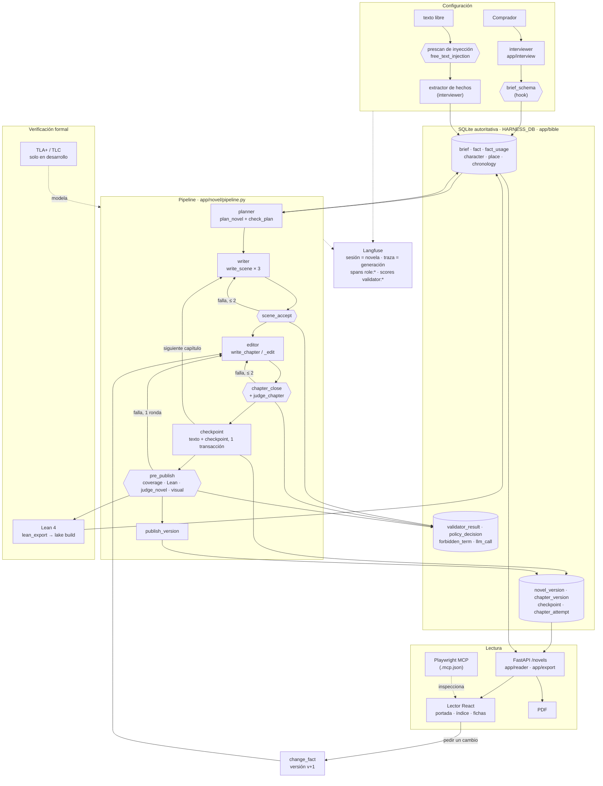
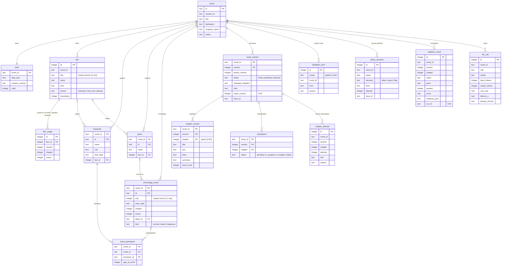
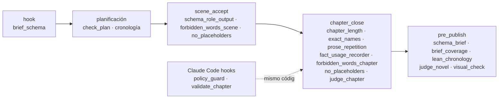

# Diagramas

> Registro (spec 004, D10). Cuatro vistas del sistema tal como está construido en
> `proyecto-desde-cero` (commit `340ede7`). El diseño que las gobierna está en
> [`docs/architecture.md`](../architecture.md) (Figuras 3 y 5) y
> [`docs/verification.md`](../verification.md#validator-registry-and-execution-points).
> Todos los bloques se han renderizado con `@mermaid-js/mermaid-cli`.

1. [Arquitectura del harness](#arquitectura-del-harness)
2. [Máquina de estados TLA+](#máquina-de-estados-tla)
3. [Esquema SQLite](#esquema-sqlite)
4. [Validadores y punto de ejecución](#validadores-y-punto-de-ejecución)

---

## Arquitectura del harness

*Cómo leerlo.* Los rombos hexagonales son puntos de validación (contrato K3/K4); cada
flecha "falla" es un bucle con presupuesto. Ningún rol escribe en la BD: lo hace el
pipeline en su nombre. TLA+ no corre por generación; modela el subgrafo del pipeline. El
lector solo habla con la API (regla 7 de `AGENTS.md`).

---

## Máquina de estados TLA+

De [`formal/tla/GiftNovelHarness.tla`](../../formal/tla/GiftNovelHarness.tla), incluidos
`Crash` y `Resume` (que el README del modelo deja fuera del dibujo por claridad).

```mermaid
stateDiagram-v2
  [*] --> Configured : brief válido
  Configured --> Planned : Plan (versión 1, draft)
  Planned --> Scene : NextChapter
  Scene --> Scene : WriteScene (pasa → siguiente escena; falla → reescribe, ≤ MAX_SCENE_RETRIES)
  Scene --> Editor : última escena aceptada
  Editor --> Close : Editor
  Close --> Scene : chapter_close falla (≤ MAX_CHAPTER_RETRIES, contador durable, CE2)
  Close --> Checkpoint : chapter_close pasa
  Checkpoint --> Next : texto + checkpoint en una transacción (CE1), upsert (CE3)
  Next --> Scene : queda un capítulo sin checkpoint
  Next --> PrePublish : todos con checkpoint
  PrePublish --> Next : falla → blocked, repairRounds + 1, capítulos reabiertos (CE4)
  PrePublish --> Publish : pasa
  Publish --> Published
  Published --> Next : ChangeFact (versión v+1, capítulos no afectados copiados)
  Scene --> StoppedError : reintentos agotados
  Close --> StoppedError : reintentos agotados
  PrePublish --> StoppedError : ronda de reparación ya usada
  Scene --> Crashed : Crash
  Editor --> Crashed : Crash
  Close --> Crashed : Crash
  Next --> Crashed : Crash
  PrePublish --> Crashed : Crash
  Crashed --> Configured : Resume, sin versión
  Crashed --> Next : Resume, versión draft o blocked
  Crashed --> Published : Resume, última versión publicada
  Published --> [*]
  StoppedError --> [*]
```

*Cómo leerlo.* `Crash` borra solo las variables volátiles (`pc`, `ver`, `cur`, `scene`,
`sceneTry`); las durables (filas de la BD) sobreviven, y `Resume` decide el estado leyendo
la BD. TLC comprueba `NoUnvalidatedPublish`, `ResumeNoDupNoLoss`, `PreviousVersionKept`,
`RetriesBounded` y la vivacidad `Termination` sobre N = 5 capítulos. La correspondencia
acción → función está en [`formal/tla/README.md`](../../formal/tla/README.md#mapping-tla-action--code).

---

## Esquema SQLite

De las migraciones de
[`backend/app/commons/db/authoritative/migrations/`](../../backend/app/commons/db/authoritative/migrations/)
(`1000_init.sql`, `1001_tlc_rules.sql`, `1300_forbidden_terms_global.sql`). Todas las
tablas van indexadas por `novel_id`. Columnas de auditoría (`created_at`, `updated_at`)
omitidas.

*Cómo leerlo.* `chapter_version` + `checkpoint` se escriben juntos (CE1); los textos que
`chapter_close` rechaza van a `chapter_attempt` en vez de sobrescribirse (D6, "nada se
borra"). `fact_usage` es por escena **y versión**, así `change_fact` sabe qué capítulos
regenerar. `forbidden_term` con `scope = global` viene sembrado por la migración `1300`.

---

## Validadores y punto de ejecución

Registro K3 (`app/validators/registry.py`), poblado por `app.novel.setup.register_all()`
desde cada bloque.

| Validador | Módulo | Punto | Bloquea | Vuelve a |
|---|---|---|---|---|
| `brief_schema` | `app/interview/service.py` | `hook` (al entregar el brief, antes de planificar) | sí: brief inválido no se genera | entrevistador |
| `check_plan` + `chronology_problems` | `app/novel/plan_check.py`, `chronology.py` | planificación (no K3) | sí, con 1 replan | planner |
| `schema_role_output` | `app/validators/programmatic/schema.py` | `scene_accept` | sí | rol productor |
| `forbidden_words_scene` | `app/policy/validators.py` | `scene_accept` | sí, ≤ 2 reescrituras | writer |
| `no_placeholders` | `app/novel/placeholders.py` | `scene_accept`, `chapter_close` | sí | writer / editor |
| `chapter_length` | `app/validators/programmatic/length.py` | `chapter_close`, `hook` | sí | editor |
| `exact_names` | `…/names.py` | `chapter_close`, `hook` | sí | editor |
| `prose_repetition` | `…/prose.py` | `chapter_close`, `hook` | blando: solo si es grave | editor |
| `fact_usage_recorder` | `…/coverage.py` | `chapter_close` | no (registra `fact_usage`) | — |
| `forbidden_words_chapter` | `app/policy/validators.py` | `chapter_close` | sí | editor |
| `judge_chapter` | `app/judge/validators.py` | `chapter_close` | sí (umbral de rúbrica) | editor |
| `schema_brief` | `…/schema.py` | `pre_publish` | sí | entrevistador |
| `brief_coverage` | `…/coverage.py` | `pre_publish` | sí | editor del capítulo asignado |
| `lean_chronology` | `…/chronology.py` → `app/formal/lean_runner.py` | `pre_publish` | sí (sin toolchain, falla) | editor |
| `judge_novel` | `app/judge/validators.py` | `pre_publish` | sí | editor |
| `visual_check` | `app/reader/visual_check.py` | `pre_publish` | sí, solo con `VISUAL_CHECK=1` y lector activo; si no, pasa como omitido | código del lector |
| `policy_guard.py` | `.claude/hooks/` | Claude Code `PreToolUse` | sí (exit 2) | quien edita |
| `validate_chapter.py` | `.claude/hooks/` | Claude Code `PostToolUse` | sí (exit 2) | quien edita |

*Cómo leerlo.* Un fallo en `pre_publish` no reescribe todo: `chapters_named` extrae de la
evidencia los capítulos citados (número, id de evento de Lean o clave de hecho) y solo esos
se reabren para la ronda de reparación.
