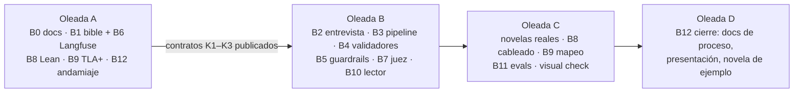

# Spec inicial: qué se decidió construir y por qué

> Registro (spec 004, D10). Resume la
> [spec 004](../../specs/004-exam-refactor-programme/004-exam-refactor-programme.md), su
> [plan](../../specs/004-exam-refactor-programme/004-exam-refactor-programme-plan.md) y su
> [página de contratos](../../specs/004-exam-refactor-programme/004-contracts.md). El diseño
> vinculante está en [`docs/`](../architecture.md); aquí solo se cuenta el razonamiento.

## Punto de partida

El repositorio ya tenía un harness **genérico** para escribir una novela larga escena a
escena (specs [001](../../specs/001-backend-foundation/001-backend-foundation.md),
[002](../../specs/002-frontend-foundation/002-frontend-foundation.md) y
[003](../../specs/003-frontend-visual-identity/003-frontend-visual-identity.md)): stores en
ficheros con tabla de permisos (Figura 3), índice SQLite *derivado*, turno de escritura con
revisiones acotadas, seis roles vía `claude -p` y un lector web con portada y fichas.

El examen pide otro producto: una **novela-regalo personalizada** de 10 capítulos de
1.000–1.500 palabras, generada desde un brief validado sobre una persona concreta, legible
en web, con verificación formal de la historia (Lean 4) y del harness (TLA+), Langfuse,
guardrails y evals medibles.

`AGENTS.md` pone `docs/` por encima de specs y código. Construir encima sin más habría
obligado a cada spec de bloque a contradecir el diseño. Por eso la primera decisión fue
**no escribir código** hasta confrontar `docs/` con el enunciado, requisito a requisito.

## La confrontación

La spec 004 § 1 tiene una fila por cada id de
[`exam/requirements.toml`](../../exam/requirements.toml), con veredicto *covered · partial ·
contradicts · absent · code-only* y bloque dueño. Las contradicciones que cambiaban el
diseño eran cinco:

| Lo que decía `docs/` | Lo que pide el examen | Resolución |
|---|---|---|
| SQLite es un índice derivado, "nunca una fuente" | Story bible en SQLite, cada hecho con los capítulos que lo usan | Base **autoritativa** aparte del índice (D1) |
| Las versiones son cosa de git | Conservar la versión anterior tras un cambio del lector | Versiones como filas, nada se borra (D6) |
| Seis roles sin entrevistador ni juez | Entrevistador, planificador, escritor, editor/crítico | Roles D7, dos filas nuevas en la Figura 3 |
| El frontend es para vistas espaciales | Lectura web o PDF interactivo | El lector pasa a ser el primer propósito (D8) |
| Calidad narrativa = riesgo aceptado (**U**) | Calidad mínima exigida | Pasa a **I** (juez + revisión humana); la excelencia sigue en **U** |

En total, 17 de 72 ítems comprobables estaban cumplidos al empezar
([`exam/compliance.md`](../../exam/compliance.md)).

## Decisiones transversales D1–D11

| # | Decisión | Por qué |
|---|---|---|
| D1 | Una SQLite autoritativa (`HARNESS_DB`, por defecto `data/harness.sqlite`) con novela, versiones, brief, hechos, uso por escena, cronología, listas prohibidas, log de políticas y resultados de validadores | Una sola fuente de verdad consultable por validadores, lector y Lean |
| D2 | Los hechos del brief son autoritativos en la BD; un cambio del lector actualiza el hecho | Un hecho nunca tiene dos versiones; `change_fact` sabe qué capítulos tocar |
| D3 | 10 capítulos de 1.000–1.500 palabras, 3–5 escenas por capítulo | Enunciado; el usuario cambió 4–7 escenas por 3–5 por coste |
| D4 | Validadores en `scene_accept`, `chapter_close` y `pre_publish` | Cada fallo se detecta donde es barato repararlo |
| D5 | Checkpoint por capítulo y reanudación en el primero incompleto | Una ejecución de horas no puede empezar de cero tras un fallo |
| D6 | Uso de hechos por escena; versiones como filas con texto y hash por capítulo | "Capítulo modificado" = hash distinto; la versión anterior sobrevive |
| D7 | Roles: interviewer, planner, writer, editor, judge, canoniser; ningún rol gana escrituras salvo el entrevistador (brief) y el juez (resultados) | La tabla de permisos es el muro de carga del sistema |
| D8 | Lector web primero, PDF exportado por el backend | Ver [trade-offs](./trade-offs.md#modelo-de-lectura) |
| D9 | Prosa, README y presentación en español; docs, specs y código en inglés | Lector hispanohablante; código legible para cualquiera |
| D10 | `docs/process/` es un área de registro, no de diseño | Evita una segunda fuente de verdad del diseño |
| D11 | **Personalización y calidad narrativa pesan igual** | Sin esto el sistema optimiza que los datos "aparezcan" y la novela se lee mal |

## Bloques y oleadas

El resto del trabajo se partió en doce bloques con **ficheros propios disjuntos**, para
que agentes en paralelo no se pisaran (spec 004 § 3), y cinco contratos publicados antes que
sus implementaciones (K1 story bible, K2 observabilidad, K3 protocolo de validadores, K4
puntos de enganche del pipeline, K5 `change_fact`/`publish_version`).

| Bloque | Spec | Cierra |
|---|---|---|
| B1 Story bible (K1, K3) | [005](../../specs/005-story-bible/005-story-bible.md) | M01, M02, R07 |
| B2 Entrevista y brief | [006](../../specs/006-interview-brief/006-interview-brief.md) | C01–C04, V04, R04 |
| B3 Pipeline de generación (K4) | [007](../../specs/007-generation-pipeline/007-generation-pipeline.md) | H01, H06, M04, R05 |
| B4 Validadores programáticos | [008](../../specs/008-programmatic-validators/008-programmatic-validators.md) | V01–V04, V06, X02 |
| B5 Guardrails, políticas y hooks | [009](../../specs/009-guardrails-policy-hooks/009-guardrails-policy-hooks.md) | G01–G05, H03, H04 |
| B6 Observabilidad (K2) | [010](../../specs/010-observability/010-observability.md) | O01–O03 |
| B7 Juez y revisión humana | [011](../../specs/011-judge-human-review/011-judge-human-review.md) | S01, S02 |
| B8 Lean 4 | [012](../../specs/012-lean-chronology/012-lean-chronology.md) | L01–L04 |
| B9 TLA+ | [013](../../specs/013-tla-harness/013-tla-harness.md) | T01–T05 |
| B10 Lector, versiones, PDF (K5) | [014](../../specs/014-reader-versions-pdf/014-reader-versions-pdf.md) | R01–R07, E05 |
| B11 Evals y red-team | [015](../../specs/015-evals-redteam/015-evals-redteam.md) | EV1–EV3, E02, E05 |
| B12 Repo, proceso, presentación | [016](../../specs/016-repo-process-presentation/016-repo-process-presentation.md) | E01, K01–K06, D01–D06, P01–P05, H02, V05 |

## Desviaciones aceptadas al aprobar (plan 004)

El usuario delegó todas las aprobaciones de la sesión. El plan registra seis desviaciones
de la spec, cada una con su motivo:

| # | Qué cambia | Por qué |
|---|---|---|
| V1 | Un worktree por agente; el orquestador fusiona en `proyecto-desde-cero` | Única rama a la que la sesión puede empujar |
| V2 | B0 (docs) en paralelo con la oleada A, no como puerta serie | Una noche de reloj; B0 posee `docs/` en exclusiva |
| V3 | Verificación ligera en código nuevo: ruff + mypy --strict + 1–3 tests por bloque | Petición del usuario; registrado como **U** |
| V4 | El texto de capítulo vive en `chapter_version` (BD), no en ficheros | Evita dos fuentes de verdad del mismo texto |
| V5 | 3 escenas por capítulo por defecto | Coste y latencia con Haiku, dentro de D3 |
| V6 | Cada agente redacta, aprueba (por delegación) e implementa su spec de bloque | Delegación; la spec sigue escribiéndose antes que el código |

El Proceso 0 de la spec 004 se hizo en cuatro rondas con el usuario, guardadas en
[`exam/process-0/`](../../exam/process-0/).
