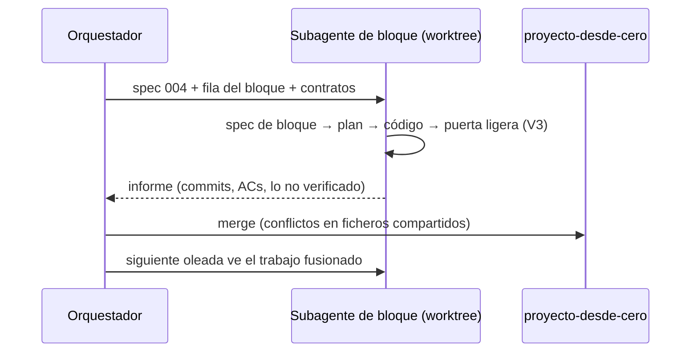

# Subagentes, comandos, skills, memoria, hooks y MCP

> Registro (spec 004, D10). Cómo se usó Claude Code para construir el proyecto, con
> propósito y resultado de cada pieza. Evidencia: `git log --oneline 441298d~30..340ede7`
> y los commits citados.

## Orquestador y subagentes por bloque

Una sesión **orquestadora** redactó y aprobó (por delegación del usuario) la
[spec 004](../../specs/004-exam-refactor-programme/004-exam-refactor-programme.md) y su
plan, publicó los contratos K1–K5 y lanzó un **subagente por bloque**, cada uno en su
propio git worktree (`.claude/worktrees/agent-*`, desviación V1). Cada subagente leía la
spec 004, su fila del mapa de bloques y los contratos, redactaba su spec de bloque desde la
plantilla § 6, la aprobaba y la implementaba solo en sus rutas propias (V6), y devolvía un
informe. El orquestador fusionaba en `proyecto-desde-cero`, resolvía los ficheros
compartidos y regeneraba `openapi.json`.

| Oleada | Bloque (spec) | Propósito | Resultado (commits) |
|---|---|---|---|
| A | B0 docs | Alinear `docs/` con las decisiones D1–D11 | `01649fe`, `6c323b6`, `6124c86`, `267bc92`, `d262870`, `0eba924`; fusionado en `b925f2d` |
| A | B1 story bible (005) + B6 observabilidad (010) | Contratos K1, K3 y K2 primero, con fakes | `4b40262` K1, `034782f` K3, `3878b60` K2; revisado por CE1–CE4 en `62038fe`/`d42b8a0`; fusión `2d60afb` |
| A | B8 Lean 4 (012) | Toolchain, modelo de cronología, exportador y `lake build` | `a3aa627`, `0808ce0`, aclaración `decide +kernel` `8f4a431`; fusión `9903955` |
| A | B9 TLA+ (013) | Modelo del flujo y TLC | `b56d6e5` (4 contraejemplos documentados); fusión `fba8e57` |
| A | B12 andamiaje (016) | `.mcp.json`, comandos, memoria, skill, README | `9352bcd`, `f75b9c2`, `eb3e893`, `7ad20e9` |
| B | B2 entrevista (006) | Brief, validación, extracción de texto libre, entrevistador | `0cfdd72`, `402455e`, `de09d58`, `96ae126`; fusión `58f3027` |
| B | B3 pipeline (007) | Planner, escenas, editor, checkpoints, publicación, `change_fact`, CLI | `de3a38c`, `2df3c74`, `7fbc8b0`, `967902f`, `ab4731f`; fusión `f1bd119` |
| B | B4 validadores (008) | Longitud, nombres, cobertura, esquemas, prosa, Lean | `19d83f0` (fusionado en la rama de B3 con `5be6525`) |
| B | B5 guardrails y hooks (009) | Normalizador, motor de políticas, hooks de Claude Code | `7c04c87`, `4aac425`, `54854d3`; fusión `832b23e` |
| B | B7 juez (011) | Rúbrica, `judge_chapter`/`judge_novel`, revisión humana | `35d3a83`, `67fb710`; fusión `ca4e572` |
| B | B10 lector (014) | API `/novels`, lector, versiones, PDF, visual check | `7911141`, `66cdaa7`, `19984c7`, `5d9ef24`, `312b142`; fusión `340ede7` |
| C | B11 evals (015) | Cinco briefs, runner, comparación de iteraciones | `8f78dea`, `a0c1b58`; resultados en [`evals/results.md`](../../evals/results.md) |
| D | B12 cierre, parte 1 (016) | Esta documentación de proceso y el uso real del browser MCP | rama `docs/process-part1` |

Lo que costó el paralelismo, en cifras de la historia: dos fusiones entre ramas de bloque
para que B3 viera a B4 y B2 antes del merge final; dos arreglos de tests de B1 cuando B5
sembró términos globales (`4357184`, `5ce641a`); `openapi.json` regenerado tres veces
(`f82f418`, `a5d5220`, `e7b00b9`).

## Comandos propios (`.claude/commands/`)

| Comando | Propósito | Cuándo se usó / resultado |
|---|---|---|
| [`/generate-novel`](../../.claude/commands/generate-novel.md) | Generar desde un brief con la CLI, reanudando desde el último checkpoint | Envuelve `uv run python -m app.novel.cli generate`, la operación de los smokes en vivo de B3 (1 capítulo publicado, `7fbc8b0`) y de las dos novelas que se generan en la oleada C |
| [`/inspect-novel`](../../.claude/commands/inspect-novel.md) | Abrir el lector con Playwright MCP y comprobar portada, índice y fichas; anotar hallazgos | Su procedimiento es el que siguió este bloque con el cliente MCP propio: ver el [log del browser MCP](./browser-mcp-log.md) |
| [`/change-fact`](../../.claude/commands/change-fact.md) | Pedir un cambio de un hecho y regenerar solo sus capítulos | La operación subyacente (`app.novel.cli change-fact`) se ejecutó en vivo: `pet.toby.name=Nala` en una novela de 2 capítulos → versión 2 publicada, versión 1 intacta (`ab4731f`) |
| [`/exam-gap`](../../.claude/commands/exam-gap.md) | Ejecutar `exam/check.py` y agrupar lo que falta por bloque | Informe regenerado al aprobar la spec 004 (`0ca480b`); sirve para elegir el siguiente bloque |

Los comandos no inventan flags: donde la operación no existía aún (K5 antes de B10) lo
decían explícitamente (plan 016, riesgos).

## Skills (`.claude/skills/`)

| Skill | Origen | Uso en este proyecto |
|---|---|---|
| [`gift-novel-run`](../../.claude/skills/gift-novel-run/SKILL.md) | **Creada** en B12 (spec 016) | Recorrido completo de una generación: brief → generación → checkpoints → validadores en SQLite → traza → lector con Playwright MCP → PDF. Es la skill propia del harness (H02) |
| [`react`](../../.claude/skills/react/SKILL.md) | Escrita para este repo | Convenciones del lector (B10): hooks, TanStack Query, react-three-fiber de la portada |
| [`sqlite`](../../.claude/skills/sqlite/SKILL.md) | Escrita para este repo | Conexiones, transacciones y `SQLITE_BUSY` en la BD autoritativa (B1) y las reglas CE1/CE3 |
| [`verification`](../../.claude/skills/verification/SKILL.md) | Escrita para este repo | Asignar letras Trust Spec a cada AC de las specs de bloque y la entrada **U** de V3 |
| `fastapi` | Oficial, instalada desde el wheel fijado en `backend/.claude/skills/fastapi/` | Routers `/novels` e `/interview` (B2, B10) |
| [`sqlite-vec`](../../.claude/skills/sqlite-vec/SKILL.md) | Terceros, solo los ficheros de skill | Heredada del harness genérico; no usada en la novela-regalo |

Procedencia y licencias en [`.claude/skills/README.md`](../../.claude/skills/README.md).

## Memoria (`.claude/memory/`)

- [`project.md`](../../.claude/memory/project.md): qué es el producto y las decisiones ya
  cerradas (modelo, roles, story bible, longitud), para que una sesión nueva no las reabra.
- [`conventions.md`](../../.claude/memory/conventions.md): la forma corta de los procesos,
  la propiedad de rutas por bloque y los prefijos de commit.

## Hooks (`.claude/settings.json`, `.claude/hooks/`)

- `policy_guard.py` (PreToolUse, `Write|Edit|MultiEdit|Bash`): niega `.env` reales, valores
  con forma de clave, escrituras directas a `data/harness.sqlite*` y términos prohibidos en
  ficheros de capítulo.
- `validate_chapter.py` (PostToolUse): longitud 1.000–1.500 y guardrail en capítulos
  exportados.

Ejecución de muestra pegada en `54854d3` (14 casos: p. ej. `.env` → exit 2,
`sqlite3 … delete` → exit 2, `sqlite3 … select` → exit 0, capítulo con `c4br0n` → exit 2,
capítulo de 2 palabras → exit 2), con ~0,05 s por edición normal y ~1 s en capítulos.

**Hallazgo que se dejó al humano.** La regla de fronteras del harness genérico
(`backend/tests/test_boundaries_mirror.py`, spec 001 AC 3: nada fuera de la capa de stores
usa primitivas de fichero) empezó a fallar con el exportador de Lean (`lean_runner.py`). Un
subagente intentó **ampliar la lista de exenciones de esa regla de seguridad** y el
clasificador del modo auto de Claude Code lo bloqueó: ampliar una excepción de seguridad no
es algo que un agente decida solo. Se dejó como está y se anotó en los commits
(`725734e`, `a5d5220`). Estado verificado en esta rama (`uv run python -m
tools.check_boundaries`): **21 hallazgos** en `app/export`, `app/formal`, `app/judge`,
`app/novel`, `app/reader` y `app/validators` — todos accesos a ficheros fuera del modelo de
stores de la spec 001 (CLI, PDF, proyecto Lean, revisión humana), que la V4 dejó sin
encaje. Decisión pendiente del humano: o estas rutas entran en la regla como exenciones con
motivo, o la regla se restringe a los stores del harness genérico.

## MCP (`.mcp.json`)

Un servidor, `playwright` (`npx -y @playwright/mcp@latest --headless --isolated --browser
chromium`), sin rutas de máquina. En este contenedor el MCP fija una revisión de Chromium
(1246) que la caché no tiene (1194), así que se exporta
`PLAYWRIGHT_MCP_EXECUTABLE_PATH=/opt/pw-browsers/chromium-1194/chrome-linux/chrome`
(demostrado en `9352bcd`). Uso real y hallazgos en el
[log del browser MCP](./browser-mcp-log.md).
