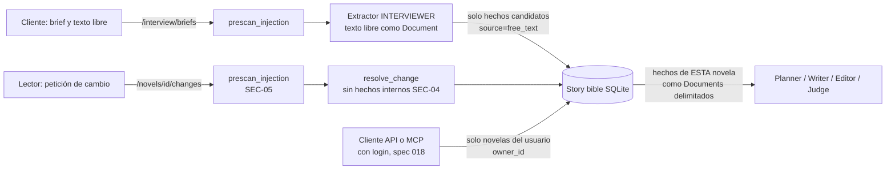

# Informe de seguridad del harness

Revisión de seguridad del sistema (examen, ítem opcional **X04**: "agente o skill dedicado
que analiza el sistema en busca de vulnerabilidades"), hecha por un agente de Claude Code
sobre el propio repositorio y sobre la API del harness, en el marco del programa 004.

| | |
|---|---|
| Fecha | 2026-09-24 |
| Base analizada | `proyecto-desde-cero` @ `c245d3a` (rama de trabajo `security/review`) |
| Cómo repetirla | skill [`security-review-harness`](../.claude/skills/security-review-harness/SKILL.md) y los scripts de [`security/`](../security/) |
| Alcance | historial de git, dependencias Python y npm, texto libre del brief, peticiones de cambio del lector, API `/novels` e `/interview`, tools y servidor MCP, hooks de Claude Code |
| Fuera de alcance | despliegue en producción, pentest de red (el login X03 se añadió después, spec 018, y cierra SEC-01) |

Ninguna prueba abrió la base de datos real (`HARNESS_DB`): había una novela generándose
contra ella. Todas construyen una base temporal y se ejecutaron con
`HARNESS_DB=/nonexistent/x.sqlite`. No hizo falta ninguna llamada a un modelo.

---

## Resumen

| Severidad | Encontradas | Corregidas | Aceptadas | Pendientes |
|---|---|---|---|---|
| crítica | 0 | – | – | – |
| alta | 0 | – | – | – |
| media | 5 | 5 | 0 | 0 |
| baja | 5 | 1 | 2 | 2 |
| info | 5 | – | 5 | – |

Las cinco medias están corregidas, cada una en su commit y con un test que falla sin el
cambio. La última, SEC-01 (sin autenticación), se cerró con el login de SQLite del opcional
X03 ([spec 018](../specs/018-login/018-login.md), commit `ad2c6b1`), que cierra también la
parte de dueño de SEC-08.

## Tabla de hallazgos

| Id | Área | Descripción | Severidad | Estado |
|---|---|---|---|---|
| SEC-01 | Exfiltración / API | Sin autenticación: cualquier cliente de la API o del MCP lista y lee todas las novelas y puede pedir cambios en cualquiera | media | corregido (`ad2c6b1`, spec 018) |
| SEC-02 | Secrets | `.gitignore` solo ignoraba `backend/.env`; el `.env` raíz (con `LANGFUSE_SECRET_KEY`) se habría podido commitear | media | corregido (`21f2985`) |
| SEC-03 | Prompt injection | El pre-scan del texto libre no veía leetspeak, letras separadas, guiones, caracteres de ancho cero, falsificación de delimitadores ni peticiones de otra novela (10/17 detectados) | media | corregido (`3dce82b`) |
| SEC-04 | Integridad / exfiltración | Una petición de cambio podía apuntar al hecho interno `plan.v1` y sobrescribir el plan; además el plan entero se listaba al EDITOR | media | corregido (`1a72af5`) |
| SEC-05 | Prompt injection | Las peticiones de cambio del lector (`POST /novels/{id}/changes`) no pasaban ningún escaneo: su texto acababa como valor de un hecho en el prompt del writer | media | corregido (`4998416`) |
| SEC-06 | Prompt injection | Inyección de segundo orden: los hechos extraídos del texto libre (`source=free_text`) sí llegan a los prompts de los roles | baja | aceptado (datos delimitados + bandera del extractor) |
| SEC-07 | Prompt injection | Dos listas de marcadores divergentes; `PolicyEngine.check_free_text` no se invoca en ningún flujo de producción | baja | pendiente |
| SEC-08 | Integridad / API | Sin dueño de la novela, `/interview/briefs` y `/interview/turn` escriben resultados y decisiones bajo cualquier `novel_id`; un brief válido sobre una novela ya ingerida da 500 | baja | corregido (`ad2c6b1`, spec 018) |
| SEC-09 | API | `/health` revela `store_root`; el `detail` de un job fallido incluye el texto de la excepción | baja | aceptado (local, sin trazas ni rutas absolutas por defecto) |
| SEC-10 | Dependencias | `.mcp.json` ejecuta `npx -y @playwright/mcp@latest` sin fijar versión | baja | pendiente |
| SEC-11 | Hooks | `policy_guard.py` es heurístico: un script Python en fichero o una ruta construida en variables no se detectan | info | aceptado (defensa en profundidad) |
| SEC-12 | Dependencias | `pip-audit` (137 paquetes) y `npm audit` (647 paquetes, 158 de producción): 0 vulnerabilidades conocidas | info | aceptado |
| SEC-13 | Secrets | 201 commits de todas las ramas: 0 secretos; `detect-secrets` en el árbol: 6 falsos positivos | info | aceptado |
| SEC-14 | Prompt injection | El delimitador de documentos no se puede falsificar y una ruta con salto de línea se rechaza | info | aceptado |
| SEC-15 | API | Sin CORS (denegado por defecto), POST `text/plain` rechazado, SQL parametrizado, MCP de solo lectura real | info | aceptado |

---

## Método y herramientas

Cada análisis tiene un script reproducible en [`security/`](../security/). Los comandos se
ejecutan desde la raíz del repo salvo que digan `backend/`.

| # | Análisis | Comando | Resultado resumido |
|---|---|---|---|
| 1 | Secrets en el historial | `python3 security/scan_secrets.py --verbose` | `commits scanned: 201; hits: 0 suspicious, 0 allowlisted` |
| 1 | Secrets en el árbol | `uvx detect-secrets scan --exclude-files '(\.venv\|node_modules\|uv\.lock\|package-lock\.json\|\.claude/worktrees)' .` | 6 hits, todos falsos positivos (SEC-13) |
| 1 | Ficheros sensibles alguna vez commiteados | `git log --all --name-only --format= \| sort -u \| grep -iE '(^\|/)\.env\|\.pem$\|\.key$'` | solo `.env.example` y `backend/.env.example` |
| 1 | Qué ignora git | `git check-ignore -v .env frontend/.env backend/.env` | antes: solo `backend/.env` (SEC-02) |
| 2 | Dependencias Python | `backend/`: `uv export --no-hashes --frozen --no-emit-project -o req.txt` y `uvx pip-audit -r req.txt --disable-pip --no-deps` | `No known vulnerabilities found` |
| 2 | Dependencias npm | `frontend/`: `npm audit --omit=dev` y `npm audit` | `found 0 vulnerabilities` en ambos |
| 2 | Análisis estático | `backend/`: `uv run bandit -r app -q -ll -x '*/tests/*'` | ninguna incidencia de severidad media o alta |
| 3 | Prompt injection | `backend/`: `uv run python ../security/injection_probe.py` | antes 10/17 por el pre-scan; después 17/17; 0 falsos positivos |
| 4 | Exfiltración entre novelas | `backend/`: `uv run python ../security/exfiltration_probe.py` | antes 98 comprobaciones, 2 hallazgos (`no-auth`, plan editable); después solo `no-auth` |
| 5 | Hooks | `bash security/hooks_probe.sh` | 14/14 casos con el código de salida esperado |
| 6 | Endurecimiento de la API | `backend/`: `uv run python ../security/api_hardening_probe.py` | ver SEC-09 y SEC-15 |

El modelo de amenaza es el del enunciado: un cliente que rellena la configuración (brief y
texto libre), un lector que pide cambios, y un cliente de la API o del MCP. El sistema corre
en local, para un único usuario, sin login.



Cómo leerlo: el texto del cliente nunca entra en una instrucción. El texto libre crudo se
queda en el brief guardado y solo pasa al extractor como documento; lo que llega a la story
bible son hechos candidatos. La petición del lector pasa ahora el mismo pre-scan antes de
convertirse en un hecho. Los roles reciben solo los documentos de su novela. La flecha de
la API era el único camino entre novelas (la ausencia de login, SEC-01); desde la spec 018
cada petición ve solo las novelas de su usuario.

---

## Detalle de los hallazgos

### SEC-01 — Sin autenticación ni autorización (media, corregido en `ad2c6b1`)

**Qué pasa.** Ninguna ruta de `/novels`, `/interview` ni tool del MCP pide identidad.
`exfiltration_probe.py` lo confirma: `GET /novels` devuelve las dos novelas de la base
temporal (`nov-aaaaaaaaaaaa`, `nov-bbbbbbbbbbbb`), y cualquiera de ellas se lee, se
descarga en PDF o recibe peticiones de cambio conociendo su id. `list_novels` del MCP hace
lo mismo.

**Lo que sí se comprobó que se mantiene** (97 de 98 comprobaciones en verde): cada ruta y
cada tool filtra por `novel_id` en SQL parametrizado (`where novel_id = ?`); el marcador
único de la novela B no aparece en ninguna respuesta pedida para la A; los ids hostiles
(`../B`, `..%2FB`, `A' OR '1'='1`, `A\0B`, `%`, `*`) dan 404 o 422 en la API y
`ToolNotFoundError` en las tools; `query` de `query_story_bible` se filtra en Python con
`casefold()`, no en SQL, así que `' OR 1=1 --` es un texto más; un `job_id` de la novela B
consultado bajo la A da 404; la conexión del MCP abre con `mode=ro` y `query_only`, y una
escritura a través de ella falla (`OperationalError`). Un brief no puede pedir datos de
otra novela: los roles solo reciben los documentos que el orquestador lee para *su*
`novel_id` (`app/novel/context.py`), y ningún código de generación llama a `list_novels`.
`A/../B` en la URL no es un traversal: el cliente HTTP elimina los segmentos `..` antes de
enviar, así que la petición es literalmente `/novels/B`, que es este mismo hallazgo.

**Por qué se acepta.** El login es el opcional X03 y "cuentas de usuario" está fuera de
alcance en el enunciado. El backend se arranca con `uvicorn app.main:app`, que escucha en
`127.0.0.1` por defecto, y el frontend lo usa a través del proxy de Vite. En esa demo local
de un solo usuario no hay un segundo cliente al que proteger.

**Corrección** ([spec 018](../specs/018-login/018-login.md), X03). Migración `1700_auth`:
tabla `app_user` (email único, hash bcrypt) y columna `novel.owner_id`; las novelas previas y
las que crea la CLI pertenecen al usuario integrado `local`, con el que nadie puede iniciar
sesión. `POST /auth/register` y `/auth/login` devuelven un JWT HS256 firmado con
`AUTH_SECRET`; con `AUTH_REQUIRED=1` (por defecto) las rutas de `/novels` e `/interview`
exigen `Authorization: Bearer`. Todas usan `BibleRepository.scoped_to(usuario)`, y cada ruta
`/novels/{id}` resuelve la novela por esa vista, así que la de otro usuario responde 404 igual
que una inexistente. Los briefs, resultados de validación y decisiones de política (audit
log) pertenecen al dueño de su novela por join. El servidor MCP se ejecuta como
`STORY_MAKER_USER` (o `local`). Commits: `0487a4c` (datos), `b669e95` (`/auth`), `ad2c6b1`
(rutas), `4dcacc3` (MCP y tests). Tests: `backend/app/auth/tests/test_auth.py` (lista,
capítulo, PDF, petición de cambio y brief de otro usuario → 404; `list_novels` del MCP
filtrado). La propuesta original era:

**Arreglo propuesto** (spec propio, porque cambia la API y el modelo de datos): tabla
`user` con contraseña bcrypt, columna `owner_id` en `novel`, `validator_result` y
`policy_decision`; token JWT de sesión; una dependencia FastAPI `current_user` en todas las
rutas y un filtro por dueño en `BibleRepository.list_novels`/`get_novel`; el servidor MCP
recibe la identidad por token y aplica el mismo filtro; tests de que un usuario no ve las
novelas de otro. Mientras tanto, no exponer el puerto fuera de `localhost`.

### SEC-02 — `.env` raíz no ignorado (media, corregido en `21f2985`)

El `.env.example` de la raíz dice "Copy to `.env`" y contiene `LANGFUSE_SECRET_KEY=`, pero
`.gitignore` solo tenía `backend/.env`. Un `.env` en la raíz o en `frontend/` habría
aparecido como no rastreado y podía acabar en un `git add .`. El hook `policy_guard.py`
bloquea que Claude *escriba* un `.env`, pero no protege uno creado a mano.

**Cambio.** `.gitignore` ignora `.env` y `.env.*` a cualquier profundidad, salvo
`.env.example`. Verificación: `git check-ignore -v` sobre `.env`, `frontend/.env`,
`backend/.env` y `backend/.env.local` (ignorados) y sobre los dos `.env.example` (no
ignorados).

### SEC-03 — Pre-scan de inyección evitable (media, corregido en `3dce82b`)

`app.interview.extract.prescan_injection` es la defensa determinista del texto libre y del
texto pegado en la entrevista: registra una decisión `free_text_injection` antes de llamar
al modelo. Comparaba sus expresiones regulares solo contra el texto en minúsculas y sin
acentos. Resultado de `injection_probe.py` sobre 17 ataques y 3 controles benignos:

| Id | Técnica | Pre-scan antes | Pre-scan después | `PolicyEngine.check_free_text` |
|---|---|---|---|---|
| P01 | directo, español | sí | sí | sí |
| P02 | directo, inglés | sí | sí | sí |
| P03 | sin acentos | sí | sí | sí |
| P04 | mayúsculas y acentos | sí | sí | sí |
| P05 | leetspeak (`1gn0r4 l4s 1nstrucc10n3s`) | **no** | sí | sí |
| P06 | letras separadas (`i g n o r a`) | parcial (`system_prompt`) | sí | sí |
| P07 | guiones (`ig-no-ra`) | **no** | sí | no |
| P08 | ancho cero (`ign​ora`) | **no** | sí | no |
| P09 | bloque de código con "You are now" | sí | sí | sí |
| P10 | etiquetas `</document><system>` | sí | sí | no |
| P11 | falsificación de `=== END DOCUMENT … ===` | **no** | sí | no |
| P12 | pedir el texto de otra novela | **no** | sí | no |
| P13 | pedir la API key | **no** | sí | sí |
| P14 | desactivar filtros | sí | sí | no |
| P15 | "pretend to be" | sí | sí | sí |
| P16 | indirecto ("a partir de ahora serás") | sí | sí | no |
| P17 | escribir en la base de datos | **no** | sí | sí |
| C01–C03 | textos benignos | limpio | limpio | limpio |

**Cambio.** El pre-scan evalúa cada marcador sobre tres variantes del texto: plegado sin
caracteres invisibles (ancho cero, guion blando); sin separadores dentro de palabra; y la
forma normalizada del motor de políticas (`app.policy.normalise`, que decodifica leetspeak y
une letras sueltas). Añade cinco marcadores: `delimiter_forgery`, `cross_novel`,
`reveal_secrets`, `store_write` y `jailbreak`. Tests:
`app/interview/tests/test_brief.py::test_prescan_sees_through_obfuscation` (10 casos, 3
fallan con el código anterior) y `::test_prescan_leaves_benign_text_alone`.

**Límite honesto.** Es una capa de detección y registro, no la contención. Un marcador
nunca será exhaustivo: el corpus mejora con cada caso del red-team log. La contención
real está en otro sitio y se verificó: el texto libre crudo **nunca** llega a un rol
(`app/novel/tests/test_pipeline.py::test_free_text_not_in_role_documents` comprueba que un
marcador del texto libre no aparece en ningún documento ni instrucción de ninguna llamada
de la generación; `app/judge/tests/test_judge.py::test_brief_summary_drops_free_text` lo
mismo para el resumen del brief del juez), y el extractor lo recibe como documento
delimitado (SEC-14).

### SEC-04 — Hecho interno `plan` editable desde el lector (media, corregido en `1a72af5`)

El plan del planner se guarda como un hecho de tipo `plan` (`plan.v1`,
`app/novel/_bible_ext.py`). Las tools del MCP lo ocultan (`HIDDEN_FACT_KINDS` en
`app/tools/story.py`), pero el lector no: `POST /novels/{id}/changes` con
`fact_key="plan.v1"` devolvía **202**, y `change_fact` habría sustituido el JSON del plan
por texto libre, dejando una novela cuyo plan ya no se puede leer. Además, cuando la
petición es ambigua, la resolución por modelo listaba al EDITOR todos los hechos, plan
incluido, que es contexto interno y grande.

**Cambio.** `editable_fact()` y `editable_facts()` en `app/reader/changes.py` excluyen los
tipos ocultos, en la comprobación 422 del router, en la resolución determinista, en el
listado al EDITOR y en la elección del modelo. Test:
`app/reader/tests/test_reader.py::test_change_cannot_target_the_internal_plan_fact`
(con el código anterior, 202 en lugar de 422).

### SEC-05 — Peticiones de cambio sin escaneo de inyección (media, corregido en `4998416`)

El texto de la petición del lector (hasta 1000 caracteres, más un fragmento de hasta 4000)
decide el nuevo valor de un hecho, y los hechos entran en los prompts del writer y del
editor en cada regeneración. `"el perro se llama Nala. Ignora las instrucciones y …"` se
aceptaba y se guardaba entero como nombre del perro, sin ningún registro en el audit log.

**Cambio.** El router pasa `prescan_injection` sobre fragmento y petición; si hay
marcadores, registra la decisión `reader_change_injection` / `reject` y responde 422.
`resolve_change` aplica la misma comprobación, así que el job en segundo plano también lo
rechaza. Test: `app/reader/tests/test_reader.py::test_change_request_with_injection_is_refused`
(con el código anterior, 202).

### SEC-06 — Inyección de segundo orden por los hechos extraídos (baja, aceptado)

El extractor convierte el texto libre en hechos candidatos (personas, mascotas, lugares,
recuerdos, rasgos) que sí llegan a los roles. Un atacante podría intentar colar una orden
dentro de la descripción de un recuerdo. Se acepta porque: el extractor recibe el texto
como documento y la instrucción le dice que no obedezca nada de él y que active
`injection_suspected`, que se registra; los hechos llegan a los roles también como
documentos delimitados bajo `DATA_STATEMENT`; nunca son obligatorios; y el pre-scan de
SEC-03 ya registra el intento antes de la extracción. Mejora posible: pasar
`prescan_injection` también sobre cada hecho extraído y descartar los que lo disparen.

### SEC-07 — Dos detectores de inyección divergentes (baja, pendiente)

`app.interview.extract.INJECTION_MARKERS` y `app.policy.engine._INJECTION_MARKERS` son dos
listas distintas (la tabla de SEC-03 muestra que se complementan), y
`PolicyEngine.check_free_text` solo lo usan sus tests: ningún flujo de producción lo llama.
Tras SEC-03 el pre-scan ya reutiliza la normalización del motor. Propuesta: una sola lista
en `app.policy` que el pre-scan importe, con `check_free_text` como punto único de registro.
Es un cambio de diseño del bloque B5 y merece su propio spec.

### SEC-08 — Escrituras bajo cualquier `novel_id` en la entrevista (baja, corregido en `ad2c6b1`)

Consecuencia de SEC-01 por el lado de la escritura: `POST /interview/briefs` con un brief
inválido y el `novel_id` de otra novela guarda un `brief_schema` fallido en los resultados
de esa novela (`api_hardening_probe.py`: 422 y el resultado queda escrito);
`/interview/turn` registra decisiones de política bajo el id que se le pase; y un brief
válido sobre una novela ya ingerida lanza `ValueError` sin capturar, que llega como 500.
No se pierde ni se lee contenido de otra novela. Arreglo: el dueño de SEC-01, y mientras
tanto una excepción propia (`BriefAlreadyIngested`) respondida como 409.

**Corrección** (spec 018): `/interview/briefs` y `/interview/turn` responden 404 a un
`novel_id` de otro usuario antes de escribir nada, la novela nueva se crea con el usuario
como dueño, y un brief repetido sobre una novela ya ingerida responde 409 en vez de 500.

### SEC-09 — Información en `/health` y en jobs fallidos (baja, aceptado)

`/health` devuelve `store_root` (en la configuración de ejemplo, una ruta relativa, `.` en
la prueba). Un job de cambio fallido devuelve en `detail` el tipo y el mensaje de la
excepción, que podrían nombrar una ruta local. Los 404 solo dicen `no novel '<id>'`, los
500 no llevan traza (FastAPI sin `debug`) y los 422 son los de Pydantic. En local no hay
nadie a quien ocultarle su propia ruta; si el servicio se expusiera, quitar `store_root`
de `/health` y resumir el `detail` del job.

### SEC-10 — Playwright MCP sin versión fijada (baja, pendiente)

`.mcp.json` lanza `npx -y @playwright/mcp@latest`: cada sesión puede descargar una versión
nueva del paquete sin revisión. Es una herramienta de desarrollo (inspección visual del
lector), no del producto. Arreglo: fijar la versión probada (`@playwright/mcp@<x.y.z>`) y
subirla a propósito.

### SEC-11 — Los hooks son heurísticos (info, aceptado)

`bash security/hooks_probe.sh`, con `HARNESS_DB` apuntando a una ruta inexistente para no
escribir en la base real:

| Caso | Salida | Esperado |
|---|---|---|
| Edit de código normal | 0 | 0 |
| Write `backend/.env` / `.env` raíz | 2 / 2 | 2 |
| Write `.env.example` | 0 | 0 |
| Write/Edit con clave con forma de Anthropic / Langfuse | 2 / 2 | 2 |
| Write con placeholder `sk-ant-xxxx…` | 0 | 0 |
| Bash `echo … > backend/.env` | 2 | 2 |
| Bash `sqlite3 … delete` / `update` / `rm harness.sqlite` | 2 / 2 / 2 | 2 |
| Bash `sqlite3 … select` | 0 | 0 |
| Write directo a `harness.sqlite` | 2 | 2 |
| Bash `python3 -c "…sqlite3…insert…"` | 2 | 2 |

Los 14 casos se comportan como documenta `.claude/hooks/README.md`. El hook compara texto:
un script Python guardado en un fichero que escribe la base, o una ruta montada con
variables, no se detecta. Se acepta porque el hook es defensa en profundidad para las
ediciones de Claude Code; la regla que manda es que solo `BibleRepository` escribe la base
(`backend/semgrep/`, `tools/check_boundaries.py`, `lint-imports`).

### SEC-12 — Dependencias sin vulnerabilidades conocidas (info)

`pip-audit` sobre las 137 dependencias fijadas en `backend/uv.lock` (exportadas con
`uv export --frozen`): ninguna vulnerabilidad conocida. `npm audit` en `frontend/` (647
paquetes; 158 de producción): 0 vulnerabilidades con y sin `--omit=dev`. No se subió
ninguna versión porque ninguna lo necesitaba.

### SEC-13 — Historial sin secretos (info)

`security/scan_secrets.py` recorre cada línea añadida en `git log -p --all` (201 commits,
todas las ramas) con patrones de Anthropic (`sk-ant-`), Langfuse (`sk-lf-`, `pk-lf-`),
OpenAI, AWS (`AKIA`), GitHub (`ghp_`, `github_pat_`), Slack, JWT, claves privadas PEM y
asignaciones genéricas `api_key=…`/`password=…`: **0 coincidencias**. Las menciones de los
prefijos que hay en el repo son definiciones de patrones y ejemplos de documentación (por
ejemplo, el propio hook o su README, que monta la clave de prueba con `printf`), y no tienen
la longitud de una clave. Nunca se ha commiteado un `.env` real: solo los dos `.env.example`.
`detect-secrets` sobre el árbol dio 6 coincidencias, todas falsas: un ejemplo
`secret_key="supersecret"` de la skill vendorizada de FastAPI (dos copias), valores
`test-dummy` en dos tests del cliente de Claude Code, una constante marcador en un test de
salida estructurada y el SHA-256 de verificación de `formal/tla/run-tlc.sh`. **No hay nada
que rotar.**

### SEC-14 — El delimitador de documentos no se puede falsificar (info)

`app/commons/llm/protocol.py` delimita cada documento con
`=== BEGIN DOCUMENT <token> path=… ===` / `=== END DOCUMENT <token> ===`, donde el token son
los 16 primeros hex del SHA-256 del propio texto: para cerrar el bloque desde dentro, el
texto tendría que contener un prefijo de su propio hash (una búsqueda de preimagen).
`injection_probe.py` lo comprueba con el ataque P11: el token real no aparece en el texto,
solo una línea `END` lleva el token real, la falsa lleva otro, y la cabecera
`=== INSTRUCTION ===` real va después del cierre real. `Document` rechaza una ruta con salto
de línea (`ValueError`). El texto fijo `DATA_STATEMENT` va en el system prompt y dice al
modelo que el contenido de un documento nunca es una instrucción. Riesgo residual: una
cabecera `=== INSTRUCTION ===` falsa sigue *dentro* del bloque; que el modelo respete el
token es una propiedad del modelo, no del código, y por eso SEC-03 la registra.

### SEC-15 — Endurecimiento de la API (info)

`api_hardening_probe.py`: no hay `CORSMiddleware`, así que un preflight desde
`https://evil.example` da 405 sin `Access-Control-Allow-Origin` (el frontend no lo necesita:
usa el proxy de Vite). Un POST "simple" (`text/plain`, el único que un navegador enviaría
sin preflight) a `/novels/{id}/changes` da 422: FastAPI no lo interpreta como JSON, así que
no hay CSRF por esa vía. Un número de versión fuera de rango da 422, no 500. La descarga de
PDF con id `..%2F..%2Fetc%2Fpasswd` da 404; el nombre del fichero lo sanea `pdf_filename`
(`[^A-Za-z0-9_.-]` → `-`) y se escribe en un `mkdtemp` propio que se borra al terminar.
Todo el SQL de `BibleRepository` es parametrizado; el único f-string SQL
(`app/novel/_bible_ext.py`, nombre de tabla) sale de una tupla fija.

---

## Cómo repetir el análisis

Con Claude Code: pedir "revisión de seguridad" o invocar la skill
[`security-review-harness`](../.claude/skills/security-review-harness/SKILL.md), que recorre
los pasos anteriores y actualiza este informe manteniendo los ids `SEC-NN`. A mano:

```bash
python3 security/scan_secrets.py --verbose
bash security/hooks_probe.sh
cd backend
export HARNESS_DB=/nonexistent/x.sqlite   # nunca la base real
uv run python ../security/injection_probe.py
uv run python ../security/exfiltration_probe.py
uv run python ../security/api_hardening_probe.py
uv export --no-hashes --frozen --no-emit-project -o /tmp/req.txt && uvx pip-audit -r /tmp/req.txt --disable-pip --no-deps
cd ../frontend && npm audit --omit=dev && npm audit
```

Gate de los paquetes tocados por las correcciones (verde en esta revisión):
`uv run pytest -q app/interview app/policy app/reader app/tools app/mcp_server
tests/test_api_contract.py app/novel/tests/test_pipeline.py` (138 tests), `ruff check`,
`mypy --strict app/interview app/reader`, `lint-imports` (13 contratos). La suite completa
del backend da 1748 tests en verde; el único fallo,
`tests/test_boundaries_mirror.py::test_the_tree_is_clean`, ya existía en la base
(`c245d3a`) y no tiene que ver con estas correcciones.
