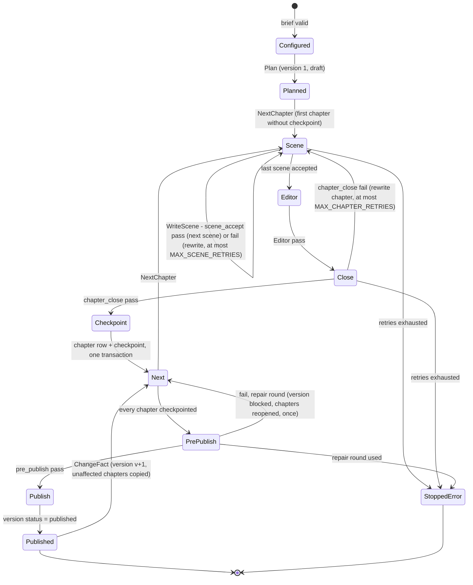

# TLA+ model of the gift-novel harness flow

Spec [013](../../specs/013-tla-harness/013-tla-harness.md) (block B9 of spec 004, exam
items T01–T05). Verification method: model checking, **A**
([`docs/verification.md`](../../docs/verification.md#model-checking--a)). TLC runs in
development, never per generation.

| File | What it is |
|---|---|
| [`GiftNovelHarness.tla`](./GiftNovelHarness.tla) | The model, plain TLA+ |
| [`GiftNovelHarness.cfg`](./GiftNovelHarness.cfg) | TLC configuration: constants, invariants, properties |
| [`run-tlc.sh`](./run-tlc.sh) | Fetches the pinned `tla2tools.jar` and runs TLC |
| [`tlc-output.txt`](./tlc-output.txt) | Output of the last full run |
| [`COUNTEREXAMPLES.md`](./COUNTEREXAMPLES.md) | Every counterexample TLC found while the model was developed, and the code rule each one produced |

## What is modelled

One novel, from a validated brief to a published version, with crashes and one reader
change:



*Reading it.* Each box is a value of the volatile `pc`. `Crash` is not drawn: it can fire
from any state except `Published`, `StoppedError` and `Crashed` itself, wipes the
pipeline's memory, and leads to `Crashed`, from which `Resume` reads the database and
returns to `Configured` (nothing planned yet), `Published` (latest version already
published) or `Next` (a draft or blocked version to finish). `ChangeFact` sends the new
version through the same loop: only the chapters it reopened lack a checkpoint, so only
they are rewritten.

**Durable variables** (K1 rows, kept across `Crash`):

| Variable | K1 row it stands for |
|---|---|
| `vstatus[v]` | `novel_version.status` ∈ none (no row), draft, blocked, published |
| `changed[v]` | `novel_version.changed_chapters` |
| `rows[v][c]`, `origin[v][c]`, `passed[v][c]` | `chapter_version(version, chapter)`: how many rows, in which version the text was written, whether it passed `scene_accept` and `chapter_close` |
| `ckpt[v]` | `checkpoint(version, chapter, status = complete)` |
| `ppOk[v]` | the persisted `pre_publish` `validator_result` of the version |
| `chFails[v][c]` | `chapter_close` failures in `validator_result` since the chapter was opened (CE2) |
| `repairRounds[v]` | repair rounds used by the version, on `novel_version` (CE4) |
| `factRev` | revision of the brief facts (`fact`) |

**Volatile variables** (the process's memory, reset by `Crash`): `pc`, `ver`, `cur`,
`scene`, `sceneTry`. Scenes are not durable (plan 004, V4): an interrupted chapter restarts
from its first scene, so its scene retry counter restarts with it; the budgets that must
survive a crash are the chapter and repair counters.

**Ghost variables** (for the properties only): `crashes`, `changes`, `everPublished`,
`snap` (the rows of each version as they were when it was published).

**Abstractions.** Validator outcomes are nondeterministic (every validator can pass or
fail at every call). The set of chapters a reader change affects, and the set a failed
`pre_publish` reopens, are nondeterministic non-empty subsets. Prose, prompts, the judge's
scores and the MCP server are not modelled. `ChangeFact` (create version, copy unaffected
rows and their checkpoints) is one atomic step: the code must do it in one transaction.
Concurrent regenerations are out of scope (spec 004).

## Properties

| Name | Kind | Says |
|---|---|---|
| `TypeOK` | invariant | Every variable stays in its type |
| `NoUnvalidatedPublish` | invariant | A published version has a passed `pre_publish` result, every chapter checkpointed, and every chapter's stored text passed `scene_accept` and `chapter_close` |
| `ResumeNoDupNoLoss` | invariant | No `(version, chapter)` is stored twice, and no checkpoint exists without its text |
| `PreviousVersionKept` | invariant | Every version ever published is still published and its rows are exactly as they were at publication |
| `RetriesBounded` | invariant | Scene retries ≤ `MAX_SCENE_RETRIES`, chapter retries ≤ `MAX_CHAPTER_RETRIES` and repair rounds ≤ `MAX_REPAIR_ROUNDS`, counted across crashes |
| `StoreSurvivesCrash` | action property | `Crash` and `Resume` change no durable variable, so the set of checkpointed chapters after a resume is exactly the set before the crash (the "no loss" half of resume) |
| `Termination` | liveness | Every behaviour ends, and stays, in `Published` or `StoppedError` |
| `EveryGenerationEnds` | liveness | Whenever the flow is not terminal (a first generation, a resume, a regeneration), it eventually becomes terminal |

Liveness holds under **weak fairness** of every step except `Crash` and `ChangeFact`
(`WF_vars(Progress)`), with crashes bounded by `MaxCrashes` and reader changes by
`MaxChanges`. Without the bounds, a behaviour that crashes forever would never finish,
which is true of the real system too.

## How to run

```bash
formal/tla/run-tlc.sh            # needs Java 11+; downloads tools/tla2tools.jar on first run
```

The jar is the v1.8.0 release asset of `tlaplus/tlaplus`, pinned by SHA-256 in the
script, because that tag is a rolling pre-release (the pinned jar reports
`TLC2 Version 2026.09.23.154203, rev 4260e47`). `tools/` and TLC's `states/` are
git-ignored.

**Configuration** ([`GiftNovelHarness.cfg`](./GiftNovelHarness.cfg)): `N = 5` chapters,
`SCENES = 3` (plan 004, V5), `MAX_SCENE_RETRIES = 2`, `MAX_CHAPTER_RETRIES = 2`,
`MAX_REPAIR_ROUNDS = 1`, `MaxCrashes = 1`, `MaxChanges = 1`. Nothing had to be reduced.

**Last result** ([`tlc-output.txt`](./tlc-output.txt)): *Model checking completed. No error
has been found.* 1,247,479 states generated, 696,062 distinct, search depth 109, about one
minute on 4 workers.

## Mapping: TLA+ action → code

> **To be confirmed against code in wave C.** The pipeline (spec 007, B3) and the
> repository (spec 005, B1) are being written in parallel; the names below are the ones
> fixed in plan 004 and in the B9 brief. Wave C checks each row against the code and
> either confirms it or updates the model.

| TLA+ action | Expected code | State or transition in the code |
|---|---|---|
| `Init` (`pc = "Configured"`) | brief validated by the interview (B2) | a `brief` row exists and validates; no `novel_version` row |
| `Plan` | `backend/app/novel/pipeline.py` `plan_novel` | inserts `novel_version(version = 1, status = draft, changed_chapters = all)` and the plan |
| `NextChapter` | `pipeline.py` `write_chapter` loop, `resume` | picks the lowest chapter of the version whose `checkpoint` is not complete; none left → pre-publish |
| `WriteScene` | `pipeline.py` `write_chapter` + `run_scene_validators` | writes one scene, runs hook `before_scene_accept` → `run_point(scene_accept)` (forbidden words, schema); fail → rewrite the scene, at most `MAX_SCENE_RETRIES`, then stop |
| `Editor` | `pipeline.py` `write_chapter` (editor role) | style editor + auditor pass over the assembled chapter |
| `CloseChapter` | `pipeline.py` `close_chapter` | hook `before_chapter_close` → `run_point(chapter_close)` (length, exact names, judge); failure count read from `validator_result` (CE2); fail → rewrite, at most `MAX_CHAPTER_RETRIES`, then stop |
| `Checkpoint` | `pipeline.py` `checkpoint` → `backend/app/bible/repository.py` (checkpoint) | **one transaction**: upsert `chapter_version(version, chapter, text, hash)` and set `checkpoint.status = complete`; refused for a published version (CE1, CE3) |
| `PrePublish` (pass) | `pipeline.py` `publish_version` | hook `before_publish` → `run_point(pre_publish)` (brief coverage, Lean, visual); result persisted |
| `PrePublish` (fail, repair) | `pipeline.py` `publish_version` → `repository.py` (versions) | one transaction: `novel_version.status = blocked`, repair round + 1 (CE4), reopened chapters' `checkpoint.status` reset |
| `PrePublish` (fail, exhausted) | `pipeline.py` `publish_version` | version stays `blocked`; the run ends `StoppedError` |
| `Publish` | `pipeline.py` `publish_version` → `repository.py` (versions) | `novel_version.status = published`; its `chapter_version` rows are never written again |
| `ChangeFact` | `pipeline.py` `change_fact` → `repository.py` (versions) | one transaction: update the `fact`, insert `novel_version(v+1, parent = v, status = draft, changed_chapters = A)`, copy the other chapters' `chapter_version` rows and complete checkpoints; version v untouched |
| `Crash` | process killed (container restart, exception, `kill`) | memory lost; SQLite keeps committed transactions |
| `Resume` | `pipeline.py` `resume` → `repository.py` (checkpoint, versions) | reads the latest `novel_version`: none → plan; published → nothing to do; draft or blocked → continue at the first chapter without a complete checkpoint, with retry and repair counts read from the database |
| `Done` | — | terminal stutter: `Published` or `StoppedError` |

**Rules the code must follow**, each produced by a counterexample
([`COUNTEREXAMPLES.md`](./COUNTEREXAMPLES.md)):

1. The chapter text and its checkpoint are written in one transaction (CE1).
2. The chapter retry count comes from persisted `validator_result` rows, not a loop
   variable (CE2).
3. `chapter_version` is keyed by `(version, chapter)` and upserted; a published version's
   rows are never written (CE3).
4. The repair round is stored on `novel_version` and updated with the `blocked` status
   (CE4).
5. Assumed by the model, not found by TLC: `change_fact` creates the new version and its
   copied rows in one transaction, and publishing is an insert of a new version plus a
   status change, never an update of an earlier version's rows.
