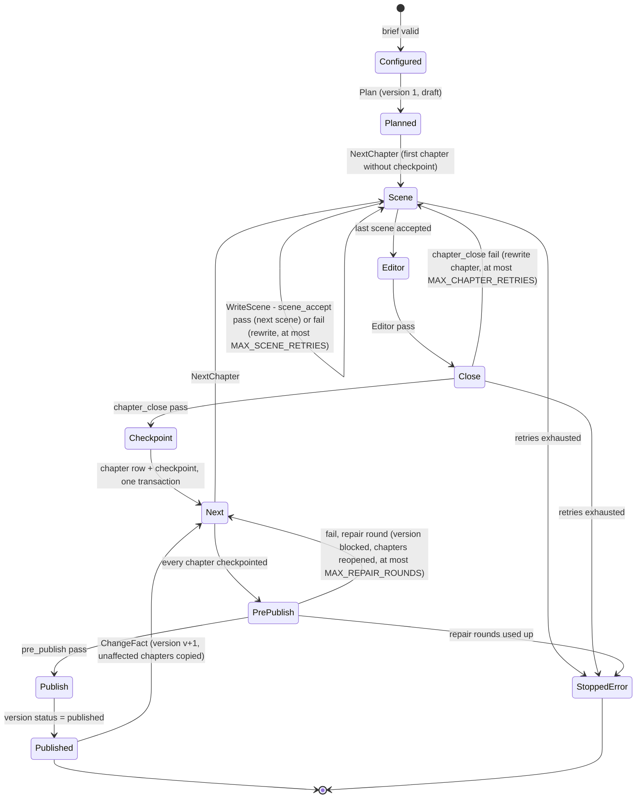

# TLA+ model of the gift-novel harness flow

Spec [013](../../specs/013-tla-harness/013-tla-harness.md) (block B9 of spec 004, exam
items T01–T05). Verification method: model checking, **A**
([`docs/verification.md`](../../docs/verification.md#model-checking--a)). TLC runs in
development, never per generation.

| File | What it is |
|---|---|
| [`GiftNovelHarness.tla`](./GiftNovelHarness.tla) | The model, plain TLA+ |
| [`GiftNovelHarness.cfg`](./GiftNovelHarness.cfg) | TLC configuration: constants, invariants, properties |
| [`run-tlc.sh`](./run-tlc.sh) | Fetches the pinned `tla2tools.jar` and runs TLC |
| [`tlc-output.txt`](./tlc-output.txt) | Output of the last full run |
| [`COUNTEREXAMPLES.md`](./COUNTEREXAMPLES.md) | Every counterexample TLC found while the model was developed, and the code rule each one produced |

## What is modelled

One novel, from a validated brief to a published version, with crashes and one reader
change:



*Reading it.* Each box is a value of the volatile `pc`. `Crash` is not drawn: it can fire
from any state except `Published`, `StoppedError` and `Crashed` itself, wipes the
pipeline's memory, and leads to `Crashed`, from which `Resume` reads the database and
returns to `Configured` (nothing planned yet), `Published` (latest version already
published) or `Next` (a draft or blocked version to finish). `ChangeFact` sends the new
version through the same loop: only the chapters it reopened lack a checkpoint, so only
they are rewritten.

**Durable variables** (K1 rows, kept across `Crash`):

| Variable | K1 row it stands for |
|---|---|
| `vstatus[v]` | `novel_version.status` ∈ none (no row), draft, blocked, published |
| `changed[v]` | `novel_version.changed_chapters` |
| `rows[v][c]`, `origin[v][c]`, `passed[v][c]` | `chapter_version(version, chapter)`: how many rows, in which version the text was written, whether it passed `scene_accept` and `chapter_close` |
| `ckpt[v]` | `checkpoint(version, chapter, status = complete)` |
| `ppOk[v]` | the persisted `pre_publish` `validator_result` of the version |
| `chFails[v][c]` | `chapter_close` failures in `validator_result` since the chapter was opened (CE2) |
| `repairRounds[v]` | repair rounds used by the version, on `novel_version` (CE4) |
| `factRev` | revision of the brief facts (`fact`) |

**Volatile variables** (the process's memory, reset by `Crash`): `pc`, `ver`, `cur`,
`scene`, `sceneTry`. Scenes are not durable (plan 004, V4): an interrupted chapter restarts
from its first scene, so its scene retry counter restarts with it; the budgets that must
survive a crash are the chapter and repair counters.

**Ghost variables** (for the properties only): `crashes`, `changes`, `everPublished`,
`snap` (the rows of each version as they were when it was published).

**Abstractions.** Validator outcomes are nondeterministic (every validator can pass or
fail at every call). The set of chapters a reader change affects, and the set a failed
`pre_publish` reopens, are nondeterministic non-empty subsets. Prose, prompts, the judge's
scores and the MCP server are not modelled. `ChangeFact` (create version, copy unaffected
rows and their checkpoints) is one atomic step: the code must do it in one transaction.
Concurrent regenerations are out of scope (spec 004).

## Properties

| Name | Kind | Says |
|---|---|---|
| `TypeOK` | invariant | Every variable stays in its type |
| `NoUnvalidatedPublish` | invariant | A published version has a passed `pre_publish` result, every chapter checkpointed, and every chapter's stored text passed `scene_accept` and `chapter_close` |
| `ResumeNoDupNoLoss` | invariant | No `(version, chapter)` is stored twice, and no checkpoint exists without its text |
| `PreviousVersionKept` | invariant | Every version ever published is still published and its rows are exactly as they were at publication |
| `RetriesBounded` | invariant | Scene retries ≤ `MAX_SCENE_RETRIES`, chapter retries ≤ `MAX_CHAPTER_RETRIES` and repair rounds ≤ `MAX_REPAIR_ROUNDS`, counted across crashes |
| `StoreSurvivesCrash` | action property | `Crash` and `Resume` change no durable variable, so the set of checkpointed chapters after a resume is exactly the set before the crash (the "no loss" half of resume) |
| `Termination` | liveness | Every behaviour ends, and stays, in `Published` or `StoppedError` |
| `EveryGenerationEnds` | liveness | Whenever the flow is not terminal (a first generation, a resume, a regeneration), it eventually becomes terminal |

Liveness holds under **weak fairness** of every step except `Crash` and `ChangeFact`
(`WF_vars(Progress)`), with crashes bounded by `MaxCrashes` and reader changes by
`MaxChanges`. Without the bounds, a behaviour that crashes forever would never finish,
which is true of the real system too.

## How to run

```bash
formal/tla/run-tlc.sh            # needs Java 11+; downloads tools/tla2tools.jar on first run
```

The jar is the v1.8.0 release asset of `tlaplus/tlaplus`, pinned by SHA-256 in the
script, because that tag is a rolling pre-release (the pinned jar reports
`TLC2 Version 2026.09.23.154203, rev 4260e47`). `tools/` and TLC's `states/` are
git-ignored.

**Configuration** ([`GiftNovelHarness.cfg`](./GiftNovelHarness.cfg)): `N = 5` chapters,
`SCENES = 3` (plan 004, V5), `MAX_SCENE_RETRIES = 2`, `MAX_CHAPTER_RETRIES = 2`,
`MAX_REPAIR_ROUNDS = 2` (1 until tuning iteration 1, 2026-09-24; it follows
`pipeline.MAX_REPAIR_ROUNDS`), `MaxCrashes = 1`, `MaxChanges = 1`. Nothing had to be reduced.

**Last result** ([`tlc-output.txt`](./tlc-output.txt), `MAX_REPAIR_ROUNDS = 2`): *Model
checking completed. No error has been found.* 10,031,846 states generated, 5,492,531
distinct, search depth 127, 8 min 17 s on 4 workers. With `MAX_REPAIR_ROUNDS = 1` (the
configuration before tuning iteration 1) it was 1,247,479 generated, 696,062 distinct,
depth 109, about one minute; no new counterexample appeared with the second round.

## Mapping: TLA+ action → code

**Confirmed against the code** at `340ede7` (spec 007 pipeline, spec 005 repository). Every
function below exists under that name; the pipeline is `backend/app/novel/pipeline.py`
(`pipeline.`), the repository `backend/app/bible/repository.py` (`repo.`).

| TLA+ action | Code | State or transition in the code |
|---|---|---|
| `Init` (`pc = "Configured"`) | `app/interview/service.py` `ingest_brief` | a `brief` row exists and validates (`brief_schema`, point `hook`); no `novel_version` row |
| `Plan` | `pipeline.plan_novel` → `persist_plan` → `record_plan_usage`; `pipeline._open_version` → `repo.create_version` | one planner call, `check_plan` + `chronology_problems`, at most `MAX_REPLANS = 1`; the plan is stored as fact `plan.v1`; `novel_version(version = 1, status = draft)` |
| `NextChapter` / `Resume` | `pipeline._chapter_loop` via `repo.first_incomplete_chapter`; entered from `generate` (`resume` is the same call) | the lowest chapter of the version without a `complete` checkpoint; none left → `publish_version` |
| `WriteScene` | `pipeline.write_scene` → `before_scene_accept` → `run_point(SCENE_ACCEPT)` | writer call, then `schema_role_output`, `forbidden_words_scene`, `no_placeholders`; fail → rewrite with feedback, at most `MAX_SCENE_RETRIES = 2` (loop counter **in memory**, see below), then `StopRunError` → `stopped_error` |
| `Editor` | `pipeline.write_chapter` → `pipeline._edit` | the editor joins the three scenes (or repairs a reopened chapter, or rewrites a changed one) plus one bounded length adjustment |
| `CloseChapter` | `pipeline.close_chapter` → `before_chapter_close` → `run_point(CHAPTER_CLOSE)` | budget read by `_chapter_close_runs` from `repo.count_chapter_attempts` (persisted `chapter_close` runs since the chapter was last reopened, **CE2**); fail → the rejected text goes to `repo.record_chapter_attempt` and the editor rewrites, at most `MAX_CHAPTER_RETRIES = 2`, then `stopped_error` |
| `Checkpoint` | `pipeline.checkpoint` → `repo.save_chapter_and_checkpoint` | **one transaction**: upsert `chapter_version(version, chapter)` and `checkpoint.status = complete` (**CE1**); refused for a published version (**CE3**) |
| `PrePublish` (pass) / `Publish` | `pipeline.publish_version` → `before_publish` → `run_point(PRE_PUBLISH)`; `repo.set_version_status(…, "published")` | `schema_brief`, `brief_coverage`, `lean_chronology`, `judge_novel`, `visual_check`; results persisted; the version becomes `published` and its rows are never written again |
| `PrePublish` (fail, repair) | `pipeline.publish_version` → `repo.block_version(…, repair_rounds = repair_rounds + 1)` + `repo.set_checkpoint(…, "pending")` | one transaction: `status = blocked`, repair round + 1 (**CE4**), the chapters named by `chapters_named` reopened; `_chapter_loop` runs again |
| `PrePublish` (fail, exhausted) | `pipeline.publish_version` → `pipeline._stop` | `repair_rounds >= MAX_REPAIR_ROUNDS = 2`: the version stays `blocked`, the novel `stopped_error` with `stop_reason` in the version note |
| `ChangeFact` | `pipeline.change_fact` → `repo.update_fact_value` → `repo.create_version_from(parent, copy_chapters_except = affected)` → `_chapter_loop` | new version v+1 (draft, parent = latest published) with the unaffected chapters and their checkpoints copied in one transaction; only the affected chapters are rewritten; version v untouched |
| `Crash` | process killed (container restart, exception, `kill`) | memory lost; SQLite keeps committed transactions |
| `Resume` | `pipeline.generate` / `resume` → `load_plan`, `_open_version`, `first_incomplete_chapter` | no version → plan; latest published → "already published"; draft or blocked → continue at the first chapter without a complete checkpoint, with chapter and repair budgets read from the database |
| `Done` | — | terminal: `RunResult.status` ∈ `published`, `stopped_error` |

**Divergences between the model and the code** (found while confirming the table; recorded
in [`docs/process/iteraciones.md`](../../docs/process/iteraciones.md#divergencias-encontradas-al-mapear-tla-a-código)):

1. *Scene retry counter in memory.* `write_scene` counts rewrites in a local loop, so a
   crash restarts the chapter from scene 1 with a fresh scene budget. This is safe and
   matches the model, where `sceneTry` is volatile: scenes are never checkpointed (plan
   004, V4), and the model's `RetriesBounded` across crashes is enforced by the durable
   chapter-close and repair counters; the extra cost is bounded by the number of crashes.
2. *`ChangeFact` is not one transaction in the code.* The model takes it as one atomic
   step (rule 5 below). `change_fact` commits `update_fact_value` (and, for a name, the
   renames of cast, derived facts and brief) **before** `create_version_from`, which is
   itself one transaction. A crash between them leaves the fact changed with no version
   v+1, and `Resume` then finds the latest version published: the change is lost silently.
   **Fixed in `772f846`:** everything from `update_fact_value` to `create_version_from` and
   the usage rows runs in one `BibleRepository.transaction()` (savepoint-aware).

**Rules the code must follow**, each produced by a counterexample
([`COUNTEREXAMPLES.md`](./COUNTEREXAMPLES.md)):

1. The chapter text and its checkpoint are written in one transaction (CE1).
2. The chapter retry count comes from persisted `validator_result` rows, not a loop
   variable (CE2).
3. `chapter_version` is keyed by `(version, chapter)` and upserted; a published version's
   rows are never written (CE3).
4. The repair round is stored on `novel_version` and updated with the `blocked` status
   (CE4).
5. Assumed by the model, not found by TLC: `change_fact` creates the new version and its
   copied rows in one transaction, and publishing is an insert of a new version plus a
   status change, never an update of an earlier version's rows. Both halves hold in the
   code (the `change_fact` half since `772f846`, divergence 2 above).
