# Cómo funciona el sistema, de la primera llamada a la novela completa

Documento de trabajo, no forma parte de `docs/`. Su objetivo es visualizar el camino
completo del harness, desde que el frontend hace la primera petición hasta que existe un
manuscrito terminado, bajando de nivel diagrama a diagrama.

**Aviso de fidelidad.** Hoy `backend/` y `frontend/` están vacíos y no hay ninguna spec
aprobada. Todo lo que aquí se marca como **[docs]** está tomado de `docs/architecture.md`,
`docs/definitions.md`, `docs/domain-knowledge.md` y `docs/verification.md`. Todo lo que se
marca como **[propuesta]** es una lectura razonable de esos docs que aún no está decidida
y que, para convertirse en código, tendría que pasar por Proceso 0, una spec y un plan.
Los nombres de endpoints, en particular, son propuesta: no existe ninguno.

---

## Diagrama 1 — Vista de alto nivel, por capas

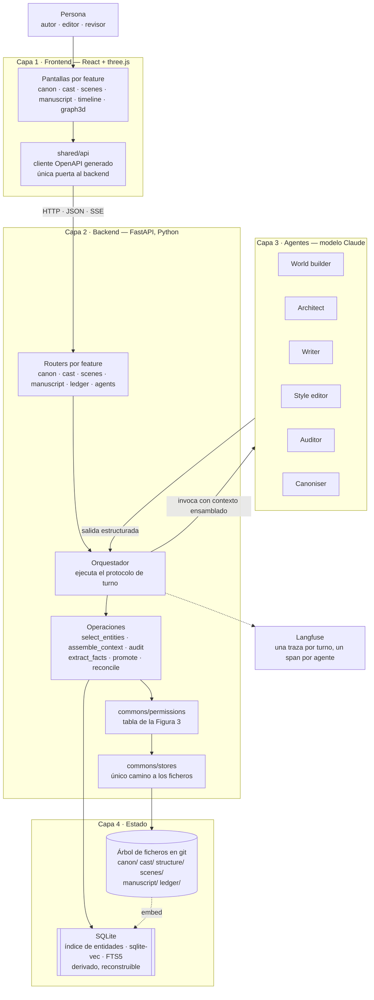

### Qué muestra

Cuatro capas con una regla de dependencia estricta: cada capa solo habla con la
inmediatamente inferior. **[docs]** El frontend jamás toca los stores; el backend es el
único proceso que lee y escribe el árbol de ficheros; los agentes son funciones sin estado
que reciben un contexto y devuelven una salida, y **no tienen acceso propio al disco**
salvo a través de herramientas que el backend les presta (ver Diagrama 5).

Tres cosas que conviene fijar desde el principio:

- **El estado es el árbol de ficheros, no la base de datos.** SQLite es un índice
  derivado: se puede borrar y reconstruir desde `canon/`, `cast/` y
  `manuscript/digests/` sin perder nada. Si un registro del índice no tiene fichero
  detrás, es un bug. **[docs]**
- **La tabla de permisos vive en el backend.** No en el prompt ni en el cliente. Es la
  "pared maestra" del sistema: qué rol puede escribir en qué store. **[docs]**
- **Langfuse observa, no decide.** Cada turno es una traza; cada invocación de agente es
  un span con el rol, la escena y los paths leídos y escritos. **[docs]**

Las capas 1, 2 y 4 son deterministas. Toda la incertidumbre del sistema está concentrada
en la capa 3, y el resto de la arquitectura existe para rodearla de contratos.

---

## Diagrama 2 — El ciclo de vida de una novela

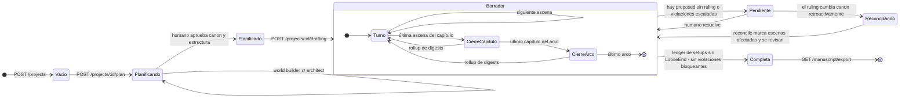

### Qué muestra

La novela pasa por **dos fases con agentes distintos**. **[docs]**

**Planificación.** Aquí escriben los dos únicos roles con permiso sobre `canon/` y
`structure/`: el world builder produce axiomas, tecnología, lugares, facciones, léxico y
calendario; el architect produce arcos, capítulos y los registros de escena
`scenes/NNN.yaml`. Se alternan porque se alimentan mutuamente: el architect necesita
axiomas para diseñar escenas que los pongan a prueba, y el world builder necesita la
estructura para saber qué parte del mundo hace falta detallar. El estado sale de esta fase
cuando un humano da por bueno el canon inicial.

**Borrador.** Es el bucle de la Figura 4 de `architecture.md`, ejecutado unas doscientas
veces, una por escena. Cada iteración es un **turno**: ensamblar contexto, escribir,
auditar, revisar lo señalado, extraer hechos, promover. Los cierres de capítulo y de arco
no son agentes nuevos: son el momento en que se enrollan los digests (100 → 250 → 400
palabras) para que el coste de ensamblar la escena 200 sea parecido al de la 20.

**Pendiente** es el estado en que el sistema espera a una persona. Hay exactamente dos
puertas humanas obligatorias **[docs]**: una promoción que colisiona con canon existente
y una violación cuya resolución es "cambiar el canon" y no "cambiar la prosa". Si el
ruling cambia canon hacia atrás, `reconcile()` identifica qué escenas ya escritas
dependían del hecho anterior.

**Completa** no es "se escribió la última escena". Es una condición comprobable: el
conjunto de setups en estado `LooseEnd` está vacío y no quedan violaciones `blocking`.

**Endpoint de entrada del backend.** **[propuesta]** La primera llamada real es
`POST /projects` con la intención del autor (premisa, tesis, contrato de género). Crea el
proyecto vacío: inicializa el árbol de ficheros, el repositorio git y el índice SQLite.
Todo lo demás cuelga de ese `project_id`. Los endpoints de estado (`plan`, `drafting`,
`turns`) devuelven `202 Accepted` con un `run_id`, porque un turno tarda minutos y no cabe
en una petición HTTP síncrona; el progreso llega por SSE (ver Diagrama 6).

---

## Diagrama 3 — Capa 1: el frontend y sus features

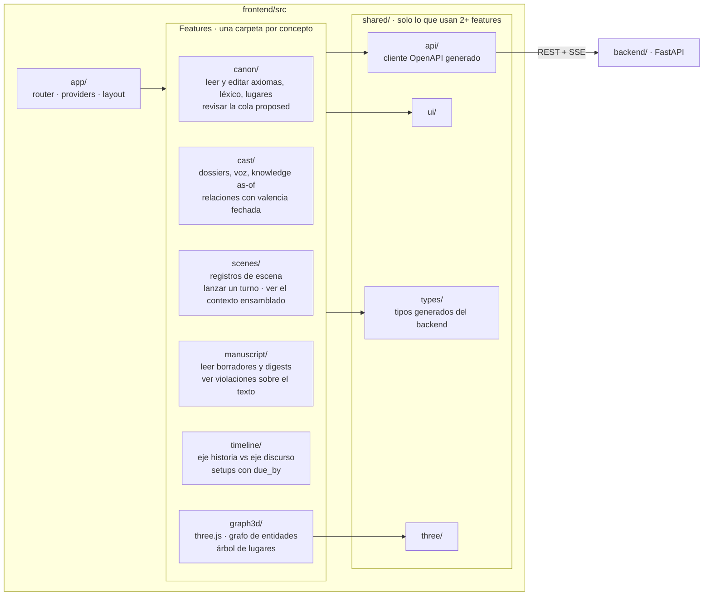

### Qué muestra

**Frontend → features** significa **package by feature**, no Feature-Sliced Design.
**[docs]** Una feature es una carpeta plana con sus pantallas, hooks, llamadas y tests
juntos. No hay `components/` ni `hooks/` en la raíz; esos nombres aparecen dentro de la
feature cuando la carpeta crece lo bastante para necesitarlos.

Las seis features que nombran los docs se corresponden con las vistas que un autor
necesita sobre cada store, más dos vistas transversales:

| Feature | Store que mira | Qué hace el usuario ahí |
|---|---|---|
| `canon/` | `canon/`, `ledger/proposed.yaml` | Leer y editar el mundo; dar el ruling humano a los hechos propuestos |
| `cast/` | `cast/` | Consultar un dossier "tal como estaba" en una escena concreta |
| `scenes/` | `scenes/`, `structure/` | Editar registros; lanzar un turno; previsualizar el contexto ensamblado |
| `manuscript/` | `manuscript/`, `ledger/violations.yaml` | Leer prosa con las violaciones anotadas; decidir "arreglar prosa" o "arreglar canon" |
| `timeline/` | `ledger/timeline.yaml`, `ledger/setups.yaml` | Ver los dos ejes temporales y las deudas con fecha |
| `graph3d/` | índice de entidades | Navegar el grafo en 3D |

Dos reglas hacen que esta capa sea segura por construcción **[docs]**: solo
`shared/api/` puede emitir peticiones al backend, y esto lo vigila una regla de ESLint;
y el cliente se genera del OpenAPI del backend, de modo que un cambio de contrato sin
regenerar el cliente rompe la CI. El frontend, por tanto, no puede "saltarse" el backend ni
por error.

---

## Diagrama 4 — Capa 2: el backend por dentro

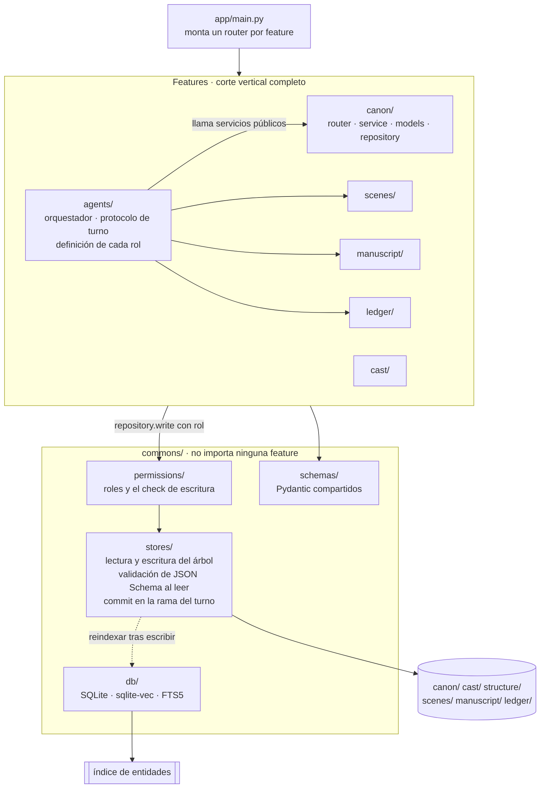

### Qué muestra

El backend está partido igual que el frontend: **una carpeta por concepto**, más
`commons/` para lo que cruza conceptos. **[docs]** Las reglas que lo mantienen sano:

1. Una feature no importa las entrañas de otra. Si `scenes/` necesita algo de `canon/`,
   llama a su servicio público.
2. `commons/` no conoce el nombre de ninguna feature. Las dependencias van en un solo
   sentido.
3. **Todo acceso a disco pasa por `commons/stores/`**, y cada escritura nombra el rol que
   la realiza. `commons/permissions/` compara ese rol con la tabla de la Figura 3 y
   rechaza lo que no cuadra. Esto se verifica con `import-linter` y con tests que
   intentan la escritura prohibida.

**Endpoint de agentes.** **[propuesta]** La feature `agents/` es el orquestador, no una
colección de endpoints por rol. No conviene exponer `POST /agents/writer` ni
`POST /agents/auditor`: eso permitiría al cliente elegir quién escribe y en qué orden, y
el protocolo de turno dejaría de estar garantizado por el backend. Lo que se expone son
**las operaciones que una persona puede pedir**, y el orquestador decide qué roles
intervienen:

| Endpoint propuesto | Qué dispara | Roles que intervienen |
|---|---|---|
| `POST /projects` | Crear proyecto | ninguno |
| `POST /projects/{id}/plan` | Turno de planificación | world builder, architect |
| `POST /projects/{id}/turns` con `scene_id` | Un turno de escritura, Figura 4 | writer, auditor, style editor, canoniser |
| `POST /projects/{id}/drafting` con rango de escenas | Bucle de turnos | los mismos, en bucle |
| `GET /runs/{run_id}/events` | Flujo SSE del progreso | — |
| `GET /scenes/{id}/context` | Previsualizar el contexto ensamblado | ninguno, solo `assemble_context` |
| `POST /ledger/proposed/{id}/ruling` | Ruling humano sobre un hecho | canoniser aplica el resultado |
| `POST /ledger/violations/{id}/resolution` | Decidir prosa o canon | writer en modo `revise`, o escalado |
| `GET /projects/{id}/manuscript/export` | Novela completa en orden de discurso | ninguno |

Los endpoints CRUD por feature (`GET /canon/axioms`, `PUT /scenes/{id}`, etc.) son
lecturas y ediciones humanas. También pasan por el store layer, con un rol `human` que
tiene permiso de escritura sobre todo, porque la persona es la autoridad última.

---

## Diagrama 5 — Capa 3: dónde y cómo corre un agente

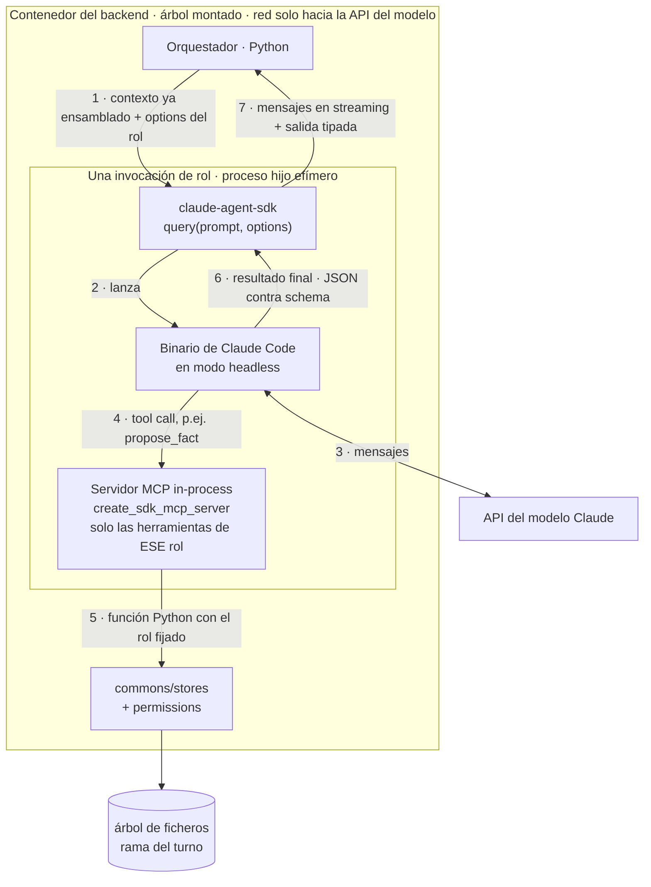

### Qué muestra

**Cómo pasamos de FastAPI a Claude Code.** El puente es el **Claude Agent SDK** de Python.
**[propuesta]** El backend no llama a la API del modelo a pelo: llama a `query()` del
paquete `claude-agent-sdk`, que lanza el binario de Claude Code como proceso hijo en modo
headless, le pasa prompt y opciones, y devuelve un iterador asíncrono de mensajes. Es
Claude Code "como librería": el mismo bucle de agente, permisos, hooks y MCP que usamos
en el terminal, pero controlado desde Python.

Lo que el orquestador configura en `ClaudeAgentOptions`, **por rol**:

- `system_prompt`: el contrato del rol (su fila de la Figura 3 y las reglas de estilo).
- `cwd`: la rama del turno del árbol de ficheros, montada en el contenedor.
- `mcp_servers` y `allowed_tools`: un servidor MCP **in-process** creado con
  `create_sdk_mcp_server`, cuyas herramientas son funciones Python decoradas con `@tool`.
  Cada función lleva el rol ya fijado y llama al store layer. El writer recibe
  `propose_fact` y `write_draft`; el auditor recibe `report_violation`; el canoniser
  recibe `promote`. **Ninguno recibe `Write`, `Edit` ni `Bash`**: se retiran con
  `disallowed_tools`. Así la herramienta que el modelo ve *es* la comprobación de permisos
  del backend, no un prompt que le pide comportarse.
- `output_format` con `type: json_schema`: la respuesta final se valida contra el schema
  de `Draft`, `Violation[]` o `ProposedFact[]`. Una salida malformada se rechaza, no se
  repara. **[docs]**
- `max_turns`: cota de ida y vuelta de herramientas, que junto con el cap de 100k tokens
  de contexto hace que una invocación no pueda crecer sin límite.

**Dónde corren los agentes.** Dentro del **mismo contenedor que el backend**, como procesos
hijo efímeros del proceso FastAPI. **[docs]** `verification.md` lo fija: "el proceso del
backend que ejecuta operaciones de agente corre en un contenedor con el árbol montado y sin
red salvo hacia la API del modelo". No hay un "servicio de agentes" aparte ni una sesión
interactiva de Claude Code abierta: cada rol se lanza, hace su trabajo, devuelve y muere.
No hereda ventana de contexto de nadie. **[docs]** Eso es lo que quiere decir "los agentes
son funciones sin estado sobre los stores".

**Por qué el Agent SDK y no la API de Messages directa.** **[propuesta]** Sería posible
usar el SDK cliente `anthropic` con su tool runner, y el resultado funcional sería el mismo.
El Agent SDK aporta tres cosas que este proyecto ya usa: carga `.claude/skills/` y
`CLAUDE.md` del árbol de trabajo, con lo que el protocolo de turno que los docs sitúan en
`CLAUDE.md` llega al agente sin duplicarlo; trae hooks `PreToolUse` que sirven de segunda
barrera además del `allowed_tools`; y la observabilidad hacia Langfuse ya está cableada
para sesiones de Claude Code en este repo. Es una decisión abierta y debe cerrarse en una
spec.

---

## Diagrama 6 — Un turno de escritura, extremo a extremo

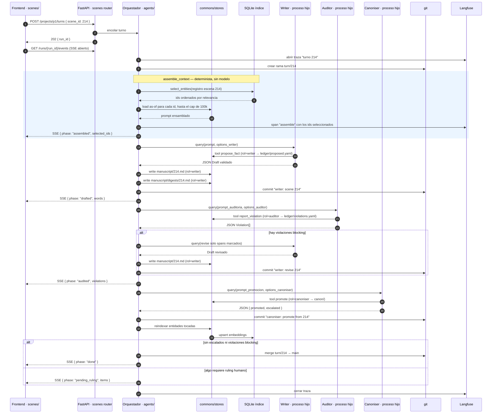

### Qué muestra

Es la Figura 4 de `architecture.md` con las capas 1, 2 y 4 hechas explícitas. Lo que la
Figura 4 dibuja como "Orchestrator → Writer" aquí se ve como lo que realmente es: el
backend construye el contexto, lanza un proceso hijo, recoge una salida tipada y persiste
él mismo.

**Cómo llegan las respuestas de los agentes a Python, se persisten y llegan al frontend.**
Hay **dos canales de vuelta**, y conviene distinguirlos:

1. **Efectos durante la ejecución, por herramienta.** Cuando el writer llama a
   `propose_fact`, esa llamada es una función Python que corre en el proceso del backend,
   con el rol ya fijado. La función valida el `ProposedFact` con Pydantic, pasa por
   `permissions`, escribe en `ledger/proposed.yaml` y registra un evento en el span de
   Langfuse. El agente solo ve el resultado de la herramienta. No hay parseo de texto libre
   ni ficheros que el agente haya escrito por su cuenta.
2. **La salida final, por schema.** El `Draft`, la lista de `Violation` o el resultado de
   promoción llegan como el mensaje de resultado del `query()`, en JSON validado contra el
   schema declarado en `output_format`. Python lo convierte a su modelo Pydantic y **es el
   orquestador quien escribe** `manuscript/214.md`, nombrando el rol que lo produjo.

En ambos casos el camino a disco es el mismo: modelo Pydantic → `permissions` → `stores`
→ fichero en la rama del turno → commit. Y el camino al frontend también: cada fase del
turno emite un evento por el flujo SSE abierto en el paso 4, con lo justo para pintar
progreso; el contenido completo se lee después por los endpoints normales de cada feature
(`GET /manuscript/214`, `GET /ledger/violations?scene=214`).

Tres detalles que no son decoración **[docs]**:

- El bloque `assemble_context` no llama a ningún modelo. La selección es una consulta a
  sqlite-vec y la carga es determinista; por eso los ids seleccionados se escriben en la
  traza y el auditor los reutiliza para saber qué axiomas están en vigor.
- La revisión es `revise(draft, violations)`, acotada a los spans marcados. No se
  regenera la escena.
- El merge a `main` solo ocurre si el turno queda limpio. Si algo pide ruling humano, la
  rama queda viva y el estado del proyecto pasa a "Pendiente" (Diagrama 2).

---

## Diagrama 7 — Dentro de assemble_context: seleccionar y luego cargar

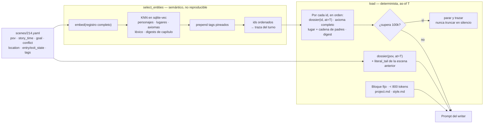

### Qué muestra

La operación más importante del backend, y la única que toca SQLite en el camino
caliente. **[docs]** Está partida en dos mitades a propósito:

**Seleccionar** decide *qué* entra. Embebe el registro de escena completo y pregunta al
índice por las entidades más cercanas. Devuelve identificadores, nunca texto. Es la
única parte no reproducible del sistema, y por eso su resultado se persiste en la traza.

**Cargar** decide *qué versión* entra. Para cada id, el store devuelve el registro tal
como estaba en el instante `T` de la escena: el dossier de un personaje solo con lo que ya
sabía, la valencia de sus relaciones en esa fecha. El POV no pasa por la selección; entra
siempre, por identificador. Esto es lo que impide que el writer use un hecho que el
personaje aún no ha aprendido: no se le pide que lo ignore, no se le da.

El cap de 100k es duro y por invocación. Una llamada que lo superaría **se detiene y se
traza**; nunca se recorta en silencio, porque un contexto recortado produce una escena
que parece válida y no lo es.

Para el frontend, esta operación se expone también en solitario **[propuesta]** como
`GET /scenes/{id}/context`, que es lo que la feature `scenes/` usa para que el autor vea
qué le va a llegar al writer antes de gastar un turno.

---

## Diagrama 8 — El camino de un dato desde el agente hasta la pantalla

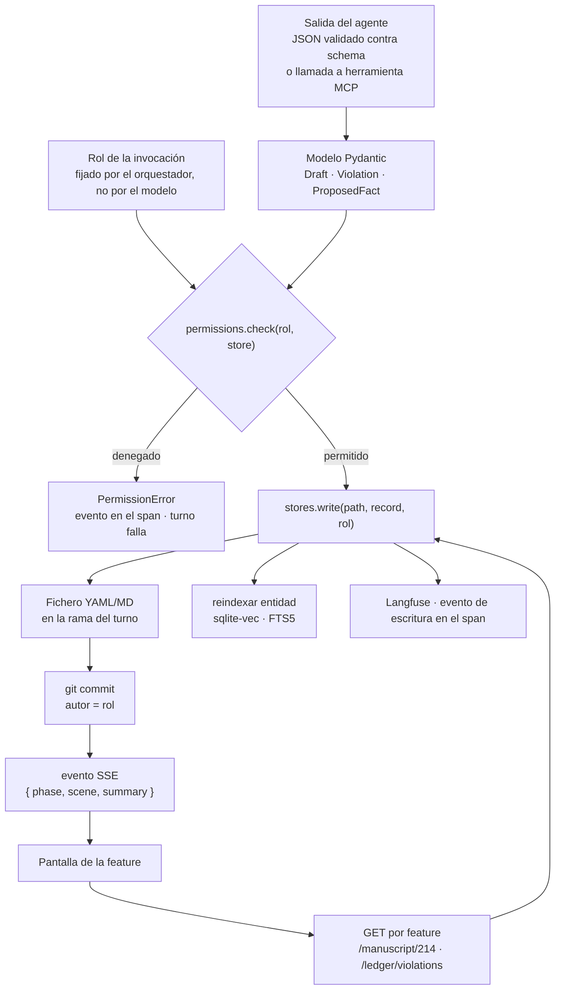

### Qué muestra

La respuesta a "cómo se persiste" en una sola línea: **el agente nunca persiste; el
backend persiste en nombre del agente.** El rol lo fija el orquestador al construir la
invocación, no lo declara el modelo, así que un agente comprometido por una inyección en la
prosa no puede escalar sus permisos diciendo que es otro. La comprobación ocurre en Python,
antes del disco, y la denegación se registra como evento en Langfuse y hace fallar el turno.
La rama de git es la segunda barrera: si `permissions` tuviera un bug, `main` sigue intacta
hasta que el turno pasa la auditoría.

---

## Diagrama 9 — Memoria a corto y a largo plazo

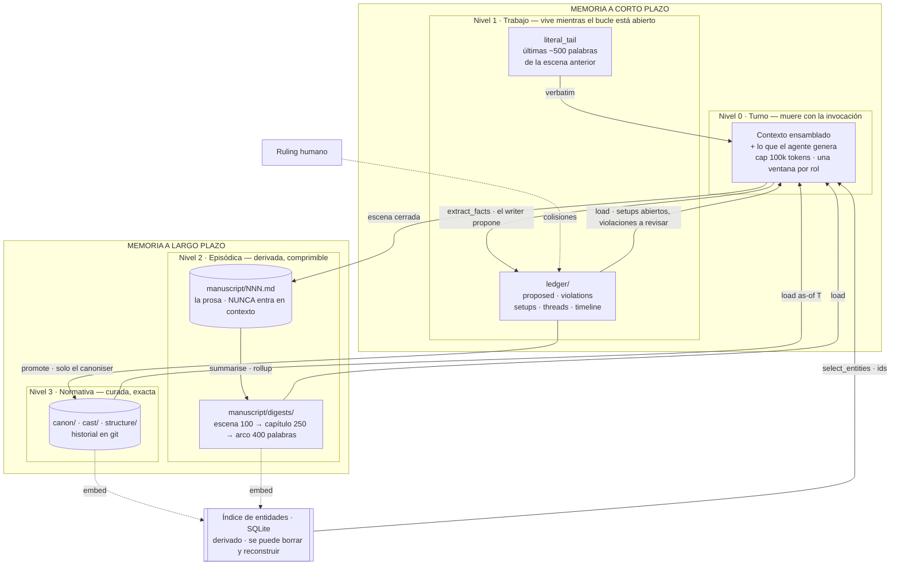

### Qué muestra

**[docs]** El sistema no tiene "una memoria". Tiene cuatro niveles con dueño, camino de
escritura y política de olvido distintos, y la regla que lo gobierna es que **ningún agente
recuerda nada fuera de los stores**. No hay transcripción, no hay historial de
conversación, no hay sesión que sobreviva a la invocación. El writer y el auditor se
comunican a través de `manuscript/214.md` y `ledger/violations.yaml`, nunca pasándose
mensajes.

| | Corto plazo | Largo plazo |
|---|---|---|
| **Qué es** | El contexto de una invocación, y el ledger mientras el bucle está abierto | Canon, cast y estructura; los digests de la prosa; el historial git |
| **Dónde vive** | RAM del proceso hijo; `ledger/` | `canon/` `cast/` `structure/` `manuscript/digests/` |
| **Quién escribe** | El orquestador al ensamblar; el writer y el auditor sobre `ledger/` | Solo world builder y canoniser sobre canon; el orquestador sobre digests |
| **Cómo se olvida** | Al terminar la invocación; al cerrarse un setup, un thread o una violación | Nunca se borra canon; los digests se comprimen por rollup |
| **Cómo vuelve a entrar** | No vuelve: cada turno se reconstruye desde cero | Por selección semántica en el índice y carga as-of |

**Corto plazo, nivel 0: la ventana de la invocación.** Es lo único que podría llamarse
"memoria de trabajo del modelo", y se diseña para que **no persista**. Cada rol arranca
con una ventana nueva de como mucho 100k tokens, construida por `assemble_context`
(Diagrama 7), y esa ventana se descarta al terminar. Consecuencia práctica para la
implementación **[propuesta]**: en el Agent SDK se usa `query()` y nunca
`ClaudeSDKClient` con sesión ni `resume`. Reutilizar una sesión entre roles o entre turnos
sería exactamente el fallo que este diseño prohíbe, porque haría que el auditor "recordase"
lo que el writer pensó en lugar de leer lo que escribió.

**Corto plazo, nivel 1: el ledger y la cola literal.** `ledger/` es la memoria de trabajo
del bucle, no del modelo. Ahí viven las cosas abiertas: hechos propuestos y aún no
promovidos, violaciones sin resolver, setups sin pagar, threads con su latencia. Se
comporta como una bandeja: lo que se cierra sale. Un setup pagado, un thread resuelto o
una violación aceptada dejan de cargarse en el siguiente contexto. El `literal_tail` es el
otro elemento de corto plazo: las últimas ~500 palabras de la escena anterior, pasadas
tal cual, para que la siguiente escena arranque en el mismo registro de voz. Es el único
texto verbatim de prosa que un agente llega a ver, y dura exactamente un turno.

**Largo plazo, nivel 2: la memoria episódica.** Es la memoria de "qué ha pasado en el
libro", y está deliberadamente separada de la prosa. `manuscript/NNN.md` se escribe y no
se vuelve a leer por ningún agente; lo que se lee son los `SceneDigest`: un resumen de
unas 100 palabras al cerrar cada escena, que se enrolla en un digest de capítulo de unas
250 y en uno de arco de unas 400. Esa escalera es la política de olvido a largo plazo:
la escena 200 no carga 199 resúmenes, carga los pocos digests de capítulo que el índice
juzga relevantes. Y son regenerables desde la prosa, así que no son autoritativos: un
digest dice lo que la prosa *dijo*, no lo que es verdad en el mundo.

**Largo plazo, nivel 3: la memoria normativa.** Canon, cast y estructura. Es pequeña,
exacta y curada, y tiene una sola entrada durante el borrador: `promote`, ejecutado por
el canoniser, con ruling humano cuando un hecho colisiona con otro ya canónico. **La
consolidación de memoria se revisa, no se acumula.** El writer, que es quien más tokens
genera y por tanto más inventa, no tiene ninguna forma de escribir aquí; solo puede
proponer. Git da la dimensión temporal gratis: el `blame` de un axioma es la historia de
cuándo y por qué pasó a ser verdad.

**El índice no es memoria.** Aunque SQLite parezca la "base de datos de la memoria", es
un derivado: una fila por entidad, embebida desde `canon/`, `cast/` y los digests. Si se
borra, se reconstruye sin pérdida. Su único papel es decidir *qué* recordar en cada turno
(selección); *qué versión* recordar lo decide la carga as-of desde los stores. Esto es lo
que impide que la recuperación semántica meta en contexto un hecho que el personaje POV
todavía no conoce.

**Qué pasa con la memoria propia de Claude Code.** **[propuesta]** El Agent SDK carga
`CLAUDE.md` y `.claude/` del `cwd`, y eso es deseable: ahí está el protocolo de turno y la
tabla de permisos, que es memoria de *cómo trabajar*, no de *qué pasa en la novela*. Lo que
hay que apagar es la memoria automática por proyecto que Claude Code guarda fuera del
árbol de trabajo, porque sería un quinto nivel que ningún doc gobierna y que sobreviviría
a las invocaciones sin pasar por `promote`. Cómo se desactiva exactamente depende de la
versión del SDK y es un punto para la spec del runtime.

---

## Diagrama 10 — Las herramientas de cada agente

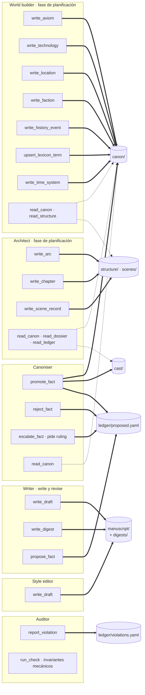

Trazo grueso: escritura. Trazo punteado: lectura bajo demanda. Los nombres de las
herramientas son **[propuesta]**; los stores a los que apuntan y quién puede tocar cada
uno son **[docs]**, columna `Out` de la Figura 3.

### Qué muestra

**Una herramienta es un permiso hecho función.** Cada caja es una función Python del
backend, decorada con `@tool`, servida al proceso hijo por el servidor MCP in-process del
rol (Diagrama 5). No hay una herramienta genérica `write(path)`: hay `write_draft`, que solo
sabe escribir en `manuscript/NNN.md`, y `propose_fact`, que solo sabe añadir a
`ledger/proposed.yaml`. El rol va fijado en la función, no lo declara el modelo. Por eso la
tabla de la Figura 3 no hace falta explicársela al agente en el prompt: **el agente no
puede violar un permiso que no tiene como herramienta.**

**Lo que ningún rol recibe.** Las herramientas nativas de Claude Code se retiran para
todos con `disallowed_tools`: `Read`, `Write`, `Edit`, `Bash`, `Glob`, `Grep`,
`WebSearch`, `WebFetch`. Un writer con `Write` podría escribir `canon/axioms/x.md` y el
store layer nunca lo vería. Un writer con `WebFetch` rompería la regla de "sin red salvo
hacia la API del modelo". Esto es verificable de forma estática **(A)**: un test lee las
`ClaudeAgentOptions` de cada rol y comprueba que la lista de herramientas permitidas es
exactamente la esperada.

**La tabla completa, rol por rol.**

| Rol | Herramientas de escritura | Store destino | Herramientas de lectura | Salida final validada |
|---|---|---|---|---|
| World builder | `write_axiom` `write_technology` `write_location` `write_faction` `write_history_event` `upsert_lexicon_term` `write_time_system` | `canon/` | `read_canon` `read_structure` | Lista de ids creados o modificados |
| Architect | `write_arc` `write_chapter` `write_scene_record` | `structure/` `scenes/` | `read_canon` `read_dossier` `read_ledger` | Lista de `scenes/NNN.yaml` producidos |
| Writer | `write_draft` `write_digest` `propose_fact` | `manuscript/` `manuscript/digests/` `ledger/proposed.yaml` | ninguna | `Draft` |
| Style editor | `write_draft` | `manuscript/` | ninguna | `Draft` |
| Auditor | `report_violation` | `ledger/violations.yaml` | `run_check` | `Violation[]` |
| Canoniser | `promote_fact` `reject_fact` `escalate_fact` | `canon/` `cast/` `ledger/proposed.yaml` | `read_canon` | `{ promoted[], rejected[], escalated[] }` |

**Por qué writer, style editor y auditor no tienen herramientas de lectura.** **[docs]**
La Figura 3 dice que todo lo que un agente necesita está en su columna `In`, y que "un
agente que necesita un hecho ausente de sus entradas no va a buscarlo: el contrato está
mal y se corrige". Para los roles del bucle de escritura eso se cumple literalmente: el
writer recibe el contexto ensamblado, el auditor recibe borrador, registro de escena y la
lista de entidades seleccionadas, el style editor recibe borrador, biblia de estilo y
perfil de voz. Darles `read_canon` abriría la puerta a que el writer cargue el dossier
completo de un personaje y use un hecho que el POV aún no conoce, que es exactamente lo que
la carga as-of evita.

**Por qué world builder, architect y canoniser sí las tienen.** **[propuesta]** Sus
entradas son `canon/` y `structure/` enteros, que en el capítulo cuarenta no caben en 100k
tokens. Aquí la selección semántica no basta, porque el world builder necesita saber si un
axioma ya existe antes de escribir otro. Una lectura bajo demanda, restringida a los stores
de su columna `In` y sin as-of (estos roles trabajan sobre el presente del mundo, no sobre
el instante de una escena), es la forma de mantener el contrato sin romper el cap. Es una
decisión que la spec del runtime debe tomar; la alternativa es dividir la planificación en
turnos más pequeños con contexto preensamblado.

**`run_check` del auditor.** **[propuesta]** De los diez invariantes de `definitions.md`,
varios son mecánicos: léxico prohibido es comparación de cadenas, tránsitos posibles es
una consulta a la matriz, unicidad espacial es un cruce de `story_time` y `location`.
Esos no deberían depender del criterio del modelo. `run_check(invariant_id)` ejecuta la
comprobación determinista en Python y devuelve el resultado; el auditor la invoca, lee la
evidencia y decide severidad y redacción. Los invariantes semánticos, como monotonía del
conocimiento o voz reconocible, los juzga el modelo con lo que tiene en contexto.

**Las tres salidas del canoniser.** `promote_fact` escribe en canon y marca el hecho como
`promoted`; `reject_fact` lo marca `rejected` con motivo; `escalate_fact` lo deja
`pending` y lo señala para ruling humano. La tercera es la que hace que la puerta humana
sea real: un canoniser que solo tuviera `promote` y `reject` resolvería toda colisión por
su cuenta, que es el modo de fallo que `ProposedFact` describe.

**Anatomía de una llamada.** Lo que pasa cuando el writer invoca `propose_fact`:

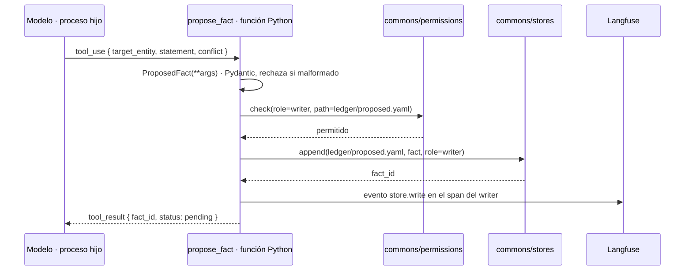

El rol `writer` no viene del modelo: está capturado en la clausura de la función cuando el
orquestador construyó el servidor MCP para esta invocación. Si el modelo intentase llamar a
una herramienta que no está en su servidor, la llamada no llega a existir: el SDK la
rechaza antes de tocar Python.

---

## Respuestas a las preguntas, consolidadas

**¿Cómo vamos a pasar de FastAPI a Claude Code?**
Con el Claude Agent SDK de Python dentro del proceso FastAPI. El orquestador construye
`ClaudeAgentOptions` por rol y llama a `query()`; el SDK lanza el binario de Claude Code
como proceso hijo headless. Las herramientas que ve el agente son funciones Python del
backend expuestas como servidor MCP in-process, con el rol ya fijado; las herramientas de
fichero y shell se retiran. La salida final se valida contra JSON Schema. **[propuesta]**
La alternativa, el SDK cliente `anthropic` con tool runner, es viable; la decisión es de una
spec.

**Frontend → ¿features?**
Sí, package by feature: `canon/`, `cast/`, `scenes/`, `manuscript/`, `timeline/`,
`graph3d/`, cada una con pantallas, hooks, llamadas y tests en una carpeta plana, más
`shared/` para el cliente generado, primitivas UI y helpers de three.js. **[docs]**

**Endpoint de entrada del backend.**
`POST /projects` crea el proyecto y su árbol. Después, `POST /projects/{id}/plan` abre la
planificación y `POST /projects/{id}/turns` o `/drafting` abren la escritura. Todos los
que lanzan agentes devuelven `202` con `run_id` y el progreso sale por
`GET /runs/{run_id}/events` en SSE. **[propuesta]**

**¿Endpoint de agentes?**
No por rol. La feature `agents/` es el orquestador; lo que se expone son operaciones
humanas (planificar, turno, ruling, resolución), y el backend decide qué roles participan
y en qué orden. Exponer roles individuales dejaría el protocolo de turno en manos del
cliente. **[propuesta]**

**¿Dónde corren los agentes?**
En el contenedor del backend, como procesos hijo efímeros de FastAPI, con el árbol de
trabajo montado en la rama del turno y sin red salvo hacia la API del modelo. Uno por
invocación, sin ventana heredada. **[docs]**

**¿Cómo se comunican las respuestas a Python para persistir y enviar al frontend?**
Dos canales: herramientas MCP durante la ejecución, que son funciones Python que escriben
vía `permissions` y `stores`; y la salida final en JSON contra schema, que el orquestador
convierte a Pydantic y escribe él mismo nombrando el rol. Ambos acaban en fichero, commit
en la rama del turno, reindexación y evento en Langfuse. Al frontend llega un evento SSE
por fase con un resumen; el contenido se lee luego por los endpoints de cada feature.
**[docs]** para el camino de permisos y stores; **[propuesta]** para SSE y MCP.

---

## Lo que los docs no cierran y necesita spec antes de tocar código

1. **Runtime de agentes.** `architecture.md` habla de "Claude Code" y de `CLAUDE.md` como el
   fichero que todo agente ve; `verification.md` habla de "la API del modelo" como única
   salida de red. Agent SDK satisface ambas; hay que escribirlo.
2. **Superficie HTTP.** Ningún doc nombra un endpoint. La tabla del Diagrama 4 es una
   propuesta completa que puede ser la sección "Design" de la primera spec.
3. **Transporte de progreso.** SSE encaja con FastAPI y con el skill `fastapi` del repo, y
   con la naturaleza de una sola dirección del progreso. WebSocket sería excesivo.
4. **Rol `human` en la tabla de permisos.** La Figura 3 no lo lista y las ediciones desde
   el frontend lo necesitan. Es un cambio de permisos: Proceso 1 con spec previa.
5. **Persistencia de `run_id` y estado del proyecto** (Diagrama 2). Los docs no dicen
   dónde vive el estado "Pendiente"; lo natural es una tabla en SQLite, fuera de los
   stores, porque es estado de la aplicación y no del mundo.
6. **Quién escribe `ledger/setups.yaml`, `threads.yaml` y `timeline.yaml`.** La Figura 3
   los lista como entradas del architect y del auditor, pero ninguna columna `Out` los
   nombra. Sin dueño no hay herramienta que los escriba (Diagrama 10). Lo natural es el
   architect en planificación y el orquestador, de forma determinista, al cerrar cada
   turno; es un cambio de permisos y va por Proceso 1.
