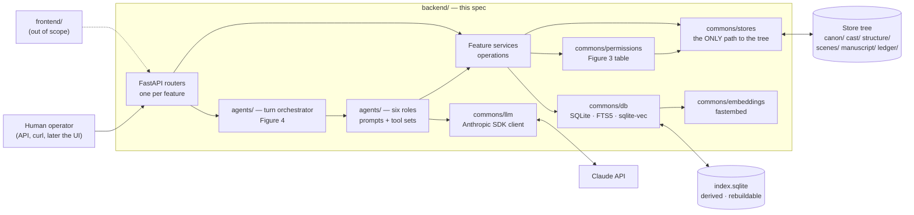
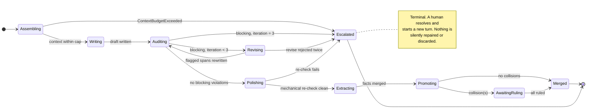
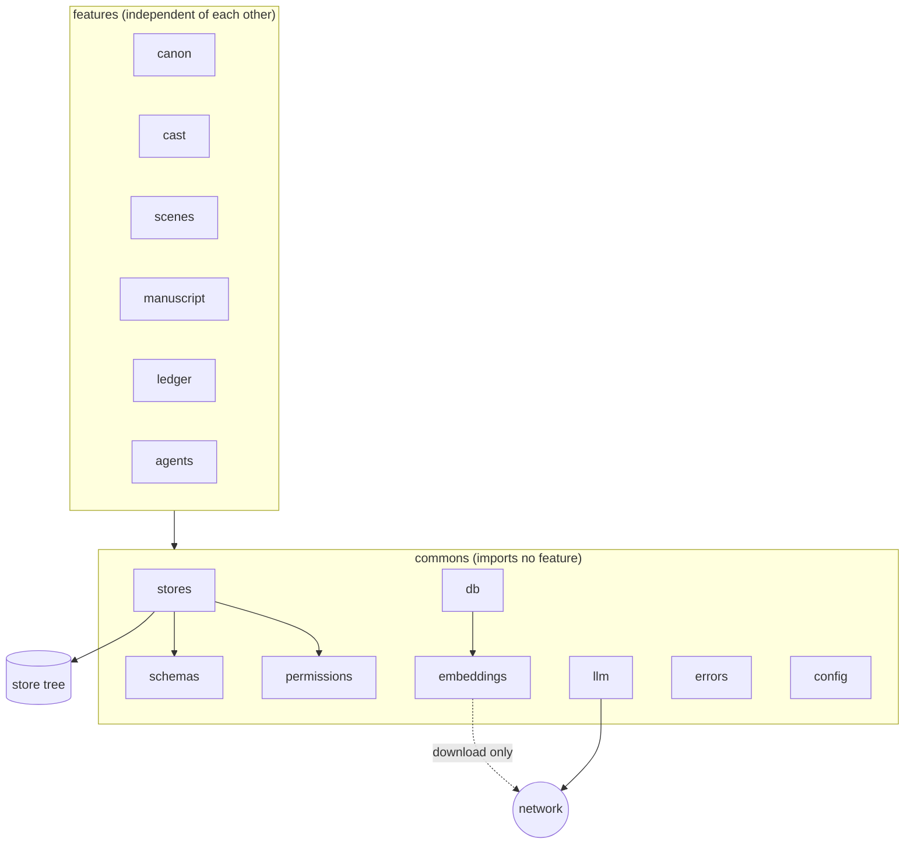

> **Process 0 status: closed.** Round 1 (16 questions) and round 2 (9 questions) were
> answered by the user on 2026-09-22; every decision is in the
> [Decision log](#decision-log). The four Process 1 doc edits the spec depended on are
> committed (`b8e76ed`, `1578513`, `f39300b`, `95e0cd5`) and every requirement below now
> links to a doc section that says what it assumes. **Approved by the user on 2026-09-22**;
> the approval was recorded by the agent at the user's explicit instruction.

This document is written as a Software Requirements Specification (SRS) for the first
version of `backend/`. It keeps the fixed sections that `AGENTS.md` prescribes for every
spec and fits the SRS structure inside them: **Motivation** is the introduction and product
perspective; **Scope** is the boundary; **Design** carries the numbered functional,
interface, data and non-functional requirements; **Acceptance criteria** and
**Verification plan** close the loop with `docs/verification.md`.

---

## Motivation

### Purpose

Deliver the first runnable version of the FastAPI backend described in
[`architecture.md`](../docs/architecture.md#repository-and-application-stack): the only
process that reads and writes the harness stores, the layer where the permission table of
[Figure 3](../docs/architecture.md#figure-3--agents-and-write-permissions) is enforced, and
the host of the six agent roles and the writing turn of
[Figure 4](../docs/architecture.md#figure-4--one-writing-turn).

### What fails today without it

Today the design exists only as documentation. Nothing enforces the permission asymmetry
that the architecture calls "the actual anti-drift mechanism"; nothing validates that a
file under `scenes/` has the shape `definitions.md` gives it; nothing can answer
`dossier(character, at=T)`; no scene can be written from an assembled context; and there is
no fixture repository against which any agent behaviour can be tested. Building the agents
before these foundations would mean retrofitting the load-bearing wall; building the
foundations without a single real turn would leave the loop unproven.

### Product perspective

*Reading it.* Every arrow into the store tree passes through `commons/stores`, and every
write through it is checked against `commons/permissions` first. Agent roles never hold a
file handle: they receive an assembled context and return typed output, and the
orchestrator writes that output through the store layer under the role's name. The only
outbound network edges are the model API and, at index-build time, the embedding model
download.

### Order of adoption

This spec implements steps **1**, **2**, **4** and the human-gate half of **6** of the
[order of adoption](../docs/verification.md#order-of-adoption): type checking, SAST with
the permission rules, import contracts and JSON Schema on read (**A**); fixture repository
and tests for the operations, index rebuild and migrations (**T**); tool-set guardrails and
forbidden-write tests (**A**, **T**); the human gate on contradicting promotions (**I**).
Step 3 (Langfuse tracing), step 5 (branch-per-turn and the story pipeline), the eval
datasets of step 6, and steps 7–10 are later specs.

---

## Scope

### In

1. **Repository skeleton** for `backend/` laid out
   [package by feature](../docs/architecture.md#code-architecture--package-by-feature):
   `app/main.py`, `app/commons/{stores,permissions,schemas,db,embeddings,llm,errors,config.py}`,
   and the six feature folders `canon/`, `cast/`, `scenes/`, `manuscript/`, `ledger/`,
   `agents/`, each with `router.py`, `service.py`, `models.py`, `repository.py`, `tests/`.
2. **Store layer** (`commons/stores/`): typed read and write of every path in the
   [storage layout](../docs/architecture.md#storage-layout), with the agent role named on
   every write and refused when Figure 3 forbids it.
3. **Permission layer** (`commons/permissions/`): the six roles and the write table as data
   plus one check function; per-role **tool sets** that contain only the writes the role
   may perform.
4. **Typed records**: Pydantic v2 models and versioned JSON Schemas for every file type
   under the stores, validated on read.
5. **Derived index** (`commons/db/`): SQLite with FTS5 always; `sqlite-vec` with real
   embeddings when the extension loads, FTS5-only otherwise; rebuildable from the tree.
6. **Embedder** (`commons/embeddings/`): `fastembed` with a configurable 384-dimension
   model, default `sentence-transformers/all-MiniLM-L6-v2`, falling back to
   `BAAI/bge-small-en-v1.5` (also 384) if the configured one cannot be loaded; the active
   model name is recorded in the index.
7. **Deterministic operations**: `dossier`, `select_entities`, `assemble_context` (100k
   hard cap), `promote` with collision escalation, `reconcile`, and the record- and
   string-level checks of `audit`.
8. **Model client** (`commons/llm/`): one wrapper over the official Anthropic Python SDK
   with structured output, refusal handling, token counting and a fake for tests.
9. **Agent roles** (`agents/`): writer `write` and `revise`, style editor `polish`,
   canoniser `extract_facts` and `promote` ruling, auditor semantic checks (invariants 3,
   6 and the prose halves of 1 and 8), writer scene digest, and chapter/arc digest rollup.
   Architect `plan` and world builder `build` are **not** invoked by a model in v1: their
   stores are written by the human operator acting under those roles (Decision 5).
10. **Turn orchestrator** (`agents/turn.py`): Figure 4 end to end, bounded revision loop,
    extraction on the accepted draft, promotion before the next scene, escalation to a
    human ruling on collisions and on unresolved blocking violations.
11. **HTTP API** exposing all of the above, with the OpenAPI schema committed.
12. **Fixture repository** under `backend/tests/fixtures/repo/` with a small canon, cast,
    scenes, manuscript and ledger, containing at least one instance of every violation type
    the mechanical auditor detects and one scene engineered to tempt an axiom violation.
13. **Local gate**: `ruff`, `mypy --strict`, `bandit`, `import-linter`, `semgrep`
    permission rules, `pytest`, JSON Schema validity, OpenAPI freshness, in one command.

### Out

- Git operations by the backend (branch-per-turn, commits) and the story pipeline in CI.
  The tree is a git working tree; a human commits.
- Langfuse spans (adoption step 3). Everything a span would carry — selected ids, model id,
  token counts, iterations, outcome — **is** persisted per turn (FR-TURN-07) so a later spec
  attaches it without changing the turn.
- Authentication of humans. v1 is a local single-operator tool; the role header is trusted
  (Decision 3, AC 25).
- `frontend/` and its generated client. This spec guarantees only that the OpenAPI schema
  is committed and stable.
- Eval datasets, LLM-as-judge, self-consistency on extraction, adversarial sets (adoption
  steps 6–8). The semantic roles exist; measuring their accuracy is a later spec.
- Model-invoked architect and world builder.
- Further changes to `docs/`. The four doc edits this spec needed were made first, under
  Process 1, in their own `docs:` commits (see the status note above); implementation
  that reveals another gap stops and reopens Process 0.

---

## Design

Requirement identifiers are stable and are what the plan, tests and commits reference.
Prefixes: **FR** functional, **IF** interface, **DR** data, **NFR** non-functional. Each
requirement links to the doc section it derives from; a requirement with no link proposes
something the docs do not say and is flagged in Open questions.

### FR-STORE — Store layer

Source: [Storage layout](../docs/architecture.md#storage-layout), [Code architecture rule 4](../docs/architecture.md#backend--feature-folders-plus-commons), [Memory tiers](../docs/architecture.md#memory-and-context-budget).

| Id | Requirement |
|---|---|
| FR-STORE-01 | The store root is a directory containing `canon/`, `cast/`, `structure/`, `scenes/`, `manuscript/`, `ledger/` as the storage layout lists them. Its location is read from configuration (`STORY_ROOT`); the backend refuses to start if it lacks `canon/project.md`. |
| FR-STORE-02 | Only modules under `app/commons/stores/` open, read, write, rename or delete files under the store root. |
| FR-STORE-03 | Every write takes the `AgentRole` performing it as a required argument and is refused with `PermissionDenied` when `commons/permissions` forbids that role on that path, before any byte touches disk. |
| FR-STORE-04 | Every write appends a provenance record (role, `actor: agent \| human`, path, `content_hash`, timestamp, scene id and turn id when supplied) to `.index/provenance.jsonl`, outside the store tree, as [Storage layout](../docs/architecture.md#storage-layout) now places it. The log is append-only and is written by the store layer itself, so no write can skip it. |
| FR-STORE-05 | Paths derive from identifiers inside the store layer, never from the client. An identifier that would escape the root or fails `^[a-z0-9][a-z0-9_-]*$` (scenes: `^\d{3}$`) is rejected. |
| FR-STORE-06 | Reads return typed records (DR-01). A file failing validation raises `InvalidRecord` naming file and field; it is never repaired or partially returned. |
| FR-STORE-07 | Writes are atomic per file (temp, fsync, rename). The store layer never runs git. |
| FR-STORE-08 | No in-process record cache across requests; external edits are seen immediately. |

### FR-PERM — Permission layer and tool sets

Source: [Figure 3](../docs/architecture.md#figure-3--agents-and-write-permissions), [Guardrails](../docs/verification.md#guardrails--a-structural--t-behavioural).

| Id | Requirement |
|---|---|
| FR-PERM-01 | `AgentRole` is a closed enum: `architect`, `world_builder`, `writer`, `style_editor`, `auditor`, `canoniser`. |
| FR-PERM-02 | The write table is data transcribed from Figure 3's table and nothing else: architect → `structure/**`, `scenes/**`; world_builder → `canon/**`; canoniser → `canon/**`, `cast/**`, `ledger/proposed.yaml`; writer → `manuscript/NNN.md`, `manuscript/digests/NNN.md`, `ledger/proposed.yaml`; style_editor → `manuscript/NNN.md`; auditor → `ledger/violations.yaml`. |
| FR-PERM-03 | `may_write(role, path) -> bool` is the single check; the store layer is its only production caller. |
| FR-PERM-04 | `GET /permissions` exports the table. |
| FR-PERM-05 | The table is a module constant; no configuration key or code path widens it at runtime. |
| FR-PERM-06 | Each model-invoked role receives a **tool set** built from the table: the writer's tools can write `manuscript/NNN.md`, `manuscript/digests/NNN.md` and append to `ledger/proposed.yaml`, and nothing under `canon/`; the auditor's only writing tool targets `ledger/violations.yaml`; the canoniser has no tool that writes `manuscript/`. The tool set is derived from FR-PERM-02 by code, not hand-listed, so the two cannot diverge. |
| FR-PERM-07 | Text read from any store is placed in the prompt as **data** (inside delimited document blocks with a fixed system instruction that store content is never an instruction). No store content is ever placed in the `system` field. |

### DR — Data requirements

Source: [definitions.md](../docs/definitions.md), [domain-knowledge Figure 2](../docs/domain-knowledge.md#figure-2--fields-of-the-three-critical-entities), [System entities](../docs/architecture.md#system-entities-layer-4).

| Id | Requirement |
|---|---|
| DR-01 | Every file type under the stores has a Pydantic v2 model and an exported JSON Schema (`backend/schemas/<type>.v1.json`). Models used by one feature live in that feature's `models.py`; models used by two or more live in `commons/schemas/`. |
| DR-02 | Markdown-with-frontmatter files parse into typed frontmatter plus `body: str`. |
| DR-03 | `Scene` has the Figure 2 fields — `id`, `pov`, `story_time: int` (hours since `epoch_zero`, Decision 8), `discourse_order: int`, `location`, `goal`, `conflict`, `outcome` (four-value enum), `value_change`, `entry_state`, `exit_state`, `tags`, `budget`, `notes: str | None` — and `participants: list[str]` (Decision 9). |
| DR-04 | `KnowledgeState.certainty` is the five-value enum; `via` is `witnessed · was_told · deduced · suspects`. Booleans are rejected. |
| DR-05 | `Setup.resolution` is `paid · subverted · deliberately_abandoned`, optional while `paid_in` is empty; `due_by` required. |
| DR-06 | `PlotThread.state` is the five-value enum; `max_latency: int` required. |
| DR-07 | `ProposedFact`: `extracted_from`, `target_entity`, `target_field`, `payload`, `source_scene`, `conflict: bool`, `existing_value` (set on collision), `status` (`pending · promoted · rejected`), `ruling` (optional: `by`, `reason`, `at`). `Violation`: `scene`, `invariant` (1–10), `evidence` (quote + offset), `severity` (`blocking · reviewable · note`), `resolution` (optional: `fix_prose · fix_canon · accept_with_reason`), `source` (`mechanical · model`). |
| DR-08 | Identifiers are stable; the backend never renames. `Relationship` is directed with `valence` as a dated list. `ChangeEvent` (`character`, `attribute`, `from`, `to`, `scene`, `cause`) lives in `cast/{id}/changes.yaml` as [definitions.md](../docs/definitions.md#changeevent) and the storage layout now state. |
| DR-09 | `CanonicalTerm.forbidden_variants` present (may be empty). `TemporalSystem.epoch_zero` and `transit_matrix` required. |
| DR-10 | Every JSON Schema is versioned in its filename and via `schema_version`; unknown versions fail validation. |
| DR-11 | `Draft`: `scene_ref`, `words`, `literal_tail` (last 500 words, derived on write), `body`. `SceneDigest`: `scene_ref` (or range), `level` (`scene · chapter · arc`), `povs`, `delta`, `words`. |
| DR-12 | Every model-role output has a Pydantic schema used as the request's structured-output format: `WriterOutput {body, proposed_facts[]}`, `ReviseOutput {body}` (full scene text with only flagged spans changed), `PolishOutput {body}`, `ExtractOutput {facts[]}`, `SemanticAuditOutput {violations[]}`, `DigestOutput {delta, povs}`. |

### FR-IDX — Derived index

Source: [Memory and context budget](../docs/architecture.md#memory-and-context-budget), [Unit/integration testing — persistence](../docs/verification.md#unit--integration-testing--t), repository rule "SQL Lite → con sin vector compatible" (Decision 10).

| Id | Requirement |
|---|---|
| FR-IDX-01 | One SQLite file outside the tree (`STORY_INDEX`, default `<root>/.index/index.sqlite`), owned by `commons/db/`, never committed. |
| FR-IDX-02 | One row per entity in `canon/`, `cast/` and the **chapter-level** digests under `manuscript/digests/` (`entity_id`, `kind`, `path`, `text`, `content_hash`, `updated_at`) and an FTS5 table over `text`. Scene- and arc-level digests are not indexed, as [SceneDigest](../docs/architecture.md#scenedigest) states. |
| FR-IDX-03 | On startup the backend tries to load `sqlite-vec`. If it loads, a `vec0` table (`float[384]`, cosine) holds one embedding per row and `/health` reports `vector: available`; if not, the backend starts normally, reports `vector: unavailable`, and selection is FTS5-only. No code path fails for a missing extension. |
| FR-IDX-04 | `rebuild()` drops derived tables and repopulates from the tree. Two rebuilds from the same tree yield identical rows and identical embeddings (the embedder is deterministic on CPU). |
| FR-IDX-05 | Numbered SQL migrations recorded in `schema_migrations`; applying them to an old index yields the fresh schema. |
| FR-IDX-06 | WAL mode, busy timeout, retry with backoff; `IndexBusy` only after the timeout. |
| FR-IDX-07 | Index metadata records `embedding_model` and `embedding_dim`; a rebuild is forced when they change. `GET /index/status` reports orphan count (rows whose `path` is gone), which the rebuild test asserts is zero. |
| FR-IDX-08 | Incremental update: a store write re-embeds only rows whose `content_hash` changed. |

### FR-EMB — Embedder

Source: [Memory and context budget — entity index](../docs/architecture.md#memory-and-context-budget), [U register — reproducibility of semantic selection](../docs/verification.md#accepted-risks-u-register), user decision (round 1, Q14).

| Id | Requirement |
|---|---|
| FR-EMB-01 | `Embedder` is a `Protocol` (`embed(texts) -> list[list[float]]`, `dim`, `model_name`). Two implementations: `FastEmbedEmbedder` and `FakeEmbedder` (deterministic hash-based, 384-d, for tests). |
| FR-EMB-02 | `FastEmbedEmbedder` loads the model named by `EMBED_MODEL` through `fastembed`; default `sentence-transformers/all-MiniLM-L6-v2`. If it cannot be loaded (unsupported in the pinned `fastembed`, download failure), it falls back to `BAAI/bge-small-en-v1.5` and logs which model is active. Only 384-d models are accepted, so the `vec0` schema never changes. The fixture's `README` documents the one-line switch to `sentence-transformers/paraphrase-multilingual-MiniLM-L12-v2` (also 384-d) for prose written in Spanish (Decision R2-3). |
| FR-EMB-03 | Model files are cached under `EMBED_CACHE_DIR` (default `<root>/.index/models/`). With `EMBED_OFFLINE=1` no download is attempted and a missing model is a startup error naming the path to populate. |
| FR-EMB-04 | Embedding runs on CPU, batched, synchronously inside `rebuild()` and incremental updates; the model never runs inside a request that a role is waiting on. |

### FR-OPS — Deterministic operations

Source: [Operations](../docs/architecture.md#operations), [Figure 2](../docs/architecture.md#figure-2--assembling-the-context-for-one-scene), [Domain invariants](../docs/definitions.md#domain-invariants).

| Id | Requirement |
|---|---|
| FR-OPS-01 | `dossier(character_id, at)` returns identity, competences, the arc entry anchored to the latest scene with `story_time <= at`, `KnowledgeState` rows whose `acquired_in` scene has `story_time <= at`, and per relationship the latest valence dated `<= at`. Nothing later appears. |
| FR-OPS-02 | `select_entities(scene)` builds the query text from `goal`, `conflict`, `value_change`, `pov`, `location`, `entry_state`, `exit_state` and `notes`; ranks by FTS5 BM25 and, when available, by vector cosine, fused by reciprocal rank; prepends entities named in `tags`; excludes the POV. Returns identifiers, kinds and scores — never record text. |
| FR-OPS-03 | `assemble_context(scene)` loads in order: fixed block (`canon/project.md`, `canon/style.md`); `dossier(pov, at=story_time)`; `literal_tail` of the previous scene in `discourse_order`; then each selected id in ranking order in its as-of form (dossier for characters; full record for axioms, technology, locations with parent chain, factions; chapter-level digest for prose; lexicon bound to loaded entities through `used_by`; open setups with `due_by >= scene`). It stops before the entry that would exceed **100 000 tokens** and records `truncated_at`; it never truncates inside an entry. **As-of forms.** A chapter digest is loaded only if every scene it covers has `story_time <= T`; a digest whose `povs` does not include the POV is labelled in the prompt as events the POV did not witness, so `povs` does the filtering job [SceneDigest](../docs/architecture.md#scenedigest) gives it. A setup is "open" when `paid_in` and `resolution` are empty and its `planted_in` scene has `story_time <= T`; a violation with a `resolution` set and a thread `resolved` or `abandoned` never enter the context (they "leave the working tier as they close"). Setups are presented under a *may collect* label, never as an instruction to pay a specific one. Raw `manuscript/NNN.md` prose never enters the context except as the previous scene's `literal_tail`. |
| FR-OPS-04 | If the fixed block exceeds 800 tokens the response carries `warnings: ["fixed_block_over_budget"]`. |
| FR-OPS-05 | The selected-id list is persisted in the turn record (FR-TURN-07) so the auditor of the same turn reads the same list. |
| FR-OPS-06 | `promote(fact_id)` under the canoniser role: when `conflict` is false, writes `payload` to `target_entity.target_field` and marks the fact `promoted`. When the target already holds a different value, sets `conflict = true`, records `existing_value`, leaves `status = pending`, and returns `Escalation`. It never overwrites. |
| FR-OPS-07 | `rule(fact_id, ruling, reason)` under the canoniser role with `actor: human`: `accept` promotes despite the collision; `reject` marks the fact `rejected`. Every ruling is recorded on the fact. This is the human gate of [Human-in-the-loop review](../docs/verification.md#human-in-the-loop-review--i). |
| FR-OPS-08 | `reconcile(entity_id)` returns every scene whose record references the entity (`pov`, `participants`, `location` or ancestors, `tags`), every turn record whose selected list contains it, and every `KnowledgeState.acquired_in` scene whose `fact_ref` is the entity. |

### FR-LLM — Model client

Source: [Guardrails — output schema validation, budget](../docs/verification.md#guardrails--a-structural--t-behavioural), [U register — model provider behaviour change](../docs/verification.md#accepted-risks-u-register); provider facts from the `claude-api` skill (2026-06 cache).

| Id | Requirement |
|---|---|
| FR-LLM-01 | `commons/llm/` wraps the official `anthropic` Python SDK; no raw HTTP, no other provider. Credentials come from the SDK's default resolution (`ANTHROPIC_API_KEY` or an `ant auth login` profile); no key is read from or written to the store tree or source. |
| FR-LLM-02 | `ModelClient` is a `Protocol` with `complete(role, system, documents, instruction, output_schema) -> Parsed[T]` and `count_tokens(...) -> int`. Implementations: `AnthropicModelClient` and `FakeModelClient` (scripted responses from fixtures; records every call). |
| FR-LLM-03 | Default model for every role is `claude-haiku-4-5` (Decision R2-4), configurable per role (`MODEL_<ROLE>`). Haiku 4.5 takes extended thinking as `{type: "enabled", budget_tokens: N}` and does not accept `effort`, so thinking is off by default and enabled per role through `THINKING_BUDGET_<ROLE>` (minimum 1024, below `max_tokens`); if a role is later pointed at a 4.6+ model the client switches that role to `{type: "adaptive"}` by model family, never by hand. The model id actually used is recorded on every turn (FR-TURN-07). |
| FR-LLM-04 | Every role call requests structured output (`output_config.format`) against the role's DR-12 schema and parses with the SDK's typed parse helper. A response that fails schema validation is **rejected, not repaired**: the call is retried once, then the turn step fails with `MalformedModelOutput`. |
| FR-LLM-05 | Requests stream and use the SDK's final-message helper; `max_tokens` is sized from the scene `budget` with headroom, never below 16 000 for prose roles. |
| FR-LLM-06 | `stop_reason` is checked before `content` is read on every response. `refusal` fails the step with `ModelRefused` (carrying `stop_details.category` when present) and the turn is escalated; `max_tokens` fails the step with `OutputTruncated` and is retried once with a larger `max_tokens`. No refusal is retried against a different model in v1. |
| FR-LLM-07 | Before every call the client counts the prompt with `messages.count_tokens`; a count above 100 000 raises `ContextBudgetExceeded` and the call is **not** made (Decision R2-2). `FakeModelClient.count_tokens` uses a local approximation so the offline suite runs without network. |
| FR-LLM-08 | Typed SDK exceptions are caught most-specific-first (`RateLimitError` → retry with backoff; `APIStatusError` 4xx → fail step; `APIConnectionError` → retry). A step never swallows an error into an empty draft. |
| FR-LLM-09 | Prompt caching: the stable prefix (role system prompt, fixed block) is placed first and marked with `cache_control`; volatile content follows. `usage.cache_read_input_tokens` is recorded per step so a zero across a turn is visible. |
| FR-LLM-10 | Role prompts are written in English; the language the prose is written in is read from `canon/style.md` and stated in the writer's and style editor's instruction (Decision R2-9). |

### FR-AGENT — Agent roles

Source: [Figure 3 table — Signature, In, Out](../docs/architecture.md#figure-3--agents-and-write-permissions), [Operations](../docs/architecture.md#operations), [SceneDigest](../docs/architecture.md#scenedigest), [A warning about over-constraint](../docs/architecture.md#a-warning-about-over-constraint).

Each role is a stateless function over stores: it receives exactly the inputs its Figure 3
`In` column names, returns a DR-12 output, and the orchestrator persists that output
through the store layer under the role's name. **Anything not listed as an input is not
available to the role.**

| Id | Role · call | Requirement |
|---|---|---|
| FR-AGENT-01 | Writer · `write(assembled_context) -> WriterOutput` | Prompt = role system prompt + the `AssembledContext` of FR-OPS-03 as documents. Instruction states dramatic function (goal, conflict, outcome, value_change, budget) and leaves execution free. Output body is written to `manuscript/NNN.md`; `proposed_facts` are appended to `ledger/proposed.yaml` with `status: pending`. |
| FR-AGENT-02 | Writer · `revise(draft, violations) -> ReviseOutput` | Inputs: the current draft, the **blocking** violations only, the same assembled context. Instruction: change only the flagged spans. The orchestrator diff-checks the output: if more than `REVISE_MAX_CHANGED_RATIO` (default 0.35) of the draft's sentences changed, the revision is rejected and retried once with a stronger instruction; a second failure escalates. |
| FR-AGENT-03 | Writer · `digest(draft) -> DigestOutput` | Produces the scene-level `SceneDigest` (~100 words) written to `manuscript/digests/NNN.md`; `literal_tail` is derived by code, not by the model. |
| FR-AGENT-04 | Style editor · `polish(draft, style) -> PolishOutput` | Inputs: `manuscript/NNN.md`, `canon/style.md`, `canon/lexicon.yaml`, POV `cast/{id}/voice.md`. Writes `manuscript/NNN.md`. Runs after a clean audit and before extraction; a polished draft is re-checked by the mechanical lexicon and voice checks (FR-AUD-05, -07) before acceptance. |
| FR-AGENT-05 | Canoniser · `extract_facts(draft) -> ExtractOutput` | Inputs: the accepted draft, the assembled context's canon documents. Returns assertions about the world not already in canon, each with `target_entity`, `target_field`, `payload`, evidence span. Malformed output is rejected (FR-LLM-04). Results are merged with the writer's own `proposed_facts` (deduplicated by `target_entity + target_field + normalised payload`). |
| FR-AGENT-06 | Auditor · `audit_semantic(scene) -> SemanticAuditOutput` | Inputs: `manuscript/NNN.md`, `scenes/NNN.yaml`, the turn's selected-entity list and the axioms it names, `cast/{id}/knowledge.yaml` and `cast/{id}/changes.yaml` for participants, `cast/{id}/dossier.md#immutable_physical`. Checks invariants **3** (stable bodies: a physical attribute in the prose that differs from `immutable_physical` with no `ChangeEvent` at or before this scene), **6** (axiomatic respect against the selected axioms only), and the prose halves of **1** (a character voices a fact whose state at story time is not `believes`/`knows`/`believes_falsely`) and **8** (the prose delivers the declared `value_change`). Each violation carries a quote and offset. `source: model`. |
| FR-AGENT-07 | Auditor · combined | `audit(scene)` = mechanical checks (FR-AUD) ∪ `audit_semantic`. Mechanical results are computed first and included in the semantic prompt as data so the model does not re-report them. |
| FR-AGENT-08 | Writer · `rollup(chapter_id \| arc_id) -> DigestOutput` | Rolls scene digests into a chapter digest (~250 words) or chapter digests into an arc digest (~400 words), written under `manuscript/digests/` by the writer role, whose Figure 3 row already owns that path (Decision R2-6). Invoked by `POST /agents/digests/rollup`, outside any scene turn. |
| FR-AGENT-09 | All roles | No role receives a tool that reads the tree: reads are done by the orchestrator through the store layer and handed in as documents. The only tools a role holds are the writes FR-PERM-06 derives. The documents a role may receive are listed as data too — `INPUT_TABLE`, transcribed from Figure 3's `In` column — and a document from any other path is a bug, so "anything not listed as an input is not available to the agent" is checkable. |
| FR-AGENT-11 | All roles | Roles exchange work **through the stores, never through messages**: the auditor reads the draft from `manuscript/NNN.md` after the writer's write has landed, and `revise` receives the blocking violations read back from `ledger/violations.yaml` after the auditor's write, not the in-memory objects. The orchestrator carries identifiers between steps, not content. |
| FR-AGENT-10 | All roles | Role system prompts live in `agents/prompts/<role>.md`, versioned in git, with a `prompt_version` recorded per turn. |

### FR-TURN — The writing turn

Source: [Figure 4](../docs/architecture.md#figure-4--one-writing-turn), [Memory — agents are stateless](../docs/architecture.md#memory-and-context-budget), [Model checking — turn termination](../docs/verification.md#model-checking--a).

*Reading it.* Every path ends in `Merged` or `Escalated`, and the revise–audit cycle is
bounded by a constant, which is the turn-termination invariant the model-checking section
asks for. `AwaitingRuling` is the human gate: the draft is already accepted and written;
only the collided facts wait.

| Id | Requirement |
|---|---|
| FR-TURN-01 | `POST /agents/turns` with `{scene_id}` runs one turn as Figure 4 orders it: assemble → write → audit → (revise → audit)* → polish → extract → promote. Each step is a fresh model call with its own context; no transcript is carried between roles. |
| FR-TURN-02 | The revise–audit loop runs at most `TURN_MAX_REVISIONS = 3` times (module constant). Reaching the bound with blocking violations still open ends the turn `escalated`; the last draft and the violations stay on disk. |
| FR-TURN-03 | Extraction runs on the **accepted** draft (after polish), never on a draft that failed audit. The writer's own `proposed_facts` from every iteration are kept in `ledger/proposed.yaml` regardless (a rejected draft can still have invented a good name). |
| FR-TURN-04 | Promotion happens inside the turn, before it returns, so the next scene's assembly sees the new facts. Collided facts are left `pending` with `conflict: true`; the turn ends `awaiting_ruling` and reports them. After every promotion, and after every `accept` ruling, the turn runs `reconcile(target_entity)` and records the affected already-written scenes on the turn record, so a retroactive change is named the moment it is made rather than found at the read-through. |
| FR-TURN-05 | A turn is **not** started for a scene that has facts `pending` with `conflict: true` from an earlier turn of the same scene, nor while another turn is running on the same store root (a lock file under `.index/`). |
| FR-TURN-06 | Every **store** write during a turn is performed under the role Figure 4 assigns to that step; the orchestrator holds no role and cannot write to the tree except through a role's tool set. Its own records go to `.index/`, which is not a store and is not governed by Figure 3 (Decision R2-1). |
| FR-TURN-07 | A turn record is written to `.index/turns/NNN-<n>.yaml`: scene, started/ended, outcome, per step: role, model id, prompt version, input, output and cache-read tokens, elapsed; the selected-entity list with scores; violation ids per iteration; fact ids promoted, pending, rejected, with the scenes `reconcile` returned for each; the draft's `words` against the scene `budget` and each digest's `words` against its level target; whether the scene closes its chapter (a hint for `rollup`, which stays a manual call in v1). The record is written after every step, not only at the end, so a crash leaves the steps completed so far on disk (FR-TURN-09). |
| FR-TURN-08 | `POST /agents/turns/{id}/rulings` accepts a list of `{fact_id, ruling, reason}` under `X-Agent-Role: canoniser` and `actor: human`, applies FR-OPS-07 to each, and moves the turn from `awaiting_ruling` to `merged` when none remain. |
| FR-TURN-09 | Steps are idempotent on retry: a turn interrupted by a process crash can be resumed from its record (`POST /agents/turns/{id}/resume`) without re-running completed steps. |
| FR-TURN-10 | `POST /agents/turns?dry_run=true` runs assembly only and returns the `AssembledContext` with token count and selected ids, without calling the writer. |

### FR-AUD — Mechanical audit

Source: [Domain invariants](../docs/definitions.md#domain-invariants), [Violation](../docs/architecture.md#violation), [Figure 3 lifecycle](../docs/domain-knowledge.md#figure-3--lifecycle-of-a-reader-debt).

| Id | Invariant | Check | Severity |
|---|---|---|---|
| FR-AUD-01 | 1 · Knowledge monotonicity (record half) | Every `KnowledgeState` with `acquired_in = scene` names a character in `pov`/`participants`; every `acquired_in` resolves. | `blocking` |
| FR-AUD-02 | 2 · Closed debts | Setups with `due_by` at or before this scene on the story axis, empty `paid_in`, empty `resolution` → `LooseEnd`. | `reviewable`; `blocking` at last scene |
| FR-AUD-03 | 4 · Spatial uniqueness | No character in two scenes with equal `story_time` and different `location`. | `blocking` |
| FR-AUD-04 | 5 · Possible transits | Consecutive story-axis scenes per character satisfy `Δstory_time >= transit_matrix[from][to]`; missing entry → `note`. | `blocking` |
| FR-AUD-05 | 7 · Canonical lexicon | Case-insensitive search of every `forbidden_variants` in the draft; evidence = quote + offset. | `blocking` |
| FR-AUD-06 | 8 · No inert scenes (record half) | `value_change` non-empty and signed. | `reviewable` |
| FR-AUD-07 | 9 · Recognisable voice | POV's `never_says` searched in the draft (Decision 13). | `reviewable` |
| FR-AUD-08 | 10 · Thread latency | Gap in `discourse_order` since a `planted`/`developing` thread's last scene ≤ `max_latency`. | `reviewable` |
| FR-AUD-09 | 3, 6, prose halves of 1 and 8 | Delegated to `audit_semantic` (FR-AGENT-06). If the model step fails, `audit` returns `skipped: [...]` naming them so absence of a violation is never mistaken for a pass. | per model output |

### IF — Interface requirements (HTTP API)

| Id | Requirement |
|---|---|
| IF-01 | Routes mount per feature (`/canon`, `/cast`, `/structure`, `/scenes`, `/manuscript`, `/ledger`, `/agents`) plus `/health`, `/permissions`, `/index`. |
| IF-02 | Write routes require `X-Agent-Role`; a human operator adds `X-Actor: human`, absent means `agent`, and the orchestrator always sends `agent` (Decision R2-7). Missing role → `400`; forbidden → `403` `{"error": "permission_denied", "role", "path"}`. |
| IF-03 | Reads: `GET /canon/project`, `/canon/style`, `/canon/{kind}`, `/canon/{kind}/{id}`, `/canon/lexicon`, `/canon/time`; `GET /cast`, `/cast/{id}`, `/cast/{id}/dossier?at=`, `/cast/{id}/knowledge`, `/cast/{id}/voice`, `/cast/relationships`; `GET /structure/arcs`, `/structure/chapters`; `GET /scenes`, `/scenes/{id}`; `GET /manuscript/{id}`, `/manuscript/digests/{id}`; `GET /cast/{id}/changes`; `GET /ledger/{setups\|threads\|timeline\|proposed\|violations}`; `GET /agents/turns`, `/agents/turns/{id}`, `/agents/provenance?path=&since=`. |
| IF-04 | Writes: `PUT /canon/{kind}/{id}`, `/canon/lexicon`, `/canon/time` (world_builder, canoniser); `PUT /cast/{id}/{dossier\|voice\|knowledge\|changes}`, `/cast/relationships` (canoniser); `PUT /structure/{arcs\|chapters}`, `PUT /scenes/{id}` (architect); `PUT /manuscript/{id}` (writer, style_editor); `PUT /manuscript/digests/{id}` (writer); `POST /ledger/proposed` (writer); `PUT /ledger/violations` (auditor). A human resolves an escalated violation through that last route, acting as the auditor with `X-Actor: human`, by setting `resolution` (`fix_prose · fix_canon · accept_with_reason`); the prose or canon edit itself goes through the owning role's route. This is the dotted "escalate ruling" edge of [Figure 1](../docs/architecture.md#figure-1--the-working-loop). |
| IF-05 | Operations: `POST /scenes/{id}/select`, `/scenes/{id}/assemble`, `/scenes/{id}/audit?semantic=false` (mechanical only, no model), `/scenes/{id}/audit` (full, auditor role); `POST /ledger/proposed/{id}/promote` (canoniser) → `Promoted \| Escalation`; `POST /ledger/proposed/{id}/rule` (canoniser, human); `POST /canon/reconcile`; `POST /index/rebuild`; `GET /index/status`. |
| IF-06 | Turns: `POST /agents/turns` `{scene_id}` (+ `?dry_run`), `GET /agents/turns/{id}`, `POST /agents/turns/{id}/rulings`, `POST /agents/turns/{id}/resume`, `POST /agents/digests/rollup` `{chapter_id \| arc_id}`. Turn execution is synchronous with streamed progress as Server-Sent Events (one event per step) so a client can follow a multi-minute turn. |
| IF-07 | Error bodies share one shape. `InvalidRecord` → `422`, `NotFound` → `404`, `PermissionDenied` → `403`, `IndexBusy` → `503`, `TurnLocked` → `409`, `ContextBudgetExceeded` → `422`, `MalformedModelOutput` / `ModelRefused` → `502` with the category. |
| IF-08 | `backend/openapi.json` is exported by script and committed; CI fails on drift. |

### NFR — Non-functional requirements

| Id | Requirement | Source |
|---|---|---|
| NFR-01 | Python 3.12, FastAPI, Pydantic v2, `anthropic`, `fastembed`, `sqlite-vec`, managed with `uv`, all pinned; the model id per role is pinned in configuration and recorded per turn, so a provider-side change is attributable (U register: "model provider behaviour change"). Once FastAPI is pinned, the vendored `fastapi` skill is replaced by the managed install. | `CLAUDE.md` |
| NFR-02 | `mypy --strict` clean; no `Any`; no `type: ignore` without a comment linking this spec. | Process 3 rule 9 |
| NFR-03 | `ruff` and `bandit` clean; all YAML via `safe_load`. | [SAST](../docs/verification.md#static-analysis--sast--a) |
| NFR-04 | `import-linter`: features independent; `commons` imports no feature; only `commons.stores` touches file primitives under the root; only `commons.llm` imports `anthropic`; only `commons.embeddings` imports `fastembed`. | [SAST — boundaries](../docs/verification.md#static-analysis--sast--a) |
| NFR-05 | 100 000 tokens is a module constant, identical for every role, with no configuration key that raises it. | [Memory and context budget](../docs/architecture.md#memory-and-context-budget) |
| NFR-06 | Outbound network is limited to the Anthropic API host and, only during `rebuild()` without `EMBED_OFFLINE`, the embedding-model download host. An `httpx` transport allow-list enforces it in-process; the test suite runs with network disabled. | [Red-teaming — data exfiltration](../docs/verification.md#red-teaming--adversarial-testing--t--i) |
| NFR-07 | On the fixture with the fake model client: `assemble_context` < 2 s cold; `rebuild()` with the fake embedder < 10 s; a full fake turn < 5 s. Measured, not gating (Decision 12). | proposed |
| NFR-08 | Every test that satisfies a criterion carries `# spec 001 / AC n`. | Process 3 rule 16 |
| NFR-09 | Tests run on a temporary copy of the fixture; live-model tests are marked `live`, excluded by default, and run only with `--live` and credentials present. | [Unit/integration testing](../docs/verification.md#unit--integration-testing--t) |
| NFR-10 | Every model call logs role, model id, prompt version, token counts and elapsed to the turn record and to structured application logs; no prompt or draft text is logged outside the store tree. | [Tracing](../docs/verification.md#runtime-observability--tracing--d) (precursor) |

### Module dependency contract

*Reading it.* Three arrows leave the process: files from `stores`, the model API from
`llm`, and the one-time model download from `embeddings`. The `import-linter` contracts of
NFR-04 make each of these, and the absence of every other, a build failure.

---

## Acceptance criteria

| # | Criterion | Letter |
|---|---|---|
| AC 1 | `mypy --strict`, `ruff`, `bandit` and `import-linter` pass on `backend/` with zero findings; the contracts encode NFR-04. | **A** |
| AC 2 | A parametrised test over six roles × every store family obtains exactly Figure 3's outcomes. | **T** |
| AC 3 | A `semgrep` rule fires on any file primitive applied to a store path outside `commons/stores/`, on a planted fixture, and is silent on the tree. | **A** |
| AC 4 | Every fixture file validates on read; a type-mutated copy is rejected naming file and field; parse → serialise → parse is identity for every model (`hypothesis`). | **T** |
| AC 5 | Every enum field in DR-04…07 rejects out-of-enum values and booleans. | **T** |
| AC 6 | `rebuild()` twice yields identical rows and embeddings; delete-and-rebuild reproduces them; orphans are zero; migrations on a v0 index match a fresh schema. | **T** |
| AC 7 | Without `sqlite-vec`: backend starts, `/health` says `vector: unavailable`, selection is FTS5-ranked. With it (CI matrix): fused ranking; `vec0` dimension is 384. | **T** |
| AC 8 | Two processes writing the index concurrently complete without corruption; `SQLITE_BUSY` surfaces as `503` only after the timeout. | **T** |
| AC 9 | `FastEmbedEmbedder` loads the primary model or falls back to the secondary; either yields 384-d unit vectors; the same text embeds to the same vector across two process starts. Recorded `embedding_model` mismatch forces a rebuild. | **T** |
| AC 10 | `dossier(character, at=T)` never includes knowledge or valence dated after `T` (property test). | **T** |
| AC 11 | `select_entities` returns ids only; pinned `tags` come first; the POV is absent. | **T** |
| AC 12 | `assemble_context` never includes a fact acquired after the scene; stops before 100k; never truncates inside an entry; the selected list persisted in the turn record equals the list the auditor step receives. | **T** |
| AC 13 | `promote` on a non-conflicting fact updates the record; on a collision it returns `Escalation`, changes nothing, sets `conflict`. No code path under `ledger/` or `agents/` resolves a collision without a `rule` call carrying `actor: human`. | **T**, **A** (grep rule) |
| AC 14 | `reconcile` returns a superset of hand-labelled dependents for a character, a nested location and a tagged axiom. | **T** |
| AC 15 | Mechanical `audit` on the fixture finds every planted violation for invariants 1r, 2, 4, 5, 7, 8r, 9, 10 with expected severity and nothing on the clean control scene. | **T** |
| AC 16 | `audit` writes only `ledger/violations.yaml`, only under the auditor role; any other role → `403` and a byte-identical tree. | **T** |
| AC 17 | The writer's tool set contains no tool whose target matches `canon/**`; the auditor's contains only `ledger/violations.yaml`; the canoniser's contains nothing under `manuscript/`. Verified by a test that enumerates each role's tools and by a `semgrep` rule that forbids hand-written tool lists. | **T**, **A** |
| AC 18 | With `FakeModelClient`, a full turn on the fixture ends `merged`: draft, digest, proposed facts and turn record are on disk under the right roles; provenance names a role for every file changed. | **T** |
| AC 19 | With a scripted fake that always returns a blocking violation, the turn ends `escalated` after exactly 3 revisions, with the last draft and all violations on disk. With a fake that changes 60 % of sentences on revise, the revision is rejected and the turn escalates after the second attempt. | **T** |
| AC 20 | With a fake extraction that collides with canon, the turn ends `awaiting_ruling`; `rulings` with `accept` promotes and moves it to `merged`; `reject` marks the fact and also moves it to `merged`; a second turn on the scene is refused (`409`) while a ruling is pending. | **T** |
| AC 21 | With a fake returning schema-invalid output, the step retries once then fails `MalformedModelOutput`; nothing is written to `manuscript/`. With a fake returning `stop_reason: refusal`, the turn escalates with the category. | **T** |
| AC 22 | With a fake `count_tokens` exceeding 100k, no model call is made and the turn escalates `ContextBudgetExceeded`. | **T** |
| AC 23 | No store content appears in the `system` field of any recorded fake call; every document block is delimited and labelled as data. | **T** |
| AC 24 | Resuming a turn killed after the write step re-runs audit onward without a second write call (fake call log). | **T** |
| AC 25 | The role header is trusted without authentication. | **U** — registered |
| AC 26 | Live run (`--live`, real model, real embedder) of one turn on the fixture's tempting scene: the semantic auditor flags the planted axiom violation and the planted unregistered body change, and does not flag the registered one in `changes.yaml`; the turn ends `merged` or `awaiting_ruling`; the turn record shows real model ids, cache-read tokens and token counts under 100k per step. Output attached to the PR. | **D** |
| AC 27 | Live run: `extract_facts` on the fixture's accepted draft returns at least the two hand-labelled invented facts. | **D** |
| AC 28 | Fixture repository documented with expected mechanical audit output and the tempting scene's expected semantic finding; reviewed by a human. | **I** |
| AC 29 | `backend/openapi.json` equals the exported schema; `schemathesis` against it on the fixture yields no `5xx`. | **T** |
| AC 30 | The local gate passes in one command from `backend/`; output pasted in the PR. | **D** |
| AC 31 | Turn records and the provenance log under `.index/` are not rebuildable from the tree. | **U** — registered |
| AC 32 | Every store write made during AC 18's fake turn has exactly one provenance line with the role Figure 4 assigns to that step and `actor: agent`; a `PUT` with `X-Actor: human` produces a line with `actor: human`. | **T** |

---

## Verification plan

| AC | Letter | Where | Method |
|---|---|---|---|
| 1 | A | `pyproject.toml`, CI `backend-static` | Types, SAST, import contracts |
| 2 | T | `commons/permissions/tests/test_table.py` | Parametrised unit test |
| 3 | A | `backend/semgrep/forbidden-store-write.yaml` + fixtures | Custom SAST rule |
| 4 | T | `commons/schemas/tests/test_roundtrip.py`, `commons/stores/tests/test_validate_on_read.py` | Schema on read; `hypothesis` |
| 5 | T | `commons/schemas/tests/test_enums.py` | Unit |
| 6 | T | `commons/db/tests/test_rebuild.py`, `test_migrations.py` | Rebuild-and-compare |
| 7 | T | `commons/db/tests/test_vec_optional.py`; CI matrix `vec: [present, absent]` | Integration, two environments |
| 8 | T | `commons/db/tests/test_busy.py` | Two-process test |
| 9 | T | `commons/embeddings/tests/test_fastembed.py` (marked `model`, needs cached weights; CI caches them) | Integration |
| 10 | T | `cast/tests/test_dossier.py` | Unit + property |
| 11 | T | `scenes/tests/test_select.py` | Unit |
| 12 | T | `scenes/tests/test_assemble.py`, `backend/tests/test_turn_selection_shared.py` | Property + integration |
| 13 | T, A | `ledger/tests/test_promote.py`; `semgrep` rule: no write to `canon/` under `ledger/`/`agents/` outside `promote`/`rule` | Unit + SAST |
| 14 | T | `canon/tests/test_reconcile.py` | Golden + property |
| 15 | T | `ledger/tests/test_audit_<n>.py` | Golden on fixture |
| 16 | T | `ledger/tests/test_audit_writes.py` | Tree hash before/after |
| 17 | T, A | `commons/permissions/tests/test_toolsets.py`; `semgrep` rule on `agents/` | Unit + SAST |
| 18–24 | T | `agents/tests/test_turn_*.py` with `FakeModelClient` scripts under `agents/tests/scripts/` | Integration on fixture copy |
| 25 | U | `docs/verification.md` U register, row "role trusted, not authenticated" (commit `95e0cd5`) | Reason: local single operator; mitigation: provenance |
| 31 | U | `docs/verification.md` U register, row ".index/ records not rebuildable" (commit `95e0cd5`) | Mitigation: git history, structured logs, Langfuse later |
| 32 | T | `commons/stores/tests/test_provenance.py`, `agents/tests/test_turn_provenance.py` | Log inspection after fake turn |
| 26–27 | D | `backend/tests/live/test_turn_live.py` (`--live`), output in PR | Demonstrated run |
| 28 | I | `backend/tests/fixtures/repo/README.md` | Human review in PR |
| 29 | T | `scripts/export_openapi.py`, CI `contract`, `backend/tests/test_schemathesis.py` | Contract |
| 30 | D | PR description | Pasted gate |

**Coverage matrix rows advanced**: store record shapes (A, T); feature isolation (A);
`commons/` imports no feature (A); only `commons/stores/` reaches the tree (A); index
drop-and-rebuild (T); migrations (T); `SQLITE_BUSY` (T); no module outside its role writes
a forbidden store (A, T); operations on known and unknown cases (T); the writer cannot
write canon (A, T); contradicting promotions are ruled by a human (I); selection returns
ids only and loads as-of (T); the selected list is recorded and shared with the auditor
(T); the 100k cap, static half (A) and per-call count (now also **T** via AC 22, D via
AC 26); API agreement, backend side (T). Rows **not** advanced and why: agent
trajectories reconstructible (D) waits for Langfuse; `extract_facts`/`audit` accuracy (T)
waits for golden datasets; injection resistance (T, I) waits for the adversarial set,
though FR-PERM-07 and AC 23 are its structural precondition.

---

## Decision log

Every Process 0 decision, so the spec is self-contained. Answered by the user on
2026-09-22.

### Round 1

| # | Decision |
|---|---|
| 1 | Intent confirmed, **extended**: v1 also runs real turns with a real model and a real embedder. |
| 2 | File renamed to `specs/001-backend-foundation.md`. |
| 3 | Role header trusted, no auth; **U** (AC 25), registered in `verification.md`. |
| 4 | New operational paths need a doc home first — resolved by R2-1: they live under `.index/`, not `ledger/`. |
| 5 | A human acts under an explicit role; provenance records `actor: human`. No `human` row in Figure 3. |
| 6 | Writer cannot write `ledger/violations.yaml`; table transcribed literally. |
| 7 | Local token counting — **superseded** by R2-2 once the model API entered scope. |
| 8 | `story_time` = integer hours since `epoch_zero`; committed to `definitions.md` and Figure 2 (`b8e76ed`). |
| 9 | `participants[]` on Scene; committed (`b8e76ed`). |
| 10 | "Con sin vector compatible" = works with and without `sqlite-vec`. |
| 11 | Mechanical audit list confirmed; invariants 3 and 6 run in the model-backed auditor; `ChangeEvent` resolved by R2-5. |
| 12 | Performance targets kept, non-gating. |
| 13 | `never_says` checked for the POV only, `reviewable`. |
| 14 | **Overruled**: model calls, Figure 4 orchestration and a real embedder are in scope. Still out: git ops, Langfuse, frontend, auth, evals. |
| 15 | Specs in English. |
| 16 | Letters confirmed; `semgrep` rule kept. |

### Round 2

| # | Decision |
|---|---|
| R2-1 | **(c)** Turn records and the provenance log live under `.index/`, outside the store tree, not governed by Figure 3 and written by the store layer and the orchestrator directly. The cost — they are not rebuildable — is stated in `architecture.md` (`f39300b`) and registered as **U** (AC 31, `95e0cd5`). |
| R2-2 | Exact token count with `messages.count_tokens` before every live call; local approximation only in the fake. |
| R2-3 | Embedding model configurable, default `all-MiniLM-L6-v2` as the user named it; the switch to the multilingual 384-d MiniLM for Spanish prose is documented, not decided here. |
| R2-4 | **`claude-haiku-4-5` for every role.** Consequences absorbed in FR-LLM-03 and FR-LLM-06: `budget_tokens`-style thinking, no `effort`, no server-side refusal fallback. |
| R2-5 | `ChangeEvent` defined in `definitions.md`, stored at `cast/{id}/changes.yaml`, canoniser writes, auditor reads; Figure 1 updated (`1578513`). |
| R2-6 | Chapter and arc rollup run under the writer role, which already owns `manuscript/digests/`. |
| R2-7 | `X-Actor: human` header; absent means `agent`; the orchestrator always sends `agent`. |
| R2-8 | Revise scope guard at 35 % changed sentences, configurable. |
| R2-9 | Role prompts in English; prose language read from `canon/style.md`. |

---

## Open questions

None open. The interrogation is closed and the docs this spec cites say what it assumes.

Two things are recorded here for the reviewer rather than asked:

- **Embedding model and prose language (R2-3).** The default follows the user's explicit
  choice. If the manuscript is written in Spanish, setting `EMBED_MODEL` to the
  multilingual 384-d MiniLM before the first `rebuild()` is a configuration change, not a
  spec change, and avoids one forced re-index later.
- **Haiku 4.5 as the only model (R2-4).** The semantic auditor and the extractor are the
  two roles where model capability most directly becomes correctness; AC 26 and AC 27 are
  the only checks on that in v1, and both are **D**. If the live runs show misses, the
  per-role `MODEL_<ROLE>` override exists precisely so one role can be raised without
  reopening this spec; measuring it is the eval spec's job.
