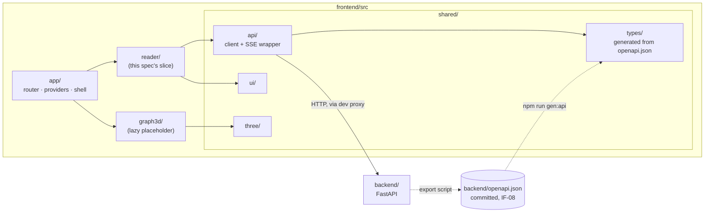

> **Process 0 status: closed.** Round 1 (ten questions) and round 2 (five) took
> place on 2026-09-23 and are recorded in the [Decision log](#decision-log). The user settled
> the placement, the number, the web reader and the error-body gap explicitly, and delegated
> the remaining questions to the agent's recommendations, marked **default**. Approving this
> spec confirms them. Nothing is left open. **Approved by the user on 2026-09-23**, defaults
> included.

## Motivation

### Purpose

`frontend/` does not exist. The docs already fix what it must be — React with three.js,
package by feature, one generated OpenAPI client as the only door to the backend, and a CI
step that fails on a stale client ([architecture](../../docs/architecture.md#frontend--package-by-feature-not-fsd),
[contract testing](../../docs/verification.md#contract-testing--t)) — but nothing enforces any
of it yet. This spec builds the **foundation**: the toolchain, the contract pipeline, the
boundaries, the test harness, and one thin read-only slice that proves the whole chain works
end to end against the real backend.

It deliberately builds **no product screen beyond that slice**. The product does want a
web reader (Decision R2-1), and the slice is the seed of it; the reader's product features
get their own specs, which will stand on this foundation.

### What fails today without it

- There is no consumer of `backend/openapi.json`. A contract nobody consumes cannot drift in
  a way anyone notices, so the "Frontend and backend agree on the API" row of the
  [coverage matrix](../../docs/verification.md#coverage-matrix) has no verification behind it.
- The ESLint boundary rule of the coverage matrix ("Only `shared/api/` calls the backend from
  `frontend/`") is stated but has no code to apply to.
- The first feature spec would otherwise have to choose the toolchain, the data-fetching
  model, the test stack and the folder rules in passing, inside a feature diff, where those
  choices get the least review.

### What a frontend spec specifies

Spec 001 is organised by operations. A frontend is organised by **what the user sees and
which contract it consumes**. So this spec, and every frontend spec after it, states for
each screen: its route, the backend operations it calls (by path in `openapi.json`), and its
four states — loading, empty, error, and loaded. A screen whose error state is unspecified
is a defect in the spec, not a detail for the code.

### Product perspective

*Reading it.* The backend exports `openapi.json` (spec 001, IF-08); the frontend generates
its types from that file, never from a running server, so generation is reproducible and
diffable. `shared/api/` is the only module that issues a request; features reach the backend
only through it, and `app/` composes features without features importing `app/`. `graph3d/`
exists only to prove that three.js is split out of the initial bundle. Dotted edges are
build-time; solid edges are imports or runtime calls.

## Scope

### In

1. **Scaffold** of `frontend/` with Vite, React 19 and TypeScript in `strict` mode, managed
   with `npm` and a committed lockfile.
2. **Contract pipeline**: types generated from `backend/openapi.json` into
   `src/shared/types/`, a typed client in `src/shared/api/` built on them, both committed, and
   a check that fails when regenerating produces a diff.
3. **SSE wrapper** in `src/shared/api/`: a typed, cancellable reader for
   `text/event-stream` responses, tested against a fake stream. No screen uses it yet; it
   exists so that the turn screen of a later spec does not invent its own transport.
4. **App shell**: router, providers (query client, error boundary), global layout, a
   backend-status indicator fed by `GET /health`, and a not-found route.
5. **Design-system primitives** in `src/shared/ui/`: only what the slice needs (layout,
   heading, prose container, status badge, error panel, skeleton). Nothing speculative.
6. **Read-only slice `reader/`**: a table of contents of scenes and a scene page that shows
   the scene record's headline fields and its draft prose. Details in [FR-READ](#fr-read--the-read-only-slice).
7. **three.js readiness**: `src/shared/three/` with one lazy canvas wrapper, and a
   `graph3d/` route that renders an empty react-three-fiber scene, loaded only on demand.
8. **Boundaries and static checks**: ESLint (TypeScript strict rules, security, jsx-a11y,
   and the feature-boundary rules of [architecture rules 6–8](../../docs/architecture.md#frontend--package-by-feature-not-fsd)).
9. **Test harness**: Vitest with Testing Library and MSW for components; Playwright for
   end-to-end runs against the real backend on its fixture repository, with axe checks.
10. **Local gate and CI**: `npm run lint && npm run typecheck && npm test`, the contract
    check and the build, as one script, and a `frontend` GitHub Actions workflow running it.

### Out

- Any write: no `PUT` or `POST` from the frontend, so no `X-Agent-Role` / `X-Actor` handling
  (spec 001, IF-02). The first spec that writes decides how a human operator identifies
  themselves.
- Turns, rulings and the SSE-driven turn screen (spec 001, IF-06). Only the transport
  wrapper is in.
- The real 3D views (locations, entity graph, timeline). Only the lazy placeholder is in.
- Canon, cast, ledger and violations screens; the assembled-context view; the Playwright
  flows "view its assembled context" and "view its violations" named in
  [unit / integration testing](../../docs/verification.md#unit--integration-testing--t).
- The product screens beyond the seed reader (interview, dedication, character sheets,
  changed-chapter marks, PDF export). Each gets its own spec.
- Authentication, deployment, internationalisation framework, mutation testing (`stryker`),
  and any change to `backend/` or `docs/`.

## Design

### FR-TOOL — Toolchain

| ID | Requirement |
|---|---|
| FR-TOOL-01 | Node 24 (the version on the development machine), `npm`, and a committed `package-lock.json`. Every dependency is pinned to an exact version. |
| FR-TOOL-02 | Vite as dev server and bundler; React 19; TypeScript with `strict: true`, `noUncheckedIndexedAccess: true` and `exactOptionalPropertyTypes: true`. |
| FR-TOOL-03 | React Router for routing. TanStack Query holds **all** server state; there is no global client-state library. Local UI state stays in components. |
| FR-TOOL-04 | `openapi-typescript` generates types; `openapi-fetch` provides the client. The client is path-based, so the backend's default FastAPI `operationId`s (`read_draft_manuscript__id__get`) do not leak into feature code. |
| FR-TOOL-05 | `react-markdown` renders draft prose, **without** raw HTML (no `rehype-raw`). Store content is untrusted text; it never becomes markup. |
| FR-TOOL-06 | `@react-three/fiber` and `@react-three/drei` for 3D, imported only under `shared/three/` and `graph3d/`. |
| FR-TOOL-07 | `npm` scripts: `dev`, `build`, `lint`, `typecheck`, `test` (Vitest), `e2e` (Playwright), `gen:api`, `check:api`, and `gate` (everything that CI runs, in CI's order). |

### FR-API — The contract pipeline

| ID | Requirement |
|---|---|
| FR-API-01 | `npm run gen:api` reads `../backend/openapi.json` and writes `src/shared/types/openapi.d.ts`. It never reads from a running server. |
| FR-API-02 | `src/shared/api/client.ts` creates the single `openapi-fetch` client typed by those paths. Features call it through small per-feature `api.ts` modules ([architecture rule 7](../../docs/architecture.md#frontend--package-by-feature-not-fsd)); nothing else calls `fetch`, `XMLHttpRequest` or `EventSource`. |
| FR-API-03 | `npm run check:api` regenerates into a temporary path and fails if the result differs from the committed file. CI runs it whenever `frontend/**` **or** `backend/openapi.json` changes, so a backend change that breaks the committed client fails the frontend workflow. |
| FR-API-04 | Error bodies follow spec 001, IF-07 (`{"error": "<code>", "detail": "<message>", …}`). Until that shape is declared in `openapi.json` (deferred to spec 001, Decision R2-2), `shared/api/` holds one hand-written `ApiError` type for it, used only for non-2xx responses, and a test asserts it against a real `404` from the backend. |
| FR-API-05 | The API base path is `/api` in the browser. In development, Vite proxies `/api/*` to the backend (default `http://127.0.0.1:8000`, overridable by `VITE_BACKEND_URL`), stripping the prefix. No CORS change is needed in `backend/`. |
| FR-API-06 | The SSE wrapper exposes `streamEvents<T>(path, init, parse): AsyncIterable<T>`, cancellable through `AbortSignal`, that parses each `data:` frame with a caller-supplied validator. Event payload types come from `openapi.json` `components/schemas` once the turn routes publish them; AsyncAPI is not adopted for a single stream. |

### FR-SHELL — App shell

| ID | Requirement |
|---|---|
| FR-SHELL-01 | `app/` owns the router, the `QueryClientProvider`, a top-level error boundary and the global layout. Features export route elements; `app/` wires them. |
| FR-SHELL-02 | The layout shows a backend-status badge from `GET /health`: `ok` with `vector: available` or `unavailable` when the backend answers; "backend unreachable" when it does not. It polls no more than once per 30 s. |
| FR-SHELL-03 | Unknown routes render a not-found page inside the layout. |
| FR-SHELL-04 | UI strings are in Spanish, written inline. Code, identifiers and tests are in English. |

### FR-READ — The read-only slice

| Route | Calls | Loading | Empty | Error | Loaded |
|---|---|---|---|---|---|
| `/` → redirects to `/scenes` | — | — | — | — | — |
| `/scenes` | `GET /structure/chapters`, `GET /scenes` | Skeleton list | "Todavía no hay escenas" | Error panel with the IF-07 `detail` and a retry button | Chapters in file order, each with its `id` and `function`, listing its scene ids in the chapter's order, each linking to its page; scenes that no chapter lists appear last under "Sin capítulo" |
| `/scenes/:id` | `GET /scenes/{id}`, `GET /manuscript/{id}` | Skeleton | Scene exists but draft is `404`: the record plus "Esta escena aún no tiene borrador" | Scene `404`: not-found panel; any other error: error panel with retry | Record headline (`pov`, `location`, `story_time`, `goal`, `conflict`, `outcome`), then the prose of `Draft.body` rendered as Markdown, with `words` shown |

| ID | Requirement |
|---|---|
| FR-READ-01 | The table of contents is driven by the chapter structure: `Chapter.scenes` is in discourse order by contract (the `Chapter` schema of `openapi.json`, spec 001), so the list costs two requests whatever the novel's length, with no per-scene fan-out (Decision R2-3). `GET /scenes` is used only to find scenes no chapter lists. |
| FR-READ-02 | The scene page treats a `404` on the draft as the empty state, never as an error. |
| FR-READ-03 | Previous/next links follow the flattened chapter order, then the unassigned scenes. |
| FR-READ-04 | All of `reader/` lives in one feature folder, flat ([architecture rule 6](../../docs/architecture.md#frontend--package-by-feature-not-fsd)). |

### FR-3D — three.js readiness

| ID | Requirement |
|---|---|
| FR-3D-01 | `shared/three/LazyCanvas.tsx` wraps the react-three-fiber `Canvas` behind `React.lazy` and `Suspense`, with a non-3D fallback. |
| FR-3D-02 | `/graph3d` renders an empty scene (camera, light, orbit controls) through `LazyCanvas`. It is the only route that loads three.js. |

### FR-STATIC — Boundaries and static checks

| ID | Requirement |
|---|---|
| FR-STATIC-01 | ESLint flat config with `typescript-eslint` strict type-checked rules, `eslint-plugin-security`, `eslint-plugin-jsx-a11y` and `eslint-plugin-boundaries`. |
| FR-STATIC-02 | Boundary rules: a feature imports `shared/` and nothing from another feature; `shared/` imports no feature and not `app/`; features do not import `app/`; only `shared/api/` may import `openapi-fetch` or reference `fetch`, `XMLHttpRequest` or `EventSource`; only `shared/three/` and `graph3d/` may import `three` or `@react-three/*`. |
| FR-STATIC-03 | No `any`, no `@ts-ignore`, no `eslint-disable` without a comment linking this spec (Process 3 rule 9). |
| FR-STATIC-04 | `npm audit --omit=dev --audit-level=high` passes. |

### NFR — Non-functional requirements

| ID | Requirement | Source |
|---|---|---|
| NFR-01 | The initial JavaScript for `/scenes` contains no three.js code and weighs at most 250 KB gzipped. | proposed |
| NFR-02 | Every route has zero `serious` or `critical` axe violations (WCAG 2.2 AA rules). | proposed |
| NFR-03 | Every test that satisfies a criterion carries `// spec 002 / AC n`. | Process 3 rule 16 |
| NFR-04 | Component tests run without network; MSW handlers are typed by the generated paths, so a handler for a route or shape the backend does not publish fails `typecheck`. | [Contract testing](../../docs/verification.md#contract-testing--t) |
| NFR-05 | End-to-end tests run the real backend against a temporary copy of its fixture repository, never against a working store. | spec 001, NFR-09 |

## Acceptance criteria

| # | Criterion | Letter |
|---|---|---|
| AC 1 | `npm run typecheck` passes with TypeScript `strict` and the flags of FR-TOOL-02; the tree contains no `any`, `@ts-ignore` or `eslint-disable` without a spec-linked comment. | **A** |
| AC 2 | `npm run lint` passes with zero findings, with the rules of FR-STATIC-01/02 active. | **A** |
| AC 3 | Each boundary rule of FR-STATIC-02 fires on a planted violating fixture file and is silent on `src/`. | **A** |
| AC 4 | `npm run check:api` passes on a fresh checkout, and fails after a one-field edit to `backend/openapi.json` that has not been regenerated into the client. | **T** |
| AC 5 | The frontend workflow runs when only `backend/openapi.json` changes, and runs the same `gate` script as a developer's machine. | **I** |
| AC 6 | `ApiError` parses the body of a real `404` from the backend (`GET /scenes/999`) and exposes `error` and `detail`. | **T** |
| AC 7 | The SSE wrapper yields one typed value per `data:` frame of a fake stream, rejects a frame that fails validation, and stops reading when its `AbortSignal` fires. | **T** |
| AC 8 | The backend-status badge shows `ok` / `vector` from a mocked `/health`, and "backend unreachable" on a network error. | **T** |
| AC 9 | `/scenes` renders its loading, empty, error and loaded states from MSW handlers; it lists scenes in each chapter's order even when `GET /scenes` returns them in a different order, and lists a scene no chapter names under "Sin capítulo". | **T** |
| AC 10 | `/scenes/:id` renders the draft as Markdown, renders the empty state on a draft `404`, renders not-found on a scene `404`, and renders a raw `<script>` or `` in `Draft.body` as text, never as an element. | **T** |
| AC 11 | Against the real backend on its fixture, a Playwright run opens `/scenes`, sees both chapters, opens scene `002` and sees its prose, follows "next" to `003`, and opens `001` to see the no-draft empty state. | **D** |
| AC 12 | Each route (`/scenes`, `/scenes/:id`, `/graph3d`, not-found) has zero `serious` or `critical` axe violations in the Playwright run. | **T** |
| AC 13 | After `npm run build`, a check over the build manifest finds no three.js module in the chunks loaded by `/scenes`, and their gzipped size is at most 250 KB. | **T** |
| AC 14 | `/graph3d` mounts a react-three-fiber canvas in the Playwright run, and the three.js chunk is requested only on that route. | **D** |
| AC 15 | `npm audit --omit=dev --audit-level=high` reports nothing. | **A** |
| AC 16 | A reviewer confirms that each feature folder is flat and self-contained, that `app/` only composes, and that no screen of the slice lacks one of its four states. | **I** |

## Verification plan

| AC | Method | Where it lives |
|---|---|---|
| 1 | `tsc --noEmit` in `npm run typecheck`; grep step in `gate` for unexplained suppressions | `frontend/package.json`, `frontend/scripts/gate.sh` |
| 2 | ESLint | `frontend/eslint.config.js` |
| 3 | A Vitest test that lints each file of `frontend/lint-fixtures/` with the project config and asserts the expected rule id | `frontend/src/shared/lint.test.ts` |
| 4 | `check:api` in `gate`; a Vitest test that runs the generator on a mutated copy of the schema and asserts a diff | `frontend/scripts/check-api.mjs`, `frontend/src/shared/api/contract.test.ts` |
| 5 | Review of the workflow's `paths` filter and its single `gate` step | `.github/workflows/frontend.yml` |
| 6 | Playwright API test against the real backend | `frontend/e2e/api-error.spec.ts` |
| 7 | Vitest with a hand-built `ReadableStream` | `frontend/src/shared/api/sse.test.ts` |
| 8 | Vitest + Testing Library + MSW | `frontend/src/app/HealthBadge.test.tsx` |
| 9, 10 | Vitest + Testing Library + MSW, handlers typed by generated paths | `frontend/src/reader/*.test.tsx` |
| 11, 14 | Playwright against `uvicorn` on a temp copy of `backend/tests/fixtures/`, started by Playwright's `webServer` | `frontend/e2e/reader.spec.ts`, `frontend/e2e/graph3d.spec.ts` |
| 12 | `@axe-core/playwright` on each route | `frontend/e2e/a11y.spec.ts` |
| 13 | A Node script over Vite's `manifest.json` | `frontend/scripts/check-bundle.mjs` |
| 15 | `npm audit` in `gate` | `frontend/scripts/gate.sh` |
| 16 | Review note in the PR description | PR for this spec |

The coverage-matrix rows this spec gives a verification to — "Only `shared/api/` calls the
backend from `frontend/`" (AC 2, 3) and "Frontend and backend agree on the API" (AC 4, 6) —
already exist in [verification.md](../../docs/verification.md#coverage-matrix); no doc
change is needed.

## Decision log

### Round 1 (2026-09-23)

| # | Question | Decision |
|---|---|---|
| 1 | Where is this spec written? | **User:** on `spec/001-backend`, ignoring `exam/rescope`; renames are reconciled when the rescope refactor starts. |
| 2 | File names inside the spec folder | **Default:** keep the `NNN-slug` prefix (`specs/002-frontend-foundation/002-frontend-foundation.md`), so filenames stay unique. |
| 3 | When does spec 001 move into its folder? | **User:** now, with the layout change (the request covered every spec). |
| 4 | Numbering against the proposed rescope spec | **User:** this spec is 002. |
| 5 | Intent | **Default:** a foundation that does not depend on the product's screens, with one read-only slice to prove the chain. |
| 6 | The proving slice | **Default:** a read-only reader of scenes and their drafts — the closest existing data to any reader the product will need. |
| 7 | Out of scope | **Default:** as listed in [Out](#out). |
| 8 | Stack | **Default:** as in [FR-TOOL](#fr-tool--toolchain); no global state library. |
| 9 | Language | **Default:** UI in Spanish, code and specs in English, no i18n framework yet. |
| 10 | Verification | **Default:** letters as in [Acceptance criteria](#acceptance-criteria); Playwright runs are **D** where they demonstrate a flow, **T** where they assert a measurable rule. |

### Round 2 (2026-09-23)

| # | Question | Decision |
|---|---|---|
| R2-1 | Does the product want a web reader? | **User:** yes, for now. The slice of FR-READ stays as the seed of that reader. |
| R2-2 | Is the missing IF-07 error schema in `openapi.json` serious? | **User:** leave it if it is not serious. It is not: it affects only the *typing* of error bodies, the runtime shape is fixed by IF-07 and tested by spec 001, and FR-API-04 types it by hand with a test against a real `404` (AC 6). Deferred to spec 001; no change to `backend/` here. |
| R2-3 | How is the table of contents built, given `GET /scenes` returns ids only? | **Default:** from `GET /structure/chapters` (IF-03), whose `scenes` lists are in discourse order. Two requests instead of N+1, and it groups the reader by chapter, which is how a reader reads. |
| R2-4 | Does SSE need a change to `verification.md`? | **Default:** not in this spec. The wrapper is generic and validated per frame; event payloads will be `components/schemas` of `openapi.json`, which is the contract the doc already names. If the turn spec needs event names or ordering in the contract, that spec runs Process 1 first. |
| R2-5 | How does the frontend identify a human operator for writes? | **Default:** not decided here; this spec has no writes. The first writing spec decides it against spec 001, IF-02. |

## Open questions

None. Every question raised during drafting is closed or deferred with its owner in the
[Decision log](#decision-log):

- **Deferred to spec 001:** declaring the IF-07 error bodies in `openapi.json` (R2-2). When
  it happens, `ApiError` is replaced by the generated type and AC 6 keeps guarding it.
- **Deferred to the turn spec:** SSE event names and ordering in the contract (R2-4).
- **Deferred to the first writing spec:** operator identity on writes (R2-5).
