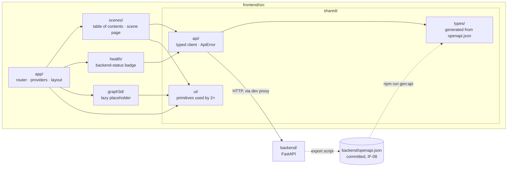

> **Process 0 status: closed.** Rounds 1 and 2 took place on 2026-09-23 with the user; round
> 3 is the alignment of this spec with `docs/`, done at the user's request the same day.
> All are recorded in the [Decision log](#decision-log). Decisions the user settled are
> marked **User**; the rest are the agent's recommendations, marked **default**, and
> approving this spec confirms them.
>
> **Re-approved by the user on 2026-09-23**, after round 3 changed scope and criteria and
> sent it back to `draft` (Process 2, rule 10). The user confirmed R3-10 explicitly.

## Motivation

### Purpose

`frontend/` does not exist. The docs already fix what it must be — React with three.js,
package by feature, one generated OpenAPI client as the only door to the backend, and a CI
step that fails on a stale client ([architecture](../../docs/architecture.md#frontend--package-by-feature-not-fsd),
[contract testing](../../docs/verification.md#contract-testing--t)) — but nothing enforces any
of it yet. This spec builds the **foundation**: the toolchain, the contract pipeline, the
boundaries, the test harness, and one thin read-only slice that proves the whole chain works
end to end against the real backend.

It deliberately builds **no product screen beyond that slice**. The product does want a
web reader (Decision R2-1), and the slice is the seed of it; the reader's product features
get their own specs, which will stand on this foundation.

### What fails today without it

- There is no consumer of `backend/openapi.json`. A contract nobody consumes cannot drift in
  a way anyone notices, so the "Frontend and backend agree on the API" row of the
  [coverage matrix](../../docs/verification.md#coverage-matrix) has no verification behind it.
- The boundary rows of the coverage matrix for the frontend ("Only `shared/api/` calls the
  backend from `frontend/`", "No feature imports another feature's internals", "`commons/`
  and `shared/` import no feature") are stated but have no code to apply to.
- The first feature spec would otherwise have to choose the toolchain, the data-fetching
  model, the test stack and the folder rules in passing, inside a feature diff, where those
  choices get the least review.

### What a frontend spec specifies

Spec 001 is organised by operations. A frontend is organised by **what the user sees and
which contract it consumes**. So this spec, and every frontend spec after it, states for
each screen: its route, the backend operations it calls (by path in `openapi.json`), and its
four states — loading, empty, error, and loaded — or says why one does not apply. A screen
whose error state is unspecified is a defect in the spec, not a detail for the code.

### Product perspective

*Reading it.* The backend exports `openapi.json` (spec 001, IF-08); the frontend generates
its types from that file, never from a running server, so generation is reproducible and
diffable. `shared/api/` is the only module that issues a request; `scenes/` and `health/`,
the two features that talk to the backend, reach it only through it. `app/` composes the
three features and imports each one's public surface; no feature imports `app/` or another
feature. `graph3d/` holds its own three.js code, because it is the only feature that uses it:
there is no `shared/three/` until a second feature needs one. Dotted edges are build-time;
solid edges are imports or runtime calls.

## Scope

### In

1. **Scaffold** of `frontend/` with Vite, React 19 and TypeScript in `strict` mode, managed
   with `npm` and a committed lockfile.
2. **Contract pipeline**: types generated from `backend/openapi.json` into
   `src/shared/types/`, the typed client in `src/shared/api/` built on them, both committed,
   and a check that fails when regenerating produces a diff.
3. **App shell** in `app/`: router, providers (query client, error boundary), global layout,
   and a not-found route — composition only.
4. **`health/` feature**: the backend-status badge fed by `GET /health`, placed in the
   layout by `app/`.
5. **`scenes/` feature**: a read-only table of contents and a scene page showing the scene
   record's headline fields and its draft prose. Details in [FR-SCN](#fr-scn--the-scenes-feature).
6. **`graph3d/` feature**: an empty react-three-fiber scene on its own route, loaded only on
   demand, proving three.js stays out of the initial bundle.
7. **`shared/ui/`**: only the primitives that two or more of `app/` and the features use
   (FR-UI-01). A primitive one feature uses lives in that feature.
8. **Boundaries and static checks**: ESLint (TypeScript strict rules, security, jsx-a11y,
   and the lint-checkable feature rules of [architecture rules 2, 3, 5, 7 and 8](../../docs/architecture.md#code-architecture--package-by-feature),
   cycles included).
9. **Test harness**: Vitest with Testing Library and MSW for components, colocated with
   them; Playwright for end-to-end runs against the real backend on its fixture repository,
   with axe checks.
10. **Local gate and CI**: `npm run lint && npm run typecheck && npm test`, the contract
    check and the build, as one script, and a `frontend` GitHub Actions workflow running it.

### Out

- Any write: no `PUT` or `POST` from the frontend, so no `X-Agent-Role` / `X-Actor` handling
  (spec 001, IF-02). The first spec that writes decides how a human operator identifies
  themselves.
- Turns, rulings, and **any Server-Sent Events code** (spec 001, IF-06). A transport with no
  consumer would be the speculative sharing the architecture forbids (Decision R3-2); the
  turn spec builds it in `shared/api/` together with its first consumer.
- The real 3D views (locations, entity graph, timeline) and `shared/three/`.
- Canon, cast, manuscript, ledger and violations screens; the assembled-context view; the
  Playwright flows "view its assembled context" and "view its violations" named in
  [unit / integration testing](../../docs/verification.md#unit--integration-testing--t).
- The product screens beyond the seed reader (interview, dedication, character sheets,
  changed-chapter marks, PDF export). Each gets its own spec.
- `shared/lib/`, until a second feature needs a utility.
- `semgrep` rules for `frontend/`. The project-specific rules [SAST](../../docs/verification.md#static-analysis--sast--a)
  names encode the store permission table, and the frontend cannot reach the stores at all
  (rule 7); its boundaries are enforced by ESLint (FR-STATIC-02). Revisited by the first
  spec that writes.
- Authentication, deployment, internationalisation framework, mutation testing (`stryker`,
  step 10 of the [order of adoption](../../docs/verification.md#order-of-adoption)), and any
  change to `backend/` or `docs/`.

## Design

### FR-TOOL — Toolchain

| ID | Requirement |
|---|---|
| FR-TOOL-01 | Node 24 (the version on the development machine), `npm`, and a committed `package-lock.json`. Every dependency is pinned to an exact version. |
| FR-TOOL-02 | Vite as dev server and bundler; React 19; TypeScript with `strict: true`, `noUncheckedIndexedAccess: true` and `exactOptionalPropertyTypes: true`. |
| FR-TOOL-03 | React Router for routing. TanStack Query holds **all** server state; there is no global client-state library. Local UI state stays in components. |
| FR-TOOL-04 | `openapi-typescript` generates types; `openapi-fetch` provides the client. The client is path-based, so the backend's default FastAPI `operationId`s (`read_draft_manuscript__id__get`) do not leak into feature code. |
| FR-TOOL-05 | `react-markdown` renders draft prose, **without** raw HTML (no `rehype-raw`). Store content is untrusted text; it never becomes markup. |
| FR-TOOL-06 | `@react-three/fiber` and `@react-three/drei` for 3D, imported only under `graph3d/`. |
| FR-TOOL-07 | `npm` scripts: `dev`, `build`, `lint`, `typecheck`, `test` (Vitest), `e2e` (Playwright), `gen:api`, `check:api`, `check:bundle`, and `gate` (everything that CI runs, in CI's order). |

### FR-API — The contract pipeline

| ID | Requirement |
|---|---|
| FR-API-01 | `npm run gen:api` reads `../backend/openapi.json` and writes `src/shared/types/openapi.d.ts` — the "generated backend types" of the [architecture tree](../../docs/architecture.md#frontend--package-by-feature-not-fsd). It never reads from a running server. |
| FR-API-02 | `src/shared/api/client.ts` creates the single `openapi-fetch` client typed by those generated paths. That typed client is what [architecture rule 7](../../docs/architecture.md#frontend--package-by-feature-not-fsd) calls the generated API client: its every route and shape comes from the schema, and no request type is written by hand. Features call it through their own `api.ts` ("its calls, built on shared/api"); nothing else calls `fetch` or `XMLHttpRequest`. |
| FR-API-03 | `npm run check:api` regenerates into a temporary path and fails if the result differs from the committed file. CI runs it whenever `frontend/**` **or** `backend/openapi.json` changes, so a backend change that leaves the client stale fails the frontend workflow, as [contract testing](../../docs/verification.md#contract-testing--t) and Process 3 rule 11 require. |
| FR-API-04 | Non-2xx bodies come in two declared shapes, plus an unknown case. Errors the backend raises as `HarnessError` follow spec 001, IF-07 (`{"error": "<code>", "detail": "<message>", …}`); request-validation failures are FastAPI's `422` `HTTPValidationError` (`{"detail": [ … ]}`), which *is* declared in `openapi.json`. The IF-07 shape is not declared there (deferral: Decision R2-2 of this spec), so the generated error type of a route such as `GET /scenes/{id}` is only `HTTPValidationError`. `shared/api/errors.ts` therefore holds the one hand-written type, `ApiError`, and a parser that narrows any non-2xx body to one of **three** cases: IF-07, `HTTPValidationError`, or *unknown* — an empty or non-JSON body, such as the Vite proxy's answer when the backend is down or a plain-text `500` — which carries only the status code. It never assumes `detail` is a string. Error panels show the IF-07 `detail` when there is one, and otherwise a generic Spanish message with the status code. A test asserts the parser against a real `404` from the backend. |
| FR-API-05 | The API base path is `/api` in the browser. In development, Vite proxies `/api/*` to the backend (default `http://127.0.0.1:8000`, overridable by `VITE_BACKEND_URL`), stripping the prefix. No CORS change is needed in `backend/`. |

### FR-SHELL — App shell

| ID | Requirement |
|---|---|
| FR-SHELL-01 | `app/` owns the router, the `QueryClientProvider`, a top-level error boundary, the global layout and the not-found page, and nothing else: it holds no API call and no feature logic ([architecture rule 8](../../docs/architecture.md#frontend--package-by-feature-not-fsd), and the tree's "router, providers, global layout"). |
| FR-SHELL-02 | Each feature exposes a public surface, its `index.ts`, exporting its route elements or components. `app/` imports features only through it. |
| FR-SHELL-03 | Unknown routes render the not-found page inside the layout, so the header and the health badge stay visible. It is static: no loading, empty or error state. `/` redirects to `/scenes`. |
| FR-SHELL-04 | UI strings are in Spanish, written inline. Code, identifiers and tests are in English. |

### FR-HLT — The `health/` feature

| ID | Requirement |
|---|---|
| FR-HLT-01 | `health/` exports a badge that `app/`'s layout places. It calls `GET /health` through its own `api.ts`. Its states: loading "comprobando…"; error "backend no disponible"; loaded `ok` with `vector: available` or `unavailable`; empty does not apply (the route always returns a body). It polls no more than once per 30 s. |

### FR-SCN — The `scenes/` feature

`scenes/` is one of the features the [architecture tree](../../docs/architecture.md#frontend--package-by-feature-not-fsd)
already names. It reads three backend resources — scene records, the chapter structure and
drafts — because a scene is read with its place in a chapter and its prose; none of those
reads is used by any other feature yet, so all three calls live in `scenes/api.ts`
([rule 6](../../docs/architecture.md#frontend--package-by-feature-not-fsd)). A future
`manuscript/` feature that needs drafts on its own takes its own call, or the shared part
moves to `shared/` then.

| Route | Calls | Loading | Empty | Error | Loaded |
|---|---|---|---|---|---|
| `/` → redirects to `/scenes` | — | — | — | — | — |
| `/scenes` | `GET /structure/chapters`, `GET /scenes` | Skeleton list | "Todavía no hay escenas" | Error panel with the parsed message (FR-API-04) and a retry button | Chapters in file order, each with its `id` and `function`, listing its scene ids in the chapter's order, each linking to its page; scenes that no chapter lists appear last under "Sin capítulo" |
| `/scenes/:id` | `GET /scenes/{id}`, `GET /manuscript/{id}` | Skeleton | Scene exists but draft is `404`: the record plus "Esta escena aún no tiene borrador" | Scene `404`: not-found panel; any other error: error panel with retry | Record headline (`pov`, `location`, `story_time`, `goal`, `conflict`, `outcome`), then the prose of `Draft.body` rendered as Markdown, with `words` shown |

| ID | Requirement |
|---|---|
| FR-SCN-01 | The table of contents is driven by the chapter structure. A chapter *orders* its scenes ([domain-knowledge Figure 1](../../docs/domain-knowledge.md#figure-1--the-entity-graph)), and the `Chapter` schema of `openapi.json` gives that order as `scenes`, in discourse order. So the list costs two requests whatever the novel's length, with no per-scene fan-out (Decision R2-3). `GET /scenes` is used only to find scenes no chapter lists. |
| FR-SCN-02 | The scene page treats a `404` on the draft as the empty state, never as an error. |
| FR-SCN-03 | Previous/next links follow the flattened chapter order, then the unassigned scenes. |
| FR-SCN-04 | The ordering logic (table of contents and previous/next) is a pure function, tested with `fast-check` properties. [Property-based testing](../../docs/verification.md#property-based-testing--t) names `fast-check` for pure state reducers; this extends the same tool to a pure ordering function. |
| FR-SCN-05 | All of `scenes/` lives in one folder, flat ([rule 6](../../docs/architecture.md#frontend--package-by-feature-not-fsd)); its tests sit beside the components they test. |
| FR-SCN-06 | An `:id` that does not match the scene-id pattern of `openapi.json` (`^\d{3}$`) renders the not-found panel **without** calling the backend, so a malformed URL never becomes a `422` and never shows a retry that cannot succeed. |

### FR-3D — The `graph3d/` feature

| ID | Requirement |
|---|---|
| FR-3D-01 | `graph3d/` wraps the react-three-fiber `Canvas` behind `React.lazy` and `Suspense`, with a non-3D fallback, and renders an empty scene (camera, light, orbit controls) on `/graph3d`. It is the only route that loads three.js. Its states: loading is the fallback while the chunk arrives; error (the chunk fails to load, or WebGL is unavailable) is the error panel; loaded is the empty scene; empty does not apply, since it shows no data. |
| FR-3D-02 | Nothing is placed in `shared/three/`. The architecture reserves it for helpers "reusable" across features, and a helper moves there only when a second 3D feature needs it. |

### FR-UI — Shared primitives

| ID | Requirement |
|---|---|
| FR-UI-01 | A component enters `shared/ui/` only when two or more of `app/` and the features use it. The [placement rule](../../docs/architecture.md#code-architecture--package-by-feature) counts features; `app/` counts as a user here because it cannot host what a feature also needs — no feature may import `app/` (rule 8) — so a component used by `app/` and one feature has nowhere else to live (Decision R3-11). In this spec that is expected to be the heading (used by `app/`'s not-found page, `scenes/` and `graph3d/`) and the error panel (used by `app/`'s error boundary, `scenes/` and `graph3d/`); the prose container, skeleton and status badge live in the one feature that uses each. The review of AC 15 checks the placement against actual use. |

### FR-STATIC — Boundaries and static checks

| ID | Requirement |
|---|---|
| FR-STATIC-01 | ESLint flat config with `typescript-eslint` strict type-checked rules, `eslint-plugin-security`, `eslint-plugin-jsx-a11y`, `eslint-plugin-boundaries` and an import-cycle rule. |
| FR-STATIC-02 | Boundary rules, which are [architecture rules 2, 3, 5, 7 and 8](../../docs/architecture.md#code-architecture--package-by-feature) for the frontend: (a) a feature may import another feature only through its `index.ts`, never its files (rule 2); (b) `shared/` imports no feature and not `app/` (rule 3); (c) no feature imports `app/` (rule 8); (d) import cycles are forbidden, between features and within one (rule 5); (e) only `shared/api/` may import `openapi-fetch` or reference `fetch` or `XMLHttpRequest` (rule 7); (f) only `graph3d/` may import `three` or `@react-three/*` (FR-3D-02); (g) `app/` imports a feature only through its `index.ts` (FR-SHELL-02). |
| FR-STATIC-03 | No `any`, no `@ts-ignore`, no `eslint-disable` without a comment linking this spec (Process 3 rule 9). |
| FR-STATIC-04 | `npm audit --omit=dev --audit-level=high` passes ([SAST](../../docs/verification.md#static-analysis--sast--a): dependency scanning), and every version in `package.json` is exact (FR-TOOL-01). |

### NFR — Non-functional requirements

| ID | Requirement | Source |
|---|---|---|
| NFR-01 | The initial JavaScript for `/scenes` contains no three.js code and weighs at most 250 KB gzipped. | proposed |
| NFR-02 | Every route has zero `serious` or `critical` axe violations (WCAG 2.2 AA rules). | proposed |
| NFR-03 | Every test that satisfies a criterion carries `// spec 002 / AC n`. | Process 3 rule 16 |
| NFR-04 | Component tests run without network; MSW handlers are typed by the generated paths, so a handler for a route or shape the backend does not publish fails `typecheck`. | [Contract testing](../../docs/verification.md#contract-testing--t) |
| NFR-05 | End-to-end tests run the real backend against a temporary copy of its fixture repository, never against a working store. | spec 001, NFR-09; [unit / integration testing](../../docs/verification.md#unit--integration-testing--t) |
| NFR-06 | Test utilities shared by several features live outside `src/` (`frontend/test/`), so nothing test-only enters `shared/` or the bundle. | [placement rule](../../docs/architecture.md#code-architecture--package-by-feature) |

## Acceptance criteria

| # | Criterion | Letter |
|---|---|---|
| AC 1 | `npm run typecheck` (`tsc -b` over every project: `src/`, `test/`, `e2e/`, the config files and `scripts/`) passes with TypeScript `strict` and the flags of FR-TOOL-02; the tree contains no `any`, `@ts-ignore` or `eslint-disable` without a spec-linked comment. | **A** |
| AC 2 | `npm run lint` passes with zero findings, with the rules of FR-STATIC-01/02 active. | **A** |
| AC 3 | Each boundary rule of FR-STATIC-02, (a) to (g), fires on a planted violating fixture and is silent on `src/`; an import through a feature's `index.ts` is accepted. | **T** |
| AC 4 | `npm run check:api` passes on a fresh checkout, and fails after a one-field edit to `backend/openapi.json` that has not been regenerated into the client. | **T** |
| AC 5 | The frontend workflow runs when only `backend/openapi.json` changes, and runs the same `gate` script as a developer's machine. | **I** |
| AC 6 | `ApiError` parses the body of a real `404` from the backend (`GET /scenes/999`) and exposes `error` and `detail`. | **T** |
| AC 7 | The health badge shows "comprobando…" while loading, `ok` / `vector` from a mocked `/health`, and "backend no disponible" both on a network error and on a `502` with a non-JSON body; with fake timers it issues no second request before 30 s. | **T** |
| AC 8 | `/scenes` renders its loading, empty, error and loaded states from MSW handlers; it lists scenes in each chapter's order even when `GET /scenes` returns them in a different order, and lists a scene no chapter names under "Sin capítulo". The ordering function holds its `fast-check` properties (every scene exactly once; chapter order kept; unassigned last; previous and next are inverse neighbours, including across a chapter boundary and into the unassigned tail). | **T** |
| AC 9 | `/scenes/:id` renders the draft as Markdown, renders the empty state on a draft `404`, renders not-found on a scene `404`, renders not-found for `/scenes/abc` without issuing a request, renders the error panel with a generic message and the status code on a `500` with a non-JSON body, and renders a raw `<script>` or `` in `Draft.body` as text, never as an element. | **T** |
| AC 10 | Against the real backend on its fixture, a Playwright run opens `/scenes`, sees both chapters, opens scene `002` and sees its prose, follows "next" to `003`, and opens `001` to see the no-draft empty state. | **D** |
| AC 11 | Each route (`/scenes`, `/scenes/:id`, `/graph3d`, not-found) has zero `serious` or `critical` axe violations in the Playwright run. | **T** |
| AC 12 | After `npm run build`, a check over the per-chunk module list emitted by the build finds no three.js module in the chunks loaded by `/scenes`, and their gzipped size is at most 250 KB; the same check fails on a planted report that places a three.js module in the entry chunk. | **T** |
| AC 13 | `/graph3d` mounts a react-three-fiber canvas in the Playwright run, and the three.js chunk is requested only on that route. | **D** |
| AC 14 | `npm audit --omit=dev --audit-level=high` reports nothing, and no version in `package.json` carries a range (`^`, `~`, `*`, `x`). | **A** |
| AC 15 | A reviewer confirms that each feature folder is flat and self-contained, that `app/` only composes, that every `shared/ui/` component has two or more users and every single-user component sits in its feature, that every screen specifies its four states or why one does not apply, and that UI strings are Spanish while code and tests are English. | **I** |
| AC 16 | Unknown routes render the not-found page inside the layout (header and health badge present). *(Revised 2026-09-24 by spec 003 revision 2: `/` no longer redirects to `/scenes`; it is the cover, verified by spec 003 AC 5–6.)* | **T** |
| AC 17 | An MSW handler for a route `openapi.json` does not publish, or with a response of the wrong shape, fails `npm run typecheck` (a planted case under `@ts-expect-error` with a spec-linked comment). | **A** |
| AC 18 | `/graph3d` renders the error panel when the three.js chunk fails to load, and when WebGL is unavailable. | **T** |

## Verification plan

| AC | Method | Where it lives |
|---|---|---|
| 1 | `tsc -b` over both projects in `npm run typecheck`; grep step in `gate` for unexplained suppressions | `frontend/tsconfig.app.json`, `frontend/tsconfig.node.json`, `frontend/scripts/gate.mjs` |
| 2 | ESLint | `frontend/eslint.config.js` |
| 3 | A Vitest test that lints each file of `frontend/lint-fixtures/` with the project config and asserts the expected rule id, plus one accepted fixture | `frontend/test/lint.test.ts` |
| 4 | `check:api` in `gate`; a Vitest test that runs the generator on a mutated copy of the schema and asserts a diff | `frontend/scripts/check-api.mjs`, `src/shared/api/contract.test.ts` |
| 5 | Review of the workflow's `paths` filter and its single `gate` step | `.github/workflows/frontend.yml` |
| 6 | Playwright API test against the real backend | `frontend/e2e/api-error.spec.ts` |
| 7 | Vitest + Testing Library + MSW, colocated | `src/health/HealthBadge.test.tsx` |
| 8, 9 | Vitest + Testing Library + MSW, colocated, handlers typed by generated paths; `fast-check` for the ordering function | `src/scenes/*.test.ts(x)` |
| 10, 13 | Playwright against `uvicorn` on a temp copy of `backend/tests/fixtures/repo/`, started by Playwright's `webServer` | `frontend/e2e/scenes.spec.ts`, `frontend/e2e/graph3d.spec.ts` |
| 11 | `@axe-core/playwright` on each route | `frontend/e2e/a11y.spec.ts` |
| 12 | A Node script over a per-chunk module report written at build time (Rollup's `chunk.modules`, which the Vite manifest does not carry), with a planted-report test | `frontend/scripts/check-bundle.mjs`, `frontend/test/check-bundle.test.ts` |
| 14 | `npm audit` and an exact-version check in `gate` | `frontend/scripts/gate.mjs` |
| 15 | Review note in the PR description | the PR that carries this spec |
| 16 | Vitest + Testing Library over `app/`'s routes, colocated | `src/app/routes.test.tsx` |
| 17 | `tsc` over a planted handler; `frontend/test/` is inside the type-checked project | `frontend/test/server.test.ts`, `frontend/tsconfig.app.json` |
| 18 | Vitest with the lazy import mocked to reject, and with WebGL detection mocked to fail, colocated | `src/graph3d/Graph3dPage.test.tsx` |

The coverage-matrix rows this spec gives a verification to — "Only `shared/api/` calls the
backend from `frontend/`" and "No feature imports another feature's internals" and
"`commons/` and `shared/` import no feature" (AC 2, 3), and "Frontend and backend agree on
the API" (AC 4, 6) — already exist in [verification.md](../../docs/verification.md#coverage-matrix);
no doc change is needed.

## Decision log

### Round 1 (2026-09-23)

| # | Question | Decision |
|---|---|---|
| 1 | Where is this spec written? | **User:** on `spec/001-backend`, ignoring `exam/rescope`; renames are reconciled when the rescope refactor starts. Code is written on the same branch, beside the backend session (plan 002). This departs from Process 3 step 3 (branch `spec/NNN-*`) and, as a consequence, rule 18: spec 002 rides on the pull request that merges `spec/001-backend`, which is not titled `spec(002):`; its description carries spec 002's criteria. |
| 2 | File names inside the spec folder | **Default:** keep the `NNN-slug` prefix (`specs/002-frontend-foundation/002-frontend-foundation.md`), so filenames stay unique. |
| 3 | When does spec 001 move into its folder? | **User:** now, with the layout change (the request covered every spec). |
| 4 | Numbering against the proposed rescope spec | **User:** this spec is 002. |
| 5 | Intent | **Default:** a foundation that does not depend on the product's screens, with one read-only slice to prove the chain. |
| 6 | The proving slice | **Default:** a read-only reader of scenes and their drafts — the closest existing data to any reader the product will need. |
| 7 | Out of scope | **Default:** as listed in [Out](#out). |
| 8 | Stack | **Default:** as in [FR-TOOL](#fr-tool--toolchain); no global state library. |
| 9 | Language | **Default:** UI in Spanish, code and specs in English, no i18n framework yet. |
| 10 | Verification | **Default:** letters as in [Acceptance criteria](#acceptance-criteria); Playwright runs are **D** where they demonstrate a flow, **T** where they assert a measurable rule. |

### Round 2 (2026-09-23)

| # | Question | Decision |
|---|---|---|
| R2-1 | Does the product want a web reader? | **User:** yes, for now. The `scenes/` slice is the seed of that reader. |
| R2-2 | Is the missing IF-07 error schema in `openapi.json` serious? | **User:** leave it if it is not serious. It is not: it affects only the *typing* of error bodies, the runtime shape is fixed by IF-07 and tested by spec 001, and FR-API-04 types it by hand with a test against a real `404` (AC 6). Deferred to spec 001; no change to `backend/` here. |
| R2-3 | How is the table of contents built, given `GET /scenes` returns ids only? | **Default:** from `GET /structure/chapters` (IF-03), whose `scenes` lists are in discourse order. Two requests instead of N+1, and it groups the reader by chapter, which is how a reader reads. |
| R2-4 | Does SSE need a change to `verification.md`? | Superseded by R3-2: no SSE code in this spec. |
| R2-5 | How does the frontend identify a human operator for writes? | **Default:** not decided here; this spec has no writes. The first writing spec decides it against spec 001, IF-02. |

### Round 3 — alignment with `docs/` (2026-09-23)

The user asked for every gap between this spec, its plan and `docs/` (above all
`architecture.md`) to be closed. Each row is a gap found and how it was closed.

| # | Gap | Resolution |
|---|---|---|
| R3-1 | `LazyCanvas` in `shared/three/` with one user broke the placement rule ("not in anticipation of one"). | **Default:** moved into `graph3d/`; no `shared/three/` (FR-3D-02). |
| R3-2 | An SSE wrapper with no consumer was speculative sharing. | **Default:** removed from scope; the turn spec builds it with its consumer. Old AC 7 dropped, criteria renumbered. |
| R3-3 | All UI primitives in `shared/ui/` regardless of use. | **Default:** placement by actual use (FR-UI-01), checked in review (AC 15). |
| R3-4 | "A feature imports nothing from another feature" was stricter than rule 2, which allows a feature's public surface — the same mismatch spec 001 fixed in its R3-3. Rule 5 (no cycles) had no check. | **Default:** public surface is the feature's `index.ts`; cycle rule added (FR-STATIC-02 a, d; AC 3). |
| R3-5 | `app/` held an API call (`app/api.ts`, the health badge), but the tree gives `app/` only "router, providers, global layout" and rule 8 makes it a composer. | **Default:** the badge is the `health/` feature; `app/` only places it (FR-SHELL-01, FR-HLT-01). |
| R3-6 | The slice was a new feature, `reader/`, whose concept — reading scenes — the tree already gives to `scenes/`. Two folders for one concept break "grouped by what it is *about*". | **Default:** named `scenes/` (FR-SCN). New features are allowed: the tree is illustrative (it lists `timeline/` and `cast/`, which do not exist yet); what is avoided is a second folder for a concept that already has one. |
| R3-7 | Test utilities in `src/shared/test/` are not in the tree's `shared/` and are not cross-feature *code*. | **Default:** they live in `frontend/test/`, outside `src/` (NFR-06). |
| R3-8 | The chapter's scene order was cited only to the backend contract. | **Default:** cited to [domain-knowledge Figure 1](../../docs/domain-knowledge.md#figure-1--the-entity-graph) ("CHAPTER orders SCENE") and to the schema (FR-SCN-01). |
| R3-9 | The shared typed client vs "generated OpenAPI client" in the tree. | **Default:** FR-API-01/02 say which file is generated and why the typed client counts as the generated client. |
| R3-10 | Process 3 rule 11 asks that an API change regenerate the client "in the same change", but on a shared branch the backend session commits `openapi.json` without touching `frontend/`. | **User** (confirmed 2026-09-23), as a consequence of R1-1: "the same change" is read as the same pull request. The frontend regenerates in a `contract:` commit right after; until then the frontend workflow, which runs on every push to `spec/**` touching `backend/openapi.json`, is red — the signal rule 11 wants, not a fault. |
| R3-11 | FR-UI-01 counts `app/` as a user of a shared component, where the placement rule speaks of features. | **Default:** `app/` counts, because rule 8 forbids features importing `app/`, so a component that `app/` and a feature share cannot live in either. |
| R3-12 | Path-validation `422`s do not follow IF-07, and a malformed `/scenes/:id` would have hit a retry that cannot succeed. | **Default:** `ApiError` narrows both shapes (FR-API-04); malformed ids render not-found without a request (FR-SCN-06, AC 9). |
| R3-13 | Requirements without a criterion: the 30 s polling limit, not-found inside the layout, previous/next order, typed MSW handlers, exact pins, Spanish strings. | **Default:** folded into AC 7, AC 8, AC 14 and AC 15, plus new criteria AC 16, AC 17 and AC 18 (the `/graph3d` error state). |
| R3-14 | The bundle check read Vite's manifest, which lists chunks but not the modules inside them, so three.js inlined into the entry chunk would pass unseen. | **Default:** the build writes a per-chunk module report, and a planted report proves the check fails (AC 12). |
| R3-15 | An empty or non-JSON error body (the dev proxy with the backend down, a plain-text `500`) fitted neither error shape; and `frontend/test/` was not said to be type-checked, which AC 17 depends on. | **Default:** a third, *unknown* error case (FR-API-04; AC 7, AC 9); `typecheck` runs `tsc -b` over every project, `test/` included (AC 1). |

## Open questions

**Why this spec went back to `draft`, and its re-approval** (Process 2, rule 10;
2026-09-23). Round 3 changed the scope after the first approval: the SSE wrapper left the scope, `health/` became a feature, the slice
became `scenes/`, `shared/three/` left the scope and the boundary rules changed. The
acceptance criteria were renumbered and extended (18). Plan 002 returns to `draft` with it
and was committed only after this spec was re-approved (Process 2, step 8). The user
confirmed R3-10 and re-approved spec and plan the same day.

Nothing else is open. Deferred, each with its owner:

- **Deferred to spec 001:** declaring the IF-07 error bodies in `openapi.json` (R2-2). When
  it happens, `ApiError` is replaced by the generated type and AC 6 keeps guarding it. Spec
  001's own Open questions do not yet record this; that entry is the backend session's to
  add, outside plan 002's paths.
- **Deferred to the turn spec:** the SSE transport and whether its event names or ordering
  need a line in `verification.md` (R3-2).
- **Deferred to the first writing spec:** operator identity on writes (R2-5).
- **Revised by spec 003 revision 2** (2026-09-24, re-approved by the agent under the user's
  written delegation): `/` is the cover, not a redirect (FR-SHELL-03, AC 16); the navigation
  is Portada · Índice · Personajes · Lugares with the brand linking to `/` and `/graph3d`
  linked from the footer; `/scenes` is titled "Índice"; the cover also loads the planet chunk
  lazily (FR-3D-01), while `/scenes` still never does (AC 13). This spec's test files are
  updated only where an assertion names one of these.
- **Superseded in part by spec 003** (2026-09-24): FR-3D-01's "empty scene" becomes spec
  003's decorative planet (FR-3D-03); `/scenes` also calls `GET /canon/project` for spec
  003's book header (FR-BOOK); plan 002 C10's inline targets move to CSS. Every acceptance
  criterion of this spec is unchanged and keeps passing (spec 003, AC 10).
- **Noted for the owner of `docs/`, not a gap of this spec:** `architecture.md` rule 7 points
  to "Process 3 rule 5 in `AGENTS.md`"; the rule that says the frontend never touches the
  stores is Process 3 rule 7. A `chore:` fix of the reference.
- **Noted for the owner of `docs/`, not a gap of this spec:** the coverage-matrix rows for
  feature boundaries name `import-linter` / `import/no-restricted-paths` as the method; the
  SAST prose also allows `eslint-plugin-boundaries`, which this spec uses. Naming it in the
  matrix cells would remove the ambiguity.
