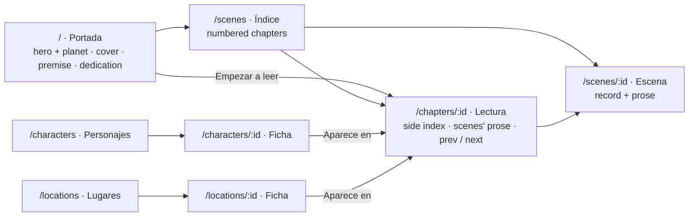

> **Revision 2 (2026-09-24).** The first version restyled the existing screens; the user
> judged the result far from `main` and asked for a new frontend: `main`'s look, but pages
> that fit this product — a navigable chapter index, character and location sheets built
> from the story bible with links to the chapters where each appears, and a cover with a
> personalised dedication. Scope and criteria changed after approval, so this spec went back
> to `draft` (Process 2, rule 10) and was **re-approved by the agent under the user's written
> delegation** ("autoapruébate todos los cambios… decide tú todas tus dudas"). Revision-1
> work that still holds (tokens, fonts, focus, motion, the planet, the identity tests) is
> kept; the rest is replaced below. See [Decision log](#decision-log).

## Motivation

### Purpose

Spec 002 built the frontend's plumbing with one proving slice; revision 1 of this spec gave
that slice `main`'s palette. The user wants more: the **feel** of `main`'s `web/` site — its
hero with the orange planet, book covers in orange gradients, cards, pills, sheets — applied
to **this** product's pages, which are not `main`'s. This product is a novel being written
from a story bible, so its reader needs:

- a **cover**, with the book's premise and a **personalised dedication**;
- a **navigable chapter index**, and a chapter reader that lets one move through the book;
- **character and location sheets** generated from the story bible, each linking to the
  chapters where that character or place appears.

All of it is read-only and fed by routes the backend already serves (spec 001, IF-03).

### What fails today without it

- The reader can see scenes one by one, but not read a chapter, not see who is in the book or
  where it happens, and has no cover.
- The story bible (cast and locations) is invisible, although the backend serves it.
- The look is `main`'s palette on a bare page, not `main`'s design.

## Scope

### In

1. **Look** (FR-TOK, FR-FONT, FR-UI3, FR-HLT3): `main`'s tokens with the accessible text/UI
   palette, self-hosted fonts, visible focus, reduced motion — kept from revision 1.
2. **Information architecture** (FR-IA): the cover at `/`, the chapter index, the chapter
   reader, the characters and locations sheets; navigation Portada · Índice · Personajes ·
   Lugares.
3. **Cover** (FR-COVER): `main`'s hero with the planet, a book-cover card, the premise, "Empezar
   a leer", and a dedication the reader personalises, kept only in their browser.
4. **Chapter index and reader** (FR-INDEX, FR-READ).
5. **Story-bible sheets** (FR-BIBLE): characters and locations, list and sheet pages, with
   appearances by chapter computed from the scene records.
6. **The planet** (FR-3D): decorative, lazy, pausable; on the cover and on `/graph3d`.
7. **Reflow** down to 320 px; **verification** additions.

### Out

- Any backend change. The backend has no title or dedication field: both live in the
  browser (FR-COVER-03); a backend field is a candidate for a later spec 001 revision.
- Writing anything to the backend; turns; SSE; an architecture view from `GET /permissions`;
  summaries; turns and violations; live refresh. Each stays a candidate spec.
- `main`'s create form and library (they belong to the previous product).
- Dark mode, CSS frameworks, CSS-in-JS, CSS Modules, component libraries, pixel baselines.
- `docs/`, `.github/`, `backend/`.

## Design

### What changes in spec 002's approved behaviour

This revision changes spec 002 in the places below; a `spec(002)` revision records them
(re-approved by the agent under the same delegation). Every other spec 002 requirement and
criterion holds.

| Spec 002 | Becomes |
|---|---|
| FR-SHELL-03, AC 16: `/` redirects to `/scenes` | `/` is the cover (FR-COVER); unknown routes still render the not-found page inside the layout. |
| FR-SHELL-01 (as tested): navigation "Escenas", "Grafo 3D"; brand links to `/scenes` | Navigation Portada, Índice, Personajes, Lugares; the brand links to `/`; `/graph3d` is linked from the footer. |
| FR-3D-01: `/graph3d` "is the only route that loads three.js" | The cover also loads the planet chunk, lazily; `/scenes` still never does (AC 13, NFR-01 unchanged). |
| FR-SCN route table: `/scenes` title "Escenas" | `/scenes` is the chapter index, titled "Índice" (FR-INDEX); `/scenes/:id` is unchanged. |

Spec 002's test files are updated only where an assertion names one of these (the nav
labels, the brand target, the `/` redirect, the `/scenes` title, the way AC 13 reaches
`/graph3d`); plan 003 lists each edit.

### Product perspective

*Reading it.* Every page is reachable from the navigation. The cover leads into the first
chapter. The index and the reader move through chapters; the reader's side index is the same
chapter list, so any chapter is one click away. Character and location sheets link each
appearance to the chapter (and its scene anchor) where it happens. Arrows are links.

### Features and data

| Feature folder | Pages | Backend reads (all existing, spec 001 IF-03) |
|---|---|---|
| `cover/` (new) | `/` | `GET /canon/project`, `GET /structure/chapters` |
| `scenes/` | `/scenes`, `/scenes/:id`, `/chapters/:id` | `GET /structure/chapters`, `GET /scenes`, `GET /scenes/{id}`, `GET /manuscript/{id}` |
| `bible/` (new) | `/characters`, `/characters/:id`, `/locations`, `/locations/:id` | `GET /cast`, `GET /cast/{id}`, `GET /canon/locations`, `GET /canon/locations/{id}`, `GET /structure/chapters`, `GET /scenes`, `GET /scenes/{id}` |
| `graph3d/` | `/graph3d`; exports the planet hero used by the cover | — |
| `health/` | badge in the header | `GET /health` |

Each feature makes its own calls in its own `api.ts` (architecture
[rule 6](../../docs/architecture.md#frontend--package-by-feature-not-fsd)); features reach each
other only through `index.ts` (rule 2). `Prose` (Markdown rendering) moves to `shared/ui/`,
because `scenes/` and `bible/` both use it (placement rule).

### FR-TOK, FR-FONT — Look (kept from revision 1)

| ID | Requirement |
|---|---|
| FR-TOK-01 | `shared/ui/tokens.css`: `main`'s brand orange `#FF7A2F` / `#E5661F` / `#FFE9DC` / `#FFF5EE`, ink `#1E2B37` / `#3D4A56`, line, surface, radii 14 px / 999 px, `main`'s shadow, fonts and type scale. |
| FR-TOK-02 | Accessible roles: `--accent #AE4E14` (text, eyebrows, filled buttons and pills with white text), `--muted #5E6A77`, `--pass #16794A`, `--fail #B83232`; brand orange for decoration and for **large** text on white only where it meets 3:1. |
| FR-TOK-03 | `shared/ui/base.css`: reset, type, underlined links in text, container, shared classes (card, pill, eyebrow, ghost and primary buttons). |
| FR-TOK-04 | One `:focus-visible` outline (2 px `--accent`, offset 2 px); the sticky header never hides focus. |
| FR-TOK-05 | Reduced motion disables CSS animation and transition. |
| FR-TOK-06 | Plain CSS per feature, English class names, Spanish UI text. |
| FR-FONT-01/02 | Inter 400/500/600/700 and JetBrains Mono 400, latin, from exact-pinned `@fontsource`; no third-party request. |

### FR-IA — Pages and navigation

| ID | Requirement |
|---|---|
| FR-IA-01 | Routes: `/` cover, `/scenes` index, `/chapters/:id` reader, `/scenes/:id` scene, `/characters`, `/characters/:id`, `/locations`, `/locations/:id`, `/graph3d`, and the not-found page for anything else. |
| FR-IA-02 | Header (kept from revision 1: glass, sticky from 600 px, logo with `alt=""`, "My Story Marker"), brand linking to `/`, navigation "Principal": **Portada, Índice, Personajes, Lugares**, the current one filled in `--accent` with `aria-current="page"` (and for `/chapters/:id`, `/scenes/:id` the "Índice" item; for sheets their list item). Footer with the product line and a link "Vista 3D" to `/graph3d`. |
| FR-IA-03 | Every page has one `h1`, a document `<title>`, and its four states (loading, empty, error, loaded) or a stated reason one does not apply. |

### FR-COVER — Cover

| ID | Requirement |
|---|---|
| FR-COVER-01 | `/` is `main`'s hero: the orange-50 → white gradient, the decorative planet behind the right half (FR-3D, with its pause toggle), and on the left a **book-cover card** (portrait, `main`'s orange radial gradient with stops dark enough for white large text ≥ 3:1) showing the title, then the eyebrow "Novela", the title as the page's `h1`, the premise statement from `GET /canon/project` as the lead, a primary button "Empezar a leer" to the first chapter's reader, and a ghost button "Índice". |
| FR-COVER-02 | A **dedication** block under the hero, in `main`'s card style: "Para {para}", the dedication text in large italic, "— {de}". |
| FR-COVER-03 | Title, *para*, dedication and *de* are **personalised in the page**: a ghost button "Personalizar portada" opens a form (four labelled fields, "Guardar" and "Cancelar"); values persist in `localStorage` under one versioned key and never leave the browser (stated in the form). Defaults when empty: title "Mi novela", no *para*/*de* lines, and a dedication placeholder inviting personalisation. Storage failures (private mode) degrade to in-memory values. |
| FR-COVER-04 | States: the premise loads → skeleton line; premise error or 404 → the lead is omitted, the rest renders; chapters error → "Empezar a leer" points to the index; no chapters → the button is hidden and the index button stays. |

### FR-INDEX — Chapter index (`/scenes`)

| ID | Requirement |
|---|---|
| FR-INDEX-01 | Title "Índice"; count pills (chapters, scenes). Chapters in file order as numbered cards: "Capítulo N", the chapter **display title** (the quoted phrase that opens `function`, if any, else "Capítulo N"), the rest of `function` as text, the scene count, a primary link "Leer capítulo" to `/chapters/:id`, and the scenes as chips "Escena NNN" to `/scenes/:id`. Scenes no chapter lists: a card "Sin capítulo" with chips. |
| FR-INDEX-02 | States as spec 002 FR-SCN (skeleton, "Todavía no hay escenas", error panel with retry; a chapters 404 reads as no chapters, plan 002 C8). |

### FR-READ — Chapter reader (`/chapters/:id`)

| ID | Requirement |
|---|---|
| FR-READ-01 | Two columns from 900 px (one below): a **side index** (`nav` "Índice de capítulos") listing every chapter by number and display title, the current one with `aria-current="page"`, and under it its scenes as in-page anchor links; and the **reading column**: eyebrow "Capítulo N", `h1` the display title, then each scene of the chapter in order as a section with id `scene-NNN`, a small heading "Escena NNN" linking to `/scenes/NNN`, and its prose (70ch column) or, without a draft, a muted "Esta escena aún no tiene borrador". |
| FR-READ-02 | Previous / next chapter buttons ("Capítulo anterior: …", "Capítulo siguiente: …") at the end, from file order; absent at the ends. |
| FR-READ-03 | States: loading → skeleton; unknown chapter id → not-found panel with a link to the index, no retry; chapters error → error panel with retry; a scene's draft 404 → that scene's empty note; a scene's other error → a small error line in that section, the rest renders. |

### FR-BIBLE — Story-bible sheets

| ID | Requirement |
|---|---|
| FR-BIBLE-01 | **Appearances** are computed by a pure function from the chapters and the scene records: a character appears in a scene when it is its `pov` or among its `participants` (role "punto de vista" or "presente"); a location appears in a scene whose `location` is it (direct) or one of its descendants in the `parent` tree (via that sublocation). Appearances group by chapter in reading order; scenes no chapter lists group under "Sin capítulo". Tested with examples and `fast-check` properties. |
| FR-BIBLE-02 | `/characters`: title "Personajes"; a grid of cards: an initials avatar in `main`'s orange gradient, the name, `wants` (muted), and "Aparece en" chapter chips (links to `/chapters/:id`); the card links to the sheet. Empty: "Todavía no hay personajes". |
| FR-BIBLE-03 | `/characters/:id`: `main`'s detail head (avatar, eyebrow "Personaje", `h1` name, appearance-count pill); a key–value card: Quiere, Necesita, Mentira, Competencias, and each `immutable_physical` attribute; the body as Markdown (`Prose`); "Aparece en": per chapter, a link to `/chapters/:id`, and its scenes with the role, each linking to `/chapters/:id#scene-NNN`. Unknown id → not-found panel. |
| FR-BIBLE-04 | `/locations` and `/locations/:id` likewise: display name from the id (`pump_vault` → "Pump vault"), parent as a link, Paleta sensorial, Geometría, Accesos (from, hours), sublocations, body, and appearances marked direct or "vía {sublocation}". |
| FR-BIBLE-05 | States: lists and sheets show a skeleton while loading, an error panel with retry on failure; appearances that cannot be computed (scene records failing) show a muted "No se han podido calcular las apariciones" while the rest of the sheet renders. |

### FR-3D — The planet

| ID | Requirement |
|---|---|
| FR-3D-03 | `PlanetScene` (kept from revision 1): `main`'s hero composition, decorative (`aria-hidden`, no controls), seeded randomness at module scope. |
| FR-3D-04 | Pause (WCAG 2.2.2): toggle "Pausar animación" with `aria-pressed`, constant label; `useFrame` returns early while paused; reduced motion starts paused. |
| FR-3D-05 | `graph3d/index.ts` exports `Graph3dRoute` and **`PlanetHero`** (the lazy canvas with its toggle, for the cover). three.js stays in the lazy chunk (spec 002 NFR-01, AC 12); `/scenes` never requests it (AC 13). |

### FR-UI3, FR-HLT3 (kept)

| ID | Requirement |
|---|---|
| FR-UI3 | `Heading`, `ErrorPanel` and now `Prose` in `shared/ui/` (two or more users each). |
| FR-HLT3 | Health pill with a pulsing dot, stopped under reduced motion. |

### NFR

| ID | Requirement |
|---|---|
| NFR3-01 | Spec 002's gate green, as revised above. |
| NFR3-02 | No horizontal scrolling at 320 × 640 and 390 × 844 on every route. |
| NFR3-03 | New tests carry `// spec 003 / AC n`; no suppressions. |

## Acceptance criteria

| # | Criterion | Letter |
|---|---|---|
| AC 1 | The palette test (revision 1) passes: every text pair ≥ 4.5:1, focus and filled states ≥ 3:1. | **T** |
| AC 2 | axe (WCAG 2.2 AA tags) reports zero serious or critical violations on `/`, `/scenes`, `/chapters/ch01`, `/scenes/002`, `/characters`, `/characters/vance`, `/locations`, `/locations/pump_vault`, `/graph3d` and the not-found page. | **T** |
| AC 3 | Every request stays on the app origin; the built CSS uses only the self-hosted latin fonts. | **T** |
| AC 4 | Keyboard focus is visible in the accent colour on the header links and page links, and never under the sticky header. | **T** |
| AC 5 | Cover: shows the premise statement from a mocked project and never the answer; "Empezar a leer" links to the first chapter's reader; "Personalizar portada" edits title, *para*, dedication and *de*, "Guardar" shows them and persists them across a remount, "Cancelar" discards; with `localStorage` throwing, saving still shows the values; premise error omits the lead only. | **T** |
| AC 6 | Header: brand name exactly "My Story Marker" with the logo, linking to `/`; navigation Portada, Índice, Personajes, Lugares with `aria-current="page"` on the right item for `/`, `/scenes`, `/chapters/ch01`, `/characters/vance`; footer with "Vista 3D". | **T** |
| AC 7 | The planet toggle starts unpressed, pauses on click, starts pressed under reduced motion, and works without `matchMedia` (revision 1 tests). | **T** |
| AC 8 | In Playwright the health dot pulses and stops under reduced motion; the planet's frames differ while playing and are identical after pausing, on `/graph3d` and on the cover. | **T** |
| AC 9 | No horizontal scrolling at 320 and 390 px on every route of AC 2; a planted wide element is detected. | **T** |
| AC 10 | Spec 002's gate passes as revised: lint, typecheck, unit, check:api, build, check:bundle, suppressions, exact versions, audit, e2e. | **T** |
| AC 11 | `npm run screenshots` shoots every route of AC 2 at 1280 and 390 px. | **D** |
| AC 12 | A review note compares the screenshots with `main`'s `web/` (hero, planet, covers, cards, pills, sheets) and records the deliberate differences. | **I** |
| AC 13 | A reviewer confirms the feature folders and CSS placement (`cover/`, `bible/` flat; `Prose` in `shared/ui/` with two users; no cross-feature imports except through `index.ts`). | **I** |
| AC 14 | Chapter index: numbered cards in file order with display titles parsed from `function` ("The Sealed Half" for ch01), "Leer capítulo" links, scene chips, "Sin capítulo" for unlisted scenes, and the spec 002 states. | **T** |
| AC 15 | Chapter reader: the side index lists every chapter with the current one `aria-current="page"`; the reading column shows each scene's prose in order with `scene-NNN` anchors, the empty note for a scene without a draft, previous/next chapter buttons only where they exist, and a not-found panel for an unknown chapter. | **T** |
| AC 16 | Appearances function: examples (pov, participant, direct and sublocation location appearances, "Sin capítulo") and `fast-check` properties (every appearance's scene is one where the entity is present; grouping follows reading order; no scene twice in a group). | **T** |
| AC 17 | Character and location lists and sheets render from mocked story-bible data: names, fields, derived location name, parent link, and "Aparece en" links to `/chapters/:id` (and `#scene-NNN`); unknown ids show not-found; failing scene records show the appearances notice while the sheet renders. | **T** |
| AC 18 | Against the real backend on its fixture, a Playwright walk: cover → "Empezar a leer" → chapter ch01 with prose of scene 002 → "Capítulo siguiente" → ch02; Personajes → Teodora Vance → a chapter link lands on that chapter; Lugares → Pump vault shows its parent Kestrel deep. | **D** |

## Verification plan

| AC | Where it lives |
|---|---|
| 1 | `frontend/test/palette.test.ts` |
| 2, 3, 4, 8, 9 | `frontend/e2e/a11y.spec.ts`, `frontend/e2e/identity.spec.ts` |
| 5 | `frontend/src/cover/CoverPage.test.tsx` |
| 6 | `frontend/src/app/routes.test.tsx` |
| 7 | `frontend/src/graph3d/Graph3dPage.test.tsx` |
| 10 | `npm run gate` |
| 11 | `frontend/screenshots/screenshots.spec.ts` |
| 12, 13 | plan 003 review notes |
| 14 | `frontend/src/scenes/TocPage.test.tsx` (new tests) and `frontend/src/scenes/chapterTitle.test.ts` |
| 15 | `frontend/src/scenes/ChapterPage.test.tsx` |
| 16 | `frontend/src/bible/appearances.test.ts` |
| 17 | `frontend/src/bible/*.test.tsx` |
| 18 | `frontend/e2e/reader.spec.ts` |

## Decision log

### Round 1 (2026-09-24, six questions) — revision 1

R1-1 … R1-6 as recorded in revision 1: `main`'s look, plain CSS, verification with axe and
screenshots, the 3D background allowed on `/graph3d`, Crear novela and Biblioteca out.

### Delegation (2026-09-24)

D-0 … D-7 of revision 1 (delegated approval; accessible palette; self-hosted fonts; tokens in
`shared/ui/`; planet decorative and pausable; screenshots outside the gate; review round).

### Revision 2 (2026-09-24, user request; all doubts delegated to the agent)

| # | Decision |
|---|---|
| R2-1 | **User:** a new frontend with `main`'s look and this product's pages: a navigable chapter index, character and location sheets from the story bible linking to the chapters where each appears, a cover with a personalised dedication. Re-approve spec and plan and implement without asking. |
| R2-2 | **Default:** the cover is `/`; the index keeps the `/scenes` path (spec 002's scene links and tests), titled "Índice"; the reader is `/chapters/:id`; sheets under `/characters` and `/locations`. |
| R2-3 | **Default:** the backend has no title or dedication field; both are personalised in the page and kept in `localStorage` (never sent anywhere). A backend field is a candidate for spec 001. |
| R2-4 | **Default:** chapter display titles come from the quoted phrase that opens `Chapter.function` (the fixture writes them that way); otherwise "Capítulo N". |
| R2-5 | **Default:** appearances from `Scene.pov`, `Scene.participants` and `Scene.location` with the location `parent` tree; `Location` has no name field, so its name is derived from the id. |
| R2-6 | **Default:** the planet becomes the cover's hero, like `main`'s; `/graph3d` stays (spec 002) and moves to the footer. |
| R2-7 | **Default:** the book header of revision 1 moves to the cover (the premise is the cover's lead); `Prose` moves to `shared/ui/`. |

## Open questions

**Closed as `implemented`** (2026-09-24), by the agent on the user's explicit instruction
("marca como implemented y done las specs 002 y 003"), before merge rather than after it.
Every criterion's verification is in place and passing: `npm run gate` 10 of 10 on `d9dbbf7`
(unit 171 passed in 20 files; e2e 26 passed against the real backend). AC 12 and AC 13 are
the review notes in plan 003.

None. Candidate specs: a backend title/dedication field; architecture view; summaries; turns
and violations; live refresh.
