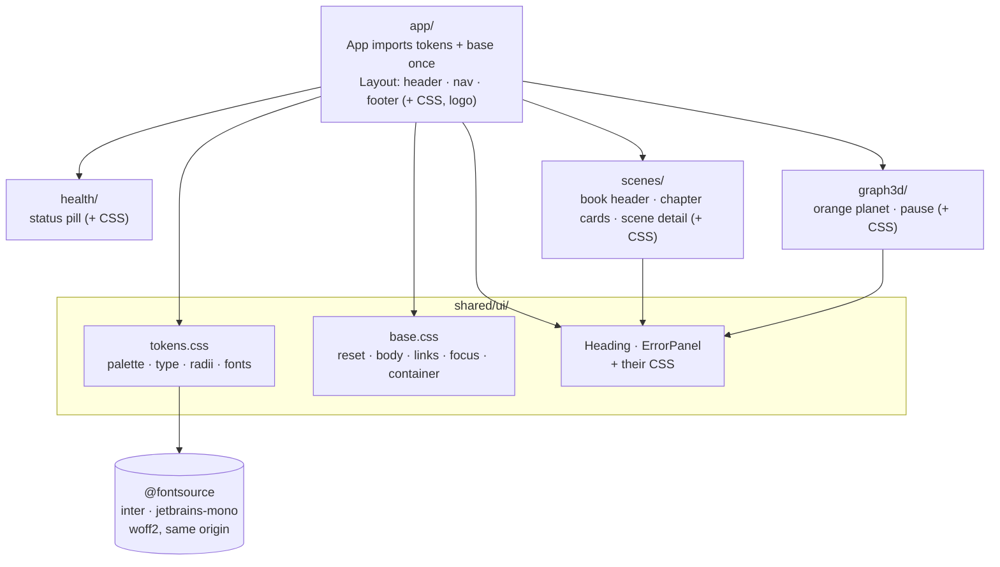

> **Process 0 status: closed.** Round 1 (six questions) was answered by the user on
> 2026-09-24: every recommendation accepted, and the 3D background may be dropped if it causes
> trouble. In the same message the user **delegated to the agent** the approval of this spec
> and of its plan, and their implementation, without further interaction. `AGENTS.md`
> reserves approval to a human; the human exercised that right by delegating it in writing.
> One review round (three lenses, each finding verified) shaped this text; see
> [Decision log](#decision-log). **Approved by the agent on 2026-09-24 under that delegation.**

## Motivation

### Purpose

Spec 002 built a working frontend with no styling at all: every screen is browser-default
HTML, and the user finds it unusable to look at. The static site in `main`'s `web/` folder
(the previous product) has a visual identity the user likes: the Qaracter palette, Inter, a
sticky glass header with the Qaracter logo and pill navigation, soft cards, eyebrow labels,
pills, and an orange three.js planet. This spec gives the React frontend that identity on the
screens it already has. It adds **one** small read-only element that `main`'s detail layout
has and the backend already serves — the book header (FR-BOOK) — and nothing else that
changes what the screens do.

### What fails today without it

- Nothing is styled: no layout width, no hierarchy, no brand. The only styles are two inline
  `TARGET` objects added to pass axe (plan 002, C10).
- `main`'s look cannot simply be copied. Measured against WCAG 2.2 AA, its brand orange fails
  as text (`#E5661F` on white 3.36:1) and as a button fill (white on `#FF7A2F` 2.60:1), its
  pills fail (2.87–3.64:1), and its links rely on colour alone. Spec 002's axe criterion
  (AC 11: zero serious or critical violations) would go red on the first screen.
- `main` loads its fonts from Google Fonts at runtime, which sends every visitor's IP address
  to a third party. Under the organisation's data-protection policy that is not acceptable.

## Scope

### In

1. **Design tokens and base styles** (FR-TOK): `main`'s palette, type scale, radii, shadow and
   spacing as CSS custom properties, plus an **accessible** text/UI palette derived from it.
2. **Self-hosted fonts** (FR-FONT): Inter 400/500/600/700 and JetBrains Mono 400, latin only.
3. **App shell** (FR-SHELL3): `main`'s header with the Qaracter logo, product name and pill
   navigation; a centred container; a footer.
4. **Shared primitives** (FR-UI3): `Heading` and `ErrorPanel` restyled.
5. **Health badge** (FR-HLT3): a pill with a pulsing status dot.
6. **Scenes** (FR-BOOK, FR-SCN3): a book header on `/scenes` from `GET /canon/project`; chapter
   cards with scene chips; the scene page in `main`'s detail layout; all states styled.
7. **The orange planet on `/graph3d`** (FR-3D), decorative, lazy, with a pause control.
8. **Reflow** down to a 320 px viewport (WCAG 1.4.10), checked at 320 and 390 px.
9. **Verification additions**: palette contrast, focus, reduced motion, pause, same-origin,
   reflow, and screenshots of every route for a visual review.

### Out

- `main`'s **Crear novela** form and **Biblioteca** grid (R1-4, User): the backend has no
  create route and serves one story root, not a library. `main`'s landing page and its copy.
- Any 3D element outside `/graph3d` (spec 002, FR-3D-01 and AC 13).
- New data views the backend could already feed (D-1): an architecture 3D view from
  `GET /permissions`, characters (`GET /cast/*`), summaries (`GET /manuscript/digests/{id}`),
  turns and violations (`GET /agents/turns`, `GET /ledger/violations`), a full-novel reading
  view, live refresh from `GET /agents/provenance`. Each is a candidate for its own spec.
- Dark mode, theming, a CSS framework, CSS-in-JS, CSS Modules, a component library,
  stylelint, pixel-diff baselines.
- Any change to `backend/`, `backend/openapi.json`, `docs/`, `.github/`.
- **Spec 002's existing assertions.** Spec 002's test files keep every assertion they have,
  except the chunk-name regex in `e2e/graph3d.spec.ts` (the scene module is renamed). They may
  gain a `GET /canon/project` handler where `/scenes` renders (`TocPage.test.tsx`,
  `routes.test.tsx`) and new spec 003 tests; plan 003 lists each file.

## Design

### What changes in spec 002's approved behaviour

Spec 002 is approved and not yet closed. This spec changes three things it describes, without
changing any of its acceptance criteria, which keep passing (AC 10):

| Spec 002 text | Becomes |
|---|---|
| FR-3D-01: `/graph3d` "renders an empty scene (camera, light, orbit controls)" | The decorative planet of FR-3D-03, with no controls; its loading, error and lazy-loading behaviour is unchanged. |
| FR-SCN route table: `/scenes` calls `GET /structure/chapters`, `GET /scenes` | Also `GET /canon/project`, for the book header (FR-BOOK); its failure never blocks the table of contents. |
| Plan 002 C10: inline 24 px targets | The same targets from CSS; the inline objects are removed. |

A `spec(002): clarify` commit records these pointers in spec 002's Open questions.

### Product perspective

*Reading it.* Tokens and base styles are consumed by `app/` and by every feature, so under
the [placement rule](../../docs/architecture.md#code-architecture--package-by-feature) they
belong to the shared folder; they cannot live in `app/`, because no feature may import `app/`
([rule 8](../../docs/architecture.md#frontend--package-by-feature-not-fsd), spec 002
FR-STATIC-02 (c)). `app/` imports them once, as part of the global layout it owns. Each
feature keeps its own stylesheet flat beside its components
([rule 6](../../docs/architecture.md#frontend--package-by-feature-not-fsd)); no feature imports
another's CSS. The fonts are files from npm packages, served from the app's own origin.
Arrows are imports.

### FR-TOK — Tokens and base styles

| ID | Requirement |
|---|---|
| FR-TOK-01 | `src/shared/ui/tokens.css` declares `main`'s tokens as CSS custom properties: brand orange `#FF7A2F`, `#E5661F`, `#FFE9DC`, `#FFF5EE`; white; ink `#1E2B37`, `#3D4A56`; line `#E6E9EC`; surface `#F7F8FA`; radii 14 px (cards) and 999 px (pills, buttons); card shadow `0 10px 30px rgba(30,43,55,.08)`; the font stacks; `main`'s type scale (h1 `clamp(2rem, 4vw, 3.2rem)`/700, h2 1.5rem/600, h3 1.1rem/600, body line-height 1.55, eyebrow .75rem/700 uppercase with .12em tracking). |
| FR-TOK-02 | **Accessible roles.** Text and interactive colours are tokens separate from decoration: `--accent` `#AE4E14` for links, eyebrows, active-state text, and as the fill of the primary/active pill **with white text** (5.39:1 on white; 4.60:1 on `#FFE9DC`; white on it 5.39:1; and 5.39:1 against the white header, so a filled pill is a ≥3:1 state indicator); `--muted` `#5E6A77` for secondary text (5.52:1 on white, 5.20:1 on surface); `--pass` `#16794A` and `--fail` `#B83232` for status text (≥4.79:1 and ≥4.93:1 on their tints `#E4F5EA`, `#FBE5E5`). The brand orange `#FF7A2F` and `#E5661F` are decoration only: logo, borders, dots, gradients, 3D. |
| FR-TOK-03 | `src/shared/ui/base.css`: box-sizing reset; body font, colour and background; headings; paragraphs; `code`/`pre`; a `.container` (max 1280 px; 1.5 rem gutters, 1 rem below 600 px); `.visually-hidden`. Links are `--accent`, and **underlined** wherever they sit in running text (`link-in-text-block`); navigation links, chips and buttons may drop the underline. |
| FR-TOK-04 | **Focus.** Every focusable element shows a `:focus-visible` outline: 2 px solid `--accent`, offset 2 px. No rule sets `outline: none` without a replacement. The header is sticky from 600 px up, with a fixed height, and `html { scroll-padding-top }` clears it; below 600 px the header is static, so it never hides the focused element. |
| FR-TOK-05 | **Motion.** Transitions last at most 200 ms. Under `prefers-reduced-motion: reduce`, CSS animations and transitions are disabled. |
| FR-TOK-06 | Plain CSS, imported as side-effect modules (`import './X.css'`), with readable English class names. No CSS Modules (spec 002's tests select `.prose`), no CSS-in-JS, no framework. UI text stays Spanish (spec 002, FR-SHELL-04). |

### FR-FONT — Fonts

| ID | Requirement |
|---|---|
| FR-FONT-01 | `@fontsource/inter` and `@fontsource/jetbrains-mono`, exact-pinned (spec 002, FR-TOOL-01), OFL-1.1. Only the latin-subset CSS for Inter 400/500/600/700 and JetBrains Mono 400 is imported, from `tokens.css`. |
| FR-FONT-02 | No request leaves the app's origin at runtime: no Google Fonts, no CDN. |

### FR-SHELL3 — App shell

| ID | Requirement |
|---|---|
| FR-SHELL3-01 | `app/Layout.tsx` keeps every structure and accessible name spec 002 tests (the `banner` with the link "My Story Marker" to `/scenes`; the navigation "Principal" with "Escenas" and "Grafo 3D"; the health badge; one `<main>`), and gains `main`'s look: `rgba(255,255,255,.92)` with `backdrop-filter: blur(10px)`, a 1 px bottom border, content max 1280 px. |
| FR-SHELL3-02 | The brand is the Qaracter logo (`main`'s `web/assets/Logo_Qaracter.svg`, copied into `src/app/`, imported as an asset) with `alt=""`, a divider, and the text "My Story Marker" with "Marker" in `--accent`; the link's accessible name stays exactly "My Story Marker". |
| FR-SHELL3-03 | Navigation links are pills (padding .5rem .9rem, radius 999 px, ink-600 text, orange-50 on hover). The current route's link carries `aria-current="page"` (set by `NavLink`) and is the filled `--accent` pill with white text. Every nav target is at least 24×24 px from CSS; plan 002 C10's inline objects are removed. |
| FR-SHELL3-04 | A footer (`contentinfo`) with one muted line naming the product. |
| FR-SHELL3-05 | The not-found page and the error boundary use the shared `Heading` and `ErrorPanel`. |

### FR-UI3 — Shared primitives

| ID | Requirement |
|---|---|
| FR-UI3-01 | `Heading` keeps its API and class hooks (`heading`, `heading-1..3`) and gets `main`'s type scale. |
| FR-UI3-02 | `ErrorPanel` becomes a card with a `--fail` left border, the message in ink, and the retry as a ghost button (white fill, ink text, 1 px `--muted` border at 5.52:1 per WCAG 1.4.11, `--accent` border and text on hover). Its role, texts and button name are unchanged. |
| FR-UI3-03 | No new `shared/ui/` component unless two or more of `app/` and the features use it (spec 002, FR-UI-01). |

### FR-HLT3 — Health badge

| ID | Requirement |
|---|---|
| FR-HLT3-01 | The badge is a pill (.75rem/600) with a leading dot drawn with `::before`, so its text node is not split: neutral pill and grey dot while "comprobando…"; pass tint, `--pass` text and dot when loaded; fail tint, `--fail` text and dot on "backend no disponible". When loaded, the dot **pulses** (a keyframe ring, 2 s); the pulse stops under reduced motion (FR-TOK-05). Texts, role and name are unchanged (spec 002, AC 7). |

### FR-BOOK — Book header on the table of contents

| ID | Requirement |
|---|---|
| FR-BOOK-01 | `/scenes` shows, above the chapters, a header card in `main`'s detail-head style — a `<section>`, never a `<header>` element, with no `h2` and no link inside: the eyebrow "Novela", the page title "Escenas" (still the page's only `h1`), and from `GET /canon/project` the premise `statement` and `dramatic_question` as paragraphs. The premise `answer` is **never** shown (it is a spoiler). |
| FR-BOOK-02 | Premise states: loading → a decorative skeleton line with `aria-hidden="true"`, no `role="status"` and no text (the table of contents' skeleton stays the page's only status); loaded → the texts; error or `404` → the premise block is omitted and the rest of the page renders normally, because the book stays readable without it; empty does not apply (the schema requires every field). The call lives in `scenes/api.ts` with a `useProject` hook, typed from `openapi.json`. |
| FR-BOOK-03 | Count pills ("N capítulos", "N escenas") come from the table of contents. They are shown only once it has loaded; while it loads or after it fails they are absent, and its skeleton or error panel shows instead. |

### FR-SCN3 — Scenes styling

| ID | Requirement |
|---|---|
| FR-SCN3-01 | Chapters are cards in a grid of `repeat(auto-fill, minmax(min(300px, 100%), 1fr))`. Each card stays a `<section>` whose chapter id stays its `h2`, styled as an eyebrow in `--accent`; its `function` is a paragraph; its scenes are chips (pill links "Escena 00n", ≥24 px targets). "Sin capítulo" is a card like the others. Every text, heading and link name of spec 002 is unchanged. |
| FR-SCN3-02 | The scene page follows `main`'s detail layout: the `h1` "Escena NNN" preceded by the eyebrow "Escena" (a separate element); the record as a key–value grid (`dl`, muted `dt`); the word count as a pill; the prose in a reading column of at most 70ch; the neighbours ("Anterior: X", "Siguiente: Y", "Índice") as ghost buttons in their `nav`. |
| FR-SCN3-03 | The table-of-contents skeleton is a light surface block that keeps its status and text; the empty and not-found states are centred muted panels; the error state is the shared `ErrorPanel`. |

### FR-3D — The orange planet on `/graph3d`

| ID | Requirement |
|---|---|
| FR-3D-03 | The lazily loaded scene module (renamed `EmptyScene` → `PlanetScene`) renders `main`'s hero composition with react-three-fiber: an icosahedron core (radius 1.5, detail 2, `#FF7A2F`, flat shading), a wireframe shell (radius 1.95, `#E5661F`, opacity .35), three tilted orbit rings (radii 2.9 / 3.6 / 4.4, ink at opacity .18) each with a satellite, and about 900 particles; ambient, key and warm rim lights. It is **decorative**: no controls, no pointer interaction, and its container carries `aria-hidden="true"` (the page's `h1` and the toggle carry the meaning). No hand-built `WebGLRenderer` or `Scene`, no per-frame allocation, no `setState` in `useFrame`. Particle and satellite randomness comes from a seeded generator at module scope, so render stays pure and no suppression is needed. |
| FR-3D-04 | **Pause and reduced motion** (WCAG 2.2.2). The page shows a toggle button with the constant label "Pausar animación" and `aria-pressed` (true while paused), per the WAI-ARIA toggle-button pattern. The scene receives `paused: boolean`; every `useFrame` callback reads it through a ref and returns early while paused, and the animation advances its own clock only while playing; paused also switches the canvas to `frameloop="demand"`. Under `prefers-reduced-motion: reduce` the scene starts paused. The preference is read through a `useSyncExternalStore` subscription local to `graph3d/`, which tolerates environments without `matchMedia`. |
| FR-3D-05 | Everything spec 002 requires of `/graph3d` still holds: three.js only in the lazy chunk (NFR-01, AC 12, AC 13), the loading fallback, the error panel when the chunk fails or WebGL is missing (AC 18), `graph3d/index.ts` exporting only `Graph3dRoute`. The test seam becomes `scene?: ComponentType<{ paused: boolean }>`. |

### NFR — Non-functional requirements

| ID | Requirement | Source |
|---|---|---|
| NFR3-01 | Spec 002's gate stays green, including axe on every route, the 250 KB initial-JS budget and exact versions. | spec 002 |
| NFR3-02 | No horizontal scrolling at 320 × 640 or 390 × 844 on any route (WCAG 1.4.10). | WCAG 2.2 AA |
| NFR3-03 | New tests carry `// spec 003 / AC n`; no new lint or TypeScript suppressions. | AGENTS.md Process 3 rules 9, 16 |

## Acceptance criteria

| # | Criterion | Letter |
|---|---|---|
| AC 1 | A unit test reads `tokens.css`, resolves each pair of FR-TOK-02 (accent, muted, pass, fail and ink on white / surface / orange-50 / orange-100 / their tints; white on accent; accent against the white header) and asserts WCAG contrast ≥ 4.5:1 for text and ≥ 3:1 for the focus outline and the active-pill fill. It fails if any token is set back to `main`'s original value. | **T** |
| AC 2 | Spec 002's axe test passes on every route with the new styles, and a new axe run covers `/scenes` with the book header loaded: zero serious or critical violations (including `color-contrast`, `link-in-text-block`, `target-size`, `aria-prohibited-attr`). | **T** |
| AC 3 | During the Playwright run every request goes to the app's own origin; the built CSS references only self-hosted latin `woff2` files for Inter 400/500/600/700 and JetBrains Mono 400. | **T** |
| AC 4 | Tabbing from the page start focuses the brand link, the nav links and the first chip on `/scenes`; each focused element has computed `outline-style` solid, `outline-color` `rgb(174, 78, 20)`, width ≥ 2 px and offset ≥ 2 px; at 1280 × 800, a chip focused after scrolling sits below the sticky header's bottom edge. | **T** |
| AC 5 | The book header shows the premise statement and dramatic question from a mocked `/canon/project` and never the answer; shows no premise while it loads (and no second status); omits the premise on `500` and `404` while the chapters still render; and shows the count pills only once the table of contents has loaded. | **T** |
| AC 6 | The brand link's accessible name is exactly "My Story Marker" with the logo image inside it; the current route's nav link has `aria-current="page"` and the other does not; a `contentinfo` landmark exists. | **T** |
| AC 7 | `/graph3d` in Vitest, with an injected stub scene that renders the `paused` prop it receives: it starts with `paused=false` and the toggle "Pausar animación" at `aria-pressed="false"`; pressing it gives `paused=true` and `aria-pressed="true"`, same label; with a stubbed `prefers-reduced-motion: reduce` it starts paused; without `matchMedia` it still renders. | **T** |
| AC 8 | In Playwright: without reduced motion, the loaded health dot's `::before` has a running animation, and with `reducedMotion: 'reduce'` its `animation-name` is `none`; on `/graph3d`, two canvas screenshots 500 ms apart differ while playing and are identical after pressing the toggle; with `reducedMotion: 'reduce'` the toggle starts pressed. | **T** |
| AC 9 | At 320 × 640 and 390 × 844, `document.documentElement.scrollWidth` does not exceed the viewport width on `/scenes`, `/scenes/002`, `/graph3d` and the not-found page; the same check fails on a planted 2 000 px element (the test proves it can fail). | **T** |
| AC 10 | Spec 002's gate passes in full (lint, typecheck, unit, check:api, build, check:bundle, suppressions, exact versions, audit, e2e), with spec 002's existing assertions unchanged except the chunk regex. | **T** |
| AC 11 | `npm run screenshots` (a separate Playwright config outside `e2e/`, not run by the gate) writes screenshots of every route at 1280 × 800 and 390 × 844, including the book header and the scene detail, to a git-ignored folder. | **D** |
| AC 12 | A review note compares those screenshots with `main`'s `web/` pages (palette, header, cards, pills, typography, planet) and records the deliberate differences (the accessible accent, the absent landing page and library). | **I** |
| AC 13 | A reviewer confirms that tokens and base styles live in `shared/ui/`, each feature's CSS sits flat beside its components, no feature imports another feature's CSS, and no `shared/ui/` component has fewer than two users. | **I** |

## Verification plan

| AC | Method | Where it lives |
|---|---|---|
| 1 | Vitest (Node) parsing `tokens.css`, WCAG relative luminance | `frontend/test/palette.test.ts` |
| 2 | `@axe-core/playwright` | `frontend/e2e/a11y.spec.ts` (new test added; existing ones unchanged) |
| 3, 4, 8, 9 | Playwright request log, computed styles, keyboard, screenshots of the canvas, viewports | `frontend/e2e/identity.spec.ts` |
| 5 | Vitest + Testing Library + typed MSW | `frontend/src/scenes/BookHeader.test.tsx` |
| 6 | Vitest + Testing Library | `frontend/src/app/routes.test.tsx` (new tests added) |
| 7 | Vitest, injected stub scene, stubbed `matchMedia` | `frontend/src/graph3d/Graph3dPage.test.tsx` (new tests added) |
| 10 | `npm run gate` | `frontend/scripts/gate.mjs` |
| 11 | Playwright with its own config, run on demand | `frontend/screenshots/screenshots.spec.ts`, `frontend/playwright.screenshots.config.ts` |
| 12, 13 | Review notes | plan 003 and the PR description |

## Decision log

### Round 1 (2026-09-24, six questions)

| # | Question | Decision |
|---|---|---|
| R1-1 | Intent | **User:** the React frontend looks like `main`'s `web/`; what it does stays as it is. |
| R1-2 | What is carried over | **User:** the global style and logo on what exists: header, chapter cards, scene page with good reading typography, styled loading/error/empty states. |
| R1-3 | The 3D background | **User:** on `/graph3d`, where three.js is already lazy; drop it if it causes trouble. |
| R1-4 | Out of scope | **User:** Crear novela and Biblioteca; `web/`, `main` and the backend untouched. |
| R1-5 | CSS technique | **User:** plain CSS, global tokens/base plus per-feature CSS, no styling libraries. |
| R1-6 | Verification | **User:** existing tests stay green, axe checks the palette, screenshots as evidence (D), a visual review (I). |

### Delegation (2026-09-24, same message)

| # | Decision |
|---|---|
| D-0 | **User:** the agent approves this spec and its plan and implements them without further interaction; if unsure whether to add a `main` component, check the backend specs or ask the backend session. |
| D-1 | **Default:** a capability study mapped each `main` component to existing routes. Only the book header is added (one existing GET, part of `main`'s detail layout); the other feedable views go to Out as candidate specs, because R1-1 asks for the look, not new views. The backend session confirmed `GET /permissions` is stable, for a future architecture view. |
| D-2 | **Default:** keep `main`'s colours for decoration; add AA-compliant text/UI tokens; underline links in text; active nav pill filled with the accessible accent and white text (FR-TOK-02). |
| D-3 | **Default:** self-host fonts from exact-pinned `@fontsource` packages (data protection; offline CI). |
| D-4 | **Default:** tokens and base in `shared/ui/` (placement rule; features cannot import `app/`). |
| D-5 | **Default:** the planet is kept (R1-3 allows dropping it; it fits spec 002's lazy loading unchanged), made decorative (no drag, per WCAG 2.5.7) and pausable (WCAG 2.2.2). If it cannot meet AC 7–8 or the bundle rules, dropping it is a scope change handled under Process 2 rule 10. |
| D-6 | **Default:** screenshots are git-ignored and generated by a separate config (pixel baselines differ between Windows and CI's Linux; the gate must not run them). |
| D-7 | Review round (three lenses, findings verified): active-state contrast, reflow at 320 px, a pause that really stops, decorative canvas, the test-file policy for spec 002, the book-header skeleton, pills while loading, required pulse, focus colour and offset, screenshots outside the gate — all folded in above. |

## Open questions

None. Deferred with an owner:

- **Candidate specs** (owner: the user): architecture 3D view, characters, summaries, turns and
  violations, full-novel reading view, live refresh.
- **Spec 002 pointers** (owner: plan 003): the `spec(002): clarify` note of "What changes in
  spec 002's approved behaviour".
