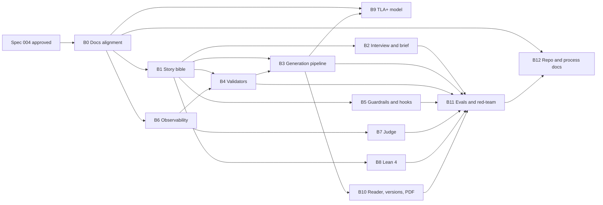

> **Process 0 status: closed.** Rounds 1–4 are recorded in
> [`exam/process-0/`](../../exam/process-0/). On 2026-09-24 the user accepted every default
> of [Open questions](#open-questions) and changed one decision: a chapter holds **3 to 5
> scenes**, not 4 to 7 (decision 20, D3). Nothing is left open. The spec stays `draft` until
> the user approves it explicitly; nothing below may be planned or built before that.

This is an **umbrella spec**. It changes no code itself. It does three things:

1. **Confronts** every requirement of the final exam brief with what `docs/` says today.
2. **Decides** how each contradiction and absence is resolved, and makes those decisions
   binding by editing `docs/` (block B0).
3. **Splits** the rest of the work into block specs that can be drafted, approved and built
   **in parallel**, each with disjoint file ownership and explicit contracts to its
   neighbours.

The exam brief itself is transcribed in [`ignore.md`](../../ignore.md#anexo--enunciado-completo-del-examen).
Its requirements are stated as checkable data in
[`exam/requirements.toml`](../../exam/requirements.toml); every requirement id below
(`E01`, `C02`, `L03`, …) is an id from that file.

---

## Motivation

### Why

The harness was designed for a generic long novel written scene by scene. The exam asks
for a different product: a **personalised gift novel** of 10 chapters of 1,000–1,500 words,
generated from a validated brief about a real recipient, readable on the web, with formal
verification of the story (Lean 4) and of the harness (TLA+), Langfuse observability,
guardrails and measured evals.

`AGENTS.md` makes `docs/` the highest authority. Today `docs/` contradicts the exam in
several load-bearing places (a derived-only SQLite, git as the version store, six roles
without an interviewer or a judge, narrative quality as an accepted risk). Building the exam
features against those docs would mean every block spec either contradicts a higher layer
or silently rewrites it. This spec settles the design once, in one place, so the block specs
can be written against a consistent `docs/`.

### What fails today without it

- Parallel sessions already write `frontend/`, `backend/` and specs on the same branch.
  Without a declared split, two block specs will edit the same files and the same docs.
- The exam checker reports **17 of 72** checkable required items met
  ([`exam/compliance.md`](../../exam/compliance.md), 2026-09-24). Nothing says which spec
  closes the other 55, or in which order.
- Spec 001 has deferred findings that touch exam requirements (round 4), and spec 003
  built reader pages that the exam requires but that no doc describes.

### What already exists and is reused

The refactor **extends** spec 001, 002 and 003; it does not replace them.

| Exam area | Already built (branch `spec/001-backend`) |
|---|---|
| Harness core | Store layer and permission table (Figure 3 as data), derived index with FTS5 and optional `sqlite-vec`, `dossier`, `select_entities`, `assemble_context` with the 100k cap, `promote`/`rule`/`reconcile`, mechanical audit of invariants 1r, 2, 4, 5, 7, 8r, 9, 10 |
| Turn | Orchestrator of Figure 4 with `merged`/`escalated`/`awaiting_ruling`, lock, per-step records, resume of an interrupted turn, human rulings, SSE; bounded revisions (`TURN_MAX_REVISIONS`), one retry on malformed output, refusal escalation |
| Roles | Writer (`write`, `revise`, `digest`, `rollup`), style editor (`polish`), mechanical and semantic auditor (explanation now stored, DR-07), canoniser (`extract`) — all through `claude -p` with validated structured output |
| Observability base | Turn record with model id, `prompt_version` (content hash) and token counts including cache reads |
| Frontend | Spec 002 foundation and spec 003 rev. 2 reader: cover with a dedication (kept in the browser), chapter index, chapter reader, character and location sheets with the chapters where each appears |
| Delivery | CI for backend and frontend, committed OpenAPI contract with schemathesis, exam checker (`exam/`). **On branch `exam/rescope` only**, not yet here: `.mcp.json` with Playwright MCP, `.claude/memory/`, `.claude/commands/exam-gap.md`, root `README.md`, `presentacion/README.md`, `ejemplos/README.md`; B12 brings them by explicit paths |

---

## Scope

### In

1. **The confrontation** of `docs/` with the exam brief, requirement by requirement
   ([Design § 1](#1-confrontation-docs-against-the-exam-brief)).
2. **The cross-cutting design decisions** that resolve it
   ([Design § 2](#2-cross-cutting-decisions)).
3. **Block B0 — docs alignment**, done under this spec: the Process 1 edits of `docs/`,
   `AGENTS.md` and `CLAUDE.md` that make those decisions binding.
4. **The block map**: twelve blocks, each with its owned paths, its dependencies, the
   contracts it provides and consumes, and the requirement ids it closes
   ([Design § 3](#3-block-map)).
5. **The parallel-work protocol**: branches, shared files, migration numbering and sync
   ([Design § 5](#5-parallel-work-protocol)).
6. **The block spec template** from which each block spec is generated
   ([Design § 6](#6-block-spec-template)).

### Out

- **Any code.** Every change under `backend/`, `frontend/`, `formal/`, `evals/` is done by
  a block spec, after its own approval and plan.
- **Out of the exam's scope** (question 2, default): payments, user accounts, printing,
  illustrations, audio, production deployment.
- **Optional items** until every required block is `implemented`. They are listed as block
  B12-opt only, and are the exam's full optional list: a read-only MCP server (FastMCP)
  with `list_novels`, `get_chapter`, `list_versions`, `query_story_bible`, `download_novel`
  (`X01`); MCP write tools for reader changes, with permissions and confirmation; prose
  linters (`X02`); a linter for manual edits that checks the story bible and forbidden
  words and sends a changed fact back through the validators, Lean included; more Lean
  invariants or general proofs; TLA+ of the MCP server or of concurrent regenerations;
  login with SQLite, hashed passwords and tokens (`X03`); a security agent or skill with
  `docs/security-report.md` (`X04`).
- Rewriting what specs 001–003 already built, beyond what a block spec needs to extend it.
- `main` and its legacy content. Moving `main` is a separate, explicit user decision.

---

## Design

### 1. Confrontation: docs/ against the exam brief

Verdicts: **covered** (docs already say it) · **partial** · **contradicts** · **absent** ·
**code-only** (docs need no change; only implementation is missing). The owning block is
the one that closes the requirement; B0 edits the docs for every *contradicts*, *absent* and
*partial* row.

#### 1.1 Configuration (exam § 1)

| Req | What `docs/` says | Verdict | Resolution | Block |
|---|---|---|---|---|
| C01 interviewer collects name, age, traits, memories, genre, tone, length, vetoed topics | No brief, no recipient; Layer 0 is premise, thesis, genre contract, style bible ([definitions](../../docs/definitions.md#layer-0--project)) | absent | New entities **Brief** and **Recipient** in `definitions.md`; new role **interviewer** in Figure 3 that writes only the brief | B2 |
| C02 structured brief validated with schema | Every store record is typed and schema-validated on read ([architecture](../../docs/architecture.md#storage-layout), `AGENTS.md` rule 8) | partial | The brief is a typed record in the authoritative database (decision D2), with a JSON Schema | B2 |
| C03 missing data and at least one contradiction type | — | absent | Brief validation rules in `definitions.md` (required fields; age × genre/tone contradiction) | B2 |
| C04 pasted free text is untrusted; facts extracted | "Injected text is data, never instruction" ([verification](../../docs/verification.md#red-teaming--adversarial-testing--t--i)) for stores only | partial | Extend the rule to user free text: delimited as data, facts extracted into the brief with provenance `source: free_text` | B2 |

#### 1.2 Reading (exam § 2)

| Req | What `docs/` says | Verdict | Resolution | Block |
|---|---|---|---|---|
| R01 web or interactive PDF | Frontend is for spatial views: locations, entity graph, timeline ([architecture](../../docs/architecture.md#repository-and-application-stack)) | contradicts | The frontend's first purpose becomes **the reader**; spatial views stay secondary. Web reader plus PDF export (decision 9) | B10 |
| R02 navigable chapter index | — (built by spec 003 rev. 2) | absent in docs | Describe the reader in `architecture.md` | B0 docs, built |
| R03 character and place sheets from the story bible, linked to chapters | — (built by spec 003 rev. 2 from the file stores) | absent in docs | Sheets read the story bible; chapter links come from fact usage per scene (decision 23) | B10 |
| R04 cover with a personalised dedication | — (spec 003 keeps the dedication **in the browser only**) | absent | The dedication is a brief field, stored with the novel and rendered on the cover and in the PDF | B2 (field), B10 (render) |
| R05 reader change request: find chapters using the fact, regenerate only those without breaking continuity | `reconcile(canon_change)` returns affected scenes ([architecture](../../docs/architecture.md#operations)) | partial | The reader **selects a fragment or a fact on the page** and states the change ("the dog is called Nala"). New operation **`change_fact(novel, fact, new_value)`**: update the fact, `reconcile`, regenerate only the affected scenes, re-run chapter-close validators, publish a new version | B10 (with B3) |
| R06 mark changed chapters | — | absent | "Changed" = chapter text hash differs from the previous version (decision 27) | B10 |
| R07 keep the previous version | "Versioning is git's, not the record's" ([architecture](../../docs/architecture.md#draft)) | contradicts | Versions live in the authoritative database; publishing never overwrites (decision 27). The Draft section is rewritten | B1, B10 |

#### 1.3 Harness (exam § 3)

| Req | What `docs/` says | Verdict | Resolution | Block |
|---|---|---|---|---|
| H01 planner, writer, editor/critic | Six roles; architect and world builder not model-invoked in v1 ([Figure 3](../../docs/architecture.md#figure-3--agents-and-write-permissions); spec 001 Decision 5) | partial | Decision 8: **planner** = architect invoked by a model, its output written under world builder (`canon/`) and architect (`structure/`, `scenes/`), no permission widened; **editor** = style editor + auditor; new **judge**, read-only | B3, B7 |
| H02 one reusable skill | Skills are listed in `.claude/skills/README.md`; none is about the harness | absent | A harness skill (e.g. "run and inspect one novel generation") | B12 |
| H03–H04 chapter-validation hook and policy hook | — | absent | One implementation, two triggers: named hook points in the orchestrator, and `.claude/settings.json` hooks calling the same code for hand edits (question 12 default) | B5 |
| H05 tools with validated schema | The model holds no tools; tool sets are the orchestrator's writes (spec 001 FR-PERM-06) | contradicts | Question 13 default: two read-only tools, `query_story_bible` and `get_chapter_summary`, served over a local MCP with JSON Schema; no write tool for any model | B3 |
| H06 bounded retries | Figure 4's revise loop; "every turn ends merged or escalated" ([coverage matrix](../../docs/verification.md#coverage-matrix)) | covered for scenes | Extend to the guardrail rewrite loop and the chapter-close gate | B3, B5 |
| Tokens and cost per novel in Langfuse | Tracing is adoption step 3, per turn ([verification](../../docs/verification.md#runtime-observability--tracing--d)) | partial | See § 1.6 | B6 |

#### 1.4 Memory (exam § 4)

| Req | What `docs/` says | Verdict | Resolution | Block |
|---|---|---|---|---|
| M01 story bible in SQLite; each fact records the chapters using it | SQLite is a derived index, "never a source" ([architecture](../../docs/architecture.md#memory-and-context-budget)) | contradicts | Decisions 6, 24, 25: an **authoritative database** beside the derived index; fact usage recorded **per scene**, chapters derived (decision 23) | B1 |
| M02 chronology table (events, moment, characters, place) feeding the formal validator | `ledger/timeline.yaml` maps story ↔ discourse axes; `canon/time.yaml` holds the calendar ([domain knowledge](../../docs/domain-knowledge.md#figure-5--story-time-against-discourse-time)) | partial | Chronology tables in the authoritative database, projected from scenes, participants, locations and brief dates; the Lean export reads them | B1, B8 |
| M03 chapter summaries build the next context | Digest ladder scene → chapter → arc ([architecture](../../docs/architecture.md#scenedigest)) | covered | — (built) | — |
| M04 checkpoint per chapter; resume from the last completed chapter | Turn resume only | partial | Decision 22: a chapter is complete when its scenes are accepted, its digest written and its close validators pass; resume at the first incomplete chapter keeping its accepted scenes | B3 |

#### 1.5 Validation and evaluation (exam § 5)

| Req | What `docs/` says | Verdict | Resolution | Block |
|---|---|---|---|---|
| V06 validators named, placed and scored | Invariants 1–10 and the auditor; no registry | partial | A **validator registry**: each validator has a name, an execution point (`scene_accept`, `chapter_close`, `pre_publish`, `hook`) and reports a result to the database and a Langfuse score (contract K3) | B4 |
| V01 chapter length in range | Scene `budget` only | absent | Chapter-close validator: 1,000–1,500 words, summed over its scenes | B4 |
| V02 names exactly as in the story bible | Invariant 7, forbidden variants of lexicon terms | partial | Chapter-close validator over canonical names of recipient and characters | B4 |
| V03 each mandatory brief element appears in some chapter, checked against SQLite facts | — | absent | Pre-publish validator over fact usage | B4 |
| V04 brief and role outputs match their schema | Role outputs validated, never repaired (spec 001) | partial | Add the brief schema; report schema results as validators | B2, B4 |
| V05 visual validation via browser MCP | Playwright for e2e flows ([verification](../../docs/verification.md#unit--integration-testing--t)) | partial | A pre-publish **visual check** run by an agent with Playwright MCP over cover, index and sheets; failures recorded and routed to the owning role; its real use documented | B12 (with B10) |
| S01 LLM-as-judge with rubric (continuity, tone, narrative quality, natural personalisation), score and justification per criterion | LLM-as-judge for style only ([evals](../../docs/verification.md#evals--t-offline--d-online)) | partial | New **judge** role and rubric; per-criterion score and justification; chapter-close and pre-publish. The rubric names the defects the exam rejects: inconsistent characters, senseless time jumps, chapters that contradict each other, mechanical or repetitive prose, abrupt endings, and forced personalisation (decision D11) | B7 |
| S02 human review of a full novel with the same rubric | Human gates on promotion and escalation only ([HITL](../../docs/verification.md#human-in-the-loop-review--i)) | absent | A human review protocol with the judge's rubric, and a comparison table | B7 |
| Narrative quality overall | **U**: "Chapter forty lands" ([coverage matrix](../../docs/verification.md#coverage-matrix)) | contradicts | The exam requires minimum quality. The row becomes **I** (judge as machine I, plus human review); literary excellence stays **U** | B0, B7 |
| L01–L04 Lean 4 | Theorem proving not applied to application code ([verification](../../docs/verification.md#formal-verification--theorem-proving--a)) | contradicts | Lean 4 verifies the **story's chronology**: a Lean file generated from the database with events, moment, characters present, place and birth dates; at least temporal order and age against birth date (question 15 default); `lake build` runs automatically and gates publication; a failure blocks the version and goes back to the editor as feedback; its result is a Langfuse score. B8 shows **one real case** Lean caught that no other validator did, or documents why none was found | B8 |
| T01–T05 TLA+ of the harness flow | Model checking of permissions and turn, adoption step 9 ([model checking](../../docs/verification.md#model-checking--a)) | partial | TLA+ of configuration → planning → chapter writing → validation → publication, with retries, checkpoint resume and reader regeneration; at least three safety invariants (never publish an unvalidated chapter; resume neither duplicates nor loses chapters; the previous version survives a regeneration; retries never exceed the limit) and liveness (every generation publishes or stops with an error); TLC on 5 chapters × 2 retries with its config in the repo; runs in development, not per generation; a README maps each action to the state or transition of the code; every counterexample TLC found is documented with the code change it caused | B9 |
| EV1–EV3 five briefs, results table, one tuning iteration | Eval kinds listed; no briefs | absent | Five briefs (one prompt injection, one temporal incoherence), a validator × brief table, one tuning iteration tied to Langfuse prompt versions | B11 |

#### 1.6 Observability (exam § 6)

| Req | What `docs/` says | Verdict | Resolution | Block |
|---|---|---|---|---|
| O01 one trace per generation, one session per novel | One trace per writing turn | contradicts | Session = novel (interview, generation, regenerations); trace = one generation or regeneration; turns become spans | B6 |
| O02 spans per role and tool; tokens, cost, latency per call, chapter, novel | Spans per agent invocation | partial | A named span for **every role** (interviewer, planner, writer, editor, judge, canoniser) and **every tool call**; cost computed from token counts and the pinned model price; totals per call, chapter and novel | B6 (every role's block emits through K2) |
| Validator scores to Langfuse | Human decisions as scores | partial | Every validator result — programmatic, semantic and Lean — is a score on its trace (contract K3). TLC is not traced: it runs in development | B4, B6, B7, B8 |
| O03 prompts versioned in Langfuse | Prompt version = content hash, local | partial | Prompts published to Langfuse; the version id is recorded per call | B6 |

#### 1.7 Guardrails (exam § 7)

| Req | What `docs/` says | Verdict | Resolution | Block |
|---|---|---|---|---|
| G01 forbidden-word lists in SQLite, global and per novel | `forbidden_variants` in `canon/lexicon.yaml` (invariant 7) | contradicts | Lists in the authoritative database, scope `global` or `novel`; lexicon variants stay as a third, canon-level source | B5 |
| G02 normalisation: case, accents, plurals, simple variants | Case-insensitive substring match | partial | Normaliser specified in `definitions.md` next to invariant 7 | B5 |
| G03 match → back to the writer, bounded; exhausted → stop and report | — | absent | Rewrite loop bounded, escalation reason `forbidden_word_limit` | B5 (with B3) |
| G04 each match in the audit log and Langfuse; policy audit log | Provenance log of store writes under `.index/` | partial | A **policy decision log** in the database; each match also a Langfuse event and score | B5 |
| G05 tests per level and for a variant | — | code-only | — | B5 |
| G06 100k tokens | Hard cap per invocation ([memory](../../docs/architecture.md#memory-and-context-budget)) | covered | — (built) | — |

#### 1.8 Repository deliverables

| Req | Verdict | Block |
|---|---|---|
| E01–E05 README, example brief, `.env.example`, no secrets, example novel PDF | partial (README, `.env.example`, no-secrets check exist) | B12, B11 (example novel) |
| E06 `CLAUDE.md` cared for and readable | partial: 17 lines deferring to `AGENTS.md` | B0 |
| K01–K06 commands, memory, browser MCP config and documented use, skills and subagents documented | partial | B12 |
| D01–D06 process docs: initial spec; trade-offs as options, criteria and choice (at least single- vs multi-agent, story-bible format, reading model, TLA+ integration with the real flow, Lean invariants prioritised); one short explainer per course concept applied; diagrams (harness architecture, TLA+ state machine, SQLite schema, validators with their execution point); iteration log of cause and effect after each eval, TLC counterexample or Lean failure; red-team log | absent (`docs/process/` decided, decision 5) | B12 |
| P01–P05 technical-commercial presentation: main deck in PDF and in its editable format, annexes as separate descriptively named files, a README listing content and language, a demo video in `presentacion/` or linked from the README; all committed **before the storyMaker deadline** | partial (README skeleton on `exam/rescope`) | B12 |
| E07–E08 MyFactory final commit; submission email with subject `[Harness Engineering] Entrega final — <name>`, both final-commit links and a sentence of at most three lines on the most important design decision. The final commit counts, not the email time | manual | the user |

#### 1.9 Findings from specs 001 and 003 that touch the exam (question 32 default)

| Finding | Exam requirement touched | Block |
|---|---|---|
| The previous scene's `literal_tail` is taken by discourse order, so an analepsis gets a later scene's tail; with 3–5 scenes per chapter the 500-word tail is longer than a scene | Continuity, no senseless time jumps | B3 |
| Provenance lines of draft, digest, proposal and audit writes carry no scene or turn id | Audit log, per-chapter traceability | B5 |
| Spec 003 keeps the dedication in the browser only | R04 | B10 |
| Spec 003 reads sheets from file stores, not from the story bible's fact usage | R03 | B10 |

---

### 2. Cross-cutting decisions

These bind every block. Numbers are the Process 0 question numbers.

| # | Decision |
|---|---|
| D1 (6, 24, 25) | **One authoritative SQLite database** (default path `data/harness.sqlite`, set by environment), separate from the derived index under `.index/`, with its own migrations. It holds the novel, its versions, the brief, facts and their usage per scene, chronology, forbidden-word lists, the policy decision log and validator results, all keyed by `novel_id`. Prose, canon and cast stay in files, **one store tree per novel** under a novels root. |
| D2 (26) | **Brief facts are authoritative in the database.** Files the planner writes cite the fact id. A reader change updates the fact; `reconcile` finds the scenes; the owning role rewrites the file. A fact never has two versions. |
| D3 (7, 20) | A novel has **10 chapters** of 1,000–1,500 words. A chapter holds **3 to 5 scenes**; the planner splits the 1,000–1,500 words into scene budgets, about 200–500 words each. |
| D4 (21) | Validators run at **scene acceptance** (mechanical audit, forbidden words, schema) and at **chapter close** (length, exact names, brief coverage so far, judge); **pre-publish** runs brief coverage, Lean and the visual check. A chapter failure goes back to the scene holding the evidence. |
| D5 (22) | Chapter checkpoint and resume as in round 2. |
| D6 (23, 27) | Fact usage per scene; versions as rows with text and hash per chapter; nothing is deleted. |
| D7 (8) | Roles: interviewer, planner, writer, editor (style editor + auditor), judge, canoniser. **No role gains a write it does not have today**, except the interviewer writing the brief and the judge writing validator results — both new rows in Figure 3. |
| D8 (9) | Web reader first, PDF export from the backend. |
| D9 (10, default) | Novel prose, root README and presentation in Spanish; `docs/`, specs and code in English. The embedder moves to the multilingual 384-d MiniLM before the first real rebuild. |
| D10 (5) | `docs/process/` is a **record** area: it cites `docs/`, never defines design, and is edited without Process 1 unless it states how the system works. |
| D11 (exam) | **Personalisation and narrative quality weigh the same.** The system must not optimise for the brief's data merely appearing. Every block that judges prose — the programmatic validators (B4), the editor (B3) and the judge (B7) — checks both: that the personal details are present and integrated naturally, and that the story works as a story. A chapter that passes coverage but fails quality, or the reverse, is not accepted. |

---

### 3. Block map

Each block becomes **one block spec**, with the next free number when it is drafted. The
map fixes what each block owns so that parallel sessions never edit the same file.

| Block | Title | Owns (writes) | Depends on | Closes |
|---|---|---|---|---|
| **B0** | Docs alignment | `docs/**` (except `docs/process/`), `AGENTS.md`, `CLAUDE.md` | this spec approved | every *contradicts*/*absent*/*partial* row's doc half; E06 |
| **B1** | Authoritative story bible | `backend/app/bible/**`, `backend/app/commons/db/authoritative/**` (new), migrations `1xxx` | B0 | M01, M02, R07 (store half) |
| **B2** | Interview and brief | `backend/app/interview/**`, `backend/schemas/brief*.json`, prompt `interviewer.md` | B1 contract K1 | C01–C04, V04 (brief half), R04 (field) |
| **B3** | Generation pipeline | `backend/app/agents/**` (planner, chapter loop, checkpoint, `literal_tail`), prompt `planner.md`, the read-only MCP tools | B1 (K1), B4 (K3 interface), B6 (K2 interface) | H01 (planner), H05, H06 (chapter), M04 |
| **B4** | Programmatic validators | `backend/app/validators/**` | K1, K2, K3 | V01–V03, V06, validator registry |
| **B5** | Guardrails, policy and hooks | `backend/app/policy/**`, `.claude/settings.json`, `.claude/hooks/**` | K1, K3 | G01–G05, H03, H04, policy log |
| **B6** | Observability (Langfuse) | `backend/app/commons/observability/**`, Langfuse prompt publishing | — | O01–O03, cost and latency |
| **B7** | Judge and human review | `backend/app/judge/**`, prompt `judge.md`, `evals/human-review/**` | K1, K2, K3 | S01, S02 |
| **B8** | Lean 4 chronology | `formal/lean/**`, `backend/app/formal/lean_export.py` | K1 (chronology schema) | L01–L04 |
| **B9** | TLA+ harness model | `formal/tla/**` | B3 design (final mapping) | T01–T05 |
| **B10** | Reader, versions and PDF | `backend/app/reader/**`, `backend/app/export/**`, `frontend/src/cover/**`, `frontend/src/bible/**`, `frontend/src/reader/**` | B1, B3 | R03–R07, E05 (render) |
| **B11** | Evals and red-team | `evals/**` (except `human-review/`), `ejemplos/` | B2–B8, B10 | EV1–EV3, E02, E05 |
| **B12** | Repo, process docs and presentation | `docs/process/**`, `.claude/skills/<harness-skill>/`, `.claude/commands/**`, `.claude/memory/**`, `.mcp.json`, `README.md`, `.env.example`, `presentacion/**` | — (starts at once; closes last) | K01–K06, D01–D06, P01–P05, E01, H02, V05 (documentation) |
| B12-opt | Optional items (full list in Scope, Out) | decided later | all required blocks | X01–X04 and the other optionals |

#### Dependency graph



*Reading it.* B0 is the only serial gate: every other block writes against the aligned
docs. After it, four blocks start at once (B1, B6, B9, B12). B1 is the widest dependency,
so its **contracts are published first** (§ 4): a block that consumes a contract codes
against its interface and does not wait for the implementation. B3 and B4 depend on each
other only through contract K3, so they run in parallel. B11 closes the programme because
it measures everything else, and B12 closes last because it documents the results.

#### Waves

| Wave | Blocks in parallel | Starts when |
|---|---|---|
| 0 | B0 | this spec is approved |
| 1 | B1, B6, B9 (model from docs), B12 (scaffold) | B0 is merged |
| 2 | B2, B3, B4, B5, B7, B8 | contracts K1–K3 are published |
| 3 | B10, B9 (mapping to code) | B3 is merged |
| 4 | B11, then B12 (close) | every block above is `implemented` |

---

### 4. Contracts between blocks

A contract is published **first** by its provider, as an interface with a fake, in a small
commit on the integration branch. Consumers code against it. Changing a published contract
is a change to the provider's spec and goes back to `draft`.

| Id | Provider | What it is | Consumers |
|---|---|---|---|
| **K1** | B1 | The authoritative schema and repository API: `novel`, `novel_version`, `chapter_version(text, hash)`, `brief`, `fact(source)`, `fact_usage(fact, scene)`, `chronology_event`, `event_participant`, `person(birth_date)`, `forbidden_term(scope)`, `policy_decision`, `validator_result`. Names are proposals; B1 fixes them | B2–B5, B7, B8, B10 |
| **K2** | B6 | `observe`: open a session, trace and span by name; record tokens, cost, latency; attach a score. A no-op implementation for tests and offline runs | B2, B3, B4, B5, B7, B8, B10 |
| **K3** | B4 | The validator protocol: `name`, `point` (`scene_accept` · `chapter_close` · `pre_publish` · `hook`), `run(context) → ValidationResult(passed, score?, evidence, explanation)`; results persisted through K1 and scored through K2 | B3, B5, B7, B8 |
| **K4** | B3 | Hook points of the pipeline by name (`before_scene_accept`, `before_chapter_close`, `before_publish`) where registered validators run | B4, B5, B8, B10 |
| **K5** | B10 | `change_fact` and `publish_version` operations and their routes | B11, frontend |

---

### 5. Parallel-work protocol

1. **Branches.** Each block spec runs on its own branch `spec/NNN-slug`, cut from the
   integration branch, in its **own worktree**. The integration branch is `spec/001-backend`
   until the programme ends (question 35, default); `main` is not touched.
2. **Ownership.** A block writes only the paths in its row of § 3. A file it needs outside
   them is a stop condition: the plan goes back to `draft` and the owner is asked.
3. **Shared files** are edited by one small, separate commit each, never mixed with feature
   work, and rebased before merge:
   - `backend/app/main.py` (router mounting), `backend/app/commons/config.py` (settings),
     `backend/pyproject.toml` and `uv.lock` (dependencies), `frontend/src/app/routes.tsx`,
     `frontend/package.json`.
   - `backend/openapi.json` and the generated frontend types are **regenerated**, never
     hand-merged; the last block to merge regenerates them.
4. **Migrations.** The authoritative database uses per-block number ranges so parallel
   migrations never collide: B1 `1000–1099`, B2 `1100–1199`, B4 `1200–1299`,
   B5 `1300–1399`, B7 `1400–1499`, B10 `1500–1599`. The derived index keeps its own
   sequence.
5. **Prompts.** Each role's prompt file belongs to the block that owns the role
   (`agents/prompts/<role>.md`); B6 publishes them to Langfuse without editing them.
6. **Sync.** Before drafting and before merging, a block merges the integration branch into
   its own, one way only, with a clean worktree (question 34, default).
7. **Gate.** Every block passes the full local gate of `AGENTS.md` Process 3 step 14 and
   `python exam/check.py` shows no regression.

---

### 6. Block spec template

Every block spec is generated from this template, filled from its row in § 1 and § 3. It
follows `AGENTS.md` Process 2 and adds four fields that make parallel work safe.

```markdown
---
id: NNN
title: B<k> — <block title>
status: draft
supersedes: null
programme: 004
block: B<k>
owns: [<paths from § 3>]
depends_on: [<blocks>]
provides: [<contracts>]
consumes: [<contracts>]
closes: [<requirement ids from exam/requirements.toml>]
docs:
  - <doc sections, as aligned by B0>
---

## Motivation
The rows of spec 004 § 1 this block resolves, and what fails without it.

## Scope
In: the requirement ids in `closes`. Out: everything owned by another block.

## Design
Operations, stores and API at the level of the docs. Contracts provided are specified
first, with their fake.

## Acceptance criteria
One or more per requirement id, each with a Trust Spec letter. Every AC names the
requirement id it satisfies (`AC 3 — L03`).

## Verification plan
Per AC: test, check, review or run, and where it lives. Tests carry `# spec NNN / AC n`.

## Open questions
Block-level decisions for this block's own Process 0 (round 1 questions 11–17 live here).
```

**How to generate the block specs.** In a session on the block's worktree:

> Read spec 004, its rows for block B<k> in § 1 and § 3, the contracts in § 4 and the
> template in § 6. Run Process 0 for the block's open questions, then draft
> `specs/NNN-<slug>/NNN-<slug>.md` with the next free number.

---

### 7. Block B0 — docs alignment (done under this spec)

After approval, B0 runs Process 1 on each doc, one `docs:` commit per conceptual change:

| Doc | Changes |
|---|---|
| `definitions.md` | Brief and Recipient in Layer 0; brief validation rules (required fields, age × genre/tone); Fact with `source` and usage per scene; forbidden-word normaliser next to invariant 7; chapter = 3–5 scenes, 1,000–1,500 words |
| `domain-knowledge.md` | Brief → facts → canon in the entity graph; chronology events and birth dates on the story axis |
| `architecture.md` | Governing principle keeps "canon small, prose disposable" and adds the brief as the root; authoritative database beside the derived index (Memory, Storage layout); Figure 3 gains interviewer and judge rows and the planner as a model-invoked architect; Figure 4 becomes a chapter loop with scene turns, chapter close and publication; operations `change_fact` and `publish_version`; Draft versioning moves to the database; the reader as the frontend's first purpose; the read-only MCP tools |
| `verification.md` | The balance of personalisation and narrative quality (D11) as a principle every prose check follows; validator registry and execution points; Lean 4 over the story chronology; TLA+ over the harness flow; LLM-as-judge with the exam rubric and human review; Langfuse session per novel and scores; guardrail levels; coverage matrix rows for every new requirement; "Chapter forty lands" split into minimum quality (**I**) and literary excellence (**U**) |
| `AGENTS.md` | Documentation map gains `docs/process/`; the parallel-work protocol of § 5 |
| `CLAUDE.md` | Rewritten to be readable on its own (E06): what the project is, how to run a generation, where the rules are, skills, commands, MCP |

Every figure touched gets its "Reading it" prose updated, and every link and Mermaid block
is checked (Process 1 steps 7 and 9).

---

## Acceptance criteria

| # | Criterion | Letter |
|---|---|---|
| AC 1 | The confrontation in § 1 has a row for every required item id of `exam/requirements.toml`, each with a verdict and an owning block or "built". | **A** (script comparing ids) · **I** |
| AC 2 | Every *contradicts*, *absent* and *partial* row with a doc half is resolved by a `docs:` commit of B0, and no doc still describes the old behaviour (Process 1 step 10 grep). | **I** · **A** (grep) |
| AC 3 | Every relative link in `docs/`, `AGENTS.md` and `CLAUDE.md` resolves and every Mermaid block renders after B0. | **A** |
| AC 4 | The coverage matrix of `verification.md` has a row, method and letter for every new validator, invariant and requirement, or a **U** entry with a reason. | **I** |
| AC 5 | The block map assigns every owned path to exactly one block, and the dependency graph is acyclic. | **A** (script over § 3) · **I** |
| AC 6 | Contracts K1–K5 are named with provider and consumers, and each consumer block lists them in its `consumes` field. | **I** |
| AC 7 | One block spec per required block (B1–B12) exists in `draft` or later, generated from the template, with `closes` covering every requirement id its row claims. | **I** · **A** (script over frontmatter) |
| AC 8 | `python exam/check.py` shows no regression between this spec's approval and B0's last commit. | **A** |
| AC 9 | The programme is complete when `python exam/check.py --strict` passes and every manual item (`E06`, `E07`, `E08`, `H02`, `S02`, `L04`, `T05`, `G03`) has a reviewed note. This closes the programme, not spec 004. | **A** · **I** |

Spec 004 moves to `implemented` when AC 1–8 hold. AC 9 is tracked by the checker until the
last block closes.

## Verification plan

| AC | Where | Method |
|---|---|---|
| 1 | `exam/check.py --coverage 004` (added by B12 in wave 1; until then a review note) | Compare the ids in § 1 with `requirements.toml` |
| 2 | B0 commits; `git grep` for each replaced term | Review + grep |
| 3 | A link and Mermaid check over `docs/` (B0 adds it to the backend gate or runs it once and pastes the output) | Static check |
| 4 | `docs/verification.md#coverage-matrix` | Review |
| 5, 7 | `exam/check.py --programme 004` over § 3 and the block specs' frontmatter | Static check |
| 6 | Each block spec's frontmatter | Review |
| 8, 9 | `exam/compliance.md` in each merge | Checker |

## Open questions

**Settled** (user, 2026-09-24). The draft was written before Process 0 closed, with a
default for each open question. The user accepted every default below, and changed
decision 20 to 3–5 scenes per chapter. Nothing is left open.

| # | Question | Decision |
|---|---|---|
| 2 | Out of scope | Payments, accounts, printing, illustrations, audio, deployment; optionals after every required block |
| 10 | Languages | Prose, README and presentation in Spanish; docs, specs, code in English; multilingual embedder before the first real rebuild |
| 26 | Brief facts authority | Authoritative in the database; files cite the fact id (D2) |
| 29 | Form of the confrontation | Tables per exam section, one row per requirement id (§ 1) |
| 30 | Scope of this spec | Confrontation, decisions and B0 docs edits; code in block specs |
| 31 | Kind of confrontation expected | As § 1, covering every requirement |
| 32 | Deferred findings of spec 001 | Rows in § 1.9, resolved by B3 and B5 |
| 33 | Views spec 003 left out | Claimed by B10; spec 003 rev. 2 already built the sheets and the cover, so B10 extends them |
| 34 | Sync rule | One-way merge of the integration branch before drafting and merging, clean worktree only |
| 35 | Integration branch *(new)* | `spec/001-backend` until the programme ends; block branches merge into it; `main` is decided at the end |
| 36 | Who runs B0 *(new)* | The session that drafted this spec, on its own branch, since `docs/` has one owner at a time |
| 37 | Cost of the scenes per chapter *(new)* | Accepted for **3–5 scenes**: 30–50 turns per novel, scenes of about 200–500 words. The 500-word `literal_tail` can still exceed a short scene; B3 resolves it. B3 measures cost and latency per novel through B6 and may propose a change back to this spec |

Two facts recorded for the reviewer:

- **Lean, Java and TLC are not installed** on the development machine (2026-09-23). B8 and
  B9 start with the toolchain install (question 14 default: `elan`, a JRE and a pinned
  `tla2tools.jar`; Docker as fallback).
- **The Langfuse key in plain text outside the repository** should be rotated before B6
  wires the SDK.
